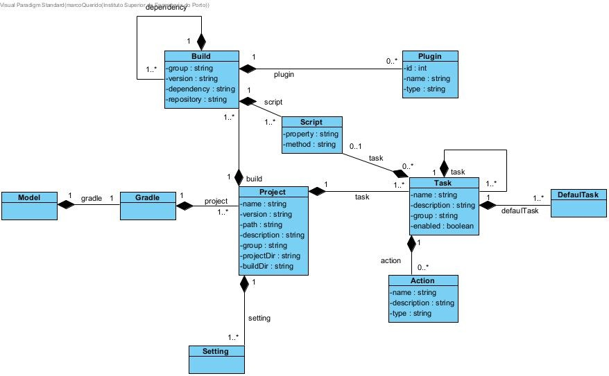
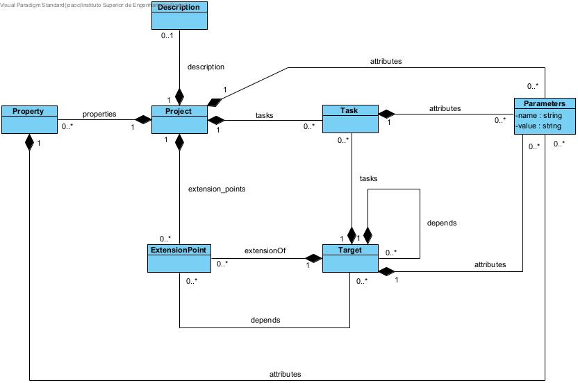
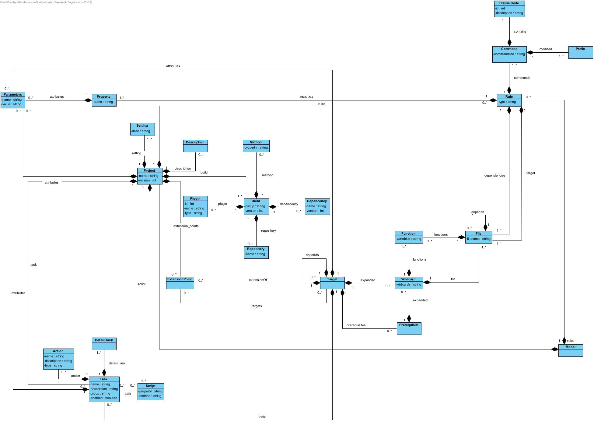

# EDOM Project, Part 1 - Team Report

## Domain Knowledge Obtained from Analyzing the Applications

Depois de cada elemento analizar e construir o metamodelo correspondente, podemos retirar a domain knowledge proveniente.

Relativamente ao Gradle, é uma framework open-source de build de software, que tem como core as tasks. Uma build faz a configuração de um conjunto de tasks e une-as de maneira funcional, é-lhes dada uma prioridade e estas são executadas. A uma ou várias tasks pode estar associado um script (ex. build script) e cada task pode ou não ter actions associadas.

O Apache Ant tem como objetivo automatizar a compilação de contrução de software, criando um processo de construção (*build*) e associando as suas dependências.

Já o Make, é uma ferramenta que, apartir da origem do ficheiro, faz o controlo de versões de ficheiros executáveis e sem origem. Quando estamos a construir um programa, deve criar um 'makefile' para que seja possível usar o Make para criar e instalar o programa.

Depois da análise das ferramentas, obtevemos os seguintes metamodelos abaixo:

 _Fig.1 - Metamodelo do Gradel_

 _Fig.2 - Metamodelo do Apache Ant_

 _Fig.3 - Metamodelo do Make_

## Design of the Metamodel

Após cada a construção dos metamodelos de cada ferramenta, analisaram-se os elementos comuns entre todos e foi criado um metamodelo a partir dessas semelhanças. O resultado final é o metamodelo da figura abaixo:

 _Fig.4 - Metamodelo final_

## Constraints and Refactorings

O metamodelo desenvolvido terá algumas constraints associadas.

| Nº  | Entity              | Constraint                                                     |
| --- | ------------------- | -------------------------------------------------------------- |
| C-1 | All                 | Cada string não é vazio e começa por letra maiúscula           |
| C-2 | Dependency, Project | A version não é vazia e tem que ser maior que 0                |
| C-3 | Plugin, StatusCode  | O id não é vazio e tem que ser maior que 0                     |
| C-4 | All                 | Cada string deve ter entre 3 e 15 letras excepto as descrições |

### OCL Code Example

- C-1
  - `invariant mustHaveNameAndUpperCase: not self.name.oclIsUndefined() and self.name.substring(1,1).toUpper().compareTo(self.name.substring(1,1))=0;`
- C-2
  - `invariant mustHaveVersion: not self.version.oclIsUndefined() and self.version > 0;`
- C-3
  - `invariant mustHaveId: not self.id.oclIsUndefined() and self.id > 0;`
- C-4
  - `invariant nameMustHaveMoreThan3CharsAndLessThan15: self.name.length() > 3 && self.name.length() < 15;`

### Proposal of refactoring
- C-1 - Criar uma transformação que automaticamente atualize a primeira letra para maiúscula

## Metamodel Graphical Representation

| **Metamodelo** | **Responsabilidade** |
| --- | --- |
| Action | Define o tipo de ação de uma Task |
| Build | Define a build do Project |
| Command | Define o commands associados a uma Rule |
| DefaultTask | Define uma Task como default |
| Dependency | Define as dependências de um Build |
| Description | Define a descrição de um Project |
| ExtensionPoint | Define o extension point de um projeto e/ou target |
| File | Define os ficheiros de um Project |
| Function | Define a função contida num ficheiro |
| Method | Define o método de um Build |
| Model | Gera a root do modelo da aplicação |
| Parameters | Define o parametro de uma classe |
| Plugin | Define os plugins associados ao Build |
| Prefix | Define o prefixo de um command |
| Prerequisite | Define os pré-requisitos de um Target |
| Project | Define o Project |
| Property | Define as propriedades de uma rule |
| Repository | Define o repositório associado a um Build |
| Rule | Define as regras a aplicar num projeto |
| Script | Define o script de uma tarefa |
| Setting | Define as definições de um Project |
| StatusCode | Define o status de um comando|
| Target | Define os target de um Project |
| Task | Define os tasks de um Project |
| Wildcard | Define os wildcards de um target |

 _Fig.4 - Metamodelo final_

## Presentations of Models (instances)

A figura abaixo mostra a representação dos modelos em plantuml:

 _Fig.5 - Modelo