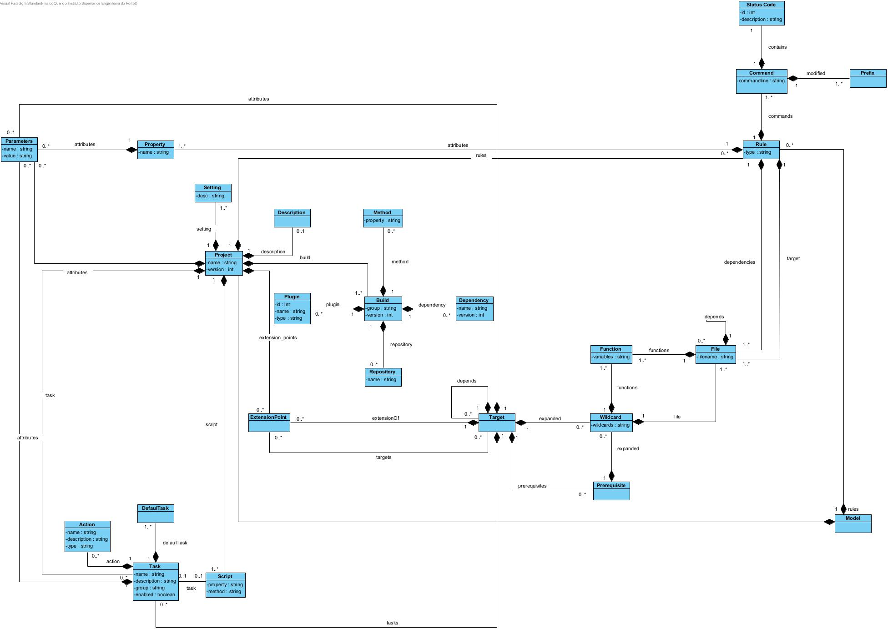

# EDOM Project, Part 2 - Team Report

## Metamodel

Demonstração do metamodelo criado na primeira parte do projeto:

## Activity 1: Design Concrete Syntax for the DSL

### Textual DSL

Design de uma DSL textual, com sintaxe semelhante ao JSON, de forma a ser mais facilmente reconhecido e compreendido pelo outro elemento do grupo.
A sintaxe textual escolhida para a DSL foi desenvolvida com base numa gramática. O texto entre as aspas é permanente.

Podemos ver aqui um excerto da notação escolhida, com base o projeto YABL:

    Model: {
        name = "YABL",
        project = Project {
            name = name,
            version = version,
            attributes = Tasks:
                            Task {
                                name = name,
                                description = description,
                                group = group,
                                enabled = enabled,
                                action = Actions:
                                            Action {
                                                name = name,
                                                description = description,
                                                type = type
                                            },
                                attributes = Parameters:
                                                Parameters {
                                                    name = name,
                                                    value = value
                                                },
                                task = Task,
                                script = Scripts:
                                            Script {
                                                name = name
                                            } 
                            }
        }
    }

### Graphical DSL

## Activity 2: Specify Common Features for Applications of the Domain

### Aplicações:

- [Make](https://www.gnu.org/software/make/manual/make.html)
- [Ant](https://ant.apache.org/manual/index.html)
- [Gradle](https://docs.gradle.org/current/samples/sample_composite_builds_basics.html)

Linguagem de programação escolhidas: Java

Framework: Console Application

The architecture of the application will have essntially 2 layers: a UI layer and a Domain layer.

### Identify Commonality and Variability in the Code

Código gerado sempre:
	
	public class Project{
		private String name;
		private String version;
		private List<Build> builds;
		
		public Project(String name, String version){
			this.name = name;
			this.version = version;
		}
	}

	public class Task{
		private String name;
		private String description;
		private String group;
		private Boolean enable = false;
		
		public Task(String name, String description, String group, Boolean enabled){
			this.name = name;
			this.description = description;
			this.group = group;		
			this.enable = enable;
		}
	}

	public class Property{
		private String name;

		public Property(String name){
			this.name = name
		}
	}

Código gerado para Ant:

	public class Parameters{
		private String name;
		private String value;
			
		public Parameters(String name, String value){
			this.name = name;
			this.value = value;	
		}
	}

	public class Property{
		private String name;

		public Property(String name){
			this.name = name;
		}
	}

Código gerado para Make:

	public class File{
		private String filename;
		private File target;
		private File prerequisite;
			
		public File(String filename, File target, File prerequisite){
			this.filename = filename;
			this.target = target;
			this.prerequisite = prerequisite;	
		}
	}
		
	public class Function{
		private String type;
			
		public Function(String type){
			this.type = type;	
		}
	}
		
	public class Rule{
		private String variables;
			
		public Rule(String variables){
			this.variables = variables;	
		}
	}
	
	public class Command{
		private String commandline;
			
		public Command(String commandline){
			this.commandline = commandline;	
		}
	}
		
	public class Prefix{
		private String name;

		public Prefix(String name){
			this.name = name;	
		}
	}

Código gerado para Gradle:

	public class Build{
		private String group;
		private String version;
			
		public Build(String group, String version){
			this.group = group;
			this.version = version;
		}
	}

	public class Plugin{
		private int id;
		private String name;
		private String type;
			
		public Plugin(int id, String name, String type){
			this.id = id;
			this.name = name;
			this.type = type;	
		}
	}

	public class Method{
		public String property;
			
		public Method(String property){
			this.property = property;	
		}
	}
		
	public class Dependency{
		public String name;
		public String version;
			
		public Dependency(String name, String version){
			this.name = name;
			this.version = version;	
		}
	}
		
	public class Repository{
		public String name;
			
		public Repository(String name){
			this.name = name;	
		}
	}
		
	public class Action{
		public String name;
		public String description;
		public String type;	
			
		public Action(String name, String description, String type){
			this.name = name;
			this.description = description;
			this.type = type;	
		}
	}
		
	public class Script{
		private String name;

		public Script(String name){
			this.name = name;	
		}
	}

### Funcionalidades Comuns:

|Ferramenta  | Ant | Make | Gradle |
|------------|-----|------|--------|
| Ant 		 |  -  | Model, Target | Model, Project, Task |
| Make 		 | Model, Target | - | Model |
| Gradle 	 | Model, Project, Task | Model |   -    |

### Funcionalidades Distintas:

|Ferramenta  | Disntinções |
|------------|-----|
| Ant 		 | File, Function, Rule, Command, Prefix |
| Make 		 | Description, Property, Parameters |
| Gradle 	 | Build, Plugin, Method, Dependency, Repository, Action, Script |

  

## Activity 4: Identify Commonality and Variability in the Code

  
| Protótipo ||
|-----------|-----------|
| **Partes Comuns**| |
| Todos os modelos da aplicação encontram-se localizados dentro da pasta _model_.|
| A aplicação tem um ponto de entrada "main()" que divide toda a lógica entre múltiplos ficheiros, organizando-os por responsabilidade.|

  
| Protótipo ||
|-----------|-----------|
| **Partes Variáveis** ||
|No MPS, os atributos opcionais de uma classe são rodeados por macros *If*. Se a condição for verdadeira, estes atributos serão adicionados à classe na geração de código. Caso contrário, estes não farão parte dessa geração.||

  

## Activity 5: Design and Implement Code Generation

O grupo decidiu colocar algumas regras obrigatórias e objetivos para a geração de código nas ferramentas:

### Regras para a geração de código nas ferramentas:

1. Todo o código gerado deve ser o mais modular possível.
2. O código gerado não deve estar repetido.
3. O código gerado deve ser executado através do terminal.

### Regras para a criação dos templates:

1. Os elementos gerados devem ser de fácil leitura.
2. O código comum deve ser de fácil compreensão e claro para o utilizador.
3. Devem haver comentários nas diferentes funções da aplicação.

### Partes Comuns

#### MPS

  - No código gerado pelo MPS, as partes comuns são aquelas classes que serão sempre geradas iguais, independentemente da aplicação que queiramos criar, como a Model, a Project, Rule e as classes de ajuda à implementação como Main.
  
### Sirius

  - No código gerado pelo Sirius, as partes comuns são as classes que serão sempre geradas independentemente da aplicação que queiramos criar, como o Main, JavaCompileClass e FileTargetStatus, assim como os ficheiros base da aplicação, como os packages e o module-info.

### Partes Variáveis

#### MPS

  - No código gerado pelo MPS, as partes variáveis são aquelas classes que serão geradas de acordo com o metamodelo que foi definido para construir um projeto Java (Concept Model definido através do nome do modelo), Project (Concept Project definido através do nome do Project), Parameter e Property (Concept definido através do nome do Property).

### Sirius

  - No código gerado pelo Sirius, as partes variáveis são as classes que serão geradas de acordo com o metamodelo que foi definido para construir uma aplicação (por exemplo a Rule no caso do Make ou Plugin no caso do Gradle)

  

## Activity 6: Generate Applications

### Comparando MPS e Sirius
Comparando as duas ferramentas, o MPS gera as classes com os valores dos atributos definidos no modelo, enquanto, no Sirius é possível gerar código sem essa dependência. 

### Issues Encontrados

* Alguns issues podem ser reportados, como por exemplo a não possibilidade de gerar os atributos com os types definidos na DSL. 

#### Sirius

* Não fui possível gerar atributos que representam uma lista de um tipo