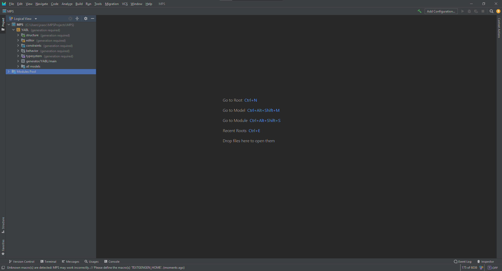
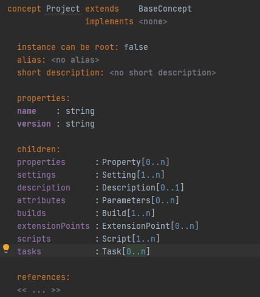
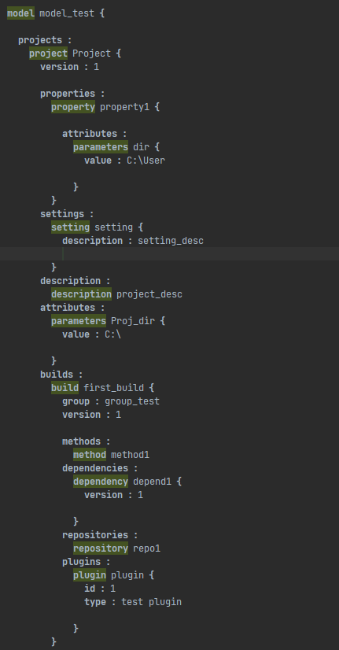
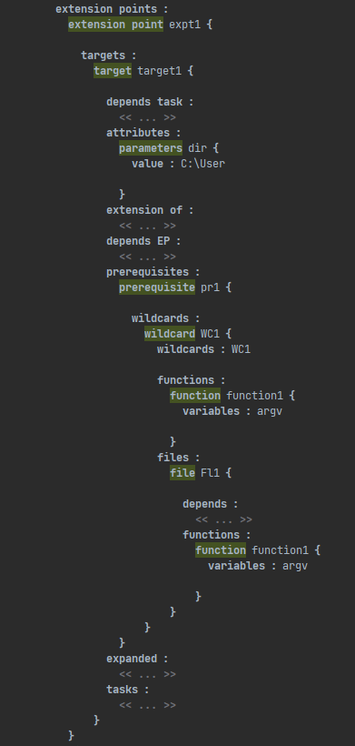
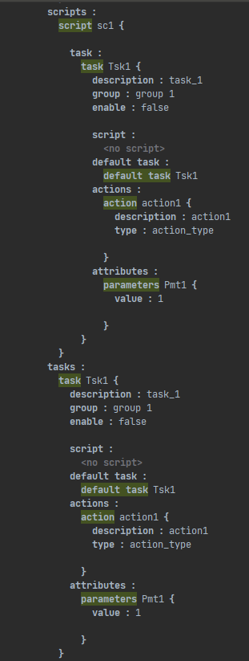
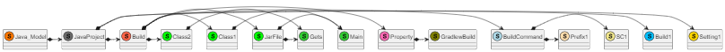

# EDOM Project, Part 1, Tool MPS - Modeling
## MPS Tool Setup

### Description of the Tool

Para este projeto, eu vou usar a ferramenta MPS, que foi desenvolvida pela JetBrains. Esta ferramenta foi criada para se conseguir expressar um Domain Specific sob forma de linguagem de programação. O seu funcionamento é realizado através de um programador que transforma as ideias de negócio de um cliente, numa aplicação com uma linguagem que o cliente consiga entender facilmente, ou seja, é uma aplicação orientada a um modelo de negócio específico.

### How to Setup and Install

Para a utilização desta ferramenta é necessário seguir alguns passos.

- Fazer download da ferramenta, com versão que o sistema operativo suporte, através do link https://www.jetbrains.com/mps/download.
- Instalar a ferramenta (neste caso com um sistema operativo Windows):
  - clicar no ficheiro que foi feito o download (com extensão .exe) e seguir os passos pedidos na instalação do mesmo.
- Após abertura da ferramenta, clicar no que se pretender executar (Novo Projeto, Importar um projeto, ...) (ver Fig.1)

   
  
  _Fig.1 - Menu inicial MPS tool_

- Neste caso será a criação de um novo projeto, por isso selecionar **Create New Project**
- Irá abrir uma nova janela com 3 opções (DSL, Development, Other) (ver Fig.2)

   
  
  _Fig.2 - Menu New Project MPS tool_

- Neste caso será a implementação de uma DSL, por isso selecionar Language Project e definir o nome e o path do projeto (neste caso, será o path por defeito definido pelo MPS).
- Serão gerados uns ficheiros default, que posteriormente poderão ser editados. (ver Fig.3)

   
  
  _Fig.3 - Menu Template New Project_

### Implementation of the Metamodel

- Para a implementação do metamodelo foi necessário criar dentro da pasta ``structure``, os vários ``concepts`` (designação dada pelo MPS a uma entidade criada), de forma a se criar um metamodelo (ver Fig.4).

  
  
   _Fig. 4 - Organização da pasta structure_

- Para a criação de um concept foi necessário definir se a entidade poderia ser root do projeto, definir as suas propriedades e os seus children, com a sua respetiva cardinalidade.
- Por exemplo, no caso da entidade *Project* (ver Fig.5):
  - não poderia ser instanciada como root do projeto,
  - tinha apenas duas propriedades, "name" e "version", que estão definidas como string 
  - tinha vários children atribuídos (properties, settings, builds, etc...).
    - Nalguns childrens, visto serem opcionais, a cardinalidade foi de 0..n ou 0..1, pois um project pode ter 0 a mais instâncias ou 0 a 1 instância dos mesmos. Caso contrário, a sua cardinalidade, é de 1..n, um project pode ter 1 ou mais instâncias dos children. 

  
  
  _Fig.5 - Exemplo criação concept Project_

### Implementation of Constraints and Refactorings

- Para as constraints foram realizadas 2 ações diferentes, uma que valida o atributo no momento de criação e outro que valida o atributo após a tentativa de criação e posteriormente envia uma mensagem de erro adequada.
- Como pode ser observado na figura 6, no ``is valid`` só validamos se a property não está vazia. Todas as outras validações foram feitas à parte e serão explicadas no próximo processo.
- Neste caso, para o refactoring, alteramos o ``set``de forma a substituir automaticamente a primeira letra do nome, de forma a cumprir com a constraint enumerada no início do projeto.

  
  
  _Fig. 6 - Exemplo criação constraint e refactoring Project_

- Como se pode observar na figura 7, criei uma regra específica para validar mais aprofundamente o name do Project.
- Neste caso, sempre que o nome do Project não começar com letra maiúscula (caso desatualizado, visto que o refactoring automático, nunca permite errar esta validação) o sistema envia uma mensagem de erro, tal como se o Project tiver um nome demasiado pequeno (menos de 3 letras) ou demasiado grande (mais de 15 letras), ou caso o name esteja vazio.

  
  
  _Fig. 7 - Exemplo criação check_Project_

### Implementation of the Visualizations

  
  
  _Fig. 8 - Diagrama em Plantuml_

O ficheiro apresentado abaixo foi gerado automaticamente para a representação gráfica do modelo (diagram usando Plantuml).

  
  
  _Fig. 9 - Ficheiro Plantuml 1/4_

  
  
  _Fig. 10 - Ficheiro Plantuml 2/4_

  
  
  _Fig. 11 - Ficheiro Plantuml 3/4_

  
  
  _Fig. 12 - Ficheiro Plantuml 4/4_

### Implementation of Models (instances)
- Para a criação de uma instância de modelo, o sistema, já gera automaticamente os elementos disponíveis. Posto isto, é necessário "configurar" esses elementos, de forma a criar um modelo válido. (ver Fig.13 a Fig.16)

  
  
  _Fig. 13 - Modelo instanciado 1/4_

  
  
  _Fig. 14 - Modelo instanciado 2/4_

  
  
  _Fig. 15 - Modelo instanciado 3/4_

  
  
  _Fig. 16 - Modelo instanciado 4/4_

### Execution of Constraints and Refactorings

  
  
  _Fig. 17 - Exemplo constraint a validar constraint se a primeira letra de uma string está em uppercase_

  
  
  _Fig. 18 - Exemplo constraint a validar constraint se uma string é nula e se um integer é inferiores a 1_

  
  
  _Fig. 19 - Exemplo constraint a validar constraint se uma string é nula e se um integer é nulo_

### Generation/Execution of Visualizations

Como solicitado, foram desenhado dois modelos para os casos propostos seguindos os passos anteriores:

  
  
  _Fig. 20 - Diagrama para o Modelo A_

  
  
  _Fig. 21 - Diagrama para o Modelo B_