# EDOM Project, Part 1, Tool 2

In this folder you should add **all** artifacts developed for part 1 of the EDOM Project, related to tool 2.

You should also include in this file the report for this part of the project (only for tool 2).

**Note:** If for some reason you need to bypass these guidelines please ask for directions with your teacher and **always** state the exceptions in your commits and issues in bitbucket.

Following there are examples of proposed sections for the report.

## Description of the Tool

Xtext é uma framework de desenvolvimento de linguagens de programação e linguagens específicas de domínios. Xtext define a sua linguagem usando uma poderosa linguagem gramatical. Como resultado obtém uma infra-estrutura completa, incluindo parser, linker, typechecker, compilador bem como suporte de edição para o Eclipse, qualquer editor que suporte o Protocolo de Servidor de Linguagem e o seu navegador web favorito.

## How to Setup and Install

Para usufruir da ferramenta XText teremos de seguir vários passos:

-Aceder a (https://www.eclipse.org/Xtext/#intro-quotes) para conhecer a ferramenta e conseguir fazer o download.

-Posteriormente fazer o download do EclipseIDE através do link (https://www.eclipse.org/downloads/), de acordo com a versão que o sistema operativo suporte.

-Depois de instalado e configurado, fazer a criação de um projeto novo. Aceder à barra de cima na opção "Help" e em seguida selecionar "Install New Software" (fig2.png).

-De seguida para instalar o XText no Eclipse teremos de aceder às "Releases" uma vez que, contém todos os componentes necessários e opcionais e dependências do XText.
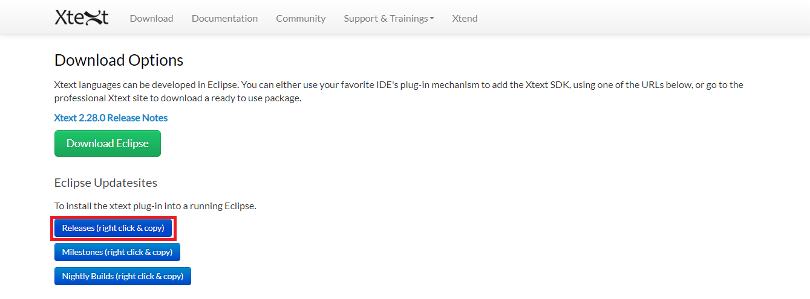

-Posteriormente, novamente dentro do Eclipse teremos de inserir o link da página anterior, "Releases"(fig.3.png), adicionando e selecionando todos os ficheiros que são disponibilizados. 

-Fazer o download de todos e confirmar.

-Depois de tudo instalado é necessário reiniciar o Eclipse e assim, o XText está pronto a ser usado.

## Implementation of the Metamodel

NOTA: Antes de começar a construção do metamodel temos de confirmar se o Eclipse tem os updates necessários para fazer a modelação. Isto é, aceder a Help -> Install new Software.. -> Selecionar o caminho do Eclipse -> Modelling, instalando tudo.

-Criámos então o nosso meta modelo abrindo um novo Ecore Modeling Project criando um projeto do tipo Ecore. Ainda na criação selecionar o Design, em Select viewpoints, de forma a poder fazer a modelação do meta modelo. 

-Temos então ao nosso dispor a ferramenta pronta para desenvolver o metamodelo.

-A realização do metamodelo do grupo deverá ficar da seguinte forma:

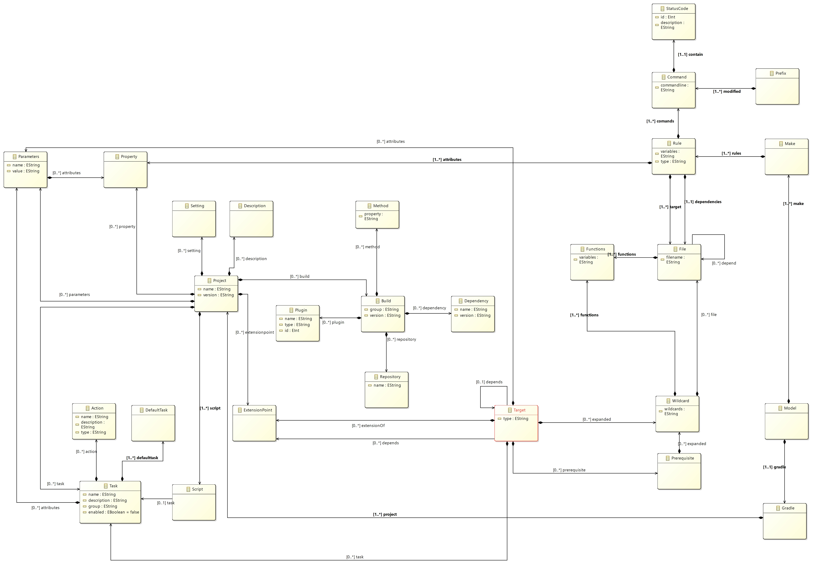

## Implementation of Constraints and Refactorings

O metamodelo desenvolvido terá algumas coinstraints associadas.

*1. Como garantir que o nome não é vazio e começa por maiúsculas.

*2. Como garantir que a version não é vazia.

*3. Obrigatório ter um statusCode.

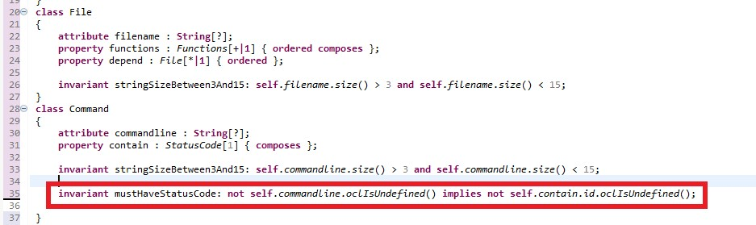

*4. Cada string deve ter entre 3 a 15 caracteres.

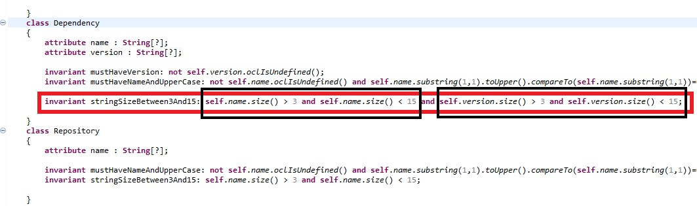

Posteriormente, para realizar as refactorings teremos de, dentro da localização onde foi criado o metamodelo, fazer a criação de de uma nova transformação. Para isso selecionar dentro da pasta do metamodelo, New->Others->Atl file. 
Daremos o nome ao módulo de feature2upperCase. 

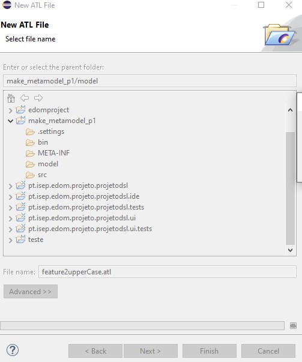

Teremos de definir o input e o output do modelo.

Na próxima imagem está explícito um exemplo de tranformação aplicado ao nosso modelo:

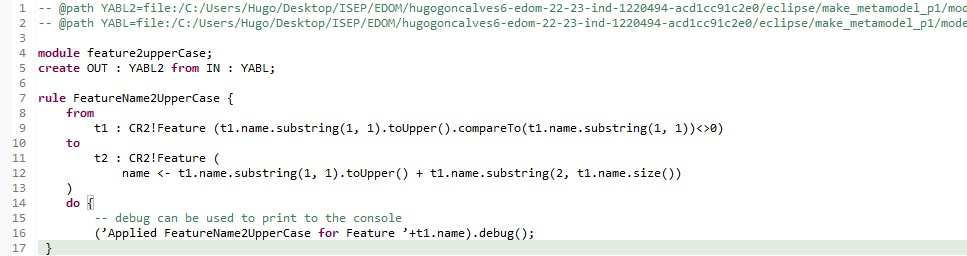

## Implementation of the Visualizations

Para visualizar o metamodelo vamos utilizar um plantUML. 

Deverá ficar da seguinte forma.

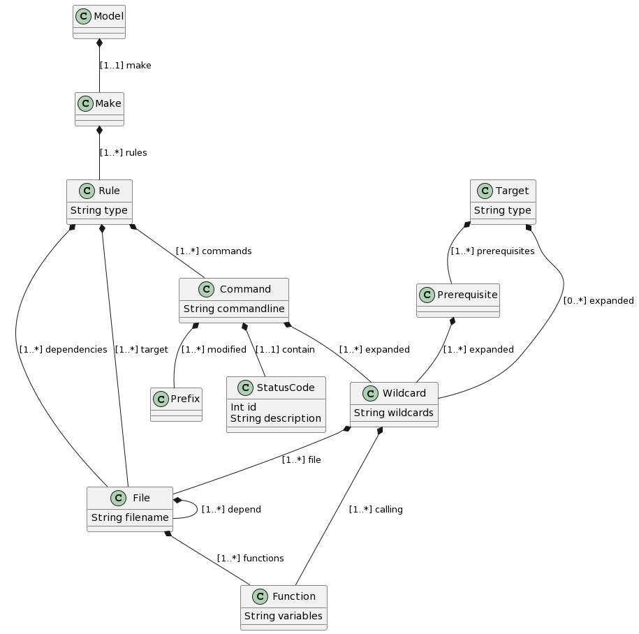

A representação gráfica foi gerada derivado ao ficheiro do metamodelo como se pode observar.

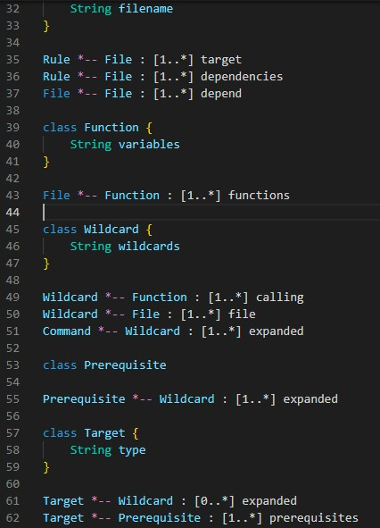

## Implementation of Models (instances)

## Execution of Constraints and Refactorings

Relativamente as constraints realizadas no metamodelo:
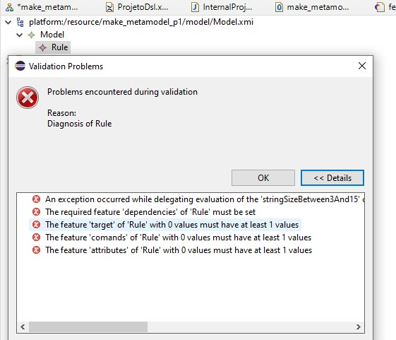

-Erros encontrados 
 
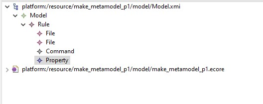

-Feita a validação dos erros

Relativamente as constraints encontrados na implementação do Models(instances)

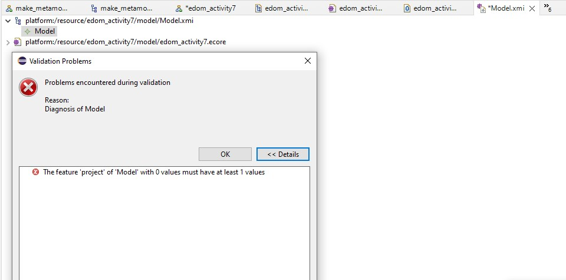

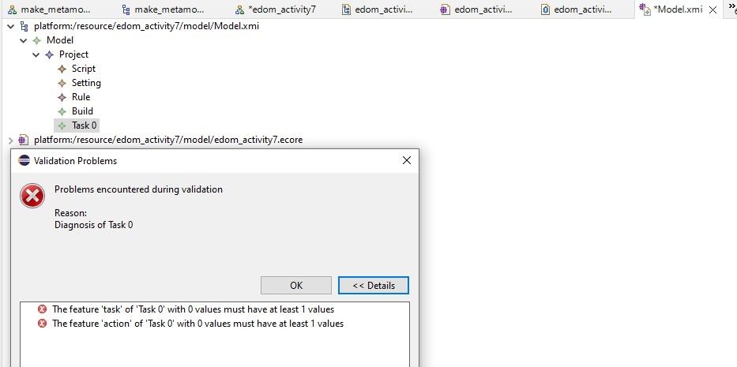

-Sendo que os constrangimentos foram todos corrigidos e validados.

## Generation/Execution of Visualizations

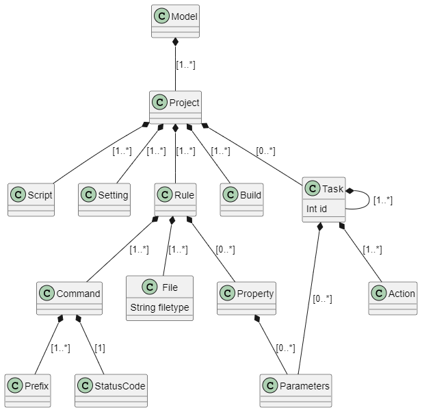