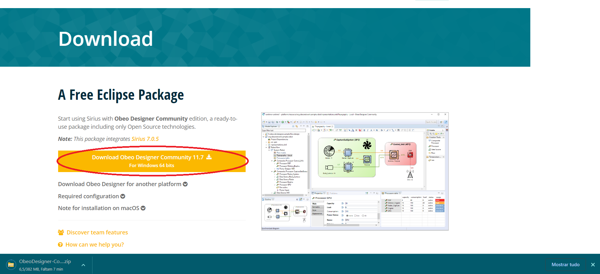
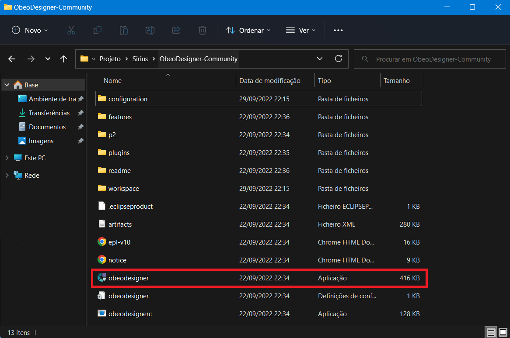
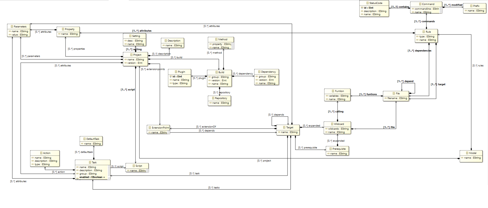
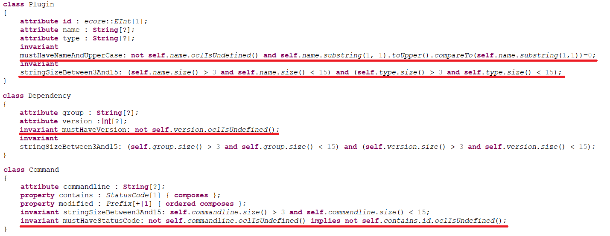
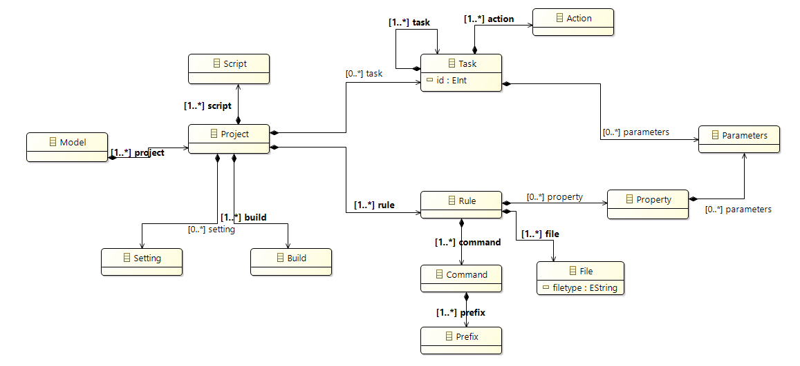
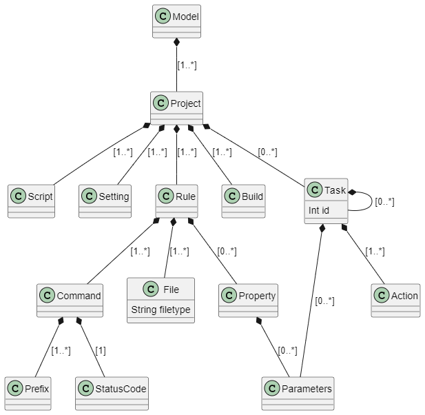

# EDOM Project, Part 1, Tool Sirius

## Sirius Tool Setup

## Description of the Tool

Sirius is an open-source software project of the Eclipse Foundation. This technology allows users to create custom graphical modeling workbenches by leveraging the Eclipse Modeling technologies, including EMF and GMF. The modeling workbench created is composed of a set of Eclipse editors (diagrams, tables and trees) which allow the users to create, edit and visualize EMF models.
Sirius has been created by Obeo and Thales to provide a generic workbench for model-based architecture engineering that could be easily tailored to fit specific needs.

## How to Setup and Install

Below are the steps necessary to install and configure Sirius in a Windows based system:
 
* Head over to [Sirius Website](http://https://www.eclipse.org/sirius/overview.html "Sirius Website") and click on the "Download" button on the top right corner;

* Click on the "Download Obeo Designer Community" button to be redirected to the Obeo Designer website;

* Click on the "Download Obeo Designer Community" to prompt a download of a zip file containing the Sirius launcher and all associated setup tools.

* Once the download finishes, unzip the file to a folder of your choosing and look for the "obeodesigner" .exe file. Click it and Sirius will launch on your computer.

## Implementation of the Metamodel

* Before starting a metamodel it's important to check if the tools we need are installed and up to date. To do this we can go to Help/Check For Updates, if the software is already installed or Help/Eclipse Marketplace and search for Ecore to install the modeling tools.

*The first step in creating our metamodel is to create a new Ecore Modeling Project by selecting File/New/EcoreModelingProject. Then you'll be prompted to create a new project of type Ecore, where you can just setup the project name and change the location if you want. Click Next> 'till you reach the 'Select Viewpoints' page, make sure only the 'Design' box is checked and click Finish.

*Now you entered the modeling perspective, where you can see many elements. To the left you have the Model Explorer, where you can see and manage the various files in your project, in the middle you have the canvas for the metamodel design, where you'll drag and drop the elements you want in your metamodel from the rightmost column called 'Palette'.

* After finishing creating the developed group metamodel, it should look like the one below:

## Implementation of Constraints and Refactorings

* The metamodel will have some constraints associated, some of them which are already implemented through the cardinality.
* The constraints applied are as follows:

1. Every name must not be null and start with an uppercase letter;
2. Every version must not be null;
3. It is mandatory that there is a status code;
4. Every string must be between 3 and 15 characters.

* To apply a constraint on an Ecore Project, just right-click on the .ecore file and click on Open With/OCLinEcore Editor. A prompt asking to convert your project to an OCL project will appear, to which you choose Yes.

We will apply the following code invariants in the project:

1. invariant mustHaveNameAndUpperCase: not self.name.oclIsUndefined() and self.name.substring(1,1).toUpper().compareTo(self.name.substring(1,1))=0;

2. invariant mustHaveVersion: not self.version.oclIsUndefined();

3. invariant mustHaveStatusCode: not self.version.oclIsUndefined();

4. invariant stringSizeBetween3And15: self.string.size() > 3 and self.string.size() < 15;

Below are examples of classes where the constraints are applied:

* For refactors we must create a new 'transformations' folder inside the metamodel folder and create a new/Other/ATL File (make sure you have ATL/EMFTVM installed, if not head to Eclipse Marketplace and install it). Our first ATL file will be named 'featureName2Uppercase'. Then you'll be prompted with the window below:

Since we will be doing a transformation, you have to choose the Input Model and Output Model which will be the current model we're working with, so click on Add/Browse Workspace and look for the .ecore model of the current model. 

The image below is an example of a tranformation applied to the model:

## Implementation of the Visualizations

To visualize the designed metamodel we'll be using plantUML, a tool that is used to generate diagrams from text. For that we'll have to install the plantUML plugin in Sirius. Go to Help/Software Update/Find and install... or Help/Install new software... and use the following link: http://hallvard.github.io/plantuml/ 

The metamodel should look like the one below:

## Implementation of Models (instances)

The designed model instance applies for both Model A and Model B:

## Execution of Constraints and Refactorings

Some constraints we can apply to the model instance are:

* Filetype can't be null and must start with an uppercase letter;
* Task id's can't be null.

The image below shows the implemented constraints in the model instance:

To execute the constraints, we simply create an instance of the model and check if it's validated.

The image below shows the constraints validation in the model instance:

For refactors we must create a new 'transformations' folder inside the metamodel folder and create a new/Other/ATL File (make sure you have ATL/EMFTVM installed, if not head to Eclipse Marketplace and install it). Our ATL file will be named 'featureName2Upper'. 

The image below shows the transformation code:

## Generation/Execution of Visualizations

After generating the model instance, the result should be the diagram in the picture below:

