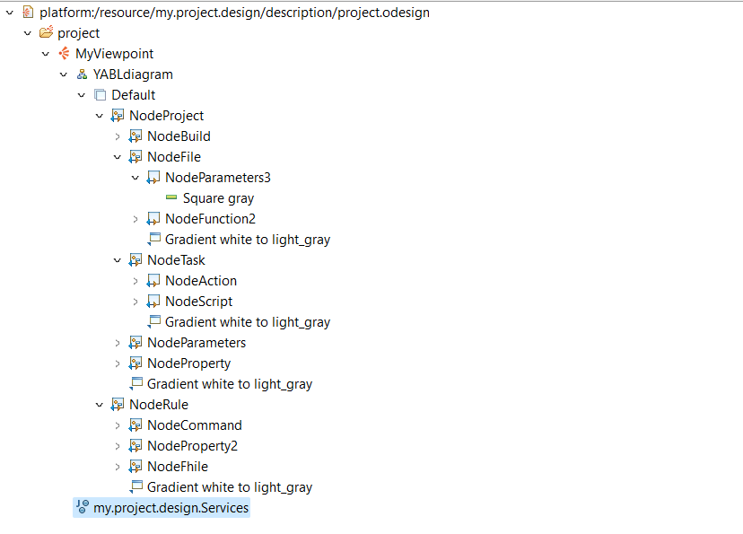
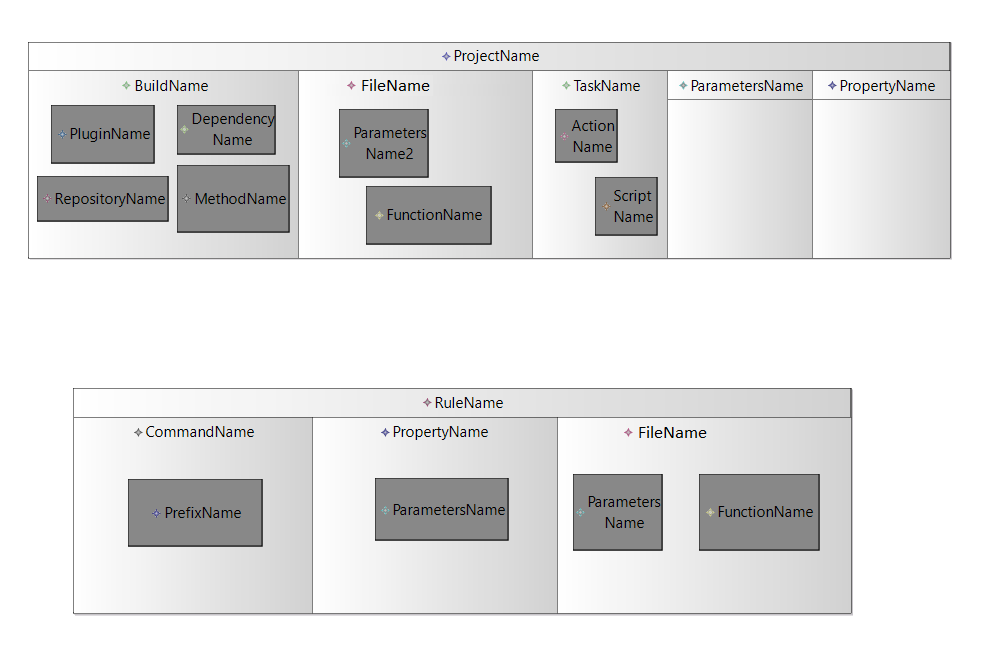
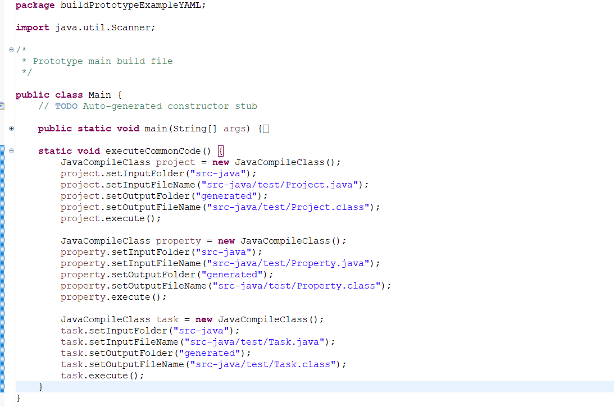
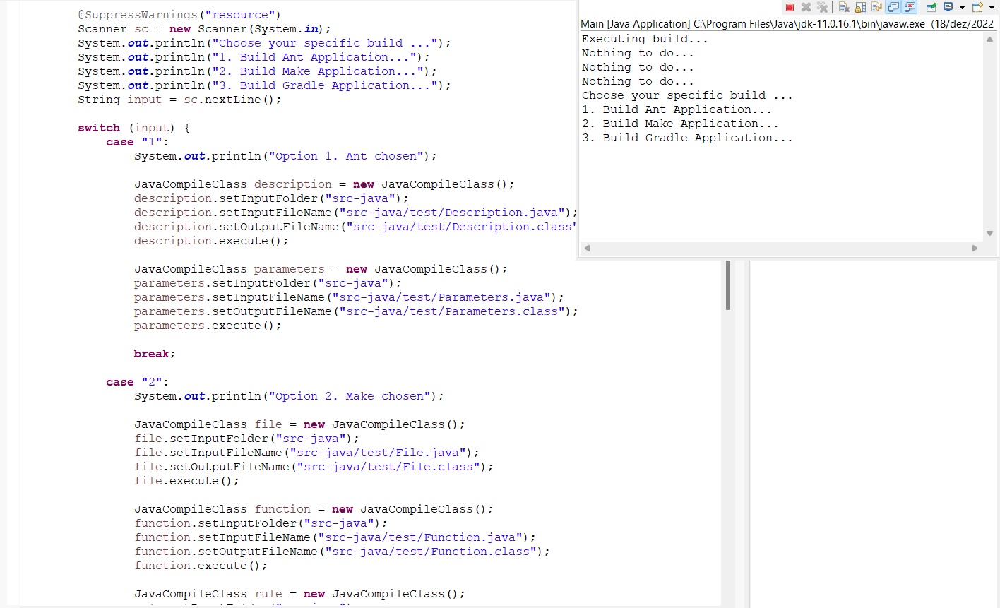
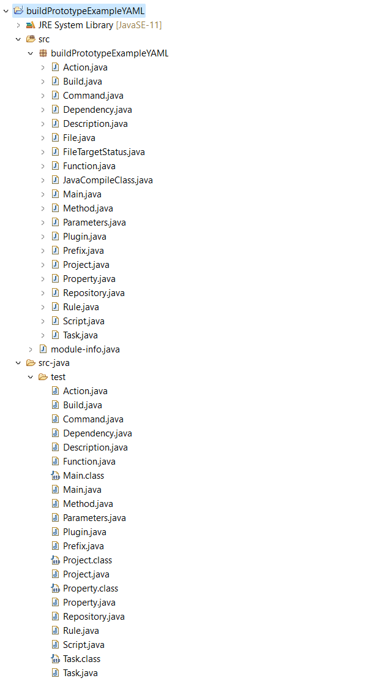

# EDOM Project, Part 2, Sirius

## Activity 1. Design Concrete Syntax for the DSL

Sirius Diagrams allows users to create dsl diagrams and supports several kinds of graphical constructs: simple nodes, containers (which can contain other nodes or containers), lists, bordered nodes (nodes which appear on the side of other elements, typically to represent ports), and edges between all of these. Each kind of element supports a rich set of possible styles (shape and color).

To design the graphical notation of the YABL metamodel, we used the base .ecore file to graphically represent all the classes and references of the metamodel. Running a pre-configured run configuration with the yabl plugin we're able to run a second instance of Sirius and create a new Modeling Project. Then it is created a .yaml file which refers to the .ecore metamodel from the metamodel project. 

After creating an instance of the model we can create a new Viewpoint Specification Model with an .odesign extention to represent the graphical elements of the model. Following the model instance we can create varius graphical elements, like containers and nodes. The result of the specifications is showed in the picture below:

### Graphical DSL

 _Fig.1 - Sirius Graphical Notation Specification_

When every configuration is set, we can right click the model instance and create a new/other/DiagramOfModel.
The result is shown in the image below:

 _Fig.2 - Sirius Graphical Notation_

## Activity 3: Implement Prototypes of Applications of the Domain

Previously in P1, the team designed two model instances for a Java console application and a c/c++ console application. 
Given that on Activity 2 the chosen programming languages where Java and C#, the team created prototypes for each of those languages.

To build the dsl prototype of the YAML in Java, we used for inspiration a demo application provided by the teacher.
Firstly, a new Java Project was created on Sirius, which would contain all the .java classes needed for generating each class represented in the metamodel.

 _Fig.3 - The Main class_

The Main.java class will be the startup class for code generation, and will contain the methods and configurations to create every class represented in the designed metamodel. First it will generate the common code present in every model variation (Make, Ant and Gradle), like a class Project, Property and Task. 

There's a JavaCompileClass that has methods that set the folders where the template classes are, their names and the name of the generated classes, a method execute() that will check, through a FileTargetStatus class, if the class name is outdated, and execute the command javac -cp to change the classpath of the generated class.

 _Fig.4 - The CompileJava class_

Finally, according to the user's preference, when the application runs, a console prompt will let him choose which build he wants to create the dsl for:

 _Fig.5 - The Main class running through console application_

The image below shows all the classes used for the build variations:

 _Fig.6 - Sirius Package Explorer_

### Activity 5: Design and Implement Code Generation

For reminder, the established rules for code generation are:

1. Todo o código gerado deve ser o mais modular possível.
2. O código gerado não deve estar repetido.
3. O código gerado deve ser executado através do terminal.

The source classes(in the src folder) are separated from the template classes (in the src-java/test folder).
The generated classes (in the generated folder) are created from the template classes and stored in a different folder.

We can run the prototype through a console application, as shown previously in Fig.5.

 _Fig.7 - Code Generation Rules_

The image below shows the code modularity:

### Activity 6: Generate Applications

### References: 

https://www.eclipse.org/sirius/doc/6.0.x/specifier/diagrams/Diagrams.html#introduction

https://tomgregory.com/gradle-task-inputs-and-outputs/