# Parallel Digital Image Processing and Analysis

This project was developed within the scope of the Sistemas Multinúcleo e Distribuídos course, and proposed by the head teacher of the mentioned curricular unit, as a method of practical evaluation. 

<br><br>

# Introduction

In the realm of digital image processing, the ability to efficiently apply filters to images is of paramount importance. Filters enable various transformations such as brightness adjustments, grayscale conversions, blurring, and more, thereby allowing for enhanced image analysis and manipulation.

As stated in the project proposition, the goal of this project is to implement image processing tools using sequential, multithreaded
and threadpool-base approaches, to study how to maximize eventual performance gains in scenarios where parallel and concurrent programming can leverage the potential of the hardware, and explain how and why each of these approaches impact in the performance of the solution.

<br><br>

# Filters

Filters represent the core functionality of image processing algorithms. They define the operations performed on individual pixels or regions within an image to achieve desired effects. 

Common types of filters include:

- Brightness Adjustment: Modifies the brightness level of an image.
- Grayscale Conversion: Converts a color image into grayscale.
- Blurring: Smoothens the image by reducing detail and noise.
- Swirl: Distorts the image in a swirling pattern.
- Glass Effect: Simulates the appearance of a glass-like surface.
- Conditional Blur: Applies blurring selectively based on certain conditions.

These types of filters where developed and will be used in the subsequent parts of the project.

<br>

## Brightness Adjustment 

|              |                                                                                                       |   |
|:------------:|-------------------------------------------------------------------------------------------------------|---|
|  Description | Brightness adjustment alters the overall luminance of an image, making it appear brighter or darker.  |   |
| Operation    | Each pixel's brightness value is modified by adding or subtracting a constant value.                  |   |
| Applications | Adjusting image exposure, enhancing visibility in low-light conditions, or creating artistic effects. |   |

<br>

### Algorithm

```
public void BrighterFilter(int value) throws IOException {
        Color[][] tmp = Utils.copyImage(image);
        String outputFile = file.substring(0, file.lastIndexOf('.')) + "_brighter.jpg";

        // Runs through entire matrix
        for (int i = 0; i < tmp.length; i++) {
            for (int j = 0; j < tmp[i].length; j++) {

                // fetches values of each pixel
                Color pixel = tmp[i][j];
                int r = pixel.getRed();
                int g = pixel.getGreen();
                int b = pixel.getBlue();

                // takes average of color values
                int bright = value;
                if (r + bright > 255)
                    r = 255;
                else
                    r = r + bright;
                if (g + bright > 255)
                    g = 255;
                else
                    g = g + bright;
                if (b + bright > 255)
                    b = 255;
                else
                    b = b + bright;

                // outputs average into picture to make grayscale
                tmp[i][j] = new Color(r, g, b);
            }
        }
        Utils.writeImage(tmp, outputFile);
    }

```

<br>

## Grayscale Conversion

|              |                                                                                                                                          |   |
|:------------:|------------------------------------------------------------------------------------------------------------------------------------------|---|
|  Description | Grayscale conversion transforms a color image into a monochromatic representation where each pixel's intensity represents its luminance. |   |
| Operation    | RGB color components are combined using weighted averages to compute the grayscale intensity.                                            |   |
| Applications | Simplifying image processing tasks, reducing memory usage, or preparing images for specific analyses.                                    |   |

<br>

### Algorithm

```
public void GrayscaleFilter() throws IOException {
        Color[][] tmp = Utils.copyImage(image);
        String outputFile = file.substring(0, file.lastIndexOf('.')) + "_grayscale.jpg";

        // Runs through entire matrix
        for (int i = 0; i < tmp.length; i++) {
            for (int j = 0; j < tmp[i].length; j++) {

                // fetches values of each pixel
                Color pixel = tmp[i][j];
                int r = pixel.getRed();
                int g = pixel.getGreen();
                int b = pixel.getBlue();

                // Compute the average of RGB values
                int avg = (r + g + b) / 3;

                // Set each RGB component to the average value
                tmp[i][j] = new Color(avg, avg, avg);
            }
        }
        Utils.writeImage(tmp, outputFile);
    }

```

<br>

## Blurring

|              |                                                                                                                              |   |
|:------------:|------------------------------------------------------------------------------------------------------------------------------|---|
|  Description | Blurring reduces image detail and sharpness, creating a smoother appearance by averaging pixel values within a neighborhood. |   |
| Operation    | Each pixel's value is replaced by the average of its neighboring pixels, weighted by a kernel matrix.                        |   |
| Applications | Removing noise, reducing image artifacts, or simulating motion blur for dynamic effects.                                     |   |

<br>

### Algorithm

```
public void BlurFilter(int neighborhoodSize) throws IOException {
        Color[][] tmp = Utils.copyImage(image);
        String outputFile = file.substring(0, file.lastIndexOf('.')) + "_blur.jpg";

        // Runs through entire matrix
        for (int i = 0; i < tmp.length; i++) {
            for (int j = 0; j < tmp[i].length; j++) {

                // Initialize sum of RGB values and count of neighboring pixels
                int sumR = 0, sumG = 0, sumB = 0;
                int count = 0;

                // Iterate over neighborhood
                for (int x = Math.max(0, i - neighborhoodSize); x <= Math.min(tmp.length - 1, i + neighborhoodSize); x++) {
                    for (int y = Math.max(0, j - neighborhoodSize); y <= Math.min(tmp[i].length - 1, j + neighborhoodSize); y++) {
                        sumR += tmp[x][y].getRed();
                        sumG += tmp[x][y].getGreen();
                        sumB += tmp[x][y].getBlue();
                        count++;
                    }
                }

                // Calculate average RGB values
                int avgR = sumR / count;
                int avgG = sumG / count;
                int avgB = sumB / count;

                // Replace original pixel with the averaged pixel
                tmp[i][j] = new Color(avgR, avgG, avgB);
            }
        }
        Utils.writeImage(tmp, outputFile);
    }

```

<br>

## Swirl

|              |                                                                                                                   |   |
|:------------:|-------------------------------------------------------------------------------------------------------------------|---|
|  Description | The swirl filter distorts an image in a swirling pattern, creating a vortex-like effect.                          |   |
| Operation    | Pixels are displaced radially around a central point, with displacement proportional to distance from the center. |   |
| Applications | Creating artistic distortions, generating visual effects, or simulating whirlpool-like patterns.                  |   |

<br>

### Algorithm

```
public void SwirlFilter(int centerX, int centerY) throws IOException {
        Color[][] tmp = Utils.copyImage(image);
        String outputFile = file.substring(0, file.lastIndexOf('.')) + "_swirl.jpg";

        // Runs through entire matrix
        for (int i = 0; i < tmp.length; i++) {
            for (int j = 0; j < tmp[i].length; j++) {

                // Calculate distance from center
                double dx = i - centerX;
                double dy = j - centerY;
                double d = Math.sqrt(dx * dx + dy * dy);

                // Calculate angle
                double theta = Math.PI / 256 * d;

                // Compute new coordinates
                int newX = (int) ((dx * Math.cos(theta) - dy * Math.sin(theta)) + centerX);
                int newY = (int) ((dx * Math.sin(theta) + dy * Math.cos(theta)) + centerY);

                // Ensure new coordinates are within image bounds
                if (newX >= 0 && newX < tmp.length && newY >= 0 && newY < tmp[0].length) {
                    tmp[i][j] = image[newX][newY];
                }
            }
        }
        Utils.writeImage(tmp, outputFile);
    }

```

<br>

## Glass Effect

|              |                                                                                                                                |   |
|:------------:|--------------------------------------------------------------------------------------------------------------------------------|---|
|  Description | The glass filter simulates the appearance of a frosted or textured glass surface, distorting and diffusing image details.      |   |
| Operation    | Pixels are displaced randomly within a defined radius, mimicking the irregular refraction of light through a textured surface. |   |
| Applications | Adding texture to images, creating frosted glass effects, or enhancing privacy in image overlays.                              |   |

<br>

### Algorithm

```
public void GlassFilter(int maxDistance) throws IOException {
        Color[][] tmp = Utils.copyImage(image);
        String outputFile = file.substring(0, file.lastIndexOf('.')) + "_glass.jpg";
        Random random = new Random();

        // Runs through entire matrix
        for (int i = 0; i < tmp.length; i++) {
            for (int j = 0; j < tmp[i].length; j++) {

                // Generate random offsets within maxDistance
                int offsetX = random.nextInt(2 * maxDistance + 1) - maxDistance;
                int offsetY = random.nextInt(2 * maxDistance + 1) - maxDistance;

                // Calculate new coordinates
                int newX = i + offsetX;
                int newY = j + offsetY;

                // Ensure new coordinates are within image bounds
                if (newX >= 0 && newX < tmp.length && newY >= 0 && newY < tmp[0].length) {
                    // Replace the pixel with the pixel at the new coordinates
                    tmp[i][j] = image[newX][newY];
                }
            }
        }
        Utils.writeImage(tmp, outputFile);
    }

```

<br>

## Conditional Blur

|              |                                                                                                                                                      |   |
|:------------:|------------------------------------------------------------------------------------------------------------------------------------------------------|---|
|  Description | Conditional blur selectively applies blurring based on specific conditions, allowing certain image regions to remain sharp while others are blurred. |   |
| Operation    | Blur is applied only to pixels that meet certain criteria, such as intensity, color, or spatial relationships.                                       |   |
| Applications | Highlighting specific image features, emphasizing focal points, or creating depth-of-field effects in photographs.                                   |   |

<br>

### Algorithm

```
    public void ConditionalBlurFilter(int neighborhoodSize, int redThreshold) throws IOException {
        Color[][] tmp = Utils.copyImage(image);
        String outputFile = file.substring(0, file.lastIndexOf('.')) + "_conditional_blur.jpg";

        // Runs through entire matrix
        for (int i = 0; i < tmp.length; i++) {
            for (int j = 0; j < tmp[i].length; j++) {

                // Check if the red value exceeds the threshold
                if (tmp[i][j].getRed() > redThreshold) {
                    // Initialize sum of RGB values and count of neighboring pixels
                    int sumR = 0, sumG = 0, sumB = 0;
                    int count = 0;

                    // Iterate over neighborhood
                    for (int x = Math.max(0, i - neighborhoodSize); x <= Math.min(tmp.length - 1, i + neighborhoodSize); x++) {
                        for (int y = Math.max(0, j - neighborhoodSize); y <= Math.min(tmp[i].length - 1, j + neighborhoodSize); y++) {
                            sumR += tmp[x][y].getRed();
                            sumG += tmp[x][y].getGreen();
                            sumB += tmp[x][y].getBlue();
                            count++;
                        }
                    }

                    // Calculate average RGB values
                    int avgR = sumR / count;
                    int avgG = sumG / count;
                    int avgB = sumB / count;

                    // Replace original pixel with the averaged pixel
                    tmp[i][j] = new Color(avgR, avgG, avgB);
                }
            }
        }
        Utils.writeImage(tmp, outputFile);
    }

```

<br><br><br>

# Sequential Implementation

In the sequential implementation, filters are applied to images one after another, processing each pixel sequentially. This approach is straightforward but lacks concurrency, resulting in slower execution times, especially for large images.

Project package organization:

```
.
└── src/
    └── main/
        └── java/
            └── app/
                └── Sequential_Digital_Image_Processing/
                    ├── ApplyFilters
                    ├── Filters
                    ├── FilterTypes
                    └── Utils
```
The sequential logic involves iterating over each pixel in the image and applying the specified filter operation. This process continues until all pixels have been processed.

<br>

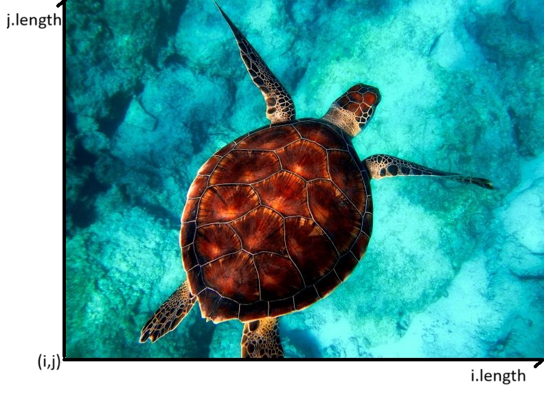

*image filter application visualization*

<br>

The filter is applied from the origin of the image (i=0,j=0) and goes from (i -> i.length) to (j -> j.lenght), in other words, from left to right, bottom to top, pixel by pixel, effectively by creating a 2D matrix.

<br>

## Main Function Explanation

```
Scanner input = new Scanner(System.in);
String filePath = "";
System.out.println("Insert the name of the file path you would like to use:");
filePath = input.nextLine();
input.close();
```

- The user is prompted to input the file path of the image they want to process;
- The program reads the file path from the user using a Scanner;
- Then it closes the Scanner after reading the input.

<br><br>

```
Filters filters = new Filters(filePath);
```

- An instance of the Filters class is created, passing the file path as an argument.

<br><br>

```
filters.BrighterFilter(value);
filters.GrayscaleFilter();
filters.SwirlFilter(centerX, centerY);
filters.GlassFilter(maxDistance);
filters.BlurFilter(neighborhoodSize);
filters.ConditionalBlurFilter(neighborhoodSize, redThreshold);
```

- Then, for each filter type, an instance of the Filters class is created, and the filter is applied to the input image calling the corresponding filter function.

<br><br><br>


# Multithreaded Implementation

The Multithreaded implementation aims to improve processing speed by leveraging multiple threads to concurrently apply filters to different parts of the image. This parallelism reduces execution time, particularly for large images.

Project package organization:

```
.
└── src/
    └── main/
        └── java/
            └── app/
                └── MultiThreaded_Digital_Image_Processing/
                    ├── ApplyFilters
                    ├── Filters
                    ├── FilterTypes
                    └── Utils
```

In the multithreaded logic, the image is divided into smaller segments, and each segment is processed by a separate thread. This concurrent processing allows for faster execution compared to the sequential approach.

<br>

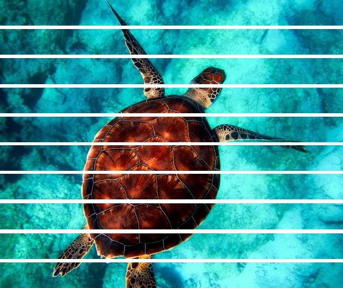

*image chunk splitting visualization*

<br><br>

### Main Function Explanation

```
public void applyFiltersMultiThreaded(int numThreads, FilterTypes filterType) throws InterruptedException
```

- numThreads specifies the number of threads to be used for parallel processing;
- filterType is an Enum representing the type of filter to be applied.

<br><br>

```
int chunkHeight = (int) Math.ceil((double) imageHeight / numThreads);
```

- The height of each chunk of the image is calculated. The image is divided into equal-sized chunks based on the number of threads specified.

<br><br>

```
Color[][][] processedChunks = new Color[numThreads][][];
Lock lock = new ReentrantLock();
List<Thread> threads = new ArrayList<>();
```

- processedChunks is an Array to store the processed chunks of the image;
- lock is a ReentrantLock for synchronization to ensure that threads access shared resources safely;
- threads is a List to keep track of the threads created.

<br><br>

```
for (int i = 0; i < numThreads; i++) {
    final int threadIndex = i;
    final int rowStart = i * chunkHeight;
    final int rowEnd = Math.min(rowStart + chunkHeight, imageHeight);

    Thread thread = new Thread(() -> {
        // Thread-local variable to store the processed chunk
        Color[][] localProcessedChunk = new Color[rowEnd - rowStart][imageWidth];
        // Loop through the chunk and apply the filter
        for (int row = rowStart; row < rowEnd; row++) {
            for (int col = 0; col < imageWidth; col++) {
                localProcessedChunk[row - rowStart][col] = applyFilter(row, col, filterType);
            }
        }
        // Lock before accessing the shared resource
        lock.lock();
        try {
            // Store the processed chunk in the array at the correct index
            processedChunks[threadIndex] = localProcessedChunk;
        } finally {
            // Ensure unlock is called even if an exception occurs
            lock.unlock();
        }
    });
    thread.start();
    threads.add(thread);
}
```

- Threads are created for each chunk of the image.
- Each thread processes a portion of the image defined by rowStart and rowEnd.
- Within each thread, the specified filter is applied to the image chunk, and the result is stored in a local variable.
- The processed chunk is then stored in the processedChunks array at the correct index.

<br><br>

```
for (Thread thread : threads) {
    thread.join();
}
```
- This loop ensures that the main thread waits for all the worker threads to finish before proceeding.

<br><br>

```
Color[][] finalImage = new Color[imageHeight][imageWidth];
int rowOffset = 0;
for (Color[][] chunk : processedChunks) {
    if (chunk != null) {
        for (int row = 0; row < chunk.length; row++) {
            System.arraycopy(chunk[row], 0, finalImage[rowOffset + row], 0, chunk[row].length);
        }
        rowOffset += chunk.length;
    }
}
```

- The processed chunks are then combined into the final image;
- System.arraycopy is used to copy the contents of each chunk into the appropriate position in the final image array.

<br>

This function efficiently distributes the image processing task across multiple threads, ensuring that each thread works on a separate portion of the image concurrently. Synchronization mechanisms like locks are used to ensure thread safety when accessing shared resources

<br><br><br>

# Threadpool-based Implementation

Thread pools in Java are a mechanism for managing and reusing a fixed number of threads to execute tasks concurrently. Instead of creating a new thread for every task, which can be inefficient due to the overhead of thread creation and management, a thread pool maintains a pool of threads ready to execute tasks as needed. The threadpool-based implementation utilizes thread pools to manage the concurrent execution of filter operations. Thread pools offer better resource management and scalability compared to ad-hoc thread creation.

Project package organization:

```
.
└── app/
    └── ThreadPool_Based_Digital_Image_Processing/
        ├── CachedThreadPool/
        │   ├── ApplyFilters
        │   └── ProcessingLogic
        ├── CompletableFutures/
        │   ├── ApplyFilters
        │   └── ProcessingLogic
        ├── FixedThreadPool/
        │   ├── ApplyFilters
        │   └── ProcessingLogic
        ├── ForkJoinPool/
        │   ├── ApplyFilters
        │   └── ProcessingLogic
        ├── SingleThreadPool/
        │   ├── ApplyFilters
        │   └── ProcessingLogic
        ├── Filters
        ├── FilterTypes
        └── Utils
```

Threadpool-based implementations employ various strategies to optimize filter application. The ones applied in the project are:

- Single ThreadPool: A single thread pool manages all filter operations, ensuring efficient resource utilization.
- Fixed ThreadPool: A fixed-size thread pool limits the number of concurrent filter operations, preventing resource exhaustion and contention.
- CachedThreadPool: A type of thread pool the dynamically adjusts the number of threads based on the workload. 
- ForkJoinPool: The ForkJoinPool framework facilitates divide-and-conquer parallelism, enabling efficient processing of recursive filter operations.
- CompletableFutures: CompletableFutures provide a high-level abstraction for asynchronous computation, allowing for the parallel execution of filter tasks with non-blocking behavior.

<br>

## Risks in using Thread Pools

- __Deadlock__: While deadlock can occur in any multi-threaded program, thread pools introduce another case of deadlock, one in which all the executing threads are waiting for the results from the blocked threads waiting in the queue due to the unavailability of threads for execution.

- __Thread Leakage__: Thread Leakage occurs if a thread is removed from the pool to execute a task but not returned to it when the task completed. As an example, if the thread throws an exception and pool class does not catch this exception, then the thread will simply exit, reducing the size of the thread pool by one. If this repeats many times, then the pool would eventually become empty and no threads would be available to execute other requests.

- __Resource Thrashing__: If the thread pool size is very large then time is wasted in context switching between threads. Having more threads than the optimal number may cause starvation problem leading to resource thrashing as explained.

<br>

Each type of thread pool approach will be explained in the next topics.

<br><br><br>

## Single ThreadPool

In a single thread pool, all filter operations are managed by a single thread. This approach ensures that only one filter task is processed at a time, preventing concurrent execution. While it may seem counterintuitive for parallel processing, it can be useful in scenarios where strict sequential execution is required, or when resources need to be tightly controlled.

This type of thread pool is suitable for scenarios where sequential execution is necessary, such as when filter tasks have dependencies on each other or when resource contention needs to be minimized.

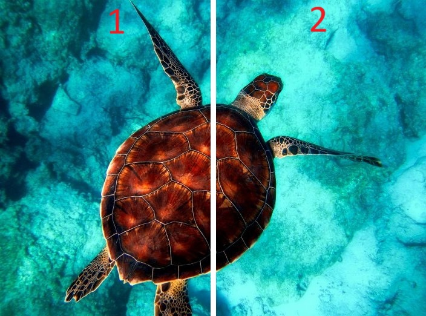

*image chunk splitting visualization part 1*

<br><br>

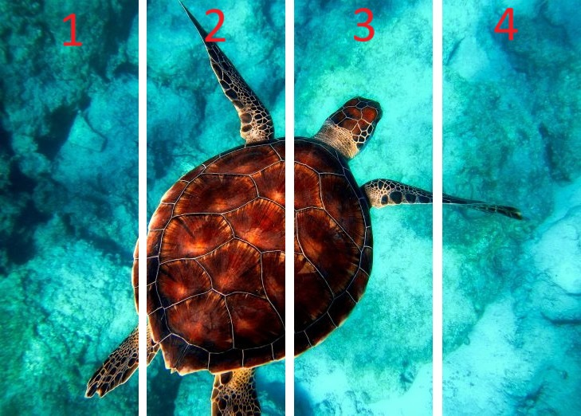

*image chunk splitting visualization part 2*

<br><br>

### Main Function Explanation

```
private void applyFiltersSingleThreadRecursive(int startRow, int endRow, FilterTypes filterType)
```

- startRow is the starting row index of the image segment to process;
- endRow is the ending row index (exclusive) of the image segment to process;
- filterType is an Enum representing the type of filter to be applied.

<br><br>

```
if (startRow == endRow - 1) {
    // Process each pixel in the segment when it's reduced to a single row
    for (int col = 0; col < imageWidth; col++) {
        image[startRow][col] = applyFilter(startRow, col, filterType);
    }
}
```

- This condition checks if the height of the image segment has reduced to 1 (a single row);
- If so, it applies the filter to each pixel in that row.

<br><br>

```
else {
    // Split the image vertically in half and process each half recursively
    applyFiltersSingleThreadRecursive(startRow, midRow, filterType);
    applyFiltersSingleThreadRecursive(midRow, endRow, filterType);
}
```

- If the image segment contains more than one row, it recursively divides the segment into two halves vertically;
- The midpoint (midRow) of the segment is calculated to split it into two roughly equal parts;
- Each half is then processed recursively by calling the function applyFiltersSingleThreadRecursive with appropriate parameters.

<br>

The recursion terminates when the base case is reached, i.e., when the image segment is reduced to a single row.

The function efficiently processes an image by recursively dividing it into smaller segments until each segment contains only a single row, at which point the filter is applied to each pixel. This recursive approach effectively handles image processing tasks in a single thread, albeit at the cost of potentially deeper function call stacks for large images.

<br><br><br>

## Fixed ThreadPool

A fixed-size thread pool restricts the number of concurrent filter operations by maintaining a predetermined number of worker threads. Once all threads are occupied, __additional tasks are queued until a thread becomes available__. This approach prevents resource exhaustion and contention by limiting the number of active threads.

This type of thread pool is ideal for scenarios where the system has limited resources or when there is a need to balance concurrency with resource utilization.


*fixed threadpool graphical demonstration*

<br><br>

### Main Function Explanation

``` 
public void applyFiltersThreadPool(int numThreads, FilterTypes filterType)
```

- numThreads specifies the number of threads to be used in the thread pool;
- filterType is an Enum representing the type of filter to be applied.

<br><br>

```
int imageHeight = image.length;
int imageWidth = image[0].length;
int chunkWidth = imageWidth / numThreads;
ExecutorService executor = Executors.newFixedThreadPool(numThreads);
```

- imageHeight and imageWidth are the dimensions of the image;
- chunkWidth is the width of each chunk of the image
- executor is an ExecutorService with a fixed thread pool size specified by numThreads.

<br><br>

```
for (int i = 0; i < numThreads; i++) {
    final int colStart = i * chunkWidth;
    final int colEnd = (i == numThreads - 1) ? imageWidth : (colStart + chunkWidth);

    executor.submit(() -> {
        for (int row = 0; row < imageHeight; row++) {
            for (int col = colStart; col < colEnd; col++) {
                image[row][col] = applyFilter(row, col, filterType);
            }
        }
    });
}
```

- A loop submits tasks to the thread pool, each responsible for processing a chunk of the image;
- Each task iterates over rows and columns within its assigned chunk, applying the filter to each pixel.

<br><br>

```
executor.shutdown();
try {
    executor.awaitTermination(Long.MAX_VALUE, TimeUnit.NANOSECONDS);
} catch (InterruptedException e) {
    e.printStackTrace();
}
```

- The executor is shut down after submitting all tasks;
- awaitTermination blocks until all tasks have completed execution or the thread is interrupted.

<br><br>

```
saveImage(image, filterType);
```

- Once all tasks are completed, the processed image is saved.

<br>

This approach efficiently utilizes multiple threads to parallelize the image processing task, dividing the image into chunks processed concurrently by the thread pool. By using a fixed thread pool, it avoids the overhead of creating and destroying threads repeatedly, which can be beneficial for certain purposes.

<br><br><br>

## CachedThreadPool

A CachedThreadPool dynamically adjusts the number of threads based on the workload, creating new threads as needed and recycling idle threads to minimize overhead. This flexibility makes it suitable for applications with variable workloads, where the number of concurrent tasks may vary over time.

In simpler terms, a cached thread pool is like a group of workers hired to complete tasks. They're ready to take on any job that comes their way, and if there's a lot of work to be done, more workers are hired. But if there's no work for them, they'll wait for about a minute before leaving the job site.

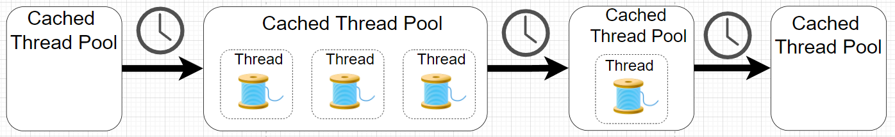

*cached threadpool graphical demonstration*

<br><br>

### Main Function Explanation

```
ExecutorService executor = Executors.newCachedThreadPool();
```

- Creates a CachedThreadPool using Executors.newCachedThreadPool(), which dynamically adjusts the pool size based on the workload.

<br><br>

```
CountDownLatch latch = new CountDownLatch(image.length * image[0].length);
```

- Initializes a CountDownLatch with a count equal to the total number of pixels in the image. This will be used to synchronize the main thread with the completion of all filtering tasks.

<br><br>

```
for (int i = 0; i < image.length; i++) {
    for (int j = 0; j < image[i].length; j++) {
        final int row = i;
        final int col = j;
        executor.submit(() -> {
            image[row][col] = applyFilter(row, col, filterType);
            // Count down the latch after processing a pixel
            latch.countDown();
        });
    }
}
```

- Iterates over each pixel in the image;
- Submits a task to the executor for each pixel;
- Each task applies the specified filter to the corresponding pixel;
- After processing a pixel, it decrements the latch count to indicate completion of that task.

<br><br>

```
try {
    latch.await();
} catch (InterruptedException e) {
    e.printStackTrace();
}
```

- The main thread waits until all tasks are completed by invoking await() on the latch. This ensures that the main thread doesn't proceed until all pixels have been processed.

<br><br>

```
executor.shutdown();
```

- Shuts down the executor after all tasks are completed. This releases resources associated with the thread pool.

<br><br>

```
saveImage(image, filterType);
```

- Once all filtering tasks are completed, the processed image is saved using the saveImage method.

<br>

This function efficiently utilizes a CachedThreadPool to concurrently process each pixel of the image, allowing for faster image processing compared to sequential execution. The CountDownLatch ensures that the main thread waits for all tasks to complete before proceeding with saving the processed image.

<br><br><br>

## ForkJoinPool

The ForkJoinPool framework is designed for divide-and-conquer parallelism, particularly well-suited for recursive filter operations. It employs a work-stealing algorithm, where idle threads steal tasks from other threads' queues, ensuring efficient distribution of workload and minimizing idle time.

In the ForkJoinPool framework, work stealing is a key feature that allows idle threads to "steal" tasks from the queues of other threads when their own queues are empty. This dynamic load balancing mechanism helps to maximize CPU utilization and reduce idle time by ensuring that threads are always actively processing tasks.

Work stealing is particularly beneficial for scenarios involving recursive or divide-and-conquer algorithms, where tasks can be subdivided into smaller subtasks. Threads can efficiently steal tasks from other threads' queues, leading to more balanced workload distribution and improved overall throughput.

This type of thread pool is particularly useful for parallelizing recursive algorithms, such as image processing tasks that involve subdividing images into smaller regions for processing.

<br>


*forkjoinpool graphical demonstration*

<br>


*forkjoinpool image visualization*

<br><br>

### Main Function Explanation

```
    private void applyFiltersRecursively(int startRow, int startCol, int endRow, int endCol, FilterTypes filterType)
```

- startRow, startCol are coordinates of the top-left corner of the rectangular region to process;
- endRow, endCol are coordinates of the bottom-right corner of the rectangular region to process;
- filterType is the type of filter to apply.

<br><br>

```
if (endRow - startRow == 1 && endCol - startCol == 1) {
    // Process a single pixel
    image[startRow][startCol] = applyFilter(startRow, startCol, filterType);
    return;
}
```

- If the rectangular region consists of only one pixel, the filter is applied directly to that pixel, and the function returns.

<br><br>

```
if (endRow - startRow > endCol - startCol) {
    // Split the image vertically
    int midRow = (startRow + endRow) / 2;
    // Create subtasks for each half of the image
    RecursiveAction[] subtasks = { ... };
    // Fork and join subtasks
} else {
    // Split the image horizontally
    int midCol = (startCol + endCol) / 2;
    // Create subtasks for each half of the image
    RecursiveAction[] subtasks = { ... };
    // Fork and join subtasks
}
```

- If the rectangular region is taller than it is wide, the image is split vertically. Otherwise, it's split horizontally;
- For each split, two subtasks are created, each responsible for processing one half of the image;
- The subtasks are created as instances of RecursiveAction with overridden compute() methods.

<br><br>

```
RecursiveAction[] subtasks = {
    new RecursiveAction() {
        @Override
        protected void compute() {
            applyFiltersRecursively(startRow, startCol, midRow, endCol, filterType);
        }
    },
    new RecursiveAction() {
        @Override
        protected void compute() {
            applyFiltersRecursively(midRow, startCol, endRow, endCol, filterType);
        }
    }
};
```

- For vertical splits, two subtasks are created: one for the top half and one for the bottom half of the image;
- For horizontal splits, two subtasks are created: one for the left half and one for the right half of the image.

<br><br>

```
for (RecursiveAction subtask : subtasks) {
    subtask.fork();
}
for (RecursiveAction subtask : subtasks) {
    subtask.join();
}
```

- After forking the subtasks, the main thread waits for their completion by joining each subtask.

<br>

This function recursively splits the image into smaller regions until reaching single pixels, applying the specified filter to each region. This divide-and-conquer approach enables parallelism and efficient processing of image filters.

<br><br><br>

## CompletableFutures

CompletableFutures provide a high-level abstraction for asynchronous computation, allowing for the parallel execution of filter tasks with non-blocking behavior. They represent the result of an asynchronous computation and offer a wide range of methods for composing, combining, and executing asynchronous operations.

This type of thread pool is well-suited for scenarios where tasks can be executed independently and asynchronously, enabling parallel processing of filter operations without blocking the main thread. CompletableFutures facilitate efficient resource utilization and can improve overall system responsiveness.

<br>

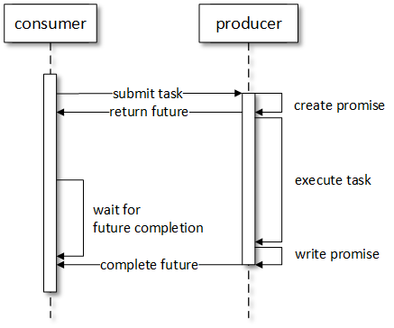

*completable futures graphical demonstration*

<br>


*completable futures image visualization*

<br>


### Main Function Explanation

```
    private CompletableFuture<Void> applyFiltersRecursivelyAsync(int startRow, int startCol, int endRow, int endCol, FilterTypes filterType)
```

- startRow, startCol are coordinates of the top-left corner of the rectangular region to process.
- endRow, endCol are coordinates of the bottom-right corner of the rectangular region to process.
- filterType is the type of filter to apply.

<br><br>

```
if (endRow - startRow <= 1 && endCol - startCol <= 1) {
    // Process a single pixel
    image[startRow][startCol] = applyFilter(startRow, startCol, filterType);
    return CompletableFuture.completedFuture(null);
}
```

- If the rectangular region consists of only one pixel, the filter is applied directly to that pixel synchronously, and a completed CompletableFuture is returned.

<br><br>

```
int midRow = (startRow + endRow) / 2;
int midCol = (startCol + endCol) / 2;
CompletableFuture<Void>[] futures;

if (endRow - startRow > endCol - startCol) {
    // Split vertically
    futures = new CompletableFuture[]{
            applyFiltersRecursivelyAsync(startRow, startCol, midRow, endCol, filterType),
            applyFiltersRecursivelyAsync(midRow, startCol, endRow, endCol, filterType)
    };
} else {
    // Split horizontally
    futures = new CompletableFuture[]{
            applyFiltersRecursivelyAsync(startRow, startCol, endRow, midCol, filterType),
            applyFiltersRecursivelyAsync(startRow, midCol, endRow, endCol, filterType)
    };
}

// Combine all CompletableFuture instances
return CompletableFuture.allOf(futures);
```

- If the rectangular region contains more than one pixel, it's split into smaller parts based on the number of rows and columns;
- For vertical splits, two CompletableFuture instances are created for the top and bottom halves of the image;
- For horizontal splits, two CompletableFuture instances are created for the left and right halves of the image;
- All CompletableFuture instances are stored in an array.

<br><br>

```
return CompletableFuture.allOf(futures);
```

- The allOf static method of CompletableFuture combines all CompletableFuture instances in the array into a single CompletableFuture that completes when all of its component CompletableFutures complete.

<br>

This function asynchronously applies filters to rectangular regions of the image using CompletableFuture, allowing for parallel processing of image filters and efficient utilization of resources.

<br><br><br>

# Tests

Comprehensive testing is essential to evaluate the performance and effectiveness of different implementations. Tests should cover a range of scenarios, including varying image sizes, filter types, and concurrency levels.

<br>

## Garbage Collector

Efficient memory management, including garbage collection, is crucial to prevent memory leaks and optimize resource utilization during image processing.

To evaluate the efficiency of different types of garbage collectors, the following types will be used in the project:

- Serial Garbage Collector;
  - java -XX:+UseSerialGC -jar Application.java
- Parallel Garbage Collector;
  - java -XX:+UseParallelGC -jar Application.java
- G1 Garbage Collector;
  - java -XX:+UseG1GC -jar Application.java
- Z Garbage Collector;
  - java -XX:+UnlockExperimentalVMOptions -XX:+UseZGC Application.java

<br>

__Serial Garbage Collector__

Also known as the Serial Collector, it is a simple, single-threaded garbage collector that freezes all application threads during garbage collection.
It is suitable for single-threaded or small-scale applications with low memory footprints.
Typically used for client applications with low memory requirements or for development and testing purposes.

<br>

__Parallel Garbage Collector__

Also known as the Throughput Collector, it is designed to improve throughput by utilizing multiple threads for garbage collection.
It freezes all application threads during garbage collection but uses multiple threads for garbage collection tasks.
Suitable for mid-sized to large-scale applications where latency is not critical and maximizing throughput is important, such as batch processing or backend server applications.

<br>

__G1 Garbage Collector__

The Garbage-First Garbage Collector is designed to provide both low pause times and high throughput by dividing the heap into multiple regions and performing garbage collection incrementally on these regions.
It dynamically adjusts its behavior based on the application's behavior and heap usage patterns.
Suitable for large-scale applications with large heaps where low-latency and high-throughput are both important, such as web servers or cloud-based applications.

<br>

__Z Garbage Collector (ZGC)__

Introduced in JDK 11, ZGC is a low-latency garbage collector designed to keep pause times consistently low, even with very large heaps (multi-terabyte heaps).
It performs garbage collection concurrently, avoiding long pause times even for very large heaps.
Suitable for applications where ultra-low latency is critical, such as financial trading systems, gaming servers, or other real-time applications.

<br>

The image below shows the configuration of Run Configurations for each type of implementation

(note that only for Sequential_Digital_Image_Processing a run configuration using Serial Garbage Collector is created, due to the fact that this type of garbage collector is not suited for multithreaded applications.)

<br>

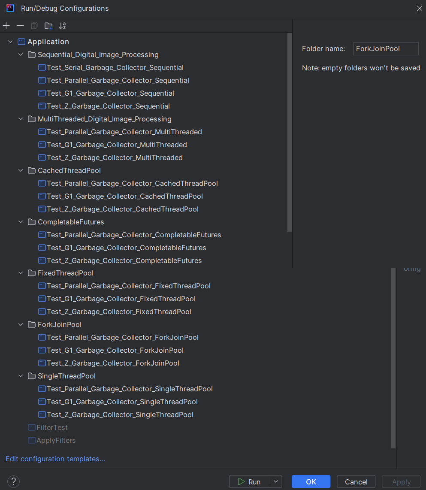

**garbage collector test configurations**

All the run configurations are in the project repository and in the following directory:

```
.
└── src/
    └── test/
        └── java/
            └── runConfigurations
```

<br><br>

## Testing environment 

Different computer components bring different outcomes when it comes to performance, which is why it's important to, before running any test cases, state the specifications of the target computer where the tests will be performed:

- Processor: AMD Ryzen 7 4700U with Radeon Graphics
  - Processor Speed: 2.00 GHz (TURBO: 4.1 GHz)
  - Number of Cores: Octa Core
  - Logical Processors (Threads): 8
  - CPU Architecture: Zen 2
- Graphics Card: AMD Radeon(TM) Graphics 
- RAM: 16,0 GB 
- Disk Storage: 1TB SSD
- Operating System: Microsoft Windows 11 Home 64 bits

<br>

## Generation of Results

Test results should be systematically recorded and analyzed to assess the efficiency and scalability of each implementation.

For each type of implementation, and for each type of garbage collector that was used, a series of tests was conducted to evaluate each filter application time.

To measure the influence of the image size for each filter application, a set of 3 different images with varying sizes were used:


*a simple turtle image - size 696x522px*

<br>


*a simple ferris wheel image - size 1600x1067px*

<br>


*a simple mountain image - size 2776x1504px*

<br> 

The defaul number of threads defined for testing is 10, but will vary for the results on the Multithreaded Implementation, from 5, to 17 threads (ideal number of threads = number of cores + 1)

For each filter, a set of 10 tests was defined to get an average of the filter application. Each test result was saved into an automatically generated txt file, with the results for each filter application.

In this report, and for the sake of the document size, only the average time for each of the 3 images using the corresponding garbage collector will be documented. The complete test results with table ready data is in the project repository and in the following directory:

```
.
└── src/
    └── test/
        └── java/
            └── results
```

<br><br>

### Tests - Sequential Implementation
#### Serial Garbage Collector

__Image 1__
- Average time for BRIGHTER filter: 53 milliseconds
- Average time for GRAYSCALE filter: 31 milliseconds
- Average time for SWIRL filter: 53 milliseconds
- Average time for GLASS filter: 38 milliseconds
- Average time for BLUR filter: 509 milliseconds
- Average time for CONDITIONAL_BLUR filter: 43 milliseconds

__Image 2__
- Average time for BRIGHTER filter: 92 milliseconds
- Average time for GRAYSCALE filter: 87 milliseconds
- Average time for SWIRL filter: 173 milliseconds
- Average time for GLASS filter: 136 milliseconds
- Average time for BLUR filter: 2105 milliseconds
- Average time for CONDITIONAL_BLUR filter: 447 milliseconds

__Image 3__
- Average time for BRIGHTER filter: 251 milliseconds
- Average time for GRAYSCALE filter: 479 milliseconds
- Average time for SWIRL filter: 415 milliseconds
- Average time for GLASS filter: 297 milliseconds
- Average time for BLUR filter: 5178 milliseconds
- Average time for CONDITIONAL_BLUR filter: 976 milliseconds

#### Parallel Garbage Collector

__Image 1__
- Average time for BRIGHTER filter: 41 milliseconds
- Average time for GRAYSCALE filter: 38 milliseconds
- Average time for SWIRL filter: 56 milliseconds
- Average time for GLASS filter: 40 milliseconds
- Average time for BLUR filter: 524 milliseconds
- Average time for CONDITIONAL_BLUR filter: 45 milliseconds

__Image 2__
- Average time for BRIGHTER filter: 89 milliseconds
- Average time for GRAYSCALE filter: 84 milliseconds
- Average time for SWIRL filter: 173 milliseconds
- Average time for GLASS filter: 128 milliseconds
- Average time for BLUR filter: 2136 milliseconds
- Average time for CONDITIONAL_BLUR filter: 441 milliseconds

__Image 3__
- Average time for BRIGHTER filter: 246 milliseconds
- Average time for GRAYSCALE filter: 466 milliseconds
- Average time for SWIRL filter: 427 milliseconds
- Average time for GLASS filter: 298 milliseconds
- Average time for BLUR filter: 5347 milliseconds
- Average time for CONDITIONAL_BLUR filter: 1041 milliseconds


#### G1 Garbage Collector

__Image 1__
- Average time for BRIGHTER filter: 53 milliseconds
- Average time for GRAYSCALE filter: 39 milliseconds
- Average time for SWIRL filter: 74 milliseconds
- Average time for GLASS filter: 57 milliseconds
- Average time for BLUR filter: 687 milliseconds
- Average time for CONDITIONAL_BLUR filter: 45 milliseconds

__Image 2__
- Average time for BRIGHTER filter: 95 milliseconds
- Average time for GRAYSCALE filter: 88 milliseconds
- Average time for SWIRL filter: 190 milliseconds
- Average time for GLASS filter: 140 milliseconds
- Average time for BLUR filter: 2364 milliseconds
- Average time for CONDITIONAL_BLUR filter: 477 milliseconds

__Image 3__
- Average time for BRIGHTER filter: 224 milliseconds
- Average time for GRAYSCALE filter: 212 milliseconds
- Average time for SWIRL filter: 440 milliseconds
- Average time for GLASS filter: 320 milliseconds
- Average time for BLUR filter: 5862 milliseconds
- Average time for CONDITIONAL_BLUR filter: 1051 milliseconds

#### Z Garbage Collector

__Image 1__
- Average time for BRIGHTER filter: 56 milliseconds
- Average time for GRAYSCALE filter: 40 milliseconds
- Average time for SWIRL filter: 75 milliseconds
- Average time for GLASS filter: 59 milliseconds
- Average time for BLUR filter: 670 milliseconds
- Average time for CONDITIONAL_BLUR filter: 44 milliseconds

__Image 2__
- Average time for BRIGHTER filter: 97 milliseconds
- Average time for GRAYSCALE filter: 87 milliseconds
- Average time for SWIRL filter: 191 milliseconds
- Average time for GLASS filter: 141 milliseconds
- Average time for BLUR filter: 2366 milliseconds
- Average time for CONDITIONAL_BLUR filter: 480 milliseconds

__Image 3__
- Average time for BRIGHTER filter: 263 milliseconds
- Average time for GRAYSCALE filter: 268 milliseconds
- Average time for SWIRL filter: 433 milliseconds
- Average time for GLASS filter: 314 milliseconds
- Average time for BLUR filter: 5727 milliseconds
- Average time for CONDITIONAL_BLUR filter: 1052 milliseconds

### Tests - Multithreaded Implementation

#### Parallel Garbage Collector With 5 Threads

__Image 1__
- Average time for BRIGHTER filter: 83 milliseconds
- Average time for GRAYSCALE filter: 66 milliseconds
- Average time for SWIRL filter: 74 milliseconds
- Average time for GLASS filter: 67 milliseconds
- Average time for BLUR filter: 219 milliseconds
- Average time for CONDITIONAL_BLUR filter: 54 milliseconds

__Image 2__
- Average time for BRIGHTER filter: 110 milliseconds
- Average time for GRAYSCALE filter: 86 milliseconds
- Average time for SWIRL filter: 118 milliseconds
- Average time for GLASS filter: 166 milliseconds
- Average time for BLUR filter: 523 milliseconds
- Average time for CONDITIONAL_BLUR filter: 190 milliseconds

__Image 3__
- Average time for BRIGHTER filter: 239 milliseconds
- Average time for GRAYSCALE filter: 224 milliseconds
- Average time for SWIRL filter: 299 milliseconds
- Average time for GLASS filter: 394 milliseconds
- Average time for BLUR filter: 1401 milliseconds
- Average time for CONDITIONAL_BLUR filter: 567 milliseconds


#### Parallel Garbage Collector With 10 Threads

__Image 1__
- Average time for BRIGHTER filter: 56 milliseconds
- Average time for GRAYSCALE filter: 39 milliseconds
- Average time for SWIRL filter: 50 milliseconds
- Average time for GLASS filter: 58 milliseconds
- Average time for BLUR filter: 146 milliseconds
- Average time for CONDITIONAL_BLUR filter: 37 milliseconds

__Image 2__
- Average time for BRIGHTER filter: 107 milliseconds
- Average time for GRAYSCALE filter: 141 milliseconds
- Average time for SWIRL filter: 114 milliseconds
- Average time for GLASS filter: 159 milliseconds
- Average time for BLUR filter: 431 milliseconds
- Average time for CONDITIONAL_BLUR filter: 163 milliseconds

__Image 3__
- Average time for BRIGHTER filter: 209 milliseconds
- Average time for GRAYSCALE filter: 207 milliseconds
- Average time for SWIRL filter: 270 milliseconds
- Average time for GLASS filter: 374 milliseconds
- Average time for BLUR filter: 1075 milliseconds
- Average time for CONDITIONAL_BLUR filter: 420 milliseconds

#### Parallel Garbage Collector With 17 Threads

__Image 1__
- Average time for BRIGHTER filter: 60 milliseconds
- Average time for GRAYSCALE filter: 39 milliseconds
- Average time for SWIRL filter: 50 milliseconds
- Average time for GLASS filter: 64 milliseconds
- Average time for BLUR filter: 179 milliseconds
- Average time for CONDITIONAL_BLUR filter: 42 milliseconds

__Image 2__
- Average time for BRIGHTER filter: 117 milliseconds
- Average time for GRAYSCALE filter: 89 milliseconds
- Average time for SWIRL filter: 110 milliseconds
- Average time for GLASS filter: 160 milliseconds
- Average time for BLUR filter: 887 milliseconds
- Average time for CONDITIONAL_BLUR filter: 165 milliseconds

__Image 3__
- Average time for BRIGHTER filter: 218 milliseconds
- Average time for GRAYSCALE filter: 227 milliseconds
- Average time for SWIRL filter: 278 milliseconds
- Average time for GLASS filter: 382 milliseconds
- Average time for BLUR filter: 2412 milliseconds
- Average time for CONDITIONAL_BLUR filter: 365 milliseconds

#### G1 Garbage Collector

__Image 1__
- Average time for BRIGHTER filter: 57 milliseconds
- Average time for GRAYSCALE filter: 43 milliseconds
- Average time for SWIRL filter: 50 milliseconds
- Average time for GLASS filter: 85 milliseconds
- Average time for BLUR filter: 188 milliseconds
- Average time for CONDITIONAL_BLUR filter: 68 milliseconds

__Image 2__
- Average time for BRIGHTER filter: 131 milliseconds
- Average time for GRAYSCALE filter: 134 milliseconds
- Average time for SWIRL filter: 122 milliseconds
- Average time for GLASS filter: 169 milliseconds
- Average time for BLUR filter: 475 milliseconds
- Average time for CONDITIONAL_BLUR filter: 169 milliseconds

__Image 3__
- Average time for BRIGHTER filter: 227 milliseconds
- Average time for GRAYSCALE filter: 224 milliseconds
- Average time for SWIRL filter: 286 milliseconds
- Average time for GLASS filter: 378 milliseconds
- Average time for BLUR filter: 1119 milliseconds
- Average time for CONDITIONAL_BLUR filter: 427 milliseconds

#### Z Garbage Collector

__Image 1__
- Average time for BRIGHTER filter: 58 milliseconds
- Average time for GRAYSCALE filter: 41 milliseconds
- Average time for SWIRL filter: 51 milliseconds
- Average time for GLASS filter: 66 milliseconds
- Average time for BLUR filter: 175 milliseconds
- Average time for CONDITIONAL_BLUR filter: 47 milliseconds

__Image 2__
- Average time for BRIGHTER filter: 163 milliseconds
- Average time for GRAYSCALE filter: 95 milliseconds
- Average time for SWIRL filter: 125 milliseconds
- Average time for GLASS filter: 170 milliseconds
- Average time for BLUR filter: 442 milliseconds
- Average time for CONDITIONAL_BLUR filter: 174 milliseconds

__Image 3__
- Average time for BRIGHTER filter: 233 milliseconds
- Average time for GRAYSCALE filter: 220 milliseconds
- Average time for SWIRL filter: 269 milliseconds
- Average time for GLASS filter: 362 milliseconds
- Average time for BLUR filter: 1162 milliseconds
- Average time for CONDITIONAL_BLUR filter: 425 milliseconds

### Tests - CachedThreadPool Implementation

#### Parallel Garbage Collector

__Image 1__
- Average time for BRIGHTER filter: 735 milliseconds
- Average time for GRAYSCALE filter: 525 milliseconds
- Average time for SWIRL filter: 565 milliseconds
- Average time for GLASS filter: 609 milliseconds
- Average time for BLUR filter: 701 milliseconds
- Average time for CONDITIONAL_BLUR filter: 808 milliseconds

__Image 2__
- Average time for BRIGHTER filter: 2934 milliseconds
- Average time for GRAYSCALE filter: 3124 milliseconds
- Average time for SWIRL filter: 2777 milliseconds
- Average time for GLASS filter: 2674 milliseconds
- Average time for BLUR filter: 3884 milliseconds
- Average time for CONDITIONAL_BLUR filter: 3179 milliseconds

__Image 3__
- Average time for BRIGHTER filter: 7032 milliseconds
- Average time for GRAYSCALE filter: 6912 milliseconds
- Average time for SWIRL filter: 7071 milliseconds
- Average time for GLASS filter: 7167 milliseconds
- Average time for BLUR filter: 9386 milliseconds
- Average time for CONDITIONAL_BLUR filter: 7242 milliseconds


#### G1 Garbage Collector

__Image 1__
- Average time for BRIGHTER filter: 602 milliseconds
- Average time for GRAYSCALE filter: 988 milliseconds
- Average time for SWIRL filter: 1005 milliseconds
- Average time for GLASS filter: 568 milliseconds
- Average time for BLUR filter: 762 milliseconds
- Average time for CONDITIONAL_BLUR filter: 945 milliseconds

__Image 2__
- Average time for BRIGHTER filter: 2860 milliseconds
- Average time for GRAYSCALE filter: 2960 milliseconds
- Average time for SWIRL filter: 2866 milliseconds
- Average time for GLASS filter: 2953 milliseconds
- Average time for BLUR filter: 3669 milliseconds
- Average time for CONDITIONAL_BLUR filter: 3351 milliseconds

__Image 3__
- Average time for BRIGHTER filter: 7296 milliseconds
- Average time for GRAYSCALE filter: 7229 milliseconds
- Average time for SWIRL filter: 7014 milliseconds
- Average time for GLASS filter: 7222 milliseconds
- Average time for BLUR filter: 9538 milliseconds
- Average time for CONDITIONAL_BLUR filter: 7278 milliseconds

#### Z Garbage Collector

__Image 1__
- Average time for BRIGHTER filter: 690 milliseconds
- Average time for GRAYSCALE filter: 556 milliseconds
- Average time for SWIRL filter: 572 milliseconds
- Average time for GLASS filter: 587 milliseconds
- Average time for BLUR filter: 739 milliseconds
- Average time for CONDITIONAL_BLUR filter: 615 milliseconds

__Image 2__
- Average time for BRIGHTER filter: 4434 milliseconds
- Average time for GRAYSCALE filter: 4205 milliseconds
- Average time for SWIRL filter: 4605 milliseconds
- Average time for GLASS filter: 4241 milliseconds
- Average time for BLUR filter: 5546 milliseconds
- Average time for CONDITIONAL_BLUR filter: 4674 milliseconds

__Image 3__
- Average time for BRIGHTER filter: 9732 milliseconds
- Average time for GRAYSCALE filter: 9846 milliseconds
- Average time for SWIRL filter: 10077 milliseconds
- Average time for GLASS filter: 10827 milliseconds
- Average time for BLUR filter: 13501 milliseconds
- Average time for CONDITIONAL_BLUR filter: 10626 milliseconds

### Tests - Completable Futures Implementation

#### Parallel Garbage Collector

__Image 1__
- Average time for BRIGHTER filter: 105 milliseconds
- Average time for GRAYSCALE filter: 83 milliseconds
- Average time for SWIRL filter: 75 milliseconds
- Average time for GLASS filter: 69 milliseconds
- Average time for BLUR filter: 670 milliseconds
- Average time for CONDITIONAL_BLUR filter: 66 milliseconds

__Image 2__
- Average time for BRIGHTER filter: 281 milliseconds
- Average time for GRAYSCALE filter: 273 milliseconds
- Average time for SWIRL filter: 325 milliseconds
- Average time for GLASS filter: 333 milliseconds
- Average time for BLUR filter: 3193 milliseconds
- Average time for CONDITIONAL_BLUR filter: 729 milliseconds

__Image 3__
- Average time for BRIGHTER filter: 737 milliseconds
- Average time for GRAYSCALE filter: 789 milliseconds
- Average time for SWIRL filter: 870 milliseconds
- Average time for GLASS filter: 746 milliseconds
- Average time for BLUR filter: 7735 milliseconds
- Average time for CONDITIONAL_BLUR filter: 1533 milliseconds


#### G1 Garbage Collector

__Image 1__
- Average time for BRIGHTER filter: 78 milliseconds
- Average time for GRAYSCALE filter: 59 milliseconds
- Average time for SWIRL filter: 71 milliseconds
- Average time for GLASS filter: 65 milliseconds
- Average time for BLUR filter: 658 milliseconds
- Average time for CONDITIONAL_BLUR filter: 62 milliseconds

__Image 2__
- Average time for BRIGHTER filter: 261 milliseconds
- Average time for GRAYSCALE filter: 257 milliseconds
- Average time for SWIRL filter: 317 milliseconds
- Average time for GLASS filter: 328 milliseconds
- Average time for BLUR filter: 3132 milliseconds
- Average time for CONDITIONAL_BLUR filter: 715 milliseconds

__Image 3__
- Average time for BRIGHTER filter: 697 milliseconds
- Average time for GRAYSCALE filter: 589 milliseconds
- Average time for SWIRL filter: 693 milliseconds
- Average time for GLASS filter: 712 milliseconds
- Average time for BLUR filter: 7804 milliseconds
- Average time for CONDITIONAL_BLUR filter: 1538 milliseconds

#### Z Garbage Collector

__Image 1__
- Average time for BRIGHTER filter: 77 milliseconds
- Average time for GRAYSCALE filter: 59 milliseconds
- Average time for SWIRL filter: 72 milliseconds
- Average time for GLASS filter: 64 milliseconds
- Average time for BLUR filter: 717 milliseconds
- Average time for CONDITIONAL_BLUR filter: 62 milliseconds

__Image 2__
- Average time for BRIGHTER filter: 268 milliseconds
- Average time for GRAYSCALE filter: 260 milliseconds
- Average time for SWIRL filter: 317 milliseconds
- Average time for GLASS filter: 329 milliseconds
- Average time for BLUR filter: 3483 milliseconds
- Average time for CONDITIONAL_BLUR filter: 724 milliseconds

__Image 3__
- Average time for BRIGHTER filter: 669 milliseconds
- Average time for GRAYSCALE filter: 614 milliseconds
- Average time for SWIRL filter: 703 milliseconds
- Average time for GLASS filter: 731 milliseconds
- Average time for BLUR filter: 8487 milliseconds
- Average time for CONDITIONAL_BLUR filter: 1542 milliseconds

### Tests - FixedThreadPool Implementation

#### Parallel Garbage Collector

__Image 1__
- Average time for BRIGHTER filter: 64 milliseconds
- Average time for GRAYSCALE filter: 41 milliseconds
- Average time for SWIRL filter: 46 milliseconds
- Average time for GLASS filter: 61 milliseconds
- Average time for BLUR filter: 152 milliseconds
- Average time for CONDITIONAL_BLUR filter: 45 milliseconds

__Image 2__
- Average time for BRIGHTER filter: 176 milliseconds
- Average time for GRAYSCALE filter: 173 milliseconds
- Average time for SWIRL filter: 203 milliseconds
- Average time for GLASS filter: 263 milliseconds
- Average time for BLUR filter: 645 milliseconds
- Average time for CONDITIONAL_BLUR filter: 314 milliseconds

__Image 3__
- Average time for BRIGHTER filter: 413 milliseconds
- Average time for GRAYSCALE filter: 413 milliseconds
- Average time for SWIRL filter: 407 milliseconds
- Average time for GLASS filter: 554 milliseconds
- Average time for BLUR filter: 1695 milliseconds
- Average time for CONDITIONAL_BLUR filter: 679 milliseconds


#### G1 Garbage Collector

__Image 1__
- Average time for BRIGHTER filter: 73 milliseconds
- Average time for GRAYSCALE filter: 46 milliseconds
- Average time for SWIRL filter: 51 milliseconds
- Average time for GLASS filter: 63 milliseconds
- Average time for BLUR filter: 162 milliseconds
- Average time for CONDITIONAL_BLUR filter: 44 milliseconds

__Image 2__
- Average time for BRIGHTER filter: 358 milliseconds
- Average time for GRAYSCALE filter: 176 milliseconds
- Average time for SWIRL filter: 193 milliseconds
- Average time for GLASS filter: 250 milliseconds
- Average time for BLUR filter: 708 milliseconds
- Average time for CONDITIONAL_BLUR filter: 769 milliseconds

__Image 3__
- Average time for BRIGHTER filter: 459 milliseconds
- Average time for GRAYSCALE filter: 438 milliseconds
- Average time for SWIRL filter: 392 milliseconds
- Average time for GLASS filter: 511 milliseconds
- Average time for BLUR filter: 1774 milliseconds
- Average time for CONDITIONAL_BLUR filter: 720 milliseconds

#### Z Garbage Collector

__Image 1__
- Average time for BRIGHTER filter: 65 milliseconds
- Average time for GRAYSCALE filter: 39 milliseconds
- Average time for SWIRL filter: 45 milliseconds
- Average time for GLASS filter: 54 milliseconds
- Average time for BLUR filter: 160 milliseconds
- Average time for CONDITIONAL_BLUR filter: 47 milliseconds

__Image 2__
- Average time for BRIGHTER filter: 181 milliseconds
- Average time for GRAYSCALE filter: 183 milliseconds
- Average time for SWIRL filter: 193 milliseconds
- Average time for GLASS filter: 254 milliseconds
- Average time for BLUR filter: 1183 milliseconds
- Average time for CONDITIONAL_BLUR filter: 303 milliseconds

__Image 3__
- Average time for BRIGHTER filter: 446 milliseconds
- Average time for GRAYSCALE filter: 452 milliseconds
- Average time for SWIRL filter: 493 milliseconds
- Average time for GLASS filter: 542 milliseconds
- Average time for BLUR filter: 1585 milliseconds
- Average time for CONDITIONAL_BLUR filter: 674 milliseconds

### Tests - ForkJoinPool Implementation

#### Parallel Garbage Collector

__Image 1__
- Average time for BRIGHTER filter: 95 milliseconds
- Average time for GRAYSCALE filter: 67 milliseconds
- Average time for SWIRL filter: 56 milliseconds
- Average time for GLASS filter: 59 milliseconds
- Average time for BLUR filter: 178 milliseconds
- Average time for CONDITIONAL_BLUR filter: 48 milliseconds

__Image 2__
- Average time for BRIGHTER filter: 263 milliseconds
- Average time for GRAYSCALE filter: 262 milliseconds
- Average time for SWIRL filter: 267 milliseconds
- Average time for GLASS filter: 270 milliseconds
- Average time for BLUR filter: 1019 milliseconds
- Average time for CONDITIONAL_BLUR filter: 310 milliseconds

__Image 3__
- Average time for BRIGHTER filter: 904 milliseconds
- Average time for GRAYSCALE filter: 645 milliseconds
- Average time for SWIRL filter: 557 milliseconds
- Average time for GLASS filter: 577 milliseconds
- Average time for BLUR filter: 2432 milliseconds
- Average time for CONDITIONAL_BLUR filter: 674 milliseconds


#### G1 Garbage Collector

__Image 1__
- Average time for BRIGHTER filter: 95 milliseconds
- Average time for GRAYSCALE filter: 66 milliseconds
- Average time for SWIRL filter: 53 milliseconds
- Average time for GLASS filter: 59 milliseconds
- Average time for BLUR filter: 180 milliseconds
- Average time for CONDITIONAL_BLUR filter: 51 milliseconds

__Image 2__
- Average time for BRIGHTER filter: 258 milliseconds
- Average time for GRAYSCALE filter: 260 milliseconds
- Average time for SWIRL filter: 264 milliseconds
- Average time for GLASS filter: 262 milliseconds
- Average time for BLUR filter: 1124 milliseconds
- Average time for CONDITIONAL_BLUR filter: 319 milliseconds

__Image 3__
- Average time for BRIGHTER filter: 626 milliseconds
- Average time for GRAYSCALE filter: 558 milliseconds
- Average time for SWIRL filter: 548 milliseconds
- Average time for GLASS filter: 557 milliseconds
- Average time for BLUR filter: 2218 milliseconds
- Average time for CONDITIONAL_BLUR filter: 767 milliseconds

#### Z Garbage Collector

__Image 1__
- Average time for BRIGHTER filter: 95 milliseconds
- Average time for GRAYSCALE filter: 67 milliseconds
- Average time for SWIRL filter: 54 milliseconds
- Average time for GLASS filter: 59 milliseconds
- Average time for BLUR filter: 169 milliseconds
- Average time for CONDITIONAL_BLUR filter: 47 milliseconds

__Image 2__
- Average time for BRIGHTER filter: 261 milliseconds
- Average time for GRAYSCALE filter: 261 milliseconds
- Average time for SWIRL filter: 262 milliseconds
- Average time for GLASS filter: 264 milliseconds
- Average time for BLUR filter: 885 milliseconds
- Average time for CONDITIONAL_BLUR filter: 316 milliseconds

__Image 3__
- Average time for BRIGHTER filter: 644 milliseconds
- Average time for GRAYSCALE filter: 660 milliseconds
- Average time for SWIRL filter: 596 milliseconds
- Average time for GLASS filter: 580 milliseconds
- Average time for BLUR filter: 2188 milliseconds
- Average time for CONDITIONAL_BLUR filter: 698 milliseconds

### Tests - SingleThreadPool Implementation

#### Parallel Garbage Collector

__Image 1__
- Average time for BRIGHTER filter: 61 milliseconds
- Average time for GRAYSCALE filter: 36 milliseconds
- Average time for SWIRL filter: 57 milliseconds
- Average time for GLASS filter: 68 milliseconds
- Average time for BLUR filter: 690 milliseconds
- Average time for CONDITIONAL_BLUR filter: 55 milliseconds

__Image 2__
- Average time for BRIGHTER filter: 189 milliseconds
- Average time for GRAYSCALE filter: 182 milliseconds
- Average time for SWIRL filter: 264 milliseconds
- Average time for GLASS filter: 306 milliseconds
- Average time for BLUR filter: 3290 milliseconds
- Average time for CONDITIONAL_BLUR filter: 668 milliseconds

__Image 3__
- Average time for BRIGHTER filter: 469 milliseconds
- Average time for GRAYSCALE filter: 448 milliseconds
- Average time for SWIRL filter: 545 milliseconds
- Average time for GLASS filter: 653 milliseconds
- Average time for BLUR filter: 8044 milliseconds
- Average time for CONDITIONAL_BLUR filter: 1407 milliseconds


#### G1 Garbage Collector

__Image 1__
- Average time for BRIGHTER filter: 57 milliseconds
- Average time for GRAYSCALE filter: 36 milliseconds
- Average time for SWIRL filter: 58 milliseconds
- Average time for GLASS filter: 64 milliseconds
- Average time for BLUR filter: 628 milliseconds
- Average time for CONDITIONAL_BLUR filter: 54 milliseconds

__Image 2__
- Average time for BRIGHTER filter: 186 milliseconds
- Average time for GRAYSCALE filter: 185 milliseconds
- Average time for SWIRL filter: 309 milliseconds
- Average time for GLASS filter: 306 milliseconds
- Average time for BLUR filter: 3010 milliseconds
- Average time for CONDITIONAL_BLUR filter: 658 milliseconds

__Image 3__
- Average time for BRIGHTER filter: 422 milliseconds
- Average time for GRAYSCALE filter: 396 milliseconds
- Average time for SWIRL filter: 547 milliseconds
- Average time for GLASS filter: 655 milliseconds
- Average time for BLUR filter: 7367 milliseconds
- Average time for CONDITIONAL_BLUR filter: 1432 milliseconds

#### Z Garbage Collector

__Image 1__
- Average time for BRIGHTER filter: 59 milliseconds
- Average time for GRAYSCALE filter: 37 milliseconds
- Average time for SWIRL filter: 55 milliseconds
- Average time for GLASS filter: 67 milliseconds
- Average time for BLUR filter: 615 milliseconds
- Average time for CONDITIONAL_BLUR filter: 54 milliseconds

__Image 2__
- Average time for BRIGHTER filter: 184 milliseconds
- Average time for GRAYSCALE filter: 181 milliseconds
- Average time for SWIRL filter: 261 milliseconds
- Average time for GLASS filter: 306 milliseconds
- Average time for BLUR filter: 2952 milliseconds
- Average time for CONDITIONAL_BLUR filter: 744 milliseconds

__Image 3__
- Average time for BRIGHTER filter: 532 milliseconds
- Average time for GRAYSCALE filter: 447 milliseconds
- Average time for SWIRL filter: 557 milliseconds
- Average time for GLASS filter: 655 milliseconds
- Average time for BLUR filter: 7554 milliseconds
- Average time for CONDITIONAL_BLUR filter: 1462 milliseconds

<br><br><br>

# Profiling

Profiling plays a crucial role in identifying performance bottlenecks and optimizing software applications. By analyzing resource usage and execution characteristics, developers can pinpoint areas for improvement and enhance overall performance. This topic explores the significance of profiling in software development and its methodologies.

**Why Profiling Matters:**
1. **Identifying Bottlenecks:** Profiling helps pinpoint areas of code that consume excessive resources or exhibit poor performance.
2. **Optimization Guidance:** It provides insights into where optimizations can yield the most significant improvements.
3. **Resource Allocation:** Profiling aids in efficient resource allocation by identifying memory leaks, CPU-bound operations, or I/O bottlenecks.
4. **User Experience Enhancement:** Optimized software leads to better user experience through faster response times and smoother interactions.

<br>

**Types of Profiling:**
1. **Performance Profiling:** Measures execution time and resource usage to identify performance bottlenecks.
2. **Memory Profiling:** Identifies memory leaks, excessive allocations, and inefficient memory usage patterns.
3. **Concurrency Profiling:** Analyzes thread usage and synchronization issues in multithreaded applications.
4. **I/O Profiling:** Examines disk and network I/O operations to optimize data access and transfer.

<br>

**Profiling Techniques:**
1. **Instrumentation-Based Profiling:** Inserts code to measure execution time and resource usage at various points in the application.
2. **Sampling-Based Profiling:** Periodically samples the application's state to gather data on resource usage and execution characteristics.
3. **Heap Profiling:** Analyzes memory allocations and deallocations to identify memory usage patterns and potential leaks.
4. **Thread Profiling:** Monitors thread activity, contention, and synchronization to optimize concurrency.

<br>

**Tools and Frameworks:**
1. **Performance Monitoring Tools:** Examples include Java VisualVM, Python's cProfile, and Linux perf.
2. **Profiling Libraries:** Frameworks like Google's Performance Tools (gperftools) and Intel VTune provide advanced profiling capabilities.
3. **Integrated Development Environments (IDEs):** IDEs like Visual Studio and IntelliJ IDEA offer built-in profiling tools for code analysis and optimization.

<br>

**Best Practices for Profiling:**
1. **Define Performance Metrics:** Establishing clear performance goals and metrics to measure the effectiveness of optimizations.
2. **Focus on Hotspots:** Prioritizing optimization efforts based on profiling results, focusing on critical code paths or functions.
3. **Iterative Optimization:** Continuously profile, optimize, and validate improvements to ensure sustained performance gains.
4. **Contextual Analysis:** Considering application domain and usage scenarios when interpreting profiling data when prioritizing optimizations effectively.

<br>

The focus of the application profiling will be Memory and Performance Profiling, and the Multithreaded implementation will be used as an example for it. Java Flight Recorder (JFR) was used.

JFR collects events that occur in the JVM when the Java application runs. These events are related to the state of the JVM itself or the state of the program. An event has a name, a timestamp, and additional information (like thread information, execution stack, and state of the heap).

There are three types of events that JFR collects:

- an instant event is logged immediately once it occurs;
- a duration event is logged if its duration succeeds a specified threshold;
- a sample event is used to sample the system activity;

The events that JFR collects contain a huge amount of data. For this reason, by design, JFR is fast enough to not impede the program.

JFR saves data about the events in a single output file, flight.jfr. 
It uses various buffers to store the collected data before flushing the blocks of data to disk. Things might become a little bit more complex because, at the same moment, a program might have multiple registering processes with different options. Because of this, we may find more data in the output file than requested, or it may not be in chronological order. We might not even notice this fact if we use JMC, because it visualizes the events in chronological order.


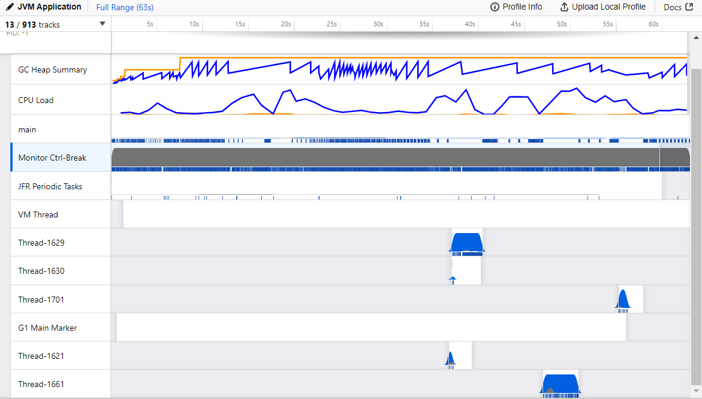

**General view of the Java Flight Recorder profiler**

<br>

This is the overall view of the profiler. We can see information like:

- statistics about created objects, when they were created and destroyed by the garbage collector;
- a detailed report about the threads’ chronology, when they were locked or active;
- which I/O operations the application was executing.

The creation of threads happens when the filter functions are called.
  
<br>

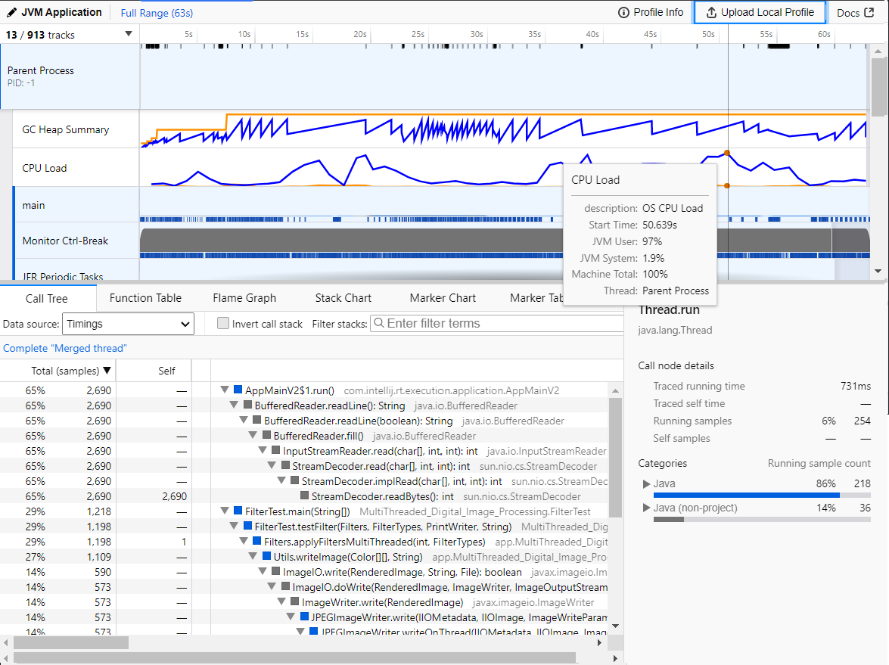

*CPU Load peaks during runtime*

During runtime, the highest CPU load peak was around 50 seconds

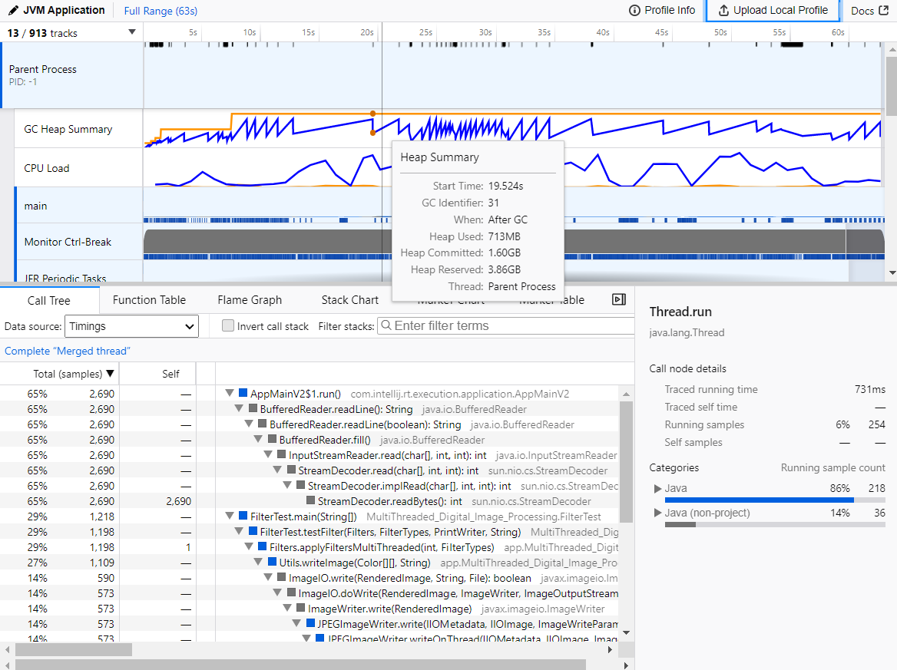

*Heap Summary peaks during runtime*

In the image above, we can see that after every Garbage Collector runs, the memory usage is reduced. This happens along the execution of the programs.

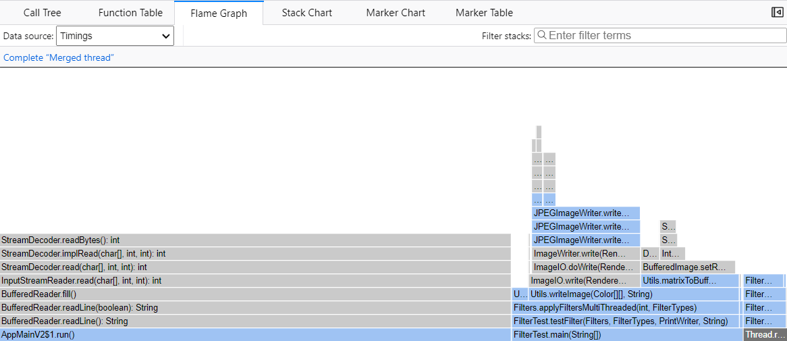

*Flame Graph Visualization*

The flame graph visualizes the application call tree with the rectangles that stand for frames of the call stack, ordered by width. Frames that consume more resources are wider than the others and are placed on the left.

The StreamDecoder, InputStreamReader, BufferedReader and the AppMain methods are the most resource costly overall.

<br><br><br>

# Results Analysis and Conclusions

Based on test results, conclusions can be drawn regarding the relative performance and suitability of each implementation for specific use cases.

From the provided test results, several conclusions can be drawn regarding the performance of different garbage collectors and thread pool implementations in processing image filters:

**Effect of Garbage Collectors**:
   - The choice of garbage collector impacts the overall performance. Across all implementations, the Z Garbage Collector generally showed slightly better performance compared to G1 and Parallel garbage collectors in terms of average filter processing time.
   - However, the difference in performance between the garbage collectors may not be significant in all cases. It's essential to consider other factors such as memory usage and application requirements when selecting a garbage collector.

<br>

**Effect of Thread Pool Implementations**:
   - The choice of thread pool implementation also influences performance. The ForkJoinPool implementation consistently showed better performance compared to other thread pool implementations like FixedThreadPool and CachedThreadPool.
   - ForkJoinPool's ability to efficiently divide tasks among multiple threads and handle recursive decomposition likely contributes to its better performance in this scenario.

<br>

**Impact of Image Size**:
   - As expected, the processing time increases with the size of the image and complexity of the filters applied. Image 3 consistently showed higher processing times compared to Image 1 and Image 2 across all implementations due to it's size.
   - The BLUR filter generally took the most time to process, especially for larger images. This suggests that the BLUR filter operation is computationally intensive.

<br>

**Concurrency vs. Sequential Processing**:
   - Multithreaded implementations generally outperform sequential implementations in terms of processing time, especially for larger images. This demonstrates the benefits of concurrency in speeding up image processing tasks.
   - However, the degree of improvement varies depending on factors such as the number of available processor cores, the efficiency of thread management, and the nature of the image processing tasks.

<br>

**Trade-offs**:
   - While multithreaded implementations offer faster processing times, they also introduce overhead related to thread creation, synchronization, and context switching. This overhead can sometimes outweigh the benefits of parallelism, especially for smaller images or tasks with low computational complexity.
   - CachedThreadPool implementations showed significantly slower performance compared to other thread pool implementations. This might be due to the overhead of task scheduling and execution in a cached thread pool environment, where threads are created dynamically.

<br><br><br>

# Final Remarks

Parallel digital image processing offers significant advantages in terms of speed and scalability, particularly for large-scale image analysis tasks. By leveraging concurrency and parallelism, developers can unlock the full potential of modern computing architectures to achieve real-time image processing and analysis capabilities. However, careful design, testing, and optimization are necessary to harness the full benefits of parallelism while minimizing overhead and resource contention.

Optimizing image processing performance involves selecting the right garbage collector and thread pool implementation while considering image characteristics and processing complexity. Key points include:

- The Garbage Collector choice impacts performance, with options like ZGC, G1GC, and Parallel GC;
- System requirements and memory usage must be considered when choosing;
- ForkJoinPool outperforms FixedThreadPool and CachedThreadPool;
- Efficiency stems from task decomposition and thread management;
- Larger or complex images require more processing time;
- BLUR filter often contributes most to processing time;
- Multithreading improves performance but introduces overhead;
- Balance benefits with overhead for optimal results;
- Options must be selected based on specific application needs and resource constraints;
- Experimentation and profiling essential for fine-tuning performance.

<br><br>

# References 

1. https://medium.com/@erayaraz10/a-comprehensive-guide-to-thread-pools-in-java-75a06657fda
2. https://www.baeldung.com/thread-pool-java-and-guava
3. https://www.baeldung.com/java-flight-recorder-monitoring
4. https://www.jetbrains.com/help/idea/read-the-profiling-report.html#profiler-flame-chart
5. https://docs.oracle.com/javase/8/docs/api/java/lang/Thread.html
6. https://www.tutorialspoint.com/java/java_multithreading.htm
7. https://www.tutorialspoint.com/java/java_multithreading.htm
8. https://tipsontech.medium.com/multi-threading-in-java-b33620ce7b0a
9. https://docs.oracle.com/javase/8/docs/api/java/util/concurrent/CompletableFuture.html
10. https://medium.com/javarevisited/java-completablefuture-c47ca8c885af
11. https://jenkov.com/tutorials/java-concurrency/thread-pools.html
12. https://docs.oracle.com/javase/8/docs/api/java/util/concurrent/ForkJoinPool.html
13. https://www.baeldung.com/java-executors-cached-fixed-threadpool
14. https://docs.oracle.com/javase/8/docs/api/java/util/concurrent/Executors.html
15. https://www.baeldung.com/java-concurrent-locks
16. https://medium.com/hprog99/locking-mechanism-in-java-c23142d4707b
17. https://www.baeldung.com/jvm-garbage-collectors
18. https://developers.redhat.com/articles/2021/11/02/how-choose-best-java-garbage-collector#serial_collector
19. https://www.baeldung.com/java-profilers
