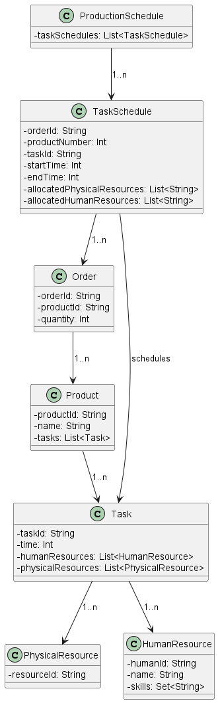

# Scheduling of Production Orders in a Factory

This project was developed as part of the Técnicas Avançadas de Programação (TAP) course unit of Mestrado em Engenharia Informática (MEI) at Instituto Superior de Engenharia do Porto (ISEP).
This project aims to address the scheduling of production orders in a factory.

The project had the following phases:
- Convert the XML with the production orders information;
- Implement the algorithm to create a schedule of production, in which every task of every product to produce is given a time slot.
- Finally, an output file is generated with the orders, and the algorithm and domain rules are tested.

## Domain Model
After examining the specifications outlined in the project rules, the subsequent domain model was constructed:

| Class               | Description                                                                                             |
|---------------------|---------------------------------------------------------------------------------------------------------|
| **Human Resource**  | Represents a worker in the factory.                                                                     |
| **Order**           | Represents a production request for a specific quantity of a single product.                           |
| **Physical Resource** | Represents a machine or post in the factory.                                                          |
| **Product**         | Defines a product type and the tasks needed to produce one unit of it.                                 |
| **Production Schedule** | Represents the complete schedule of tasks for all orders, including timing and assigned resources. |
| **Task**            | Represents a step in the production process.                                                            |
| **Task Schedule**   | Describes when a specific task instance is scheduled and which resources it uses.                      |

## Domain Validations
| Class               | Description                                                                 |
|---------------------|-----------------------------------------------------------------------------|
| **Human Resource**  | HumanId must follow the pattern HRS_[0-9]                                   |
| **Human Resource**  | When performing a task, each human resource can only be assigned to one physical resource. |
| **Order**           | OrderId must follow the pattern ORD_[0-9]                                   |
| **PhysicalResource**| PhysicalResourceId must follow the pattern PRS_[0-9].                       |
| **Product**         | ProductId must follow the pattern PRD_[0-9]                                 |
| **Schedule**        | TimeOfSchedule must be a positive not null integer                          |
| **Task**            | Duration must be a positive not null integer                                |
| **Task**            | One human resource for each physical resource must be allocated.            |
| **Task**            | TaskId must follow the pattern TSK_[0-9]                                    |
| **Task**            | TaskRef must follow the pattern TSK_[0-9]                                   |

# Milestones

## Milestone 1 (MS01)
The goal of Milestone 1 is to develop a Minimum Viable Product (MVP) that creates a valid production schedule from an XML input file. This initial version simplifies the scheduling problem by enforcing serial execution: only one task can be active at any moment in the entire factory. All tasks are executed in the exact order defined by the input file, and have unrestricted access to all resources.

### Domain Mapping from XML

The system reads a validated `production.xml` input file which defines:

- **Orders**, with unique identifiers, each specifying a **Product** and the number of units to produce.
- **Products**, each containing a linear sequence of **Tasks**.
- **Tasks**, with a duration and required physical resources.
- **Physical Resources**, which represent factory machines or workstations.
- **Human Resources**, with specialization constraints per physical resource.

Each XML structure is parsed and mapped into a corresponding immutable domain model class using Scala's `scala-xml` library and validated with pattern matching and domain-specific constraints (e.g., correct ID formats and positive duration values).

### Scheduling Algorithm

The scheduling logic for Milestone 1 follows a naive, sequential approach, implemented in the `ScheduleMS01` object. It processes one order at a time, scheduling each product unit and all of its tasks in a strict sequence. The algorithm assumes full availability of resources.

This ScheduleMS01 object defines a basic but structured scheduling mechanism for production tasks, converting XML input into a domain model, applying a naive scheduling algorithm, and converting the result back into XML.

#### Main design decisions:

- Domain conversion: The scheduling pipeline starts by parsing the input XML into a validated domain model (XMLToDomain.fromProduction) and ends by transforming the scheduled tasks back into XML (DomainToXML.generateOutputXML). This ensures a clear separation between data format and business logic.

- Naive scheduling strategy: Orders are processed strictly in ascending order of their IDs. Each product unit within an order is fully scheduled before moving on to the next order. This simple strategy favors predictability and ease of implementation, but may be inefficient for large or complex production environments.

- Sequential task scheduling: Every unit of a product is scheduled sequentially, executing its associated tasks one after the other, starting from an initial time of 0 and incrementing time based on task durations.

- Resource matching:

    - Physical resources must match required types exactly, and once used for a task, they are removed from the pool for that scheduling step.

    - Human resources are matched similarly by required skills, with each skill type needing to be fulfilled by an available human.

  Failure to match any required resource (either human or physical) immediately results in a scheduling error.

- Error handling: Functional error handling (Result type) is consistently used to propagate domain-specific errors like missing products, missing tasks, unavailable resources, or empty input schedules.

#### Justification of decisions:

- The naive approach minimizes complexity, making it ideal for initial versions or simple scenarios.

- Clear resource-matching rules ensure that tasks will only be scheduled if all required resources are available, increasing reliability.

- Using foldLeft and recursion enforces sequential, step-by-step scheduling and matching logic, which improves traceability during debugging and validation.

#### Alternatives considered:

- Instead of a naive first-come-first-serve scheduling, a more dynamic scheduling algorithm (e.g., based on earliest available time, resource load-balancing, or priority weights) could optimize throughput and resource utilization.

- Resource reservation systems could allow for more flexible matching strategies rather than strict removal from the pool after use.

- Parallelization could be considered to process multiple orders or product units simultaneously if resource availability allows.

#### Possible future improvements:

- Implement dynamic scheduling algorithms that adapts based on real-time resource availability and order priorities.

- Introduce resource release mechanisms: allow physical or human resources to be reused after the completion of a task.

- Add buffer times between tasks to simulate real-world production delays.

- Extend support for partial scheduling when full resource matching is not possible.

- Improve error messages and diagnostics to better guide users when scheduling fails.

- Support prioritized order scheduling based on business-critical requirements rather than order IDs alone.

### Testing

Unit and functional tests were written using `scalatest` and code coverage was verified using the `scoverage` plugin. Tests validated:

- XML parsing and domain object creation
- Scheduling logic under the MVP constraints
- Output XML conformance to schema
- Basic error handling for missing or invalid input data

### Assignment Due Date

