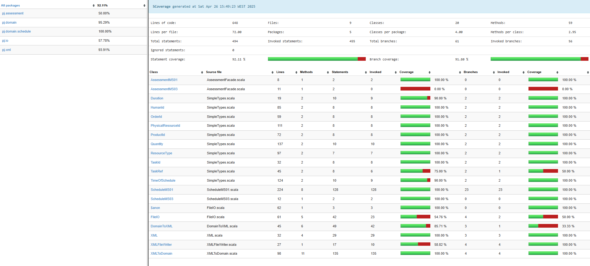
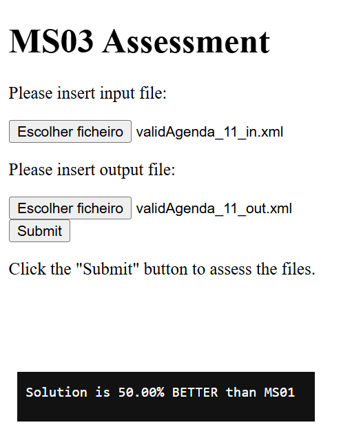

# Scheduling of Production Orders in a Factory

This project was developed as part of the Técnicas Avançadas de Programação (TAP) course unit of Mestrado em Engenharia Informática (MEI) at Instituto Superior de Engenharia do Porto (ISEP).
This project aims to address the scheduling of production orders in a factory.

The project had the following phases:
- Convert the XML with the production orders information;
- Implement the algorithm to create a schedule of production, in which every task of every product to produce is given a time slot.
- Finally, an output file is generated with the orders, and the algorithm and domain rules are tested.

## Domain Model
After examining the specifications outlined in the project rules, the subsequent domain model was constructed:

| Class               | Description                                                                                             |
|---------------------|---------------------------------------------------------------------------------------------------------|
| **Human Resource**  | Represents a worker in the factory.                                                                     |
| **Order**           | Represents a production request for a specific quantity of a single product.                           |
| **Physical Resource** | Represents a machine or post in the factory.                                                          |
| **Product**         | Defines a product type and the tasks needed to produce one unit of it.                                 |
| **Production Schedule** | Represents the complete schedule of tasks for all orders, including timing and assigned resources. |
| **Task**            | Represents a step in the production process.                                                            |
| **Task Schedule**   | Describes when a specific task instance is scheduled and which resources it uses.                      |

## Domain Validations
| Class               | Description                                                                 |
|---------------------|-----------------------------------------------------------------------------|
| **Human Resource**  | HumanId must follow the pattern HRS_[0-9]                                   |
| **Human Resource**  | When performing a task, each human resource can only be assigned to one physical resource. |
| **Order**           | OrderId must follow the pattern ORD_[0-9]                                   |
| **PhysicalResource**| PhysicalResourceId must follow the pattern PRS_[0-9].                       |
| **Product**         | ProductId must follow the pattern PRD_[0-9]                                 |
| **Schedule**        | TimeOfSchedule must be a positive not null integer                          |
| **Task**            | Duration must be a positive not null integer                                |
| **Task**            | One human resource for each physical resource must be allocated.            |
| **Task**            | TaskId must follow the pattern TSK_[0-9]                                    |
| **Task**            | TaskRef must follow the pattern TSK_[0-9]                                   |

---

# Milestones

## Milestone 1 (MS01)
The goal of Milestone 1 is to develop a Minimum Viable Product (MVP) that creates a valid production schedule from an XML input file. This initial version simplifies the scheduling problem by enforcing serial execution: only one task can be active at any moment in the entire factory. All tasks are executed in the exact order defined by the input file, and have unrestricted access to all resources.

### Domain Mapping from XML

The system reads a validated `production.xml` input file which defines:

- **Orders**, with unique identifiers, each specifying a **Product** and the number of units to produce.
- **Products**, each containing a linear sequence of **Tasks**.
- **Tasks**, with a duration and required physical resources.
- **Physical Resources**, which represent factory machines or workstations.
- **Human Resources**, with specialization constraints per physical resource.

Each XML structure is parsed and mapped into a corresponding immutable domain model class using Scala's `scala-xml` library and validated with pattern matching and domain-specific constraints (e.g., correct ID formats and positive duration values).

### Scheduling Algorithm

The scheduling logic for Milestone 1 follows a naive, sequential approach, implemented in the `ScheduleMS01` object. It processes one order at a time, scheduling each product unit and all of its tasks in a strict sequence. The algorithm assumes full availability of resources.

This ScheduleMS01 object defines a basic but structured scheduling mechanism for production tasks, converting XML input into a domain model, applying a naive scheduling algorithm, and converting the result back into XML.

#### Main design decisions:

- Domain conversion: The scheduling pipeline starts by parsing the input XML into a validated domain model (XMLToDomain.fromProduction) and ends by transforming the scheduled tasks back into XML (DomainToXML.generateOutputXML). This ensures a clear separation between data format and business logic.

- Naive scheduling strategy: Orders are processed strictly in ascending order of their IDs. Each product unit within an order is fully scheduled before moving on to the next order. This simple strategy favors predictability and ease of implementation, but may be inefficient for large or complex production environments.

- Sequential task scheduling: Every unit of a product is scheduled sequentially, executing its associated tasks one after the other, starting from an initial time of 0 and incrementing time based on task durations.

- Resource matching:

    - Physical resources must match required types exactly, and once used for a task, they are removed from the pool for that scheduling step.

    - Human resources are matched similarly by required skills, with each skill type needing to be fulfilled by an available human.

  Failure to match any required resource (either human or physical) immediately results in a scheduling error.

- Error handling: Functional error handling (Result type) is consistently used to propagate domain-specific errors like missing products, missing tasks, unavailable resources, or empty input schedules.

#### Justification of decisions:

- The naive approach minimizes complexity, making it ideal for initial versions or simple scenarios.

- Clear resource-matching rules ensure that tasks will only be scheduled if all required resources are available, increasing reliability.

- Using foldLeft and recursion enforces sequential, step-by-step scheduling and matching logic, which improves traceability during debugging and validation.

#### Alternatives considered:

- Instead of a naive first-come-first-serve scheduling, a more dynamic scheduling algorithm (e.g., based on earliest available time, resource load-balancing, or priority weights) could optimize throughput and resource utilization.

- Resource reservation systems could allow for more flexible matching strategies rather than strict removal from the pool after use.

- Parallelization could be considered to process multiple orders or product units simultaneously if resource availability allows.

#### Possible future improvements:

- Implement dynamic scheduling algorithms that adapts based on real-time resource availability and order priorities.

- Introduce resource release mechanisms: allow physical or human resources to be reused after the completion of a task.

- Add buffer times between tasks to simulate real-world production delays.

- Extend support for partial scheduling when full resource matching is not possible.

- Improve error messages and diagnostics to better guide users when scheduling fails.

- Support prioritized order scheduling based on business-critical requirements rather than order IDs alone.

### Testing

Unit and functional tests were written using `scalatest` and code coverage was verified using the `scoverage` plugin. Tests validated:

- XML parsing and domain object creation
- Scheduling logic under the MVP constraints
- Output XML conformance to schema
- Basic error handling for missing or invalid input data

---

## Milestone 2 (MS02)

Milestone 2 focuses on incorporating domain validations and property-based testing. Building upon the foundational MVP developed in Milestone 1, the second milestone addresses deeper domain logic and consistency properties that govern valid schedules, resource constraints, and task sequencing in a production environment. Milestone 2 introduces logic to ensure that the generated schedules adhere to real-world constraints and domain invariants, such as exclusive resource usage, valid time computation, and proper task completion. This milestone also leverages **ScalaCheck** for randomized and property-based testing to stress test the domain logic and catch edge cases.

### Main Decisions

#### **Property-Based Testing Framework**

**ScalaCheck** was used as the primary tool for property-based testing, as mandatory by the curricular unit teacher.

#### **Test Properties Defined**

A set of key **domain-level properties** were defined to validate the integrity and semantic correctness of the generated production schedule data. These properties do not verify schedule results, but instead ensure that the domain model and random generation logic produce valid and meaningful production scenarios.

The following properties were validated using randomized generators from `ScheduleGenerator.genSchedule`:

1. **Every product must have a non-empty list of task references**  
   This guarantees that every product specifies a production process by referencing at least one task. Products without associated tasks are invalid.

2. **All tasks must require valid physical resource types**  
   Each task must specify a non-empty list of physical resources, and the type of each resource must follow the expected format (e.g., must start with `"PRST"`).

3. **Task IDs must be unique across all tasks**  
   Ensures no duplication of task identifiers, which is crucial for identifying and scheduling tasks reliably.

4. **Every human resource must have at least one skill**  
   Prevents the creation of human resources that cannot handle any type of physical resource, which would be unusable in scheduling.

5. **Every physical resource must have a valid resource type**  
   Validates that the physical resources are correctly typed (e.g., `"PRST_1"`, `"PRST_2"`), ensuring they can match task requirements.
    

#### **Test Case Generators**

We created specific generators for different complexity levels:

* **Simple generators** for small domain classes(e.g. duration, quantity).
* **Complex generators** for bigger classes involving orders, products, and resources.
* **Dependent generators** to ensure logical consistency across nested domain elements.
* **Test case generators** for deliberately invalid scenarios (e.g., tasks with zero duration) to validate error detection.

#### **Alternatives**

Flat generators (e.g., generating complete TaskSchedule instances in one step) could be an alternative to data generation, but less flexible when testing individual components.

#### **Future Work**

The next steps for possible improvements on the project, which will be tackled in Milestone 3 are:

- Support for Parallel and Non-Sequential Scheduling 
  - Currently, tasks are scheduled sequentially across orders and product units. Future work could introduce parallel scheduling of independent tasks, concurrent order processing based on resource availability or even a smart time-slot allocation algorithm, such as earliest-fit or resource-aware heuristics.
 
- Dynamic Resource Management 
  - Extend the project to include reusable resources (Resources become available again after task completion) or time windows or working hours constraints per resource.
 
- Advanced Scheduling Algorithms
  - Incorporate more sophisticated approaches to optimize performance and throughput:

    - Greedy heuristics, priority queues, or critical path methods.

    - Constraint-based solvers to maximize utilization or minimize total production time.

---

## Milestone 3 (MS03) – Production Optimization

Milestone 3 introduces a production optimization algorithm with the objective of minimizing the total production time. It removes the sequential limitations of Milestone 1 and allows parallel execution of tasks, as long as there are sufficient physical and human resources. The scheduling strategy also relaxes the fixed ordering of product processing, enabling the algorithm to dynamically choose which tasks and products to prioritize.

### Design and Algorithmic Decisions

#### Parallel Scheduling Logic

Unlike the naive sequential strategy of MS01, MS03 introduces parallelism in scheduling by:

- Scanning all pending task instances across all orders and selecting those that are ready to be scheduled (i.e., all previous tasks in their product pipeline have completed).
- At each time unit, evaluating all eligible tasks and assigning those for which both human and physical resources are simultaneously available.
- Allowing multiple products to be under production at the same time, rather than completing all units of one order before starting another.

This algorithm uses a greedy heuristic, always selecting the earliest schedulable tasks based on available resources.

#### Time Slot Iteration

The schedule proceeds incrementally by time slots. For each slot, the algorithm:

1. Releases resources from tasks that have just completed.
2. Gathers all tasks ready to start (dependencies satisfied).
3. Tries to assign resources and schedule them as early as possible.
4. Repeats until all tasks are scheduled.

This time-based iteration allows precise control of task concurrency, resource utilization, and total time minimization.

### Domain Property Justification

MS03 respects all domain invariants established in earlier milestones:

- Valid ID formats (e.g., `TSK_`, `PRS_`, `HRS_`).
- Positive durations and quantities.
- Skill-matching between human and physical resources.
- Exclusive assignment of resources (no double-booking).
- Task linearity within product definitions.

Additionally, a new dynamic constraint emerges: tasks cannot start until dependencies are resolved, and resources are available at the current time slot.

### Functional Design Principles

The functional programming principles applied include:

- **Immutable domain models**: All scheduling logic operates over immutable data structures to preserve consistency and avoid side-effects.
- **Pure functions**: Scheduling transformations are pure, deterministic, and side-effect free.
- **Error handling via `Result`**: All validations and scheduling steps return typed `Result` instances, making errors explicit and composable.
- **Tail-recursive and fold-based iteration**: The scheduling engine leverages tail recursion or functional folds where appropriate for safe and readable time-based iteration.

### Limitations

Despite the optimizations introduced, the current MS03 approach has several known limitations:

- **Greedy strategy**: Tasks are scheduled based on immediate resource availability, which may not lead to global optimality.
- **No task prioritization**: All ready tasks are treated equally; urgent orders or critical paths are not prioritized.
- **No preemption**: Once a task starts, it runs to completion; there is no support for interrupting or rescheduling tasks.
- **Static resource model**: Human and physical resources are assumed to be available at all times. No shift schedules or downtime is considered.

### Future Improvements

Some potential improvements to MS03 could include:

- Advanced heuristics or metaheuristics (e.g., earliest finish time, critical path scheduling).
- Constraint solvers for optimizing resource allocation under complex conditions.
- Prioritization rules (e.g., based on order deadlines or product value).
- Reusable and time-bound resource modeling to simulate real-world working conditions.
- Integration of stochastic variables such as delays or failures.

### MS03 Assessment

To support the evaluation of the scheduling algorithm developed in Milestone 3, a simple web-based assessment tool was provided. This web interface allows the students to upload an input XML file and the corresponding output XML file generated by the algorithm.

#### Example

Once the files are submitted, the backend validates whether the output XML matches the expected structure, if the schedule adheres to the domain constraints and demonstrates time improvement over the MS01 schedule for the input file provided.

The assessment result shows that the **MS03 scheduling algorithm** produced a solution with a total production time that is **50% shorter** than the MS01 baseline for the same input, demonstrating a significant performance improvement.

#### Overall Results

| Filename                         | Result              |
|----------------------------------|---------------------|
| validAgenda_01_out.xml          | SAME cost as MS01                    |
| validAgenda_02_out.xml          | SAME cost as MS01                    |
| validAgenda_03_out.xml          | 16.00% BETTER                    |
| validAgenda_04_out.xml          | 36.00% BETTER                    |
| validAgenda_05_out.xml          | 44.00% BETTER                    |
| validAgenda_06_out.xml          | 44.00% BETTER                    |
| validAgenda_07_out.xml          | 48.00% BETTER                    |
| validAgenda_08_out.xml          | 36.00% BETTER                    |
| validAgenda_09_out.xml          | 36.00% BETTER                    |
| validAgenda_10_out.xml          | 35.71% BETTER                    |
| validAgenda_11_out.xml          | 50.00% BETTER       |
| validAgenda_12_out.xml          | 50.00% BETTER                    |
| validAgenda_50_out.xml          | 17.74% BETTER                    |
| validAgenda_51_out.xml          | 2.98% BETTER                    |
| validAgenda_52_out.xml          | 76.55% BETTER                    |
| validAgenda_53_out.xml          | 79.05% BETTER                    |
| validAgenda_54_out.xml          | 57.00% BETTER                    |
| validAgenda_55_out.xml          | 14.43% BETTER                    |
| validAgenda_56_out.xml          | 10.45% BETTER                    |
| validAgenda_57_out.xml          | 40.38% BETTER                    |
| validAgenda_58_out.xml          | 61.97% BETTER                    |
| validAgenda_59_out.xml          | SAME cost as MS01                    |
| validAgenda_60_out.xml          | 37.50% BETTER                    |
| validAgenda_61_out.xml          | 66.26% BETTER                    |
| validAgenda_62_out.xml          | 28.35% BETTER                    |
| validAgenda_63_out.xml          | 75.95% BETTER                    |
| validAgenda_64_out.xml          | SAME cost as MS01                    |
| validAgenda_65_out.xml          | 100.00% BETTER                    |
| validAgenda_66_out.xml          | SAME cost as MS01                    |
| validAgenda_67_out.xml          | 1.59% BETTER                    |
| validAgenda_68_out.xml          | 84.07% BETTER                    |
| validAgenda_69_out.xml          | 54.17% BETTER                    |
| validAgenda_70_out.xml          | 80.00% BETTER                    |
| validAgenda_simple_01.out.xml   | 20.00% BETTER                    |
| validAgenda_simple_02.out.xml   | 20.00% BETTER                    |
| validAgenda_simple_03.out.xml   | 50.00% BETTER                    |
| validAgenda_simple_04.out.xml   | 58.33% BETTER                    |

For the result for **validAgenda_65_out.xml**, which showed a 100.00% improvement, the algorithm was able to produce a result, and fully parallelize task execution across multiple units and resource types, significantly reducing the total production time. 

### Testing

Similar to what was done in MS01, unit and functional tests were written for MS03 using **ScalaTest**, and code coverage was verified using the **scoverage** plugin. Tests validated:

- Correct behavior of the `overlaps` method for detecting time interval conflicts.
- Successful task scheduling when all required resources are available.
- Scheduling failures in scenarios involving:
  - Missing tasks in the task map.
  - Tasks without required physical resources.
  - Lack of available human or physical resources.
- Proper domain error propagation using the `Result` type, including `TaskDoesNotExist`, `ResourceUnavailable`, and `ImpossibleSchedule`.

In addition, random task instances were generated using **ScalaCheck** generators to test edge cases in task scheduling logic. These tests help ensure that the algorithm adheres to domain rules and handles invalid scenarios.
