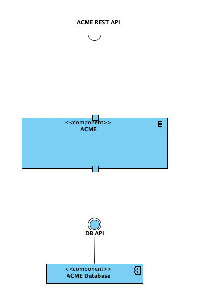
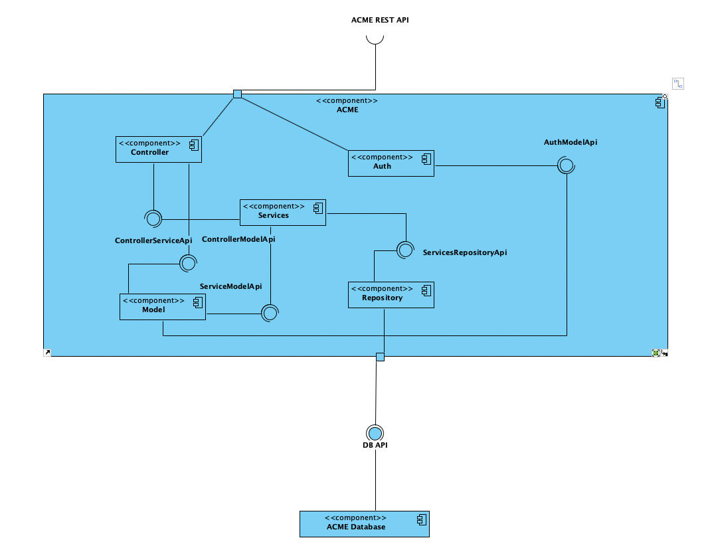
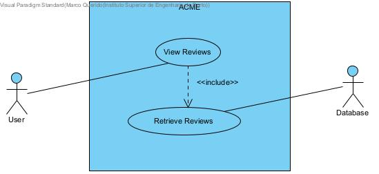
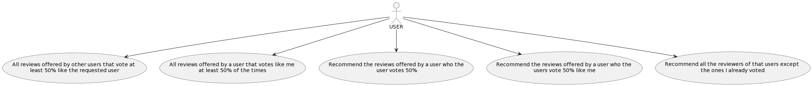
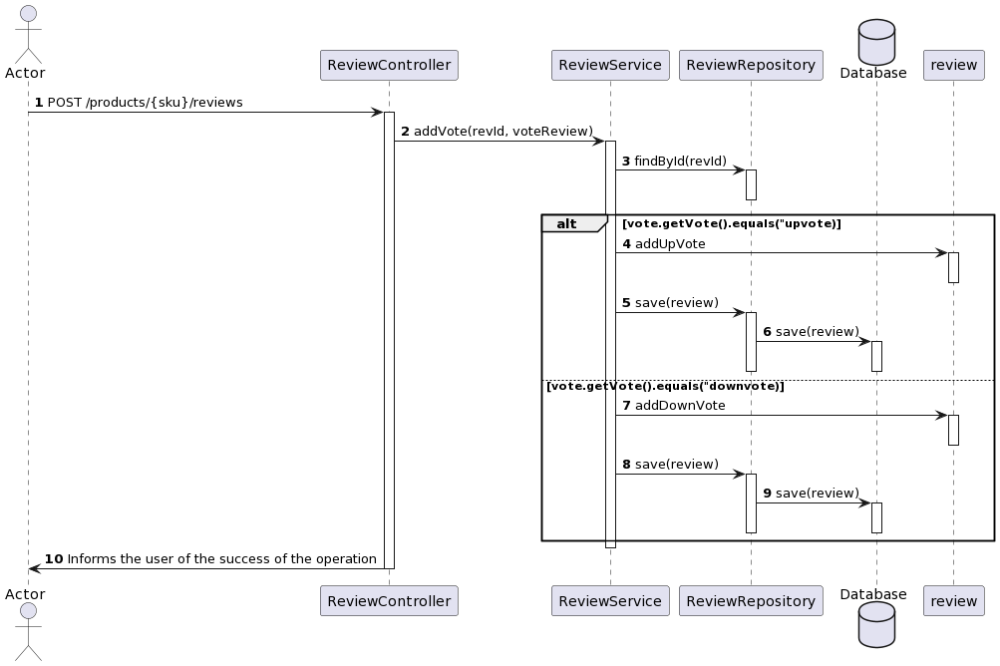
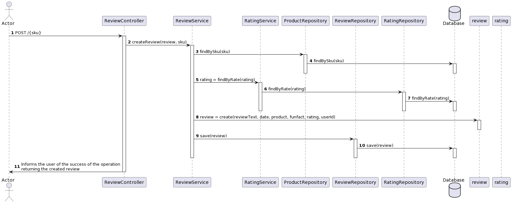
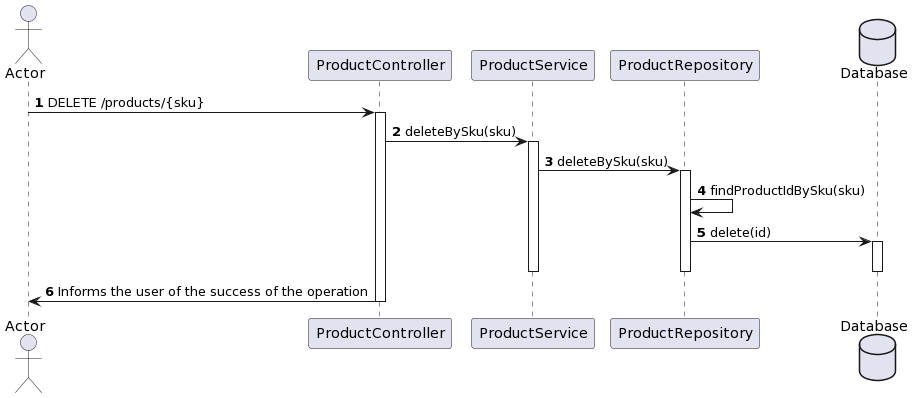
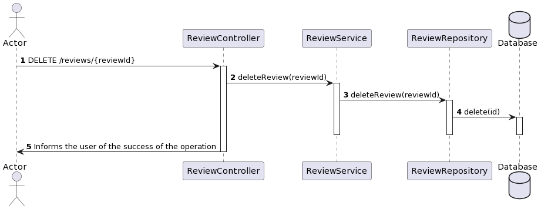
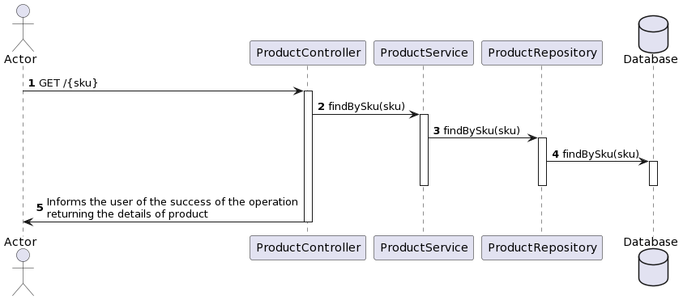
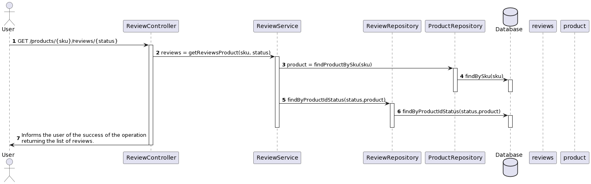

# ACME Rest API

## Overview of System-as-is

This project is a Monolithic Java Spring Boot application that serves as a Restful API, utilizing the Spring framework. It incorporates an H2 in-memory database for data storage. The goal of this API is to provide a simple and efficient way to manage and interact with resources.

## Features

- **RESTful Endpoints:** The API exposes RESTful endpoints to perform CRUD (Create, Read, Update, Delete) operations on resources.
- **H2 In-Memory Database:** The application uses H2 as the in-memory database for quick and easy data storage.
- **JWT Authentication:** Secure your API with JWT authentication for user access control.
- **Spring Boot:** Built on top of the Spring Boot framework, providing a robust and convention-over-configuration setup.
- **Maven:** The project is managed using the Maven build system for dependency management and build automation.

## Prerequisites

- Java JDK 8 or higher
- Maven

## Getting Started

1. **Clone the repository:**

    ```bash
    git clone https://username@bitbucket.org/1190404 arqsoft_1190404_1220268.git
    ```

2. **Navigate to the project directory:**

    ```bash
    cd acme
    ```

3. **Build the project:**

    ```bash
    mvn clean install
    ```

4. **Run the application:**

    ```bash
    java -jar target/acme.jar
    ```

   The application will start, and you can access the API at `http://localhost:8080`.

## API Endpoints

- **GET /api/resources:** Retrieve all resources.
- **GET /api/resources/{id}:** Retrieve a specific resource by ID.
- **POST /api/resources:** Create a new resource.
- **PUT /api/resources/{id}:** Update an existing resource.
- **DELETE /api/resources/{id}:** Delete a resource by ID.

## JWT Authentication
To access protected endpoints, include the JWT token in the Authorization header of your requests. Obtain a token by making a POST request to /auth/public/login with valid credentials.

POST /auth/public/login: Obtain a JWT token by providing valid credentials.

## H2 Database Console

The H2 in-memory database console is accessible at `http://localhost:8080/h2-console`. The JDBC URL is `jdbc:h2:file:./data/acme;MV_STORE=FALSE;AUTO_SERVER=true`, and you can connect to the database using the default settings. It only has information about the Product class.

Example:

```bash
insert into Product(id, sku, designation, description)values (nextval('id'), 'k485b1l47h5b', 'Placa Gráfica Gigabyte GeForce RTX 2060 D6 6G', 'placa mais accessivel e decente');

 ```

## Logical Views
### 1. Controller Layer

Responsible for handling incoming HTTP requests.
Implements the RESTful API endpoints for resource operations.
Validates incoming requests and delegates business logic to the service layer.

### 2. Service Layer
Contains business logic for processing and handling data.
Interacts with the repository layer to perform CRUD operations on the database.
Manages transactions and ensures data integrity.

### 3. Repository Layer
Responsible for data access and interaction with the H2 in-memory database.
Utilizes Spring Data JPA for simplified database operations.
Provides an abstraction over the underlying database.

### 4. Security Layer
Manages authentication and authorization using JWT.
Implements filters and authentication providers to secure the API endpoints.
Validates and generates JWT tokens for authorized users.

### 5. Configuration
Contains configuration files for the Spring Boot application.
Configures database properties, security settings, and other application-specific configurations.

### 6. DTOs (Data Transfer Objects)
Defines objects that carry data between the controller and service layers.
Helps in decoupling the internal data model from the external representation.

### 7. Entities
Represents the data model of the application.
Annotated with JPA annotations for database mapping.

# Requirements for new architectural design

- The application must persist data in different data models (MongoDB and Neo4J);
- The application must generate SKU's in different formats;
- There will be a list of all the reviews, sorted by the quantity of upvotes, such as the minimum number of upvotes should be 4 and at least 65% of the votes should be upvote;
- All reviews offered by other users that vote at least 50% of the times like the requested user. All the reviews are offered by a user that votes like me at least 50% of the times. The algorithm will recommend the reviews offered by a user that votes 50% like me. Reccomend all the reviews of that user except the ones I already voted.
  <br><br>

# Logical Views

## Level 2 View


## Level 3 View

# Use Cases



## Use Case 1 Description:
- There will be a list of all the reviews, sorted by the quantity of upvotes so that the minimum number of upvotes should be 4, and at least 65% of the votes should be upvote. The list is sorted by the quantity of upvotes.

|     REQ.001     | View Reviews                                              |
|:---------------:|-----------------------------------------------------------|
| Objective       | View all the reviews                                      |
| Description     | The user can view a list of reviews.                      |
| Pre-Conditions  | None                                                      |
| Post-Conditions | The user can see the filtered and sorted list of reviews. |

| Main Flow |                                                                                            |
|:---------:|------------------------------------------------------------------------------------------------------------|
| Steps     | Description                                                                                                |
| 1         | The user requests to view reviews.                                                                         |
| 2         | The system retrieves reviews from the database.                                                            |
| 3         | The system sorts the reviews by the quantity of upvotes.                                                   |
| 4         | The system filters the reviews to include only those with a minimum of 4 upvotes and at least 65% upvotes. |
| 5         | The system displays the filtered and sorted list of reviews to the user.                                   |


## Use Case 2 Description:
- All reviews offered by other users that vote at least 50% of the times like the requested user. All the reviews offered by a 
  user that votes like me at least 50% of the times. The algorithm will recommend the reviews offered by a user who the user 
  votes 50%. The algorithm will recommend the reviews offered by a user who the users vote 50% like me. Recommend all the 
  reviewers of that users except the ones I already voted. 




|     REQ.002     | Retrieve Reviews                                   |
|:---------------:|----------------------------------------------------|
| Objective       | Retrieve all the reviews                           |
| Description     | The database provides reviews to the system.       |
| Pre-Conditions  | None                                               |
| Post-Conditions | The system receives the reviews from the database. |

|    Main Flow    |                                          |
|:---------------:|-------------------------------------------------------|
| Steps           | Description                                           |
| 1               | The database provides reviews to the system.          |
| 2               | The database retrieves the reviews from the database. |

## Add Vote


## Create Product


## Create Review


## Delete Product


## Delete Review


## Find Product By Sky


## Get Recommended Reviews


## Get Review By Product and Status



# Changes to the main application

## Added a model_MongoDB folder with the following structure:

```bash
.  
└── model/  
    └── model_MongoDB/  
        ├── AggregatedRatingMongo
        ├── ProdImageMongo 
        ├── ProductMongo 
        ├── RatingMongo  
        ├── ReviewMongo  
        └── UserMongo 
```

- Each Mongo model class is an adaptation of the initial project's main models, in order to adapt to a MongoDB database (@Document, @Id and @Field annotations necessary for MongoDB data creation)

## Added a neo4j folder with the following structure:

```bash
.  
└── model/  
    └── neo4j/  
        ├── AggregatedRatingNeo4J
        ├── ProdImageNeo4J
        ├── ProductNeo4J 
        ├── RatingNeo4J  
        ├── ReviewNeo4J  
        └── UserNeo4J 
```

- Each Neo4J model class is an adaptation of the initial project's main models, in order to adapt to a Neo4j database(@Document, @Id and @Property annotations necessary for Neo4J data creation)


## Added a repositories_MongoDB folder with the following structure:

```bash
.  
└── repositories/  
    └── repositories_MongoDB/  
        ├── AggregatedRatingRepositoryMongo
        ├── ImageRepositoryMongo 
        ├── ProductRepositoryMongo 
        ├── RatingRepositoryMongo  
        ├── ReviewRepositoryMongo  
        └── UserRepositoryMongo 
```

- Each Mongo repository interface is an adaptation of the initial project's main repository interfaces, in order to adapt to a MongoDB database (@Document annotation necessary for MongoDB data saving and according Mongo methods from repositories_MongoDB/impl classes)

## Added a neo4j folder with the following structure:

```bash
.  
└── repositories/  
    └── neo4j/  
        ├── AggregatedRatingRepositoryNeo4j
        ├── ImageRepositoryNeo4j 
        ├── ProductRepositoryNeo4j 
        ├── RatingRepositoryNeo4j  
        ├── ReviewRepositoryNeo4j  
        └── UserRepositoryNeo4j 
```

- Each Neo4J repository interface is an adaptation of the initial project's main repository interfaces, in order to adapt to a Neo4J database 

## Added a impl folder with the following structure:

```bash
.  
└── repositories/  
    └── repositories_MongoDB/
	└── impl/
	    ├── AggregatedRatingRepositoryMongoImpl
            ├── ImageRepositoryMongoImpl
            ├── ProductRepositoryMongoImpl
            ├── RatingRepositoryMongoImpl  
            ├── ReviewRepositoryMongoImpl  
            └── UserRepositoryMongoImpl
```

- Each Mongo impl class is an implementation of it's corresponding repository interface, activated by profiles, in order to use the repository methods(@Repository and @Profile annotations are necessary)


## Added a impl folder with the following structure:

```bash
.  
└── repositories/  
    └── neo4j/
	└─── impl/
	    ├── AggregatedRatingRepositoryNeo4JImpl
            ├── ImageRepositoryNeo4JImpl
            ├── ProductRepositoryNeo4JImpl
            ├── RatingRepositoryNeo4JImpl  
            ├── ReviewRepositoryNeo4JImpl  
            └── UserRepositoryNeo4JImpl
```

- Each Neo4J impl class is an implementation of it's corresponding repository interface, activated by profiles, in order to use the repository methods(@Repository and @Profile annotations are necessary)


## Added a SkuGenerator1 class in com.isep.acme folder.

- This class returns a 12 character long, randomized code from a String characters = "0123456789ABCDEFGHIJKLMNOPQRSTUVWXYZ"

- The class is later invoked in the testCreateProductWithSkuGenerator class


## Added configuration files in the following folder:

```bash
.  
└── src/  
    └── main/
	    └── resources/
            ├── application-mongodb.properties
            ├── application-test.properties
            ├── docker-compose.yaml
            └── Dockerfile   
```

- application-mongodb.properties ensures that all the necessary parameters to connect to the mongodb database are set;

- application-test.properties ensures that the uri for database authentication is set;

- docker-compose.yaml is the configuration file to start the mongodb database in a docker container, including a mongo-express server for better graphical visualization of the database collections;

- Dockerfile ensures that the latest image of mongo is used.


## Added test classes in the following folder:

```bash
.  
└── test/  
    └── java/
	    └── com.isep.acme/
            └── mongoTests/
                ├── MongoConnectivityTests
                ├── MongoCrudTestsProduct
                ├── MongoCrudTestsRating
                ├── MongoCrudTestsReview   
                ├── MongoCrudTestsUser
                └── TestMongoDBConfig
```

- MongoConnectivityTests has the following tests:
    - testDatabaseConnection
    - testApiEndpoint

- MongoCrudTestsProduct has the following tests:
    - testFindProductById
    - testSaveProduct
    - testUpdateProductBySku
    - testDeleteProductBySku
    - testCreateProductWithSkuGenerator

- MongoCrudTestsRating has the following tests:
    - testSaveRating
    - testFindById
    - testFindByRate
    - testUpdateRating
    - testDeleteRating
    - testDeleteRatingById
    - testDeleteAllRatings

- MongoCrudTestsReview has the following tests:
    - testCreateReview
    - testReadReview
    - testUpdateReview
    - testDeleteReview
    - testFindByProduct
    - testFindByApprovalStatus
    - testFindByProductAndApprovalStatus
    - testFindByUser
    - testGetRecommendedReviews

- MongoCrudTestsUser has the following tests:
    - testCreateUser
    - testReadUser
    - testUpdateUser
    - testDeleteUser
    - testFindAllUsers
    - testFindByUsername