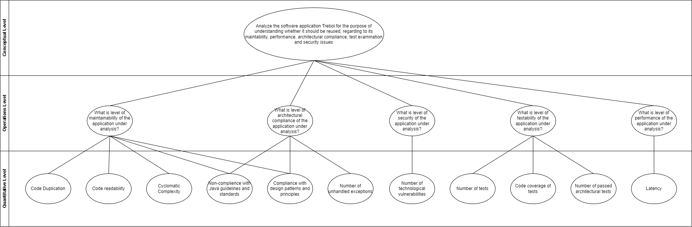

# QESOFT Project (FirstPart) - Global report of group 101 #

## **Group**
-  [**João Campelo (1151386)**](student1/README.md)
-  [**Nuno Costa (1180126)**](student2/README.md)
-  [**Beatriz Vaz (1190429)**](student3/README.md)
-  [**Tiago Pinto (1191098)**](student4/README.md)
-  [**Marco Querido (1220268)**](student5/README.md)

## **1 Introduction**

The first phase of the QESOFT project analyzes the project in an operational environment to determine whether or not the project is reusable.

The main focus are the quality attributes and architectural characteristics that must be considered throughout the study, such as maintenance, performance, safety vulnerabilities, construction compliance and adequate testing, are key issues

In order to identify and select the best materials, this research will take an objective approach.

The paper also describes the project’s learning environment, including how to choose a Java service-based application with multiple executable REST controllers or DDD sets with multiple endpoints that can allow for distribution of work among team members between in this application.
The software should also be SMART compliant and enable complete data generation.

## **2 Context**

### **2.1 Functionalities**

This project's functionalities can be grouped in three different groups. They are management, payment and notification.

Regarding the management group, this project has functionalities such as: sales management, products inventory management, client and user management.

Regarding the payment group, the project integrates payments with WebpayPlus by Transbank.

Finally, the notification group, which consists of the integration of mail notifications with Mailgun.

### **2.2 Architecture**

The project is a monolithic application that uses a layered architecture style, divided by three layers, where each layer provides a specific set of functionalities and communicates with adjacent layers.

1 . The Presentation Layer exposes a RESTful API and supports all the operations described by the project document, such as
 - CRUD operations on all declared data types
   - Can filter, sort and paginate through query params
 - Login, registration and optionally, guest customer accounts
 - Checking out as a registered user or a guest (when enabled)

2 . The Business Layer is responsible for the business logic of the application. It implements the rules and processes of the system, and communicates with the data access layer to retrieve and store data. 
 - It includes security features implemented using Spring Security, which is a framework that provides authentication and authorization functionality. This can help ensure that only authorized users can access certain parts of the application.
 - Implements stateless session authentication/autorization through JSON Web Tokens with aid from the JJWT library
    - Paired with users, roles, and permissions database tables.
 - Passwords encoded with BCrypt by default

3 . The Data Access Layer of the application uses JPA entities, which are Java classes that map to database tables. These entities can be used to perform CRUD (create, read, update, delete) operations on the underlying database.
The Spring JPA framework helps simplify the data access layer and make it easier to work with JPA entities.

The application integrates payments with WebpayPlus by Transbank using the Java SDK repo and uses Mailgun to send email notifications to users.

### **2.3 Conventions**

As the chosen project was written in Java it follows the naming conventions of the Java programming language.

The names of the packages used are in lowercase.

The names of the classes and interfaces are nouns, in mixed cases with the first letter of each internal word capitalized.

Method names use verbs to describe what the method does, in mixed case with the first letter lowercase and with the first letter of each internal word capitalized.

Variable names are in mixed case and they represent the intent of its use.

## **3. Work Distribution**

### Goal Question Metric (GQM)

This chapter describes the assignments of each student, as follows:

* João Campelo: **DataProductsController**
    - Maintability:
        - Tools: MetricsTree, SonarGraph
            - Description: The maintainability value for the DataProductsController and the methods was obtained using the MetricsTree. I utilized Sonargraph to obtain the CCD for the Average Component Dependency (ACD) and then manually calculated the ACD using the formula CCD(N)/N (where N is the number of components). For additional metrics including propagation cost, lines of code, and cyclomatic complexity, see the Sonargraph
        - Maintability Level: **45.2676**
        - Cumulative Component Dependency: **64**
        - Average Component Dependency: **3.048**
        - Propagation Cost: **0.1451**
    - Performance:
        - Tools: JMeter
        - Types of Tests: Load Tests, Stress Tests and Soak Tests
    - Security:
        - Tool: SpotBugs
            - Description: The SpotBug Plugin was used to found and analise vulnerabilities in the aggregation group
        - Total of vulnerabilities: 10
    - Architectural Compliance:
        - Tool: ArchUnit
            - Description: The ArchUnit use the JUnit5 to create fitness functions were written to check and evaluate the compliance of the project architecture
    - Tests Examination:
        - Tool: Jacoco

* Nuno Costa: **DataSalesController**
    - Maintability: I used MetricsTree to get the Maintainability value for the DataSalesController and the methods. For the Average Component Dependency (ACD), I used Sonargraph to get the CCD and then calculated the ACD manually using the formula CCD(N)/N (N is the number of components). I used Sonargraph for the other metrics such as propagation cost, lines of code and cyclomatic complexity.
    - Performance: Three types of tests were performed: Load, Stress and Soak. For this, JMeter was used, with Custom Thread Groups.
    - Security: Using SpotBug Plugin we were able to found and analise some vulnerabilities in the aggregation group. We found 2 vulnerabilities: "Method returning array may expose internal representation" and "Storing reference to mutable object"
    - Architectural Compliance: Using ArchUnit with JUnit5 some fitness functions were written to check and evaluate the compliance of the project architecture.
    - Tests Examination: For the test coverage I used the Jococo plugin for maven. JaCoCo (Java Code Coverage) is a Java code coverage analysis tool. I was able to verify that some methods just covered half of the intructions and branches.

* Tiago Pinto: **DataShippersController**
    - Maintainability: Maintainability is an important aspect of software engineering because software systems are rarely static - they need to be modified and updated to adapt to changing requirements, fix bugs, and improve performance. Sonargraph was used to measure Coupling and Structural Erosion (CSE) and Size and Complexity (SC).
    - Performance: Performance testing is important to ensure quality and end-user satisfaction, and to identify and correct problems before the software is released. They can also be used to optimize the hardware and software infrastructure, and to improve the efficiency and economy of the resources used by the system. JMeter was used in order to perform Load,Stress and Soak tests.
    - Security: Metric measured to analyze possible vulnerabilities in the project. Spotbugs was used to verify if there were any bugs present.
    - Architectural Compliance: Architecture compliance is the degree to which software complies with its defined architecture, standards, and best practices. ArchUnit was used to develop some fitness functions.
    - Tests Examination: Metric where several metrics related to tests were analysed. Jacoco library was used to this process.

* Beatriz Vaz: **DataUsersController**
    - Maintainability: Maintainability is an important aspect of software engineering because software systems are rarely static - they need to be modified and updated to adapt to changing requirements, fix bugs, and improve performance. Sonargraph was used to measure Coupling and Structural Erosion (CSE) and Size and Complexity (SC).
    - Performance: Performance testing is important to ensure quality and end-user satisfaction, and to identify and correct problems before the software is released. They can also be used to optimize the hardware and software infrastructure, and to improve the efficiency and economy of the resources used by the system. JMeter was used in order to perform Load, Stress and Soak tests.
    - Security: Metric measured to analyze possible vulnerabilities in the project. Spotbugs was used to verify if there were any bugs present.
    - Architectural Compliance: Architecture compliance is the degree to which software complies with its defined architecture, standards, and best practices. ArchUnit was used to develop some fitness functions.
    - Tests Examination: Metric where several metrics related to tests were analysed. Jacoco library was used to this process.

* Marco Querido: **DataSalespeopleController**
    - Maintainability: Maintainability is an important aspect of software engineering because software systems are rarely static - they need to be modified and updated to adapt to changing requirements, fix bugs, and improve performance. Sonargraph was used to measure Coupling and Structural Erosion (CSE) and Size and Complexity (SC).
    - Performance: Performance testing is important to ensure quality and end-user satisfaction, and to identify and correct problems before the software is released. They can also be used to optimize the hardware and software infrastructure, and to improve the efficiency and economy of the resources used by the system. JMeter was used in order to perform Load, Stress and Soak tests.
    - Security: Metric measured to analyze possible vulnerabilities in the project. Spotbugs was used to verify if there were any bugs present.
    - Architectural Compliance: Architecture compliance is the degree to which software complies with its defined architecture, standards, and best practices. ArchUnit was used to develop some fitness functions.
    - Tests Examination: Metric where several metrics related to tests were analysed. Jacoco library was used to this process.

## 4. Technologies 

To measure the different metrics in the chosen project, the group discussed and chose the following tools:

- Maintainability: MetricsTree;
- Performance: JMeter;
- Security: SpotBugs;
- Architectural Compliance: Archunit;
- Tests Examination: Jacoco.

MetricsTree is an IDE extension that helps to evaluate quantitative properties of java code. It supports the most common sets of metrics at the project, package, class, and method levels. MetricsTree uses the Maintainability Index metrics set to evaluate the project’s maintainability level.

The group chose MetricsTree to measure maintainability since the chosen project was written in Java, and it has a plugin integrated in the used IDE.

The Apache JMeter application is an open-source software, a 100% pure Java application designed to load test functional behavior and measure performance. It was originally designed for testing Web Applications but has since expanded to other test functions.

The group chose Apache JMeter to measure Performance for its ability to performance test many different application types, including REST services which are part of the chosen project, also its an open-source software.

To analyze possible vulnerabilities in the project, the group used SpotBugs, which is a program that uses static analysis to look for bugs in Java code. It can help find security related bugs in projects. Intellij has a Spotbugs plugin integrated that can be installed and executed. The relatively easy use and integration with the chosen development environment compelled the team to use this tool.

ArchUnit is a free, simple, and extensible library for checking the architecture of your Java code using any plain Java unit test framework. That is, ArchUnit can check dependencies between packages and classes, layers and slices, check for cyclic dependencies and more. It does so by analyzing given Java bytecode, importing all classes into a Java code structure

To analyze the project’s architecture compliance and test examination, and since the tool is accessible via maven dependency, the group used ArchUnit since the project was written in Java code and its build tool is Maven. 

## 5. Conventions

The group used the following conventions for the commits messages:

- Usage of the issue reference regarding the commit
- Reference of the task developed in the commit
- In the individual part, each commit must reference the issue followed by the key concern analyzed and the indication of the student responsible for that development

The group created an issue for each topic of the reports.
The issues related to topics of the individual reports were shared between the group.

## 6. Conclusion

In conclusion, in this work were analysed several metrics regarding quality in software engineering in five different Controllers class.

In what concerns to **DataShippersController** class, it has a maintainability level of 48,4884, considered average. Three different types of test were carried out in order to evaluate the performance of that class when it receives HTTP requests. Some problems were identified regarding a request. There weren't identified too much bugs in security analysis (only 3) and examining its tests it was possible to conclude that has a code coverage of 100% and there is any flaky tests.

In what concerns to **DataUsersController** class, it has a maintainability level of 46,541, considered average.
DataUsersController seems to be an easy component to understand, it is not complex and a modification will not risk any danger to the system.
Three different types of test were used to evaluate the performance of the class DataUsersController when it receives HTTP requests.
Some problems were identified regarding a request.
In the security analysis were found some bugs and by examining the tests of this class it was possible to conclude that it has a code coverage of 51% and there is any flaky tests.

In terms maintainability the **DataProductsController** is classified as average. In other hand, in terms of performance, it needs improvements and more intensive load tests to have a full picture of this controller behavior. Regarding the security of this component, there are no vulneraties on this controller, we found a few vulnerabilities on its dependencies. It does not comply with the architecture design in terms of architecture compliance. It passes all of the flanky tests and has a coverage of 100% of the tests.

In terms maintainability the **DataSalesController** is classified as bellow average. About performance the results suggest that the application may need optimisation or tuning to handle the increased traffic. The **DataSalesController** and its aggregate do not have many security issues, only 2 were found, of medium level. The Architecture should be reviewed and improved. Theres need some extra tests to cover the almost half of the instructions and branches em falta.

In what concerns to **DataSalesPeopleController** class, it has a maintainability level of 48.058, considered average. Three different types of test were carried out in order to evaluate the performance of that class when it receives HTTP requests. There weren't many bugs identified in security analysis (only 2) and examining its tests it was possible to conclude that it has a code coverage of 100% and there are no flaky tests overall.
