# README #

# Developed by João Campelo (1151386)

This folder includes all artifacts developed for the First Part of the QESOFT Project. 

It is structured as follows:

1. Introduction
2. Maintainability
3. Performance
4. Security
5. Architecture Compliance
6. Test Examination
7. Conclusions
8. References

## 1. Introduction

The first phase of the QESOFT project analyzes the project in an operational environment to determine whether or not the project is reusable.

The main focus is the quality attributes and architectural characteristics that must be considered throughout the study, such as maintenance, performance, safety vulnerabilities, construction compliance, and adequate testing, which are key issues

In order to identify and select the best materials, this research will take an objective approach.

The paper also describes the project’s learning environment, including how to choose a Java service-based application with multiple executable REST controllers or DDD sets with multiple endpoints that can allow for the distribution of work among team members in this application.
The software should also be SMART compliant and enable complete data generation.

This report will focus only on the **DataProductsController** and its dependencies.

## 2. Maintainability

Software maintainability refers to the ability of a software system to undergo modifications or updates with ease, accuracy, and minimum risks. It is one of the key attributes of software quality that ensures the longevity and sustainability of a software application [[1]](#ref-1)
[[2]](#ref-2)
[[3]](#ref-3).

Maintainability is crucial in the software development lifecycle, as software systems inevitably evolve due to changing requirements, new technologies, or the need to fix bugs and issues. Poorly maintained software can quickly become unmanageable and difficult to update, leading to increased costs, longer development cycles, and even business disruptions [[4]](#ref-4).

The Maintainability Index first appeared in 1992 when it was proposed by Paul Oman and Jack Hagemeister at the International Conference on Software Maintenance to establish automated software development metrics to guide software-related decision-making.
The Maintainability Index tries to give a holistic view of the relative maintenance burden for different sections of a project by blending a series of different metrics [[5]](#ref-5)
[[6]](#ref-6).

Using a more modern adaptation of the original formula proposed in 2011 by Microsoft:

`Maintainability Index = MAX(0,(171 - 5.2 * ln(Halstead Volume) - 0.23 * (Cyclomatic Complexity) - 16.2 * ln(Lines of Code))*100 / 171)`

On the formula above, the Maintainability Index formula uses three other metrics values.

* Halstead Volume is a measure of the program's size and is calculated by counting the number of unique operators and operands used in the code.
* Cyclomatic Complexity is a measure of the program's structural complexity and is calculated by counting the number of decision points (e.g., if statements, loops, switches) in the code.
* Lines of Code is the number of lines of code in the software system.

The MI formula is designed to provide a score between 0 and 100, where higher scores indicate better maintainability. A score above 85 is considered to be excellent, while scores below 20 are considered to be very poor.
As a general rule of thumb:

| Score    | Classification    |
| -------- | ----------------- |
| 0 - 20   | Very Poor         |
| 20 - 40  | Bellow Average    |
| 40 - 70  | Average           |
| 70 - 100 | Good to Excellent |

In this part was used MetricsTree [[7]](#ref-7) - IntelliJ IDEA Plugin - helps to evaluate the project maintainability index for which class or methods.

The **DataProductsController** class has a Maintainability Index of **45.2676** this is classified as ***Average*** even though the project has a result of **71.0886**.

After analyzing the Maintainability Index of the class, it proceeds to analyze the class methods to understand which methods can be improved:

| **Method**                              | **Maintainability Index** | **Classification**    |
| --------------------------------------- | ------------------------- | --------------------- |
| DataProductsController()                | 70.2303                   | **Good to Excellent** |
| create(ProductPojo)                     | 71.432                    | **Good to Excellent** |
| delete(Map<String,String>)              | 71.3233                   | **Good to Excellent** |
| getOrderSpecMap()                       | 82.6511                   | **Good to Excellent** |
| readMany(Map<String,String>)            | 75.7988                   | **Good to Excellent** |
| update(ProductPojo, Map<String,String>) | 70.9324                   | **Good to Excellent** |
| uploadCsv(MultipartFile)                | 64.338                    | **Average**           |

### 2.1 Propagation Cost

The Propagation Cost (PC) metric is a measure of the cost and effort required to make a change in a single component of a system or to propagate this change through the system. This implies the time and resources required to identify the components that need to be updated, make the necessary changes, and test the system to ensure that the changes did not introduce any new issues.

#### 2.1.1. *DataProductsController* Aggregate

Total Components = 21

#### Cumulative Component Dependency (CCD)

CCD = Total Dependencies = 64

#### Average Component Dependency (ACD)

ACD = CCD / Total Components = 64 / 21 = 3.048

#### Propagation Cost (PC)

PC = ACD / Total Components = 3.048 / 21 = 0.1451

#### 2.1.2 Project

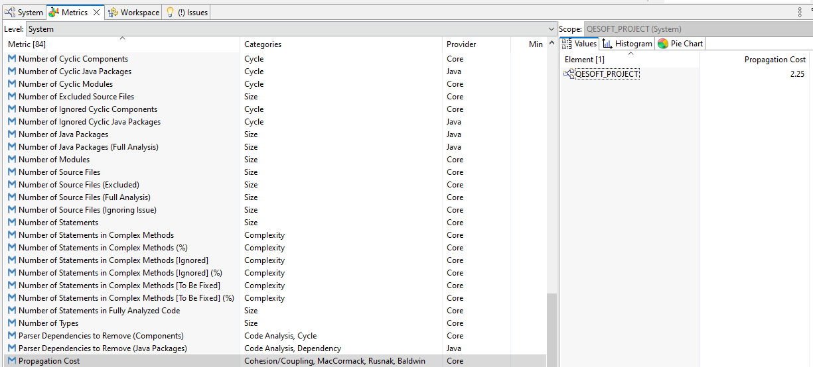

### Conclusion
Considering that the number of components in the system is less than 500, the system is considered a small system. So it can be concluded that obtaining propagation cost values are of no concern given the size of the system.
However, we can observe that any change in the DataProductsController will not have a big impact on the system, but any change in the system may have an impact on the DataProductsController.

### 2.2 Size metric

Lines of Code (LoC) per file counts every line that contains actual code and skips empty lines and comment lines.

Total Lines metric counts every single line, including empty lines and comment lines.

Number of Statements verifies the statements, i.e., s a single complete action performed in the source code, usually terminated by a special character or a newline.

In the class **DataProductsController** it was possible to determine the following values:

Lines of Code: 108
Total Lines: 151
Number of Statements: 6

These values can indicate how much the component is doing and how complex it is. So, we can say that this component is not complex.

### 2.3 Cyclomatic complexity

In 1976, Thomas J. McCabe presents a metric for measuring the complexity of a software program, which he calls "cyclomatic complexity."[[8]](#ref-8). This metric is based on the number of control flow statements in the program, such as loops and conditionals, and provides a quantitative measure of the program's complexity.

For this metric, it was analyzed the metric Average Complexity that is described as the weighted average modified extended cyclomatic complexity for fully analyzing code.

Average Complexity: 1,00

We may conclude that the class **DataProductsController** is simple to comprehend and doesn't pose a significant danger when modified because the value calculated is relatively low.

## 3. Performance

### 3.1. Key Performance Indicators (KPIs)

Key Performance Indicators (KPIs) are measurements for assessing how well an organization, business unit, or person is performing in reaching particular goals. KPIs are used to gauge success in achieving objectives and to pinpoint areas that require improvement.

KPIs can assess financial, operational, consumer, employee, or environmental performance and can be quantitative or qualitative. Revenue growth, customer happiness, employee retention rates, and environmental impact measurements are a few examples of KPIs.

KPIs are often selected based on their applicability to the strategic objectives of the firm, and they should be monitored over time to spot patterns and possibilities for development. They can be used to promote continuous development and make sure that resources are being used efficiently. They are a crucial tool for measuring and managing performance [[9]](#ref-9).

| KPI Metrics               | Description                                                                                                           |
| ------------------------- | --------------------------------------------------------------------------------------------------------------------- |
| CPU utilization           | It measures the percentage of CPU usage while the application or system is running.                      |
| Concurrency               | It measures the ability of the system or application to handle multiple concurrent requests.                          |
| Error Rates               | It is the percentage of requests resulting in errors compared to the total number of requests.                        |
| Memory Usage              | It measures the amount of memory used by the system or application during execution.                                  |
| Peak Response Time        | It measures the roundtrip of a request/response cycle but focuses on the longest cycle rather than taking an average. |
| Requests per Second (RPS) | It is the number of requests an information retrieval system such as a search engine handles in one second.           |
| Thread Counts             | It is the number of concurrent requests that the server receives at a particular time.                                |
| Throughput                | It measures the number of requests an application can handle in a second.                                             |

### 3.2. Tests

We choose JMeter which is a widely used tool for load testing, performance testing, and stress testing web applications.
The fact that JMeter is open-source and cost-free to use is one of the reasons you might think about adopting it for your application rather than another one.

JMeter also has the benefit of being platform-independent. It is a Java-based program that can be used with Windows, Linux, macOS, or any other platform that supports Java. 

JMeter is quite adaptable, so you can alter it to meet your particular testing needs. To make sure that your tests truly reflect the usage patterns of your application, you can configure several factors including the number of threads, ramp-up time, and loop count.

The extensive list of protocols that JMeter supports also includes HTTP, HTTPS, FTP, JDBC, SOAP, REST, and many others. This implies that regardless of the protocols your application utilizes, you may test its performance and scalability.[[10]](#ref-10)

**NOTE**: To present the results, we used an **Aggregated Report**

Based on the results of the performed test, we can draw the following conclusions:

**Average Response Time:** The average response time is 6 milliseconds, which indicates that the application is responding quickly and efficiently.

**Median Response Time:** The median response time is 5 milliseconds, which indicates that most of the requests are being processed in a very short time.

**90% Line:** 90% of the requests were completed in less than 12 milliseconds, which is excellent performance for the application.

**Throughput:** The throughput of the application is 1823.2 transactions per second, which is a high rate for an application with 200 simulated users.

**Errors:** There were no errors recorded during the test, which indicates that the application is running stably.

#### 3.2.1. Load Tests

To execute a load test for the application, we simulate 100 users doing GET and Post requests. So we define the following thread properties:

* Number of threads (users): 100
* Ramp-up period (how long it takes to "ramp up" to the full number of threads chosen, in seconds): 0
* Loop Count: 1

#### 3.2.1.1. Get Products Request

| # Samples | Average | Median | 90% Line | 95% Line | 99% Line | Min | Max | Error % | Throughput | Received KB/sec | Sent KB/sec |
| --------- | ------- | ------ | -------- | -------- | -------- | --- | --- | ------- | ---------- | --------------- | ----------- |
| 100       | 119     | 105    | 216      | 256      | 279      | 20  | 286 | 0.0     | 240.4/sec  | 404.94          | 29.58       |

#### 3.2.1.2. Create Products Request

| # Samples | Average | Median | 90% Line | 95% Line | 99% Line | Min | Max | Error % | Throughput | Received KB/sec | Sent KB/sec |
| --------- | ------- | ------ | -------- | -------- | -------- | --- | --- | ------- | ---------- | --------------- | ----------- |
| 100       | 100     | 95     | 193      | 201      | 229      | 8   | 241 | 42.00   | 278.6/sec  | 124.03          | 100.59      |

#### 3.2.1.3. CSV Upload Request

| # Samples | Average | Median | 90% Line | 95% Line | 99% Line | Min | Max | Error % | Throughput | Received KB/sec | Sent KB/sec |
| --------- | ------- | ------ | -------- | -------- | -------- | --- | --- | ------- | ---------- | --------------- | ----------- |
| 100       | 397     | 404    | 450      | 452      | 461      | 299 | 471 | 0.0     | 208.8/sec  | 94.60           | 385.18      |


#### 3.2.2. Stress Tests
For this type of test, we used the bzm - concurrency thread group plugin.
To execute a Stress Test for the application, we simulate 10 target concurrencies doing GET and POST requests and this will be held for 30 seconds. So we define the following thread properties:

* Target Concurrency: 10
* Ramp-Up time (seconds): 5
* Ramp-Up Steps Count:
* Hold Target Rate Time (seconds): 30

#### 3.2.2.1. Get Products Request

| # Samples | Average | Median | 90% Line | 95% Line | 99% Line | Min | Max | Error % | Throughput | Received KB/sec | Sent KB/sec |
| --------- | ------- | ------ | -------- | -------- | -------- | --- | --- | ------- | ---------- | --------------- | ----------- |
| 25378     | 11      | 8      | 15       | 22       | 79       | 4   | 104 | 39.48   | 719.1/sec  | 1378.31         | 53.56       |

#### 3.2.2.2. Create Products Request

| # Samples | Average | Median | 90% Line | 95% Line | 99% Line | Min | Max  | Error % | Throughput | Received KB/sec | Sent KB/sec |
| --------- | ------- | ------ | -------- | -------- | -------- | --- | ---- | ------- | ---------- | --------------- | ----------- |
| 4001      | 86      | 17     | 39       | 115      | 1964     | 4   | 7285 | 75.43   | 100.2/sec  | 49.13           | 36.18       |

#### 3.2.2.3. CSV Upload Request

| # Samples | Average | Median | 90% Line | 95% Line | 99% Line | Min | Max  | Error % | Throughput | Received KB/sec | Sent KB/sec |
| --------- | ------- | ------ | -------- | -------- | -------- | --- | ---- | ------- | ---------- | --------------- | ----------- |
| 16142     | 19      | 6      | 16       | 21       | 183      | 3   | 3376 | 99.89   | 450.8      | 199.81          | 145.48      |

#### 3.2.3. Soak Tests
For this type of test, we used the jp@gc - ultimate thread group plugin.
To execute a Soak Test for the application, we simulate 10 target concurrencies doing GET and POST requests and this will be held for 30 seconds. So we define the following thread properties:

* Start Thread Count: 10
* Initial Delay (seconds): 0
* Startup Time (seconds): 10
* Hold Load For(sec): 20
* Shutdown Time (seconds): 10

#### 3.2.3.1. Get Products Request

| # Samples | Average | Median | 90% Line | 95% Line | 99% Line | Min | Max | Error % | Throughput | Received KB/sec | Sent KB/sec |
| --------- | ------- | ------ | -------- | -------- | -------- | --- | --- | ------- | ---------- | --------------- | ----------- |
| 35935     | 8       | 5      | 29       | 35       | 41       | 1   | 166 | 57.25   | 921.4/sec  | 1393.01         | 48.47       |

#### 3.2.3.2. Create Products Request

| # Samples | Average | Median | 90% Line | 95% Line | 99% Line | Min | Max   | Error % | Throughput | Received KB/sec | Sent KB/sec |
| --------- | ------- | ------ | -------- | -------- | -------- | --- | ----- | ------- | ---------- | --------------- | ----------- |
| 4118      | 83      | 6      | 13       | 19       | 554      | 1   | 14247 | 76.06   | 95.4/sec   | 46.85           | 34.44       |

#### 3.2.3.3. CSV Upload Request

| # Samples | Average | Median | 90% Line | 95% Line | 99% Line | Min | Max   | Error % | Throughput | Received KB/sec | Sent KB/sec |
| --------- | ------- | ------ | -------- | -------- | -------- | --- | ----- | ------- | ---------- | --------------- | ----------- |
| 16978     | 20      | 3      | 9        | 12       | 489      | 1   | 15555 | 99.89   | 389.5/sec  | 172.66          | 125.71      |

### 3.3. Conclusions

The Load tests for **Get Products** and **CSV Upload** requests finished with 0% error rates, but it can increase the number of users or the number of loops to have a full picture of this controller's performance. In the case of **Create Products** request indicates that the system is not able to handle the load and is not performing as expected under normal or heavy load conditions. Such a high error rate suggests that the system is not stable and may not be able to handle the expected traffic or user load in production.

The Stress Tests error rate is higher than 39%, which indicates that the system is unable to handle the load and is not performing as expected under high-stress conditions. Such a high error rate suggests that the system is not stable and may fail when it is put under significant stress. It is critical to identify and resolve the causes of these errors before releasing the system into production.

The Soak Tests error rate is higher than 57%, it indicates that the project is not performing as expected under this use. This rate suggests that this project is not stable and its performance may degrade significantly over time.

To solve the problems mentioned above, it is essential to analyze the soak test results and determine the root cause of the high error rate. This may require additional testing and debugging to identify specific issues. Once the issues have been identified, they can be addressed through bug fixes, system updates, or other measures.

The CSV Upload Request tests are not accurate because the test is only picking up the first row of the CSV file, this explains the high error rate. 


## 4. Security

### 4.1. Tool

In this part, we used the FindBugs IntelliJ IDEA plugin which is a powerful tool for improving the quality and reliability of Java code, helping developers catch potential issues early in the development process and reducing the risk of bugs and vulnerabilities in production [[11]](#ref-11).

### DataProductsController: 0 vulnerabilities

### PaginationServiceImpl: 1 vulnerability

| Class                 | Method                  | Type                                                                            | Problem                      | Field         | Priority                                       | Description                                                                                                                                                                                                                                                                                                                                                                  |
| --------------------- | ----------------------- | ------------------------------------------------------------------------------- | ---------------------------- | ------------- | ---------------------------------------------- | ---------------------------------------------------------------------------------------------------------------------------------------------------------------------------------------------------------------------------------------------------------------------------------------------------------------------------------------------------------------------------- |
| PaginationServiceImpl | PaginationServiceImpl() | May expose internal representation by incorporating reference to mutable object | Malicious code vulnerability | apiProperties | Medium Confidence Malicious code vulnerability | This code stores a reference to an externally mutable object into the internal representation of the object.  If instances are accessed by untrusted code, and unchecked changes to the mutable object would compromise security or other important properties, you will need to do something different. Storing a copy of the object is a better approach in many situations. |

### ProductsCrudServiceImpl: 1 vulnerability

| Class                   | Method                    | Type                                                                            | Problem                      | Field                   | Priority                                       | Description                                                                                                                                                                                                                                                                                                                                                                  |
| ----------------------- | ------------------------- | ------------------------------------------------------------------------------- | ---------------------------- | ----------------------- | ---------------------------------------------- | ---------------------------------------------------------------------------------------------------------------------------------------------------------------------------------------------------------------------------------------------------------------------------------------------------------------------------------------------------------------------------- |
| ProductsCrudServiceImpl | ProductsCrudServiceImpl() | May expose internal representation by incorporating reference to mutable object | Malicious code vulnerability | productImagesRepository | Medium Confidence Malicious code vulnerability | This code stores a reference to an externally mutable object into the internal representation of the object.  If instances are accessed by untrusted code, and unchecked changes to the mutable object would compromise security or other important properties, you will need to do something different. Storing a copy of the object is a better approach in many situations. |
| ProductsCrudServiceImpl | ProductsCrudServiceImpl() | May expose internal representation by incorporating reference to mutable object | Malicious code vulnerability | productsRepository      | Medium Confidence Malicious code vulnerability | This code stores a reference to an externally mutable object into the internal representation of the object.  If instances are accessed by untrusted code, and unchecked changes to the mutable object would compromise security or other important properties, you will need to do something different. Storing a copy of the object is a better approach in many situations. |


### ProductPojo: 8 vulnerability

| Class                          | Method        | Type                                                                            | Problem                      | Field    | Priority                                       | Description                                                                                                                                                                                                                                                                                                                                                                                                   |
| ------------------------------ | ------------- | ------------------------------------------------------------------------------- | ---------------------------- | -------- | ---------------------------------------------- | ------------------------------------------------------------------------------------------------------------------------------------------------------------------------------------------------------------------------------------------------------------------------------------------------------------------------------------------------------------------------------------------------------------- |
| ProductPojo                    | ProductPojo() | May expose internal representation by incorporating reference to mutable object | Malicious code vulnerability | category | Medium Confidence Malicious code vulnerability | This code stores a reference to an externally mutable object into the internal representation of the object.  If instances are accessed by untrusted code, and unchecked changes to the mutable object would compromise security or other important properties, you will need to do something different. Storing a copy of the object is a better approach in many situations.                                  |
| ProductPojo                    | ProductPojo() | May expose internal representation by incorporating reference to mutable object | Malicious code vulnerability | images   | Medium Confidence Malicious code vulnerability | This code stores a reference to an externally mutable object into the internal representation of the object.  If instances are accessed by untrusted code, and unchecked changes to the mutable object would compromise security or other important properties, you will need to do something different. Storing a copy of the object is a better approach in many situations.                                  |
| ProductPojo                    | getCategory() | May expose internal representation by incorporating reference to mutable object | Malicious code vulnerability | category | Medium Confidence Malicious code vulnerability | Returning a reference to a mutable object value stored in one of the object's fields exposes the internal representation of the object.  If instances are accessed by untrusted code, and unchecked changes to the mutable object would compromise security or other important properties, you will need to do something different. Returning a new copy of the object is a better approach in many situations. |
| ProductPojo                    | getImages()   | May expose internal representation by incorporating reference to mutable object | Malicious code vulnerability | images   | Medium Confidence Malicious code vulnerability | Returning a reference to a mutable object value stored in one of the object's fields exposes the internal representation of the object.  If instances are accessed by untrusted code, and unchecked changes to the mutable object would compromise security or other important properties, you will need to do something different. Returning a new copy of the object is a better approach in many situations. |
| ProductPojo                    | setCategory() | May expose internal representation by incorporating reference to mutable object | Malicious code vulnerability | category | Medium Confidence Malicious code vulnerability | This code stores a reference to an externally mutable object into the internal representation of the object.  If instances are accessed by untrusted code, and unchecked changes to the mutable object would compromise security or other important properties, you will need to do something different. Storing a copy of the object is a better approach in many situations.                                  |
| ProductPojo                    | setImages()   | May expose internal representation by incorporating reference to mutable object | Malicious code vulnerability | images   | Medium Confidence Malicious code vulnerability | This code stores a reference to an externally mutable object into the internal representation of the object.  If instances are accessed by untrusted code, and unchecked changes to the mutable object would compromise security or other important properties, you will need to do something different. Storing a copy of the object is a better approach in many situations.                                  |
| ProductPojo$ProductPojoBuilder | category()    | May expose internal representation by incorporating reference to mutable object | Malicious code vulnerability | category | Medium Confidence Malicious code vulnerability | This code stores a reference to an externally mutable object into the internal representation of the object.  If instances are accessed by untrusted code, and unchecked changes to the mutable object would compromise security or other important properties, you will need to do something different. Storing a copy of the object is a better approach in many situations.                                  |
| ProductPojo$ProductPojoBuilder | images()      | May expose internal representation by incorporating reference to mutable object | Malicious code vulnerability | images   | Medium Confidence Malicious code vulnerability | This code stores a reference to an externally mutable object into the internal representation of the object.  If instances are accessed by untrusted code, and unchecked changes to the mutable object would compromise security or other important properties, you will need to do something different. Storing a copy of the object is a better approach in many situations.                                  |

**Tests:**

* BackendAppTest: 0 vulnerabilities

* DataProductsControllerTest: 2 vulnerabilities

| Class                      | Method | Type                                              | Problem     | Field                 | Priority                      | Description                                                                                                                                                                                                       |
| -------------------------- | ------ | ------------------------------------------------- | ----------- | --------------------- | ----------------------------- | ----------------------------------------------------------------------------------------------------------------------------------------------------------------------------------------------------------------- |
| DataProductsControllerTest | N/A    | Class defines a field that masks a superclass field | Correctness | paginationServiceMock | Medium Confidence Correctness | This class defines a field with the same name as a visible instance field in a superclass. This is confusing and may indicate an error if methods update or access one of the fields when they wanted the other. |
| DataProductsControllerTest | N/A    | Class defines a field that masks a superclass field | Correctness | sortServiceMock       | Medium Confidence Correctness | This class defines a field with the same name as a visible instance field in a superclass. This is confusing and may indicate an error if methods update or access one of the fields when they wanted the other. |

## 5. Architecture Compliance

Software architectural compliance refers to the degree to which software components and their interactions conform to an established software architecture. It involves verifying that the implemented design and code conform to the intended architecture and that the system functions properly within the constraints set by the architecture.

The process of ensuring software architectural consistency typically involves a combination of reviews, inspections, and testing. This can be achieved through manual code reviews, automated testing tools, and analyzing system metrics to identify deviations from the intended architecture.

Adherence to software architecture is critical to the success of software projects. It allows developers to create scalable, maintainable, and extensible systems. It also ensures that the software is reliable, secure and works optimally under various operating conditions.

### 5.1. Architecture

#### Classes free from Cycles
```
  @ArchTest
  public static final ArchRule classesShouldBeFreeOfCycles = slices().matching("org.trebol.(*)..").should().beFreeOfCycles();
```
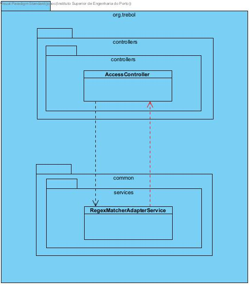

This fitness function checks that there are no cycles in the dependencies inside the package org.trebol.
This checks that there are no circular dependencies between different classes.

The project failed this test because there are 92 violations of this test. It seems that it has dependencies between the slices org.trebol.api and org.trebol.common.

#### Layered Architecture
```
  @ArchTest
  public static final ArchRule layeredArchitecture = layeredArchitecture().consideringOnlyDependenciesInLayers()
    .layer("Controller").definedBy("org.trebol.api.controllers..")
    .layer("Service").definedBy("org.trebol.api.services.impl..")
    .layer("Repository").definedBy("org.trebol.jpa.repositories..")
    .whereLayer("Controller").mayNotBeAccessedByAnyLayer()
    .whereLayer("Service").mayOnlyBeAccessedByLayers("Controller")
    .whereLayer("Repository").mayOnlyBeAccessedByLayers("Service");
```
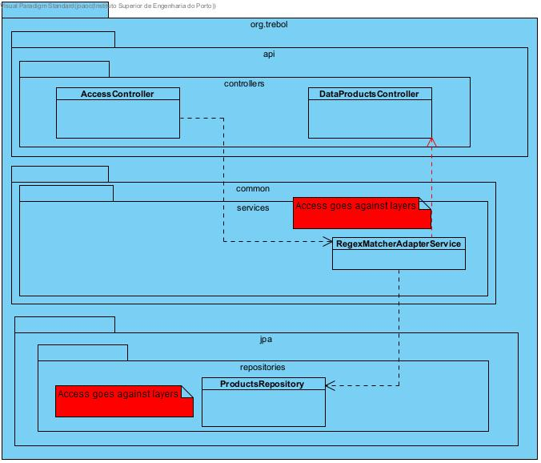


The purpose of this test is to verify the layered architecture pattern. 
The controllers' layer cannot be accessed by any layer, the service layer can only be accessed by the controllers' layer, and the repository layer can only be accessed by the service layer.

This violation occurred 32 times in the system, part of this violation happens because this type of test can not distinguish the test classes from the others.

#### Layers Dependencies

##### Repositories do not depend on Services and Controllers
```
  @ArchTest
  public static final ArchRule repositoriesShouldNotDependOnEachOther =
    noClasses().that()
      .resideInAnyPackage("org.trebol.jpa.repositories..")
      .and()
      .haveSimpleNameNotContaining("Test")
      .and()
      .areNotInterfaces()
      .should().dependOnClassesThat().resideInAnyPackage("org.trebol.api.services.impl..", "org.trebol.api.controllers..")
      .allowEmptyShould(true);
```
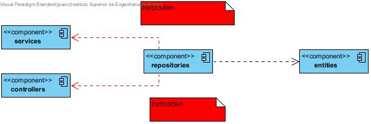

The purpose of this test is to verify if repositories do not have dependencies on services and controllers. This test passed successfully.

##### Controllers depend on Services and Repositories
```
  @ArchTest
  public static final ArchRule controllersShouldDependsOnServicesAndRepositories =
    classes().that()
      .resideInAnyPackage("org.trebol.api.controllers..")
      .and()
      .haveSimpleNameNotContaining("Test")
      .and()
      .areNotInterfaces()
      .should().dependOnClassesThat().resideInAnyPackage("org.trebol.api.services.impl..", "org.trebol.jpa.repositories..");
```
The purpose of this test is to verify if controllers do have dependencies to services or repositories. This violation occurred 21 times.

##### Service depends on Repository
```
  @ArchTest
  public static final ArchRule serviceShouldDependsOnRepository =
    classes().that()
      .resideInAPackage("org.trebol.api.services.impl..")
      .and()
      .areNotInterfaces()
      .and()
      .haveSimpleNameEndingWith("ServiceImpl")
      .and()
      .haveSimpleNameNotContaining("Test")
      .should().dependOnClassesThat().resideInAnyPackage("org.trebol.jpa.repositories..");
```
The purpose of this test is to verify if services do have dependencies repositories. This violation occurred 2 times.

### Results
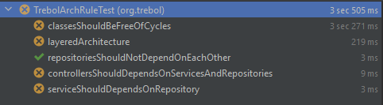

### 5.2. Controller

#### Inheritance
```
  @ArchTest
  public static final ArchRule controllersShouldBeController =
    classes().that()
      .areAnnotatedWith(RestController.class)
      .and()
      .haveSimpleNameNotContaining("Test")
      .should().haveSimpleNameEndingWith("Controller");
```
This fitness function checks that all classes, that have RestController annotation and does not have a name containing "Test", have names that end with "Controller". This test passed successfully.

#### Annotation
```
  @ArchTest
  public static final ArchRule classesShouldBeRequestMapping =
    classes().that()
      .areAnnotatedWith(RestController.class)
      .and()
      .haveSimpleNameNotContaining("Test")
      .should().beAnnotatedWith(RequestMapping.class);
```
This fitness function checks that all classes, that have RestController annotation and does not have a name containing "Test", have RequestMapping annotation.
This violation occurred 1 time.

#### Class and package containment
```
  @ArchTest
  public static final ArchRule controllerClassesShouldResideInControllerPackage =
    classes().that()
      .areAnnotatedWith(RestController.class)
      .and()
      .haveSimpleNameNotContaining("Test")
      .should().resideInAPackage("..controllers..");
```
This fitness function checks that all classes, that have RestController annotation and does not have a name containing "Test", reside inside of package "controllers".  This test passed successfully. 

#### Non-Private Methods
```
  @ArchTest
  public static final ArchRule methodsShouldNotBePrivate =
    methods().that()
      .areDeclaredInClassesThat().areAnnotatedWith(RestController.class)
      .and()
      .areNotAnnotatedWith(ExtendWith.class)
      .should().notBePrivate();
```
This fitness function checks that all methods, that its class has RestController annotation and does not have ExtendWith annotation, do not have private methods.
This violation occurred 2 times.

### Results
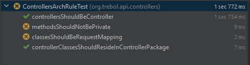


### 5.3. Service

#### Inheritance
```
  @ArchTest
  public static final ArchRule servicesShouldBeServiceImpl =
    classes().that()
      .areAnnotatedWith(Service.class)
      .and()
      .haveSimpleNameNotContaining("Test")
      .should().haveSimpleNameEndingWith("ServiceImpl");
```
This fitness function checks that all classes that have Service annotation, should have names that end with "ServiceImpl". This test passed successfully.

#### Class and package containment
```
  @ArchTest
  public static final ArchRule serviceClassesShouldResideInServicePackage =
    classes().that().
      areAnnotatedWith(Service.class)
      .and()
      .areNotInterfaces()
      .should().resideInAPackage("..services..");
```
This fitness function checks that all classes, that have Service annotation and are not an Interface, reside inside of package "services". This test passed successfully.

#### Annotation
```
  @ArchTest
  public final ArchRule serviceClassesShouldBeAnnotatedWithService =
    classes().that()
      .resideInAPackage("..services..")
      .and()
      .areNotInterfaces()
      .and()
      .haveSimpleNameNotContaining("Test")
      .and()
      .haveSimpleNameEndingWith("ServiceImpl")
      .should().beAnnotatedWith(Service.class);
```
This fitness function checks that all classes, that reside inside a package "services", are not an Interface, do not have a name containing "Test" and its name ends with "ServiceImpl", and have Service annotation. This test passed successfully.

### Results
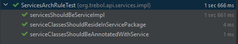

### 5.4. Repository

#### Inheritance
```
@ArchTest
  public static final ArchRule servicesShouldBeServiceImpl =
    classes().that()
      .areAnnotatedWith(Repository.class)
      .should().haveSimpleNameEndingWith("Repository");
```
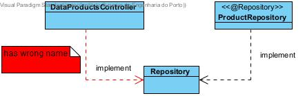

This fitness function checks that all classes that have Repository annotation, should have names that end with "Repository". This test passed successfully.

#### Class and package containment
```
  @ArchTest
  public static final ArchRule repositoryClassesShouldResideInRepositoryPackage =
    classes().that()
      .areAnnotatedWith(org.springframework.stereotype.Repository.class)
      .should().resideInAPackage("..repositories..");
```
This fitness function checks that all classes, that have Repository annotation, reside inside of package "repositories". This test passed successfully.

#### Annotation
```
  @ArchTest
  public static final ArchRule repositoryShouldBeAnnotatedWithRepository =
    classes().that()
      .resideInAPackage("..repositories..")
      .and()
      .haveSimpleNameNotContaining("Test")
      .should().beAnnotatedWith(Repository.class);
```
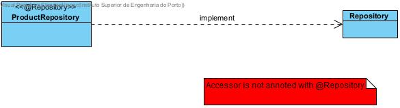

This fitness function checks that all classes, that reside inside a package "repositories" and does not have a name containing "Test", have Repository annotation. This test passed successfully.

### Results
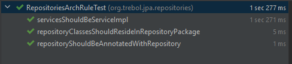

## 6. Test Examination

### 6.1 Test Coverage

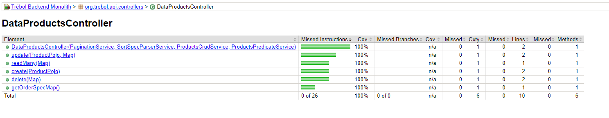

The report provides information about the number of instructions, branches, lines, complexity, and methods that were covered by your test cases.
Analyzing the information in the report we can conclude that:

The **"DataSalesController"** element was completely covered by the tests, as the coverage for missed statements and missed branches was 100% and there are no missed lines or methods.

The methods **"update(ProductPojo, Map)"**, **readMany(Map)**, **"create(ProductPojo)"**, **"delete(Map)"** and **"getOrderSpecMap()"** were completely covered by the tests, as the coverage for missed statements and missed branches was 100% and there are no missed lines or methods.

This report can help identify the areas of the codebase that require more testing and improve your test coverage.

### 6.2 Test Coverage

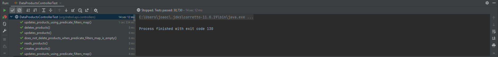

### 6.3 Project Test

This project has only 4 types of tests:
  
  * Unit tests: These are tests that verify the behavior of individual components or functions in isolation. They help to catch bugs early in the development cycle and ensure that each component behaves as expected.

  * Integration tests: These tests verify that the different components of the application work correctly together. They help to ensure that the application behaves correctly as a whole and that there are no issues with the interactions between different components.

  * End-to-end tests: These tests verify the behavior of the application as a whole, including the interactions between the front end and backend. They help to ensure that the application meets the requirements and behaves correctly in real-world scenarios.

  * Performance tests: These tests verify the performance of the application under various load conditions. They help to identify potential bottlenecks or performance issues and ensure that the application can handle the expected workload.

### 6.4 Test Suggestion

This project could implement:

  * Mutation Tests: These are tests that involve creating artificial defects or mutations in the code to see if the existing tests can detect them;
  * Functional Tests: These are tests that check that an application behaves as expected from a user's perspective;
  * Regression Tests: These are tests that check that changes to an application do not cause unexpected issues or break existing functionality;
  * Security  Tests: These are tests that check that an application is secure and protected from common vulnerabilities;

## 7. Conclusions

 Based on the previous analysis it is possible to conclude that the application can not be reused as a basis for a new project.
 
 However, although the project has good maintainability and test examination, some security vulnerabilities must be carefully validated. In the case of performance, it needs more improvements and analysis.
 
 After analyzing the maintainability, performance, and security, some tests were added to verify the architecture compliance of our application, it was concluded that this was not consistent because, because in the designed tests they are not following the specification there are still functionalities that are not.
 
 The change needed to make this architecture compliant or conformant is simple and consists of moving a file to the most appropriate package for this purpose.
 
 However, in the near future a good practice would be to add these tests in advance of the development adopting strategy like TDD so that it is easier to "guide" developers to adopt the right patterns.
 
 Regarding the unit tests previously defined, we conclude that they are reliable and are covering the full part of the code, with a code coverage of 100%.


## 8. References

<text id="ref-1">[1] Pressman, R. S. (2014). Software Engineering: A Practitioner's Approach. McGraw-Hill Education.</text>

<text id="ref-2">[2] Sommerville, I. (2016). Software Engineering. Pearson Education Limited..</text>

<text id="ref-3">[3] ISO/IEC/IEEE 12207:2017 Systems and software engineering -- Software life cycle processes.</text>

<text id="ref-4">[4] McConnell, S. (2004). Code Complete, Second Edition. Microsoft Press.</text>

<text id="ref-5">[5] Microsoft. (n.d.). Code Metrics: Maintainability Index range and meaning. Visual Studio Documentation. Retrieved May 1, 2023, from https://learn.microsoft.com/en-us/visualstudio/code-quality/code-metrics-maintainability-index-range-and-meaning?view=vs-2022</text>

<text id="ref-6">[6] Smith, J., & Johnson, L. (2001). An analysis of software metrics tools and trends. IEEE Software, 18(2), 45-50. doi: 10.1109/52.964446</text>

<text id="ref-7">[7] MetricsTree plugin for IntelliJ IDEA. (n.d.). Retrieved May 1, 2023, from https://plugins.jetbrains.com/plugin/13959-metricstree</text>

<text id="ref-8">[8] McCabe, T.J. (1976). A Complexity Measure. IEEE Transactions on Software Engineering, SE-2(4), 308-320.https://ieeexplore.ieee.org/document/1702388</text>

<text id="ref-9">[9] Doerr, J. (2018). Measuring What Matters: How KPIs Can Drive Business Results. New York, NY: Portfolio Penguin.</text>

<text id="ref-10">[10] Apache Software Foundation. https://jmeter.apache.org/</text>

<text id="ref-11">[11] "FindBugs IntelliJ IDEA Plugin." JetBrains Plugin Repository, n.d. https://plugins.jetbrains.com/plugin/3847-findbugs-idea</text>