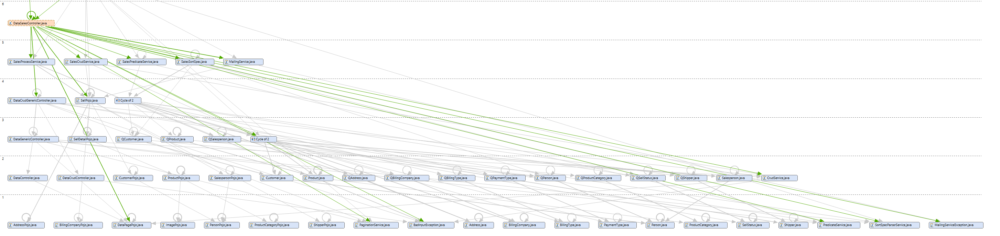
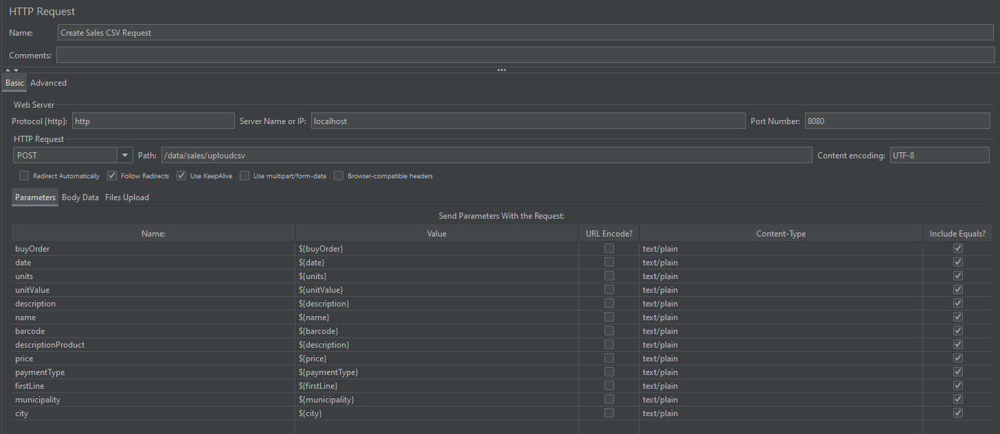
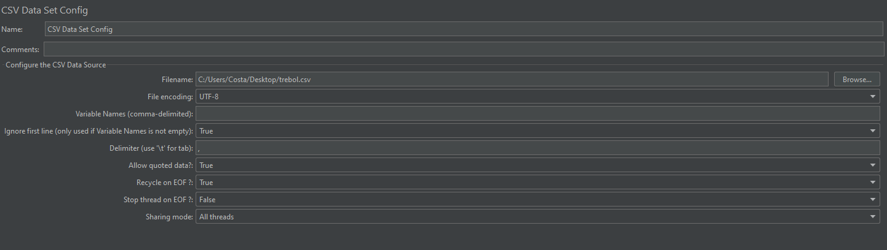
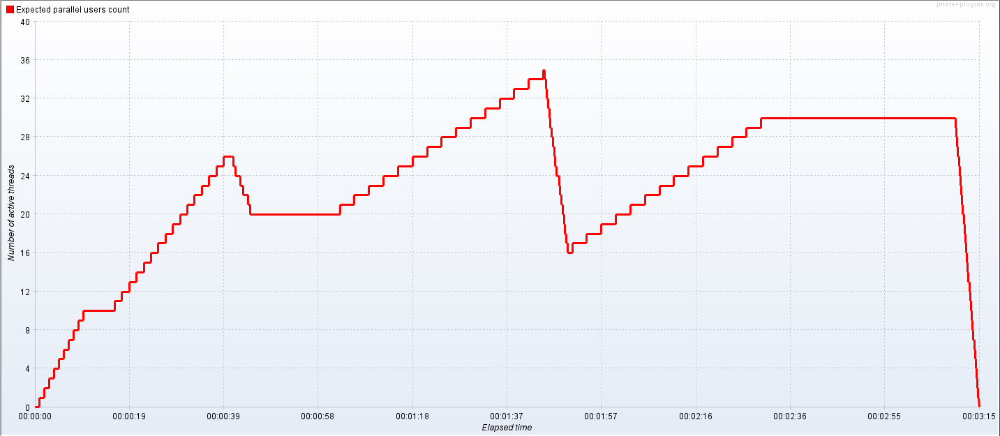
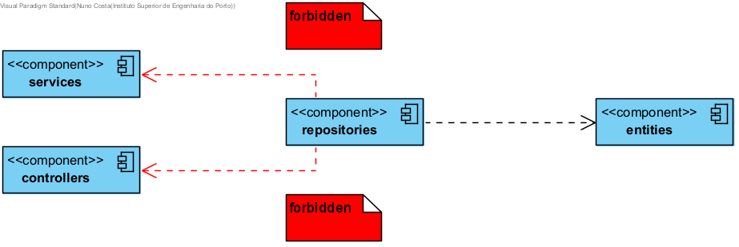
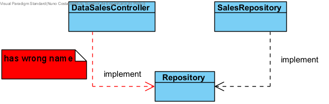
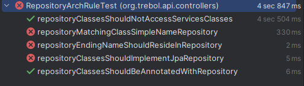
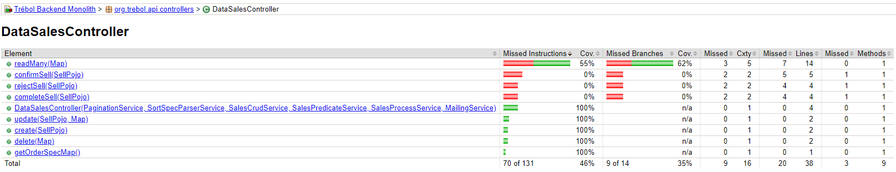
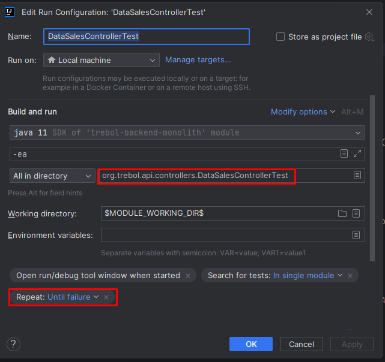
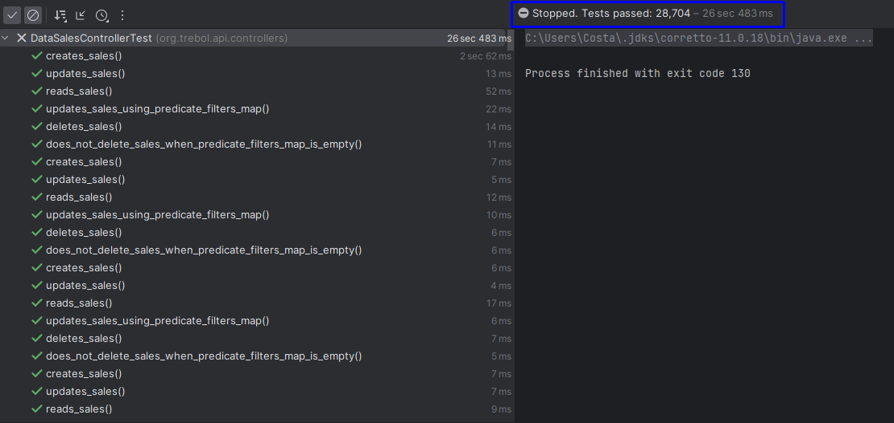

# README #

# Developed by Nuno Costa (1180126)

This folder includes all artifacts developed for the First Part of QESOFT Project.

It is structured as follows:

1. [Introduction](#1)
2. [Maintability](#2)
3. [Performance](#3)
4. [Security](#4)
5. [Architecture Compliance](#5)
6. [Test Examination](#6)
7. [Other issues](#7)
8. [Conclusions](#8)
9. [References](#refs)

## <a id="1"></a> 1. Introduction

The first phase of the QESOFT project analyzes the project in an operational environment to determine whether the project is reusable.

The main focus are the quality attributes and architectural characteristics that must be considered throughout the study, such as maintenance, performance, safety vulnerabilities, construction compliance and adequate testing, are key issues

In order to identify and select the best materials, this research will take an objective approach.

The paper also describes the project’s learning environment, including how to choose a Java service-based application with multiple executable REST controllers or DDD sets with multiple endpoints that can allow for distribution of work among team members between in this application.
The software should also be SMART compliant and enable complete data generation.

This report will focus only on the **DataSalesController** and its dependencies.

## <a id="2"></a>2. Maintainability

### 2.1 Maintainability

Software maintainability refers to the ability of software to be modified, updated, and improved over time in a cost-effective manner. 
In other words, it refers to the ease with which software can be maintained and evolved throughout its lifecycle.
Maintainability is an important aspect of software engineering because software systems are rarely static - they need to be modified and updated to adapt to changing requirements, fix bugs, and improve performance. 
Maintaining software can be a complex and expensive process, so ensuring that software is designed and built with maintainability in mind can save time and resources in the long run [[1]](#refs).

The Maintainability Index first appeared in 1992 when it was proposed by Paul Oman and Jack Hagemeister at the International Conference on Software Maintenance with the goal of establishing automated software development metrics to guide software related decision-making [[2]](#refs).
The Maintainability Index tries to give a holistic view of the relative maintenance burden for different sections of a project by blending together a series of different metrics.

Using a more modern adaptation of the original formula proposed in 2011 by Microsoft:

`Maintainability Index = MAX(0,(171 - 5.2 * ln(Halstead Volume) - 0.23 * (Cyclomatic Complexity) - 16.2 * ln(Lines of Code))*100 / 171)`

where:
* **Halstead Volume** is a measure of the size and complexity of the code.
* **Cyclomatic Complexity** is a measure of the number of independent paths through the code.
* **Lines of Code** is a simple count of the number of lines in the code.


The MI formula is designed to provide a score between 0 and 100, where higher scores indicate better maintainability. A score above 85 is considered to be excellent, while scores below 20 are considered to be very poor.
As a general rule of thumb:

| Score    | Classification    |
| -------- | ----------------- |
| 0 - 20   | Very Poor         |
| 20 - 40  | Bellow Average    |
| 40 - 70  | Average           |
| 70 - 100 | Good to Excellent |


Using the MetricsTree plugin in IntelliJ IDEA, I was able to check some metrics about the Trebol project and specific classes. [[3]](#refs)
While overall the project has a metric that is considered good to excellent (**81.33**) when it comes to maintainability, the controller that I'm analysing has a metric not so good.

The **_DataSalesController_** class has a Maintainability Index of **36.1709** this is considered **bellow average**.

If we analyze each method, we can see the following values regarding maintainability:

* DataSalesController(): **63.7441**
* completeSell(SellPojo): **66.2153**
* confirmSell(SellPojo): **64.6554**
* create(SellPojo): **71.432**
* delete(Map<String, String>): **71.432**
* getOrderSpecMap(): **82.6511**
* readMany(Map<String, String>): **53.3649**
* rejectSell(SellPojo): **66.2153**
* update(SellPojo, Map<String, String>): **70.9324**

### 2.2 Average Component Dependency (ACD)

Is a metric used in software engineering to measure the level of coupling between the components or modules of a application. 
In other words, ACD represents the average number of dependencies that each component has on other components.
This metric is calculated by dividing the total number of dependencies for all components in a application by the total number of components. [[4]](#refs)

The Sonargraph tool was used because it is a much more complete tool, a little complex to work with but very useful.
To do this, in sonargraph it was selected the class DataSalesController and then selected the option to show in graph view. The graph obtained is in the next image.




Having all the values from the Depends Upon metric of all components of the class DataSalesController, the value CCD can be calculated as the sum of these values.
It was determined that CCD has a value of 264.

As it was said before, ACD can be obtained by dividing CCD by the number of components. This way:

``` 
Average Component Dependency = CCD(N)/N (N is # of components) 
Average Component Dependency = 264/50 = 5.28 
```

The average component dependency (ACD) of 5.28 indicates that, on average, each component in the application depends on about 5 other components. Comparing to the maximum value, the ACD is approximately 10%.

### 2.3 Propagation Cost (PC)

Propagation Cost is a metric used in software engineering to assess the potential impact of a change in one component of the application on other components that depend on it.

A higher propagation cost will likely lead to an increase in complexity of the system therefore making it difficult to maintain.

PC can also be calculated by dividing the ACD once more by the number of nodes (components).

` PC = 5.28/50 = 0.106 `

Since we are working with a small part of the system, this value shouldn't be concerning.

### 2.4 Size metric

LLines of Code (LOC) is a software metric that measures the size of a software program by counting the number of lines of code that are written to create it. The LOC metric is used to estimate the complexity of a program and the effort required to develop, test, and maintain it.

In the class DataSalesController it was possible to determine the following values:

- Lines of Code: 128
- Total Lines: 164
- Number of Statements: 37

Based on these values, we can conclude that this component in question has a moderate size in terms of lines of code (LOC), with 128 lines of code in total. However, it is important to note that the total number of lines (164) also includes comments and blank lines, which may influence the interpretation of the actual size of the code itself.

Moreover, the number of statements is relatively low, with only 37, which may indicate good organization and clarity in the code.

### 2.5 Cyclomatic complexity

Cyclomatic complexity is a software metric that measures the complexity of a program by counting the number of independent paths through its source code. It is a quantitative measure of the number of decision points in a program and the number of paths that can be traversed through it. [[5]](#refs)

The cyclomatic complexity of a program is calculated by counting the number of decision points in the program's control flow. A decision point is any point in the code where the control flow can change, such as an if block.

Using sonargraph I was able to get the value of Average Complexity.

- Average Complexity: 3.19

This may indicate that the component in question has moderate complexity. 

An average complexity below 5 is generally considered good programming practice, indicating that the component is easy to understand and maintain.


## <a id="3"></a> 3. Performance

A software performance test is an activity performed to evaluate a system's ability to handle a given volume of load and/or users, identify bottlenecks, and measure speed, response time, resource consumption, and other parameters relevant to the quality and usability of the application.[[6]](#refs)
Performance testing is important to ensure quality and end-user satisfaction, and to identify and correct problems before the software is released. 
They can also be used to optimize the hardware and software infrastructure, and to improve the efficiency and economy of the resources used by the system.


### 3.1 Performance testing metrics

Some of the key performance metrics include:

**Response time:** measures the time it takes for the system or application to respond to a user request.

**Throughput:** measures how much data the system can process in a given time interval.

**CPU utilization:** measures the percentage of CPU usage while the application or system is running.

**Memory Usage:** Measures the amount of memory used by the system or application during execution.

**Error Rate:** measures the frequency of errors or glitches in the system or application during execution.

**Concurrency:** measures the ability of the system or application to handle multiple concurrent requests.

### 3.2 Key Performance Indicators

KPIs (Key Performance Indicators) are key performance indicators that help organizations evaluate the success or performance of their activities against their objectives and goals.

KPIs are important to enable organizations to monitor their performance and make informed decisions based on hard data. 
It is important to define and regularly track the relevant KPIs for each area or department to ensure that activities are aligned with the organization's strategic goals and contribute to its success.

### 3.3 Tests

We decide to use JMeter.
JMeter is an open-source software tool developed by the Apache Software Foundation that is primarily used for load, performance, and stress testing of web applications and web services. With JMeter, we can simulate a large number of users accessing an application or service at the same time, in order to evaluate the system's ability to handle the load and identify bottlenecks and performance problems.[[7]](#refs)

####  3.3.1 Load Test

To execute a load test for the application we create a Thread Group on JMeter and we define the following thread properties:

* Number of threads (users): 200
  * The number of virtual users that we want to simulate during the test. We have set a value of 150, which means that the test will run with 150 virtual users.
* Ramp-up period (how long to take to "ramp-up" to the full number of threads chosen, in seconds): 1
  * The time it takes for all virtual users to be started and reach the number defined in the first item.
* Loop Count: 10
  * The number of times each virtual user will execute the requests defined in the test plan. 

To present the results, we used an **Aggregated Report**:

| # Samples | Average | Median | 90% Line | 95% Line | 99% Line | Min | Max | Error % | Throughput | Received KB/sec | Sent KB/sec |
| --------- | ------- | ------ | -------- | -------- | -------- | --- | --- | ------- | ---------- | --------------- | ----------- |
| 2000      | 4       | 4      | 6        | 9        | 21       | 2   | 76  | 0.0     | 1855.3/sec | 914.96          | 231.91      |

Based on the results of the performed test, we can draw the following conclusions:

**Average Response Time:** The average response time is 6 milliseconds, which indicates that the application is responding quickly and efficiently.

**Median Response Time:** The median response time is 5 milliseconds, which indicates that most of the requests are being processed in a very short time.

**90% Line:** 90% of the requests were completed in less than 12 milliseconds, which is excellent performance for the application.

**Throughput:** The throughput of the application is 1823.2 transactions per second, which is a high rate for an application with 200 simulated users.

**Errors:** There were no errors recorded during the test, which indicates that the application is running stably.

#####  3.3.1.1 Upload by CSV file

To test the upload by csv file a method was developed that receives some parameters and then creates the SellPojo object with the necessary fields and other objects such as SellDetailPojo, ProductPojo:

  ``` @PostMapping({"/uploudcsv"})
  @PreAuthorize("hasAuthority('sales:create')")
  public void uploadCsv(@RequestParam(value = "buyOrder") Long buyOrder,@RequestParam(value = "date") String date,
                        @RequestParam(value = "units") String units,@RequestParam(value = "unitValue") String unitValue,
                        @RequestParam(value = "description") String description, @RequestParam(value = "name") String name,
                        @RequestParam(value = "barcode") String barcode, @RequestParam(value = "descriptionProduct") String descriptionProduct,
                        @RequestParam(value = "price") String price, @RequestParam(value = "paymentType") String paymentType,
                        @RequestParam(value = "firstLine") String firstLine, @RequestParam(value = "municipality") String municipality,
                        @RequestParam(value = "city") String city)
    throws BadInputException, EntityExistsException {

    Instant dtf = Instant.now();

    SellPojo input =new SellPojo();
    Collection<SellDetailPojo> sellDetailPojos = new ArrayList<>();
    SellDetailPojo sellDetailPojo = new SellDetailPojo();
    ProductPojo productPojo = new ProductPojo();
    AddressPojo addressPojo = new AddressPojo();

    productPojo.setName(name);
    productPojo.setBarcode(barcode);
    productPojo.setDescription(descriptionProduct);
    productPojo.setPrice(Integer.parseInt(price.trim()));

    sellDetailPojo.setDescription(description);
    sellDetailPojo.setUnitValue(Integer.parseInt(unitValue.trim()));
    sellDetailPojo.setUnits(Integer.parseInt(units.trim()));
    sellDetailPojo.setProduct(productPojo);
    sellDetailPojos.add(sellDetailPojo);

    addressPojo.setFirstLine(firstLine);
    addressPojo.setMunicipality(municipality);
    addressPojo.setCity(city);

    input.setBuyOrder(buyOrder);
    input.setDate(dtf);
    input.setPaymentType(paymentType);
    input.setBillingAddress(addressPojo);
    input.setDetails(sellDetailPojos);

    super.create(input);
  }
  ``` 

In the JMeter was created a http request with CSV Data Set Config:





Due to the complexity of my controller and the components added, I was getting some errors that were being fixed, but due to some lack of time I couldn't fix them all so I couldn't create SellPojo.

####  3.3.2 Stress Test

To execute a stress test for the application we installed a JMeter plugin, the "Custom Thread Groups" and create a bzm - Concurrency Thread Group on JMeter and we define the following thread properties:

* Target Concorruncy: 10 
  * The number of concurrent threads (concurrency) that we want the test to generate. We have set the value to 10, which means that the test will generate 10 concurrent threads during execution.
* Ramp-up period(seconds): 5
  * The time it takes for all threads to start and reach the concurrency defined in the first item. We defined a value of 5 seconds for the ramp, which means that the 10 threads will be started gradually over 5 seconds.
* Hold Target Rate Time (seconds): 30
  * The time that threads will be kept running in the defined concurrency before the test is terminated.

To present the results, we used an **Aggregated Report**:

| # Samples | Average | Median | 90% Line | 95% Line | 99% Line | Min | Max | Error % | Throughput | Received KB/sec | Sent KB/sec |
| --------- | ------- | ------ | -------- | -------- | -------- | --- | --- | ------- | ---------- | --------------- | ----------- |
| 23429     | 13      | 8      | 29       | 35       | 41       | 1   | 80  | 32.74   | 665.7      | 757.41          | 55.98       |

**Average Response Time:** The average response time was 13ms, indicating that the application may not be responding as quickly as desired.

**Median Response Time:** was 8 seconds, which suggests that most requests were answered in less than 8ms.

**90% and 99% Line:** 90% of samples were answered in less than 29ms and the 99% Line indicates that 99% of samples were answered in less than 41ms.

**Errors:** 32.74%, indicates that there was a significant percentage of errors during the test, which could be a sign that the application is overloaded and cannot handle the traffic.

**Throughput:** The throughput of the application was 665.7 transactions per second, indicates that the application was able to handle the load of 10 concurrent threads, sending an average of 665.7 requests per second.

Overall, the results suggest that the application may be suffering from performance issues under load and may need optimization or tuning to handle the increased traffic. The high percentage of errors may also indicate the need for improvements in the application's infrastructure to handle the load.

####  3.3.2 Soak Test

To execute a stress test for the application we installed a JMeter plugin, the "Custom Thread Groups" and create a jp@gc - Ultimate Thread Group on JMeter and we define the following thread properties:

* Threads Schedule:

| Start Threads Count | Initial Delay, sec | Startup Time, sec | Hold Load For, sec | Shutdown Time |
| ------------------- | ------------------ | ----------------- | ------------------ | ------------- |
| 10                  | 0                  | 10                | 30                 | 5             |
| 20                  | 15                 | 30                | 60                 | 5             |
| 30                  | 60                 | 90                | 40                 | 5             |




To present the results, we used an **Aggregated Report**:

| # Samples | Average | Median | 90% Line | 95% Line | 99% Line | Min | Max  | Error % | Throughput | Received KB/sec | Sent KB/sec |
| --------- | ------- | ------ | -------- | -------- | -------- | --- | ---- | ------- | ---------- | --------------- | ----------- |
| 76518     | 55      | 46     | 108      | 119      | 162      | 1   | 5978 | 58.96   | 394.4      | 652.36          | 20.23       |

The results indicate that the system was subjected to a considerable workload, with:

**Average Response Time:** The average response time was 55ms per sample.

**Median Response Time:** The median (46 ms) is slightly lower than the mean, indicating that the results are relatively well distributed. 

**90% and 99% Line:** The 90% (108 ms) and 95% percentile (119 ms) indicate that some requests had a longer response time, while the 99% (162 ms) indicates that few requests had very long response times. 

**Throughput:** The throughput (394.4/sec) is relatively high, indicating that the system was able to process a large number of requests per second. 

**Errors:** However, the error (58.96%) is quite high, which may indicate that there was a significant failure rate in the test or that the infrastructure was not able to handle the load. 

In general, it is necessary to analyze the results in more detail and consider other factors, such as system resources, to draw more accurate conclusions.


## <a id="4"></a> 4. Security

### 4.1 Malicious code vulnerability
Using SpotBug Plugin we were able to found and analise some vulnerabilities in the aggregation group. [[8]](#refs)
The SpotBugs plugin for IntelliJ IDEA is a useful tool for analyzing Java code for possible quality problems and improving the security and performance of the software.

Since the

#### 4.1.1 Method returning array may expose internal representation

**Problem**: May expose internal representation by returning reference to mutable object

**Priority**: Medium

**Description**: Returning a reference to a mutable object value stored in one of the object's fields exposes the internal representation of the object. If instances are accessed by untrusted code, and unchecked changes to the mutable object would compromise security or other important properties.

**Possible Solution**: Returning a copy of the object instead of the original object is the better approach in many situations.

| Class        | Method               | Field           |
| ------------ | -------------------- | --------------- |
| DataPagePojo | getItems()           | items           |
| Sell         | getBillingAddress()  | billingAddress  |
| Sell         | getBillingCompany()  | billingCompany  |
| Sell         | getBillingType()     | billingType     |
| Sell         | getCustomer()        | customer        |
| Sell         | getDetails()         | details         |
| Sell         | getPaymentType()     | paymentType     |
| Sell         | getSalesperson()     | salesperson     |
| Sell         | getShipper()         | shipper         |
| Sell         | getShippingAddress() | shippingAddress |
| Sell         | getStatus()          | status          |
| SellPojo     | getBillingAddress()  | billingAddress  |
| SellPojo     | getBillingCompany()  | billingCompany  |
| SellPojo     | getCustomer()        | customer        |
| SellPojo     | getDetails()         | details         |
| SellPojo     | getSalesperson()     | salesperson     |
| SellPojo     | getShipper()         | shipper         |
| SellPojo     | getShippingAddress() | shippingAddress |


#### 4.1.2 Storing reference to mutable object

**Problem**: May expose internal representation by incorporating reference to mutable object

**Priority**: Medium

**Description**: This code stores a reference to an externally mutable object into the internal representation of the object. If instances are accessed by untrusted code, and unchecked changes to the mutable object would compromise security or other important properties.

**Possible Solution**: Creating a defensive copy of the mutable object before incorporating it into the immutable object is the better approach in many situations.

| Class                   | Method                                | Field              |
| ----------------------- | ------------------------------------- | ------------------ |
| DataPagePojo            | DataPagePojo<init>()                  | items              |
| DataPagePojo            | setItems()                            | items              |
| SalesCrudServiceImpl    | SalesCrudServiceImpl&lt;init&gt;()    | apiProperties      |
| SalesCrudServiceImpl    | SalesCrudServiceImpl&lt;init&gt;()    | productsRepository |
| SalesCrudServiceImpl    | SalesCrudServiceImpl&lt;init&gt;()    | salesRepository    |
| SalesProcessServiceImpl | SalesProcessServiceImpl&lt;init&gt;() | salesRepository    |
| Sell                    | Sell&lt;init&gt;()                    | billingAddress     |
| Sell                    | Sell&lt;init&gt;()                    | billingCompany     |
| Sell                    | Sell&lt;init&gt;()                    | billingType        |
| Sell                    | Sell&lt;init&gt;()                    | customer           |
| Sell                    | Sell&lt;init&gt;()                    | details            |
| Sell                    | Sell&lt;init&gt;()                    | paymentType        |
| Sell                    | Sell&lt;init&gt;()                    | salesperson        |
| Sell                    | Sell&lt;init&gt;()                    | shipper            |
| Sell                    | Sell&lt;init&gt;()                    | shippingAddress    |
| Sell                    | Sell&lt;init&gt;()                    | status             |
| Sell                    | setBillingAddress()                   | billingAddress     |
| Sell                    | setBillingCompany()                   | billingCompany     |
| Sell                    | setBillingType()                      | billingType        |
| Sell                    | setCustomer()                         | customer           |
| Sell                    | setDetails()                          | details            |
| Sell                    | setPaymentType()                      | paymentType        |
| Sell                    | setSalesperson()                      | salesperson        |
| Sell                    | setShipper()                          | shipper            |
| Sell                    | setShippingAddress()                  | shippingAddress    |
| Sell                    | setStatus()                           | status             |
| Sell$SellBuilder        | billingAddress()                      | billingAddress     |
| Sell$SellBuilder        | billingCompany()                      | billingCompany     |
| Sell$SellBuilder        | billingType()                         | billingType        |
| Sell$SellBuilder        | customer()                            | customer           |
| Sell$SellBuilder        | details()                             | details            |
| Sell$SellBuilder        | paymentType()                         | paymentType        |
| Sell$SellBuilder        | salesperson()                         | salesperson        |
| Sell$SellBuilder        | shipper()                             | shipper            |
| Sell$SellBuilder        | shippingAddress()                     | shippingAddress    |
| Sell$SellBuilder        | status()                              | status             |
| SellPojo                | SellPojo&lt;init&gt;()                | billingAddress     |
| SellPojo                | SellPojo&lt;init&gt;()                | billingCompany     |
| SellPojo                | SellPojo&lt;init&gt;()                | customer           |
| SellPojo                | SellPojo&lt;init&gt;()                | details            |
| SellPojo                | SellPojo&lt;init&gt;()                | salesperson        |
| SellPojo                | SellPojo&lt;init&gt;()                | shipper            |
| SellPojo                | SellPojo&lt;init&gt;()                | shippingAddress    |
| SellPojo                | setBillingAddress()                   | billingAddress     |
| SellPojo                | setBillingCompany()                   | billingCompany     |
| SellPojo                | setCustomer()                         | customer           |


## <a id="5"></a> 5. Architecture Compliance

Architecture conformance is the degree to which software complies with its defined architecture, standards, and best practices. 
Software architecture is a comprehensive framework that defines the organization, components, interfaces, interactions and other important aspects of a software system.
Architectural compliance can be an important part of the software quality assurance process and is a common practice in large, critical enterprise software development projects.
Architectural compliance is important to ensure that software is developed and maintained in a consistent way, 
avoiding deviations and problems that can compromise its quality, security, performance, and scalability.

Using ArchUnit with JUnit5 some fitness functions were written to check and evaluate the compliance of the project architecture. [[9]](#refs)[[10]](#refs)

### 5.1 Controller

#### 5.1.1 Non-Private Methods
```
  @ArchTest
  public static final ArchRule methodsShouldNotBePrivate =
    methods().that()
      .areDeclaredInClassesThat().areAnnotatedWith(RestController.class)
      .and()
      .areNotAnnotatedWith(ExtendWith.class)
      .should().notBePrivate();
```

The purpose of this test is to check that the methods in classes annotated with "@RestController" are not private (do not have the access modifier "private").

This test failed because the method "getUserDetails" of class "AccessController" and the method "fetchProductListByCode" of class "DataProductListContentsController" violated this rule, as both have the access modifier "private".
This rule was violated 2 times in the code.

#### 5.1.2 Class and package containment
```
  @ArchTest
  public static final ArchRule controllerClassesShouldResideInControllerPackage =
    classes().that()
      .areAnnotatedWith(RestController.class)
      .and()
      .haveSimpleNameNotContaining("Test")
      .should().resideInAPackage("..controllers..");
```

This test is to verify that the classes annotated with "@RestController" are located within the "controllers" package.

This test failed. The error shows that the "SimpleController" class annotated with "@RestController" in the "JwtVerifiterFilterTest.java" file does not reside in the "...controllers..." package, violating the rule set.

#### 5.1.3 Inheritance
```
  @ArchTest
  public static final ArchRule controllersShouldBeController =
    classes().that()
      .areAnnotatedWith(RestController.class)
      .and()
      .haveSimpleNameNotContaining("Test")
      .should().haveSimpleNameEndingWith("Controller");
```
This test is to verify that the classes annotated with "@RestController" have their name ending with the word "Controller".

This test passed without errors.


#### 5.1.4 Annotation
```
  @ArchTest
  public static final ArchRule controllerClassesShouldBeAnnotatedWithController =
    classes().that()
      .resideInAPackage("..controllers..")
      .and()
      .haveSimpleNameNotContaining("Test")
      .should().beAnnotatedWith(RestController.class);
```

This test aims to verify that the classes that reside in the "...controllers..." package have the "@RestController" annotation.

This test failed because the "SimplePrincipal" class needs to be annotated with "@RestController" to fit the architecture defined by the test.

##### Results


### 5.2 Service

#### 5.2.1 Package dependency
```
  @ArchTest
  public static final ArchRule serviceClassesShouldNotAccessControllerClasses =
    noClasses().that().resideInAnyPackage("..services..")
      .should().dependOnClassesThat().resideInAnyPackage( "controllers");
```

This test defines an architectural rule that ensures that service classes do not directly access controller classes. 
This rule helps maintain the separation of responsibilities between the service and control layers in a software architecture.
This test passed without errors.

#### 5.2.2 Class and package containment
```
  @ArchTest
  public static final ArchRule serviceClassesShouldResideInServicePackage =
    classes().that()
      .areAnnotatedWith(Service.class)
      .and()
      .areNotInterfaces()
      .should().resideInAPackage("..services..");
```
This test checks that all classes that are annotated with @Service (which are service implementations) are located in the "...services..." package. 
This helps ensure good code organization by preventing service classes from being spread across different packages, which can make code maintenance difficult.

This test did not pass. The error message indicates that these classes need to be moved to the correct "...services..." package.

Example:
```
Class <org.trebol.mailing.impl.mailgun.MailgunMailingServiceImpl> does not reside in a package '..services..' in (MailgunMailingServiceImpl.java:0)
Class <org.trebol.payment.impl.webpayplus.WebpayplusPaymentServiceImpl> does not reside in a package '..services..' in (WebpayplusPaymentServiceImpl.java:0)
Class <org.trebol.security.UserDetailsServiceImpl> does not reside in a package '..services..' in (UserDetailsServiceImpl.java:0)
```

#### 5.2.3 Inheritance
```
  @ArchTest
  public static final ArchRule servicesShouldBeService =
    classes().that()
      .areAnnotatedWith(Service.class)
      .and()
      .haveSimpleNameNotContaining("Test")
      .should().haveSimpleNameEndingWith("ServiceImpl");
```
This test aims to ensure that all service classes in the project follow a consistent naming convention.
This test passed without errors.


#### 5.2.4 Annotation
```
  @ArchTest
  public static final ArchRule serviceClassesShouldBeAnnotatedWithService =
    classes().that()
      .resideInAPackage("..services..")
      .and()
      .areNotInterfaces()
      .and()
      .haveSimpleNameNotContaining("Test")
      .and()
      .haveSimpleNameEndingWith("ServiceImpl")
      .should().beAnnotatedWith(Service.class);
```
This test checks whether the service classes in a Java project conform to naming conventions and annotations.

This test passed wihout errors.

##### Results


### 5.3 Repository

#### 5.3.1 Package dependency


This fitness function checks that classes from the repository package are not depend on classes from the service or controller package.
The goal is to ensure that the repository layer is separate from the other layers of the system and that coupling between the layers is minimized.

```
  @ArchTest
  public static final ArchRule repositoryClassesShouldNotAccessServicesClasses =
    noClasses().that().resideInAnyPackage("..repositories..")
      .should().dependOnClassesThat().resideInAnyPackage( "..services..", "controllers");
```

This test passed wihout errors.


#### 5.3.2 Class dependency

This fitness function checks that all classes that have a name matching the default ".*Repository" only have dependent classes with the name "Repository".
This is done to ensure that these classes do not have unnecessary or unrelated dependencies that could cause unnecessary coupling or confusion in the code.


```
  @ArchTest
  public static final ArchRule repositoryMatchingClassSimpleNameRepository =
    classes().that().haveNameMatching(".*Repository")
      .should().onlyHaveDependentClassesThat().haveSimpleName("Repository");
```

This test failed because some classes have dependencies that do not have the required simple Repository name. This may be a design issue.
Example:
```
Constructor <org.trebol.api.services.impl.CompanyServiceImpl.<init>(org.trebol.jpa.repositories.ParamsRepository)> has parameter of type <org.trebol.jpa.repositories.ParamsRepository> in (CompanyServiceImpl.java:0)
```


#### 5.3.3 Class and package containment

The rule defined in this fitness function is that all classes whose names end with "Repository" must be located in the "..repositories" package.


```
  @ArchTest
  public static final ArchRule repositoryEndingNameShouldResideInRepository =
    classes().that().haveSimpleNameEndingWith("Repository")
      .should().resideInAPackage("..repositories");
```

This test has not passed because of a class that isn't in the expected package.
According to the error message, the class is "org.trebol.jpa.Repository", which does not reside in the expected package.


#### 5.3.4 Inheritance

This fitness function checks that all classes that implement the JpaRepository interface have names that end with "Repository".



```
  @ArchTest
  public static final ArchRule repositoryClassesShouldImplementJpaRepository =
    classes().that().implement(Repository.class)
      .should().haveSimpleNameEndingWith("Repository");
```


#### 5.3.5 Annotation

This fitness function checks that all classes that are assignable to Repository are annotated with @Repository.


```
  @ArchTest
  public static final ArchRule repositoryClassesShouldBeAnnotatedWithRepository =
    classes().that()
      .areAssignableTo(Repository.class)
      .should().beAnnotatedWith(Repository.class);
```


##### Results


### 5.4 Application

#### 5.4.1 Layer
The purpose of this test is to verify the layered architecture pattern.
The control layer cannot be accessed by any layer,
the service layer can only be accessed by the control layer,
and the repository layer can only be accessed by the service layer.


```
  @ArchTest
  public static final ArchRule layeredArchitecture = 
    layeredArchitecture().consideringOnlyDependenciesInLayers()
        .layer("Controller").definedBy("..controllers..")
        .layer("Service").definedBy("..services..")
        .layer("Repository").definedBy("..repositories..")
        .whereLayer("Controller").mayNotBeAccessedByAnyLayer()
        .whereLayer("Service").mayOnlyBeAccessedByLayers("Controller")
        .whereLayer("Repository").mayOnlyBeAccessedByLayers("Service");
```

This test fails due to the use of ProductListItemsRepository and ProductListsRepository by the 
DataProductListContentsController class, which belongs to the control layer.
This violation occurred 32 times in the system.

Example:
```
Field <org.trebol.api.controllers.DataProductListContentsController.listItemsRepository> has type <org.trebol.jpa.repositories.ProductListItemsRepository> in (DataProductListContentsController.java:0)
Field <org.trebol.api.controllers.DataProductListContentsController.listsRepository> has type <org.trebol.jpa.repositories.ProductListsRepository> in (DataProductListContentsController.java:0)
Field <org.trebol.api.controllers.DataProductListContentsControllerTest.listItemsRepositoryMock> has type <org.trebol.jpa.repositories.ProductListItemsRepository> in (DataProductListContentsControllerTest.java:0)
Field <org.trebol.api.controllers.DataProductListContentsControllerTest.listsRepositoryMock> has type <org.trebol.jpa.repositories.ProductListsRepository> in (DataProductListContentsControllerTest.java:0)
```

#### 5.4.2 Cycle

This fitness function checks that there are no cycles in the dependencies between packages that match the pattern ..org.trebol.(*)...
This checks that there are no circular dependencies between different packages.


```
  @ArchTest
  public static final ArchRule noCyclesInPackageDependencies =
    slices()
       .matching("..org.trebol.(*)..").should().beFreeOfCycles();
```


This test failed because there is a specific dependency loop between the slices org.trebol.api and org.trebol.common. This rule was violated 92 times.

Example:
```
Constructor <org.trebol.api.controllers.AccessController.<init>(org.trebol.security.services.AuthorizationHeaderParserService, org.springframework.security.core.userdetails.UserDetailsService, org.trebol.security.services.AuthorizedApiService, org.trebol.common.services.RegexMatcherAdapterService)> has parameter of type <org.trebol.common.services.RegexMatcherAdapterService> in (AccessController.java:0)
Field <org.trebol.api.controllers.AccessController.regexMatcherService> has type <org.trebol.common.services.RegexMatcherAdapterService> in (AccessController.java:0)
```

#### Results


## <a id="6"></a> 6. Test Examination

### 6.1 Test Coverage

For the test coverage I used the Jococo plugin for maven.
JaCoCo (Java Code Coverage) is a Java code coverage analysis tool. It is used to measure the extent to which Java source code is tested. JaCoCo provides detailed reports on code coverage, including line, branch, statement and method coverage. 
These reports are generated in human- and machine-readable formats, allowing developers to analyse the quality of their testing and identify areas of code that need to be tested more frequently. 



The report provides information about the number of instructions, branches, lines, complexity, and methods that were covered by the test cases.
Analyzing the information in the report we can conclude that:

The **"readMany(Map)"** method had a coverage of 55% for missed instructions and 62% for missed branches, which means that almost half of the instructions and branches of the method were not covered by the tests.

The **"confirmSell(SellPojo)"**, **"rejectSell(SellPojo)"** and **"completeSell(SellPojo)"** methods had 0% coverage for missed branches, suggesting that there is an opportunity to write additional tests to cover these branches.

The **"DataSalesController"** element was completely covered by the tests, as the coverage for missed statements and missed branches was 100% and there are no missed lines or methods.

The methods **"update(SellPojo, Map)"**, **"create(SellPojo)"**, **"delete(Map)"** and **"getOrderSpecMap()"** were completely covered by the tests, as the coverage for missed statements and missed branches was 100% and there are no missed lines or methods.

This report can help identify the areas of codebase that require more testing and improve test coverage.

### 6.2 Flaki Tests

Flaky tests are automated tests that exhibit inconsistent behaviour, they produce different results under the same conditions. This can occur for multiple reasons, such as concurrency, network latency or external dependencies.

Flaky tests can be a big problem for software development teams as they can lead to false positives and negatives, making it difficult to determine whether a code change introduced a regression. They can also slow down the development process, requiring additional time to investigate and correct. [[11]](#refs)

To get a flaky test result, we have to run our test multiple times. With the results of these tests we can begin to analyze potential causes.

We use our IDE to run the tests until failure. Intellij allows to run a JUnit test N times or until failure.



As we can see bellow the tests were runned 28704 times and always passed.



### 6.3 Project Test

This project has only 4 type of tests:
  
  * Unit tests: These are tests that verify the behavior of individual components or functions in isolation. They help to catch bugs early in the development cycle and ensure that each component behaves as expected.

  * Integration tests: These tests verify that the different components of the application work correctly together. They help to ensure that the application behaves correctly as a whole and that there are no issues with the interactions between different components.

  * End-to-end tests: These tests verify the behavior of the application as a whole, including the interactions between the frontend and backend. They help to ensure that the application meets the requirements and behaves correctly in real-world scenarios.

  * Performance tests: These tests verify the performance of the application under various load conditions. They help to identify potential bottlenecks or performance issues and ensure that the application can handle the expected workload.

### 6.4 Test Suggestion

This project could implement:

  * Mutation Tests: These are tests that involves creating artificial defects or mutations in the code to see if the existing tests can detect them;
  * Functional Tests: These are tests that check that an application behaves as expected from a user's perspective;
  * Regression Tests: These are tests that check that changes to an application do not cause unexpected issues or break existing functionality;
  * Security  Tests: These are tests that check that an application is secure and protected from common vulnerabilities;

## <a id="7"></a> 7. Other issues

N/A

## <a id="8"></a> 8. Conclusions

A score above 85 is considered to be excellent, while scores below 20 are considered to be very poor. The Trebol project has an overall maintainability score of 81.33, indicating good to excellent maintainability. 
However, the specific DataSalesController class has a score of 36.1709, which is below average. Furthermore, the analysis of the Average Component Dependency (ACD) metric indicates that on average, each component in the DataSalesController depends on about five other components. 
Finally, the Propagation Cost (PC) metric indicates that a change in one component of the software system would likely impact approximately 10% of other components. 

In the load test, the application is responding quickly and efficiently, with a high throughput and no errors recorded. However, in the stress test, the application may not be responding as quickly as desired, with a high percentage of errors recorded. The absorption test shows that the system was able to process a large number of requests per second, but with a high error rate. Overall, the results suggest that the application may need optimisation or tuning to handle the increased traffic, and that infrastructure improvements may be needed to handle the load. However, more detailed analysis and consideration of other factors is required to draw more precise conclusions.

About security, the report presents two problems related to exposing the internal representation of the object, which may compromise security or other important system properties. The first problem occurs when a reference to a mutable object is returned by a method, exposing the internal representation of the object. The solution would be to return a copy of the object instead of the original object. The second problem is when a reference to a mutable object is embedded in the object's internal representation. The solution would be to create a defensive copy of the mutable object before embedding it in the immutable object. In both cases, the priority of the problem is considered medium. Therefore, measures must be taken to prevent exposure of the object's internal representation and ensure the security and integrity of the system.

When it comes to Architectural Compliance the application has several problems, the proof is that most of the tests did not pass. The Architecture should be reviewed and improved.

The coverage test report indicates that in some methods almost half of the instructions and branches were not covered. So it would be ideal to write new tests that cover these gaps.


## <a id="refs"></a> 9. References

[1] Lehman, M. M. (1980). Programs, life cycles, and laws of software evolution. Proceedings of the IEEE, 68(9), 1060-1076.

[2] Coleman, D., Ash, D., Lowther, B., & Oman, P. (1994, August). Using metrics to evaluate software system maintainability. Computer, 27(8), 44-49. DOI: 10.1109/2.291294

[3] MetricsTree plugin for IntelliJ IDEA. [https://plugins.jetbrains.com/plugin/13959-metricstree](https://plugins.jetbrains.com/plugin/13959-metricstree)

[4] BASICS, METRICS, SOFTWARE DEVELOPMENT, SOFTWARE QUALITY (2009) Software Quality: The Basics II - CCD, ACD, Ca, Ce, I, A, I/A and D [https://blog.eisele.net/2009/12/software-quality-basics-ii-ccd-acd-ca.html](https://blog.eisele.net/2009/12/software-quality-basics-ii-ccd-acd-ca.html)

[5] McCabe, T. J. (1976). "A complexity measure." IEEE Transactions on Software Engineering, 2(4), 308-320.
 
[6] Gillis, A. S. (2023). Performance Testing. [https://www.techtarget.com/searchsoftwarequality/definition/performance-testing](https://www.techtarget.com/searchsoftwarequality/definition/performance-testing)

[7] Apache Software Foundation. https://jmeter.apache.org/

[8] SpotBugs - IntelliJ IDEs Plugin. [https://plugins.jetbrains.com/plugin/14014-spotbugs](https://plugins.jetbrains.com/plugin/14014-spotbugs)

[9] Gafert, P. (2022). ArchUnit: Automated architecture testing. [https://www.archunit.org/](https://www.archunit.org/)

[10] Yin, K. (2022) ArchUnit: Test Software Architecture Easily. [https://betterprogramming.pub/archunit-test-software-architecture-easily-a874c54bda1e](https://betterprogramming.pub/archunit-test-software-architecture-easily-a874c54bda1e)

[11] Otrebski, K. (2018)  [https://www.signifytechnology.com/blog/2018/05/flaky-tests-by-krzysztof-otrebski?source=google.com](https://www.signifytechnology.com/blog/2018/05/flaky-tests-by-krzysztof-otrebski?source=google.com)