# README #

# Developed by Tiago Pinto (1191098)

This folder includes all artifacts developed for the First Part of QESOFT Project. 

This file is structured as follows:

1. Introduction
2. Maintability
3. Performance
4. Security
5. Architecture Compliance
6. Test Examination
7. Conclusions

## 1. Introduction

The first phase of the QESOFT project analyzes the project in an operational environment to determine whether or not the project is reusable.

The main focus are the quality attributes and architectural characteristics that must be considered throughout the study, such as maintenance, performance, safety vulnerabilities, construction compliance and adequate testing, are key issues

In order to identify and select the best materials, this research will take an objective approach.

The paper also describes the project’s learning environment, including how to choose a Java service-based application with multiple executable REST controllers or DDD sets with multiple endpoints that can allow for distribution of work among team members between in this application.
The software should also be SMART compliant and enable complete data generation.

The project under analysis is the [Trebol](https://github.com/trebol-ecommerce/trebol-backend-monolith).

In this particular file, the quality attributes and architectural characteristics that were analysed concern the flow of information of _DataShippersController_.

## 2. Maintainability

It was used the IntelliJ plugin MetricsTree to measure Coupling and Structural Erosion (CSE) and Size and Complexity (SC).

MetricsTree is an IDE extension that helps to evaluate quantitative properties of java code.
It supports the most common sets of metrics at the project, package, class, and method levels.

To measure CSE were used the metrics: average component dependency, propagation cost, cyclicity and relative cyclicity and maintainability level.

To measure SC were used the metrics: size metric, cyclomatic complexity and indentation debt.

### 2.1 Average Component Dependency (ACD)

ACD can be obtained by dividing CCD by the number of components to get the ACD.

This way, it was used the tool Sonargraph to calculate the components to get the ACD and the value of CCD.
To do this, in sonargraph it was selected the class DataUsersController and then selected the option to show in graph view. The graph obtained is in the next image.

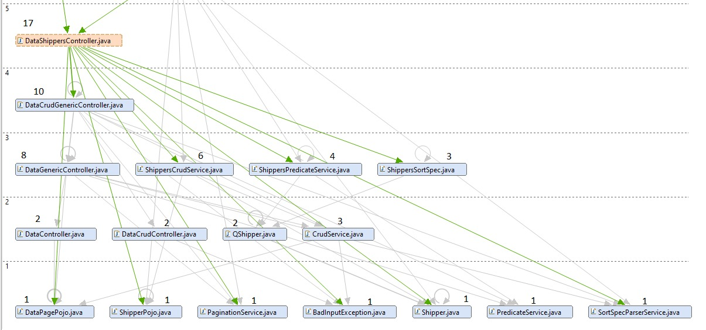

The number above each class represents the value from the metric Depends Upon. This metric was also available in the tool Sonargraph.

Having all the values from the Depends Upon metric of all components of the class DataUsersController, the value CCD can be calculated as the sum of these values.
It was determined that CCD has a value of 64.

As it was said before, ACD can be obtained by dividing CCD by the number of components. This way:

`ACD = 64/17 = 3,76 `

The maximum value is equal to the number of components, in this case it that would be 17
On average, a component depends on 3,76 components. Comparing to the maximum value, it can be said that in terms of coupling, this number is fairly low.

### 2.2 Propagation Cost (PC)

The metric propagation cost measures the potential impact a change in a component will cause on other components.
A higher propagation cost will likely lead to an increase in complexity of the system therefore making it difficult to maintain.

PC can also be calculated by dividing the ACD once more by the number of nodes (components).

`PC = 3,76/17 = 0,22 `

Since we are working with a small part of the system, this value shouldn't be concerning.


Regarding maintainability level, it was used the Intellij's plugin, MetricsThree. It allowed measurement at the class level and at the level of the different methods.

In what concers to DataShippersController class, its maintainability level, given by MetricsTree's metric Maintainability Index, it's **48,4884**.

About the methods of this class, their maintainability levels are:

- DataShippersController(
    PaginationService paginationService,
    SortSpecParserService sortService,
    ShippersCrudService crudService,
    ShippersPredicateService predicateService
  ): 70,9492

- create(ShipperPojo input): 71,9008
  
- update(ShipperPojo input, Map<String, String> requestParams): 71,432

- delete(Map<String, String> requestParams): 71,9008

- readMany(Map<String, String> allRequestParams): 76,5177

- getOrderSpecMap(): 84,7589

### 2.3 Size metric

Lines of Code (LoC) per file counts every line that contains actual code and skips empty lines and comment lines.

Total Lines metric counts every single line, including empty lines and comment lines.

Number of Statements verifies the statements, i.e., s a single complete action performed in the source code, usually terminated by a special character or a newline.

In the class DataUsersController it was possible to determine the following values:

- Lines of Code: 63
- Total Lines: 92
- Number of Statements: 6

These values can indicate of how much the component is doing and how complex it is.
So, we can say that this component is not complex.

### 2.4 Cyclomatic complexity

Cyclomatic complexity was proposed in 1976, and it computes the number of different possible execution paths through a method or
function, which is also a floor for the number of test cases needed to achieve 100% test coverage.

For this metric it was analyzed the metric Average Complexity that is described as the weighted average modified extended cyclomatic complexity for fully analyzes code.

- Average Complexity: 1,00

As the value calculated is very low we can say that the class DataUsersController is easy to understand and don't have a big risk associated when modifying the class.

## 3. Performance

Performance testing encompasses a variety of tests that assess the behavior and efficiency of a system. Specifically, software performance testing evaluates the responsiveness, stability, scalability, reliability, speed, and resource utilization of both your software and infrastructure. Depending on the type of performance test used, different data can be obtained, as we will explain in more detail.

There are three common types of performance testing that provide different data:

* Load Tests: These tests simulate a high level of user traffic or load to measure how well a system performs. They involve testing a large number of users or transactions to see how the system responds.

* Stress Tests: Stress testing goes beyond load testing by testing a system's performance limits. It involves testing beyond normal usage scenarios to see how well the system handles extreme conditions.

* Soak Tests: Also known as endurance testing, these tests measure how well a system performs over a sustained period of time. They involve testing the system for several hours, days, or even weeks to see how it performs under sustained load. Soak tests are useful for detecting memory leaks.

KPIs, also known as Key Performance Indicators, are performance metrics that measure the results and success of an organization based on relevant and important parameters. KPIs are used by organizations to evaluate their activities and measure their progress.

There are various KPIs available for testing using JMeter, and some of the recommended ones for load testing are:

1. Number of Users

```
To ensure that websites can handle high loads created by many users, we use virtual users to simulate concurrent active users. These virtual users act like real users on the website and help us identify any bottlenecks that could occur during peak usage times.
```

2. Hits Per Second

```
Simulating the number of users alone is not enough to get an accurate measurement of the load. It's important to measure the number of requests generated by users' actions as well. Hits per second is the average number of requests initiated per second, which helps us simulate and measure the types and loads of website usage accurately.
```

3. Errors Per Second

```
JMeter identifies the number of errors per second after measuring the number of hits per second. A high rate of errors per second can indicate a bottleneck that needs fixing before launching the site.
```

4. Response Time

```
After measuring users and their actions, we measure how long it takes the system to process a request. This parameter measures the time it takes from the first byte of data to leave the user until the last byte is received by the user. Response time shows how the target site is performing from the user point of view and helps us identify any performance issues that could cause customers to leave.
```

5. Latency

```
Latency is the measurement of how long it takes from just before sending the request to just after receiving the first response. It helps us understand the inherent network delay during the transmission of data from client to server.
```

6. Connect Time

```
Connect time is the measurement of how long it takes the user to connect to the server and the server to respond, including SSL handshake. It is important for isolating SSL performance as a bottleneck and forms part of the response time KPI.
```

7. Bytes/s (Throughput)

```
Throughput is the measurement of the average bandwidth consumption generated by the test per second. It measures the amount of data flowing to and from the servers and is important for ensuring that your network interface controllers are performing properly.
```

For measuring the performance of the project, the team has selected Latency as the primary KPI.

### JMeter

The Apache JMeter application is an open-source software, a 100% pure Java application designed to load test functional behavior and measure performance. It was originally designed for testing Web Applications but has since expanded to other test functions.

Apache JMeter may be used to test performance both on static and dynamic resources, Web dynamic applications.
It can be used to simulate a heavy load on a server, group of servers, network, or object to test its strength or to analyze overall performance under different load types.


To run Jmeter tests, a test plan was designed with the following configuration:

```bash
.
└── Thread Group/
    ├── Http Request (Login)/
    │   ├── View Results Tree
    │   └── JSR223 PostProcessor
    ├── Http Request (Get Shippers)/
    │   ├── Http Header Manager
    │   └── View Results Tree
    ├── Http Request (Post Shippers)/
    │   ├── Http Header Manager
    │   ├── View Results Tree
    │   ├── CSV Data Set Config
    │   └── JSR223 PostProcessor
    ├── Debug Sampler
    ├── View Results Tree
    ├── Http Request (Put Shippers)/
    │   ├── Http Header Manager
    │   ├── JSR223 PreProcessor
    │   └── View Results Tree
    ├── Debug Sampler
    ├── View Results Tree
    ├── jp@gc - Response Codes per Second
    ├── jp@gc - Transactions per Second
    └── Summary Report
```

### 3.3 Load Test

To do a load test for the application, we’ll simulate many users accessing the users page. 
The thread properties defined will be:

- **Number of Threads (users):** 200

- **Ramp-up period:** 1

- **Loop Count:** 10

Only 1 thread was defined for each test, so it'll only take 1 second to ramp it up. 
To see the results, a View Results Tree Listener and a Summary Report was used. 
It was also used a jp@gc - Response Codes per Second and jp@gc - Transactions per Second. These were possible after the download of these plugins.

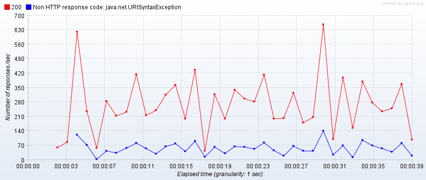

By this image (jp@gc - Response Codes per Second), it is possible to see that in the same second several requests are being handled.
Besides this, we can also see the codes from each request. The line in rose represents the debug sampler.

With the next image is possible to see that there some erros with the request post and put. 
The errors associated with the request post exits since the application is generating the id of each object beginning at the index 0. 
This is a problem because there are already users persisted in the database with the ids 1, 2, 3 and 4.
The errors observed with the request put exist since these were not defined correctly in jmeter. It was not possible to pass the parameters to the path of the request.

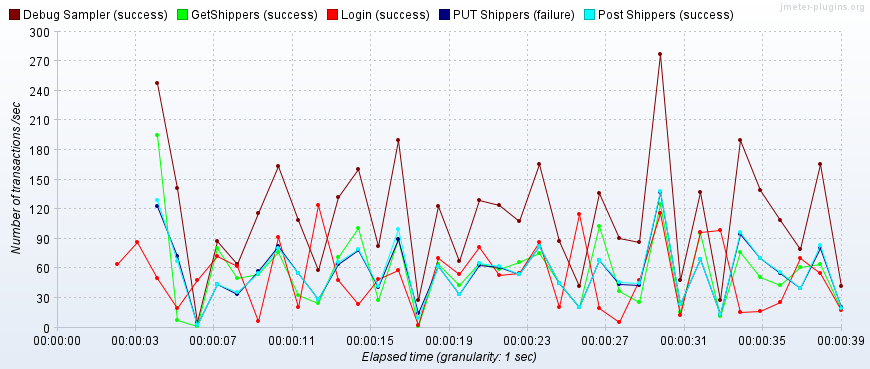

To show the results, we used a Summary Report:

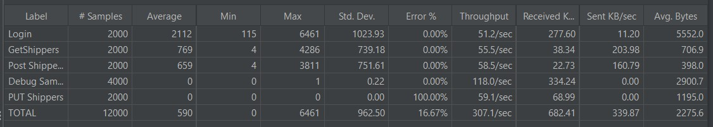

- Login: 2112
- DebugSampler: 0
- GetShippers: 769
- PostShippers: 659
- PutShippers: 0

### 3.4 Stress Tests

To do a stress test for the application, we’ll simulate way more users than the usual accessing the product categories page. The thread properties defined will be:

- **Number of Threads (users):** 800

- **Ramp-up period:** 1

- **Loop Count:** 10

Only 1 thread was defined for each test, so it'll only take 1 second to ramp it up.
To see the results, a View Results Tree Listener and a Summary Report was used.
It was also used a jp@gc - Response Codes per Second and jp@gc - Transactions per Second. These were possible after the download of these plugins.

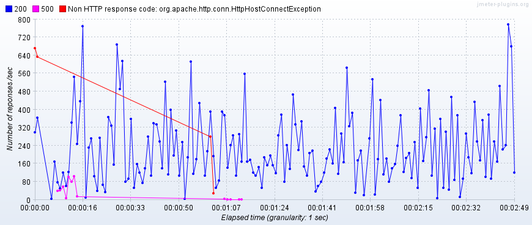

By this image (jp@gc - Response Codes per Second), it is possible to see that in the same second several requests are being handled.
Besides this, we can also see the codes from each request.

When comparing the results with the load tests there is only the difference that in this stress test, the number of transactions increased.

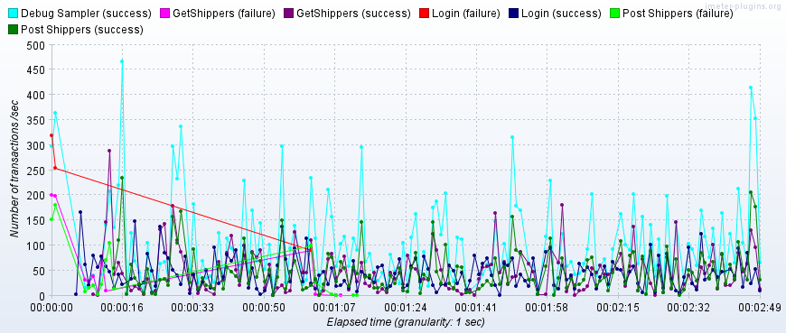

To show the results, we used a Summary Report:

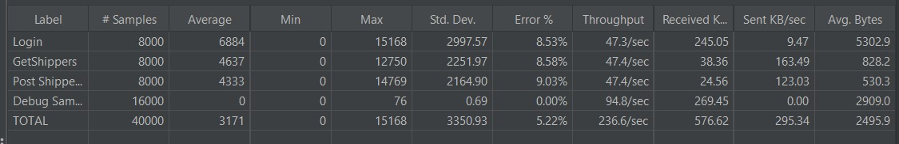

### 3.5 Soak Test

To do a stress test for the application, we’ll simulate way more users than the usual accessing the users page.
The thread properties defined will be:

- **Number of Threads (users):** 800

- **Ramp-up period:** 1

- **Loop Count:** 10

Only 1 thread was defined for each test, so it'll only take 1 second to ramp it up.
To see the results, a View Results Tree Listener and a Summary Report was used.
It was also used a jp@gc - Response Codes per Second and jp@gc - Transactions per Second. These were possible after the download of these plugins.

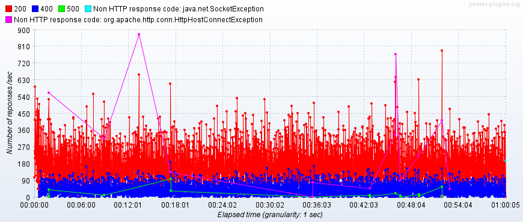

By this image (jp@gc - Response Codes per Second), it is possible to see that in the same second several requests are being handled.
Besides this, we can also see the codes from each request.

When comparing the results with the load tests there is only the difference that in this stress test, the number of transactions increased.

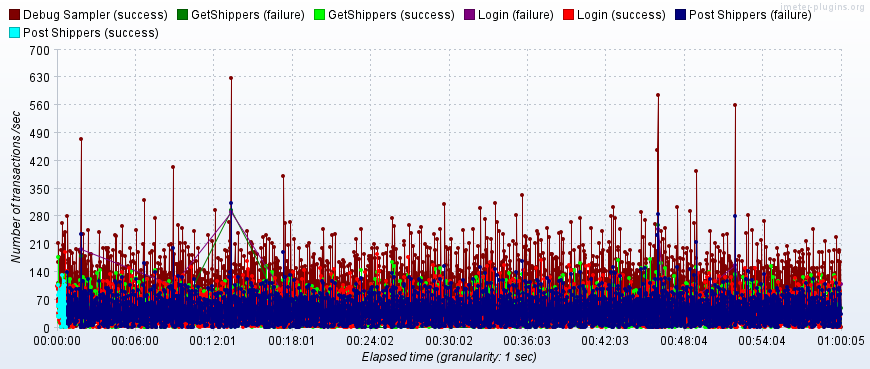

To show the results, we used a Summary Report:

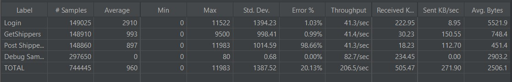

The requests post developed in this soak test use a csv with several users (200). 
This fact can explain why there are so many failures and the error of this request is so high.

## 4. Security

To analyse the vulnerabilities found, their severity level and the amount of work needed to fix them, the group used the plugin SpotBugs from IntelliJ.

IntelliJ SpotBugs plugin provides static byte code analysis to look for bugs in Java code from within IntelliJ IDEA.
SpotBugs is a defect detection tool for Java that uses static analysis to look for more than 400 bug patterns, such as null pointer dereferences, infinite recursive loops, bad uses of the Java libraries and deadlocks.

### 4.1 Malicious code vulnerability

#### 4.1.1 Method returning array may expose internal representation

Returning a reference to a mutable object value stored in one of the object's fields exposes the internal representation of the object.
If instances are accessed by untrusted code, and unchecked changes to the mutable object would compromise security or other important properties, it is necessary to do something different like returning a new copy of the object.

This problem has a medium priority.

| Class        | Method        | Field    |
|--------------|---------------|----------|
| DataPagePojo | getItems()    | items    |
| DataPagePojo             | setItems()                   | items              |

#### 4.1.2 Storing reference to mutable object

Storing a reference to an externally mutable object into the internal representation of the object may expose internal representation.
If instances are accessed by untrusted code, and unchecked changes to the mutable object would compromise security or other important properties, it is necessary to do something different like storing a copy of the object.

This problem has a medium priority.

| Class        | Method        | Field    |
|--------------|---------------|----------|
| DataPagePojo             | DataPagePojo<init>()         | items              |

## 5. Architecture Compliance

Architecture conformance is the degree to which software complies with its defined architecture, standards, and best practices. 
Software architecture is a comprehensive framework that defines the organization, components, interfaces, interactions and other important aspects of a software system.
Architectural compliance can be an important part of the software quality assurance process and is a common practice in large, critical enterprise software development projects.
Architectural compliance is important to ensure that software is developed and maintained in a consistent way, 
avoiding deviations and problems that can compromise its quality, security, performance, and scalability.

Using ArchUnit with JUnit5 some fitness functions were written to check and evaluate the compliance of the project architecture.

### 5.1 Controller

#### 5.1.1 Non-Private Methods
```
  @ArchTest
  public static final ArchRule methodsShouldNotBePrivate =
    methods().that()
      .areDeclaredInClassesThat().areAnnotatedWith(RestController.class)
      .and()
      .areNotAnnotatedWith(ExtendWith.class)
      .should().notBePrivate();
```

The purpose of this test is to check that the methods in classes annotated with "@RestController" are not private (do not have the access modifier "private").

This test failed because the method "getUserDetails" of class "AccessController" and the method "fetchProductListByCode" of class "DataProductListContentsController" violated this rule, as both have the access modifier "private".
This rule was violated 2 times in the code.

#### 5.1.2 Class and package containment
```
  @ArchTest
  public static final ArchRule controllerClassesShouldResideInControllerPackage =
    classes().that()
      .areAnnotatedWith(RestController.class)
      .and()
      .haveSimpleNameNotContaining("Test")
      .should().resideInAPackage("..controllers..");
```

This test is to verify that the classes annotated with "@RestController" are located within the "controllers" package.

This test failed. The error shows that the "SimpleController" class annotated with "@RestController" in the "JwtVerifiterFilterTest.java" file does not reside in the "...controllers..." package, violating the rule set.

#### 5.1.3 Inheritance
```
  @ArchTest
  public static final ArchRule controllersShouldBeController =
    classes().that()
      .areAnnotatedWith(RestController.class)
      .and()
      .haveSimpleNameNotContaining("Test")
      .should().haveSimpleNameEndingWith("Controller");
```
This test is to verify that the classes annotated with "@RestController" have their name ending with the word "Controller".

This test passed without errors.


#### 5.1.4 Annotation
```
  @ArchTest
  public static final ArchRule controllerClassesShouldBeAnnotatedWithController =
    classes().that()
      .resideInAPackage("..controllers..")
      .and()
      .haveSimpleNameNotContaining("Test")
      .should().beAnnotatedWith(RestController.class);
```

This test aims to verify that the classes that reside in the "...controllers..." package have the "@RestController" annotation.

This test failed because the "SimplePrincipal" class needs to be annotated with "@RestController" to fit the architecture defined by the test.

##### Results


### 5.2 Service

#### 5.2.1 Package dependency
```
  @ArchTest
  public static final ArchRule serviceClassesShouldNotAccessControllerClasses =
    noClasses().that().resideInAnyPackage("..services..")
      .should().dependOnClassesThat().resideInAnyPackage( "controllers");
```

This test defines an architectural rule that ensures that service classes do not directly access controller classes. 
This rule helps maintain the separation of responsibilities between the service and control layers in a software architecture.
This test passed without errors.

#### 5.2.2 Class and package containment
```
  @ArchTest
  public static final ArchRule serviceClassesShouldResideInServicePackage =
    classes().that()
      .areAnnotatedWith(Service.class)
      .and()
      .areNotInterfaces()
      .should().resideInAPackage("..services..");
```
This test checks that all classes that are annotated with @Service (which are service implementations) are located in the "...services..." package. 
This helps ensure good code organization by preventing service classes from being spread across different packages, which can make code maintenance difficult.

This test did not pass. The error message indicates that these classes need to be moved to the correct "...services..." package.

Example:
```
Class <org.trebol.mailing.impl.mailgun.MailgunMailingServiceImpl> does not reside in a package '..services..' in (MailgunMailingServiceImpl.java:0)
Class <org.trebol.payment.impl.webpayplus.WebpayplusPaymentServiceImpl> does not reside in a package '..services..' in (WebpayplusPaymentServiceImpl.java:0)
Class <org.trebol.security.UserDetailsServiceImpl> does not reside in a package '..services..' in (UserDetailsServiceImpl.java:0)
```

#### 5.2.3 Inheritance
```
  @ArchTest
  public static final ArchRule servicesShouldBeService =
    classes().that()
      .areAnnotatedWith(Service.class)
      .and()
      .haveSimpleNameNotContaining("Test")
      .should().haveSimpleNameEndingWith("ServiceImpl");
```
This test aims to ensure that all service classes in the project follow a consistent naming convention.
This test passed without errors.


#### 5.2.4 Annotation
```
  @ArchTest
  public static final ArchRule serviceClassesShouldBeAnnotatedWithService =
    classes().that()
      .resideInAPackage("..services..")
      .and()
      .areNotInterfaces()
      .and()
      .haveSimpleNameNotContaining("Test")
      .and()
      .haveSimpleNameEndingWith("ServiceImpl")
      .should().beAnnotatedWith(Service.class);
```
This test checks whether the service classes in a Java project conform to naming conventions and annotations.

This test passed wihout errors.

##### Results


### 5.3 Repository

#### 5.3.1 Package dependency


This fitness function checks that classes from the repository package are not depend on classes from the service or controller package.
The goal is to ensure that the repository layer is separate from the other layers of the system and that coupling between the layers is minimized.

```
  @ArchTest
  public static final ArchRule repositoryClassesShouldNotAccessServicesClasses =
    noClasses().that().resideInAnyPackage("..repositories..")
      .should().dependOnClassesThat().resideInAnyPackage( "..services..", "controllers");
```

This test passed wihout errors.


#### 5.3.2 Class dependency

This fitness function checks that all classes that have a name matching the default ".*Repository" only have dependent classes with the name "Repository".
This is done to ensure that these classes do not have unnecessary or unrelated dependencies that could cause unnecessary coupling or confusion in the code.

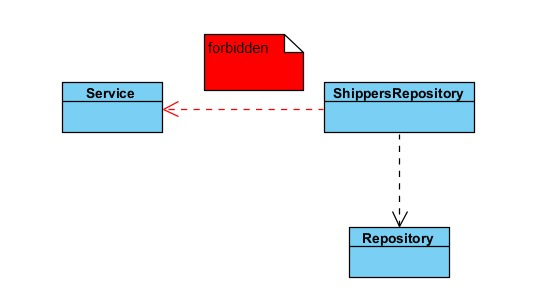

```
  @ArchTest
  public static final ArchRule repositoryMatchingClassSimpleNameRepository =
    classes().that().haveNameMatching(".*Repository")
      .should().onlyHaveDependentClassesThat().haveSimpleName("Repository");
```

This test failed because some classes have dependencies that do not have the required simple Repository name. This may be a design issue.
Example:
```
Constructor <org.trebol.api.services.impl.CompanyServiceImpl.<init>(org.trebol.jpa.repositories.ParamsRepository)> has parameter of type <org.trebol.jpa.repositories.ParamsRepository> in (CompanyServiceImpl.java:0)
```


#### 5.3.3 Class and package containment

The rule defined in this fitness function is that all classes whose names end with "Repository" must be located in the "..repositories" package.

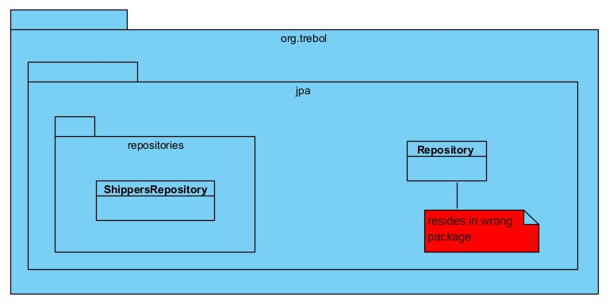

```
  @ArchTest
  public static final ArchRule repositoryEndingNameShouldResideInRepository =
    classes().that().haveSimpleNameEndingWith("Repository")
      .should().resideInAPackage("..repositories");
```

This test has not passed because of a class that isn't in the expected package.
According to the error message, the class is "org.trebol.jpa.Repository", which does not reside in the expected package.


#### 5.3.4 Inheritance

This fitness function checks that all classes that implement the JpaRepository interface have names that end with "Repository".

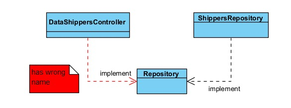

```
  @ArchTest
  public static final ArchRule repositoryClassesShouldImplementJpaRepository =
    classes().that().implement(Repository.class)
      .should().haveSimpleNameEndingWith("Repository");
```


#### 5.3.5 Annotation

This fitness function checks that all classes that are assignable to Repository are annotated with @Repository.

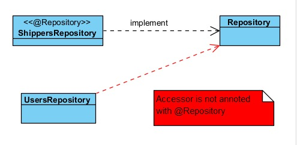

```
  @ArchTest
  public static final ArchRule repositoryClassesShouldBeAnnotatedWithRepository =
    classes().that()
      .areAssignableTo(Repository.class)
      .should().beAnnotatedWith(Repository.class);
```


##### Results


### 5.4 Application

#### 5.4.1 Layer
The purpose of this test is to verify the layered architecture pattern.
The control layer cannot be accessed by any layer,
the service layer can only be accessed by the control layer,
and the repository layer can only be accessed by the service layer.

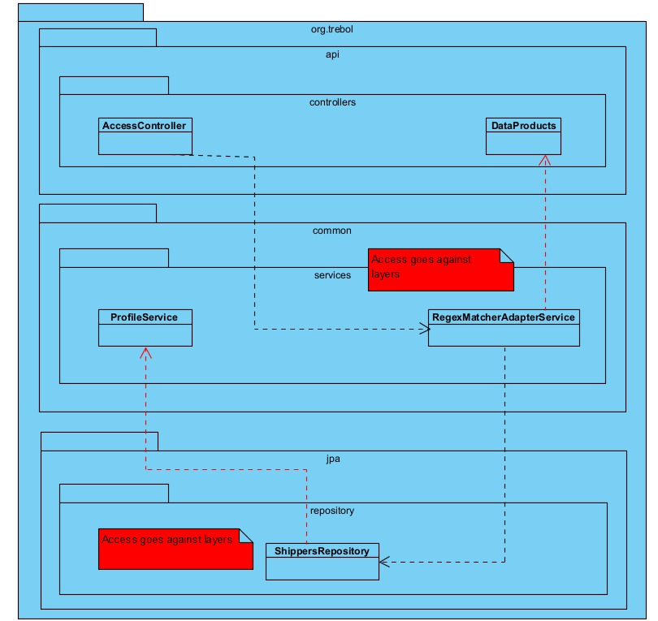

```
  @ArchTest
  public static final ArchRule layeredArchitecture = 
    layeredArchitecture().consideringOnlyDependenciesInLayers()
        .layer("Controller").definedBy("..controllers..")
        .layer("Service").definedBy("..services..")
        .layer("Repository").definedBy("..repositories..")
        .whereLayer("Controller").mayNotBeAccessedByAnyLayer()
        .whereLayer("Service").mayOnlyBeAccessedByLayers("Controller")
        .whereLayer("Repository").mayOnlyBeAccessedByLayers("Service");
```

This test fails due to the use of ProductListItemsRepository and ProductListsRepository by the 
DataProductListContentsController class, which belongs to the control layer.
This violation occurred 32 times in the system.

Example:
```
Field <org.trebol.api.controllers.DataProductListContentsController.listItemsRepository> has type <org.trebol.jpa.repositories.ProductListItemsRepository> in (DataProductListContentsController.java:0)
Field <org.trebol.api.controllers.DataProductListContentsController.listsRepository> has type <org.trebol.jpa.repositories.ProductListsRepository> in (DataProductListContentsController.java:0)
Field <org.trebol.api.controllers.DataProductListContentsControllerTest.listItemsRepositoryMock> has type <org.trebol.jpa.repositories.ProductListItemsRepository> in (DataProductListContentsControllerTest.java:0)
Field <org.trebol.api.controllers.DataProductListContentsControllerTest.listsRepositoryMock> has type <org.trebol.jpa.repositories.ProductListsRepository> in (DataProductListContentsControllerTest.java:0)
```

#### 5.4.2 Cycle

This fitness function checks that there are no cycles in the dependencies between packages that match the pattern ..org.trebol.(*)...
This checks that there are no circular dependencies between different packages.


```
  @ArchTest
  public static final ArchRule noCyclesInPackageDependencies =
    slices()
       .matching("..org.trebol.(*)..").should().beFreeOfCycles();
```


This test failed because there is a specific dependency loop between the slices org.trebol.api and org.trebol.common. This rule was violated 92 times.

Example:
```
Constructor <org.trebol.api.controllers.AccessController.<init>(org.trebol.security.services.AuthorizationHeaderParserService, org.springframework.security.core.userdetails.UserDetailsService, org.trebol.security.services.AuthorizedApiService, org.trebol.common.services.RegexMatcherAdapterService)> has parameter of type <org.trebol.common.services.RegexMatcherAdapterService> in (AccessController.java:0)
Field <org.trebol.api.controllers.AccessController.regexMatcherService> has type <org.trebol.common.services.RegexMatcherAdapterService> in (AccessController.java:0)
```

#### Results

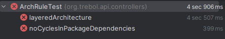

## 6. Test Examination

### Test completeness
To measure metrics related to test examination, it was used the Jacoco library and the following report was generated with respect to the DataShippersController class

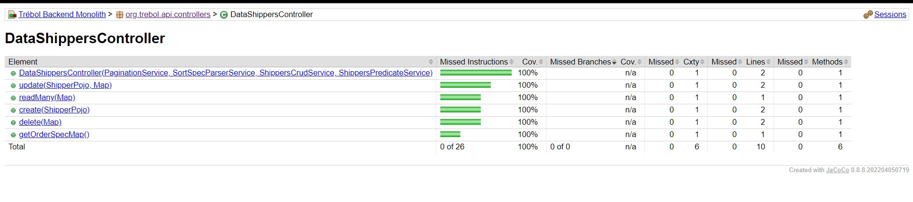

As we can see, the tests developed have a code coverage of 100%, covering 10 lines of code and did not miss any branch.

### Flaky Tests

A flaky test is a type of software test that provides inconsistent results with each execution, causing the test to fail or pass unexpectedly even if the code or test remains unchanged. The unpredictable behavior of flaky tests can pose significant challenges for developers trying to diagnose and fix issues, and can potentially impact the end-user experience.

To infer about the existence of tests in the class DataShippersControllerTest, its run configuration was changed so that it stops when any of its tests fail.

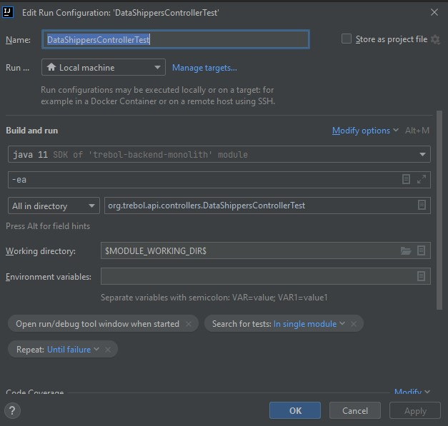

The tests ran for 15 seconds and all of them passed, making a total of 17768 successfully completed tests in this time period.

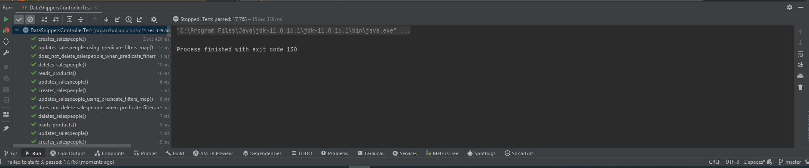

Therefore, we can conclude that this class does not have flaky tests.

## 7. Conclusion

After analysing several metrics in this class, there are some topics that we can list. It has a maintainability level of 48,4884, considered average. Three different types of test were carried out in order to evaluate the performance of that class when it receives HTTP requests. Some problems were identified regarding a request. There weren't identified too much bugs in security analysis (only 3) and examining its tests it was possible to conclude that has a code coverage of 100% and there is any flaky tests.