# README #

# Developed by Marco Querido (1220268)

This folder includes all artifacts developed for the First Part of QESOFT Project. 

It is structured as follows:

1. Introduction
2. Maintability
3. Performance
4. Security
5. Architecture Compliance
6. Test Examination
7. Other issues
8. Conclusions
9. References

## 1. Introduction

The first phase of the QESOFT project analyzes the project in an operational environment to determine whether or not the project is reusable.

The main focus are the quality attributes and architectural characteristics that must be considered throughout the study, such as maintenance, performance, safety vulnerabilities, construction compliance and adequate testing, are key issues

In order to identify and select the best materials, this research will take an objective approach.

The paper also describes the project’s learning environment, including how to choose a Java service-based application with multiple executable REST controllers or DDD sets with multiple endpoints that can allow for distribution of work among team members between in this application.
The software should also be SMART compliant and enable complete data generation.

## 2. Maintability

MetricsTree is an IDE extension that helps to evaluate quantitative properties of java code. It supports the most common sets of metrics at the project, package, class, and method levels.
MetricsTree uses the Maintainability Index metrics set to evaluate the project’s maintainability level.

The Maintainability Index first appeared in 1992 when it was proposed by Paul Oman and Jack Hagemeister at the International Conference on Software Maintenance with the goal of establishing automated software development metrics to guide software related decision making. The Maintainability Index tries to give a holistic view of the relative maintenance burden for different sections of a project by blending together a series of different metrics.
It calculates an index value between 0 and 100 that represents the relative ease of maintaining the code. A high value means better maintainability. Color coded ratings can be used to quickly identify trouble spots in the code. A green rating is between 20 and 100 and indicates that the code has good maintainability. A yellow rating is between 10 and 19 and indicates that the code is moderately maintainable. A red rating is a rating between 0 and 9 and indicates low maintainability.

The metric originally was calculated as follows:

Maintainability Index = 171 - 5.2 * ln(Halstead Volume) - 0.23 * (Cyclomatic Complexity) - 16.2 * ln(Lines of Code)

The use of this formula meant that it ranged from 171 to an unbounded negative number. As code tended toward 0, it was clearly hard to maintain code and the difference between code at 0 and some negative value was not useful. As a result of the decreasing usefulness of the negative numbers and a desire to keep the metric as clear as possible, it was decided to treat all 0 or less indexes as 0 and then rebase the 171 or less range to be from 0 to 100.
Using a more modern adaptation of the original formula proposed in 2011 by Microsoft:
Maintainability Index = MAX(0,(171 - 5.2 * ln(Halstead Volume) - 0.23 * (Cyclomatic Complexity) - 16.2 * ln(Lines of Code))*100 / 171)
where:
- Halstead Volume is a metric for estimating the complexity and size of software systems.
- Cyclomatic Complexity is a measure of the number of independent paths through the software's code.
- Lines of Code is a simple count of the number of lines in the code.

Looking through the project as a whole, the results of a metricsTree analysis gives a Maintainability Index of 71.0886, which indicates a good maintainability.

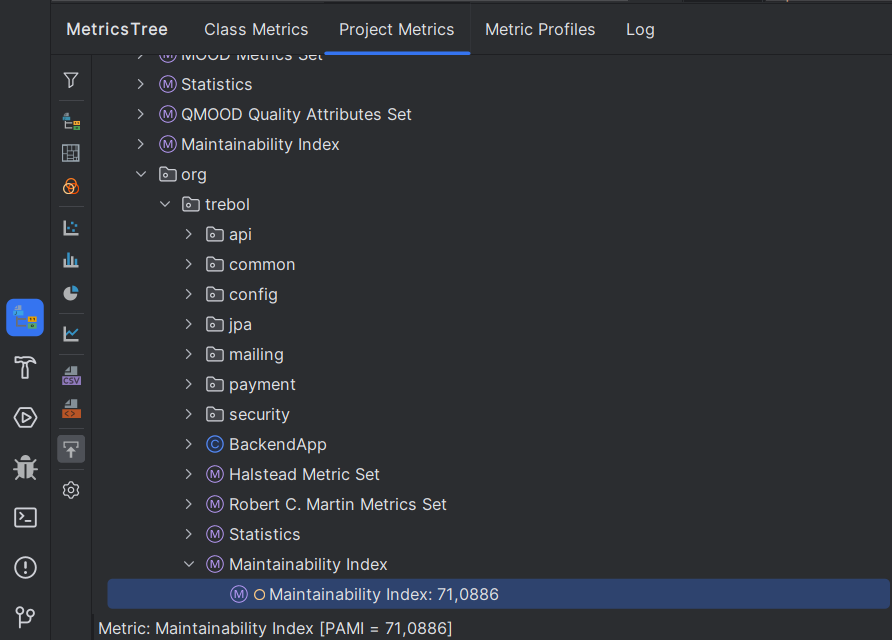

Looking at the dataSalesPeopleController class, the results of a metricsTree analysis gives a Maintainability Index of 48.058, which indicates a good maintainability.

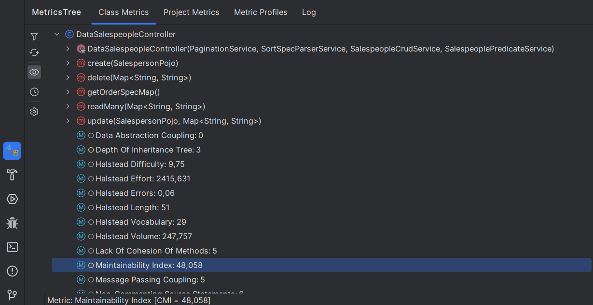

For the methods inside the class:

- create(SalesPersonPojo) has a Maintainability Index of 71,432
- delete(Map<String, String>) has a Maintainability Index of 71,432
- getOrderSpecMap() has a Maintainability Index of 82,6511
- readMany(Map<String, String>) has a Maintainability Index of 73,3612 
- update (SalespersonPojo, Map<String, String) has a Maintainability Index of 70,9324


## 3. Performance

Performance testing is the general name for tests that check how the system behaves and performs. Software performance testing examines responsiveness, stability, scalability, reliability, speed, and resource usage of your software and infrastructure.
Different types of performance testing provides you with different data, as we will further detail.

The 3 most common types of performance tests are:

- **Load Tests**:
This type of test is used to measure how well a system performs under high levels of user traffic or load. It involves simulating a large number of users or transactions to see how the system responds.


- **Stress Tests**:
Stress testing is similar to load testing but goes beyond it by testing the limits of a system's performance. This involves testing beyond normal usage scenarios to see how well the system handles extreme conditions.


- **Soak Tests**:
Endurance testing, also known as soak testing, is used to measure how well a system performs over an extended period of time. It involves testing the system for several hours, days, or even weeks to see how it performs under sustained load.
Soak tests are fundamental to detect memory leaks.


### KPI's

KPIs, or Key Performance Indicators, are metrics that enable measuring our results and success, according to parameters we choose to be relevant and important. Organizations use KPIs to evaluate themselves and their activities.

There are many KPI's that we can use to do tests using jmeter, some of the recommended ones to do load tests for example are:

- **Number of Users**

   To make sure websites can handle heavy loads created by the usage of many people, we simulate concurrent active users through virtual users. These virtual users act like “real” users on the website. By simulating real users, developers, DevOps and QA engineers can discover bottlenecks that could occur during real-time daily use or traffic spikes.


- **Hits Per Second**

   Simulating the number of users can give us a good idea of the load, but it’s not by itself an accurate enough measurement. We also want to know how many requests are generated to the target server from users’ actions. Hits per second is the average number of samples initiated per second. By understanding the correlation between the number of users and hits per second, we can accurately simulate and measure the types and loads of usage of the website, thus validating that the site’s performance abilities are adequate.


- **Errors Per Second**

   After measuring the number of hits per second, JMeter identifies the number of errors per second. A high errors-per-second rate can indicate a bottleneck that needs fixing before going live.


- **Response Time**

   We’ve measured users and their actions, now it’s time to measure how long it takes the system to process a request. This parameter measures the amount of time it takes from the first byte of data to leave the user until the last byte is received by the user. Response time shows how the target site is performing from the user point of view, meaning how long it takes to receive the text and images requested by user actions. A site might be able to handle 10,000 concurrent users viewing its homepage, but if it takes too long to process their request for tickets, their votes or their payment methods, it is not handling the load and customers may decide to leave.


- **Latency**

   The measurement of how long it takes from just before sending the request to just after receiving the first response. Part of the response time KPI, latency helps us to measure and understand the inherent network delay during transmission of data from client to server.


- **Connect Time**

   The measurement of how long it takes the user to connect to the server and the server to respond, including SSL handshake. It is a part of the response time KPI, but it is important for isolating SSL performance as a bottleneck.


- **Bytes/s (Throughput)**

   The measurement of the average bandwidth consumption that is generated by the test per second. This measures the amount of data flowing to and from the servers. Isolating this KPI is important for ensuring your network interface controllers are performing properly.


For the measurement of the project's performance, the team chose Latency as the main KPI.

### JMeter

The Apache JMeter application is an open-source software, a 100% pure Java application designed to load test functional behavior and measure performance. It was originally designed for testing Web Applications but has since expanded to other test functions.

Apache JMeter may be used to test performance both on static and dynamic resources, Web dynamic applications.
It can be used to simulate a heavy load on a server, group of servers, network, or object to test its strength or to analyze overall performance under different load types.


To run Jmeter tests, a test plan was designed with the following configuration:

```bash
.
└── Thread Group/
    ├── Http Request (Login)/
    │   ├── Http Header Manager
    │   └── View Results Tree
    ├── Http Request (GetUsers)/
    │   └── Http Header Manager
    ├── Debug Sampler
    ├── Http Request (GetProductCategories)/
    │   └── Http Header Manager
    ├── View Results in Table
    └── Summary Report
```

### Load Test

To do a load test for the application, we’ll simulate many users accessing the product categories page. The thread properties defined will be

- Number of Threads (users): 200
- Ramp-up period (how long to take to "ramp-up" to the full number of threads chosen, in seconds): 1
- Loop Count: 10

Only 1 thread was defined for each test, so it'll only take 1 second to ramp it up.
To see the results, a View Results in Table Listener and a Summary Report was used.


| Label                | # Samples | Average | Min | Max  | Std.Dev. | Error % | Throughput | Received KB/sec | Sent KB/sec | Avg. Bytes |
|----------------------|-----------|---------|-----|------|----------|---------|------------|-----------------|-------------|------------|
| Login                | 2000      | 1411    | 65  | 6563 | 1051,50  | 0,00%   | 91,5/sec   | 496,30          | 251,55      | 5552,0     |
| GetUsers             | 2000      | 495     | 1   | 3074 | 588,71   | 0,00%   | 94,9/sec   | 61,37           | 490,85      | 662,0      |
| DebugSampler         | 2000      | 0       | 0   | 6    | 0,22     | 0,00%   | 95,2/sec   | 28,47           | 0,00        | 306,3      |
| GetProductCategories | 2000      | 66      | 0   | 1101 | 141,53   | 0,00%   | 95,2/sec   | 46,93           | 493,55      | 505,0      |
| TOTAL                | 2000      | 493     | 0   | 6563 | 827,76   | 0,00%   | 366,1/sec  | 627,92          | 1199,30     | 1756,3     |

Latency average

- Login: 1411
- GetUsers: 495
- DebugSampler: 0
- GetProductCategories: 66

The results of the Load test were exported to a csv file by specifying the csv file path in the filename option (in the Summary Report).


### Stress Tests

To do a stress test for the application, we’ll simulate way more users than the usual accessing the product categories page. The thread properties defined will be:
- Number of Threads (users): 800
- Ramp-up period (seconds): 1
- Loop Count: 10


Only 1 thread was defined for each test, so it'll only take 1 second to ramp it up.
To see the results, a View Results in Table Listener and a Summary Report was used.


| Label                | # Samples | Average | Min | Max  | Std. Dev. | Error % | Throughput | Received KB/sec | Sent KB/sec | Avg. Bytes |
|----------------------|-----------|---------|-----|------|-----------|---------|------------|-----------------|-------------|------------|
| Login                | 8000      | 1404    | 3   | 9361 | 1792,19   | 40,88%  | 158,8846   | 688,5           | 258,15      | 4437,3     |
| GetUsers             | 8000      | 1131    | 1   | 9458 | 1300,9    | 100,00% | 160,4171   | 217,76          | 490,44      | 1390       |
| Debug Sampler        | 8000      | 0       | 0   | 12   | 0,28      | 0,00%   | 160,4557   | 45,34           | 0           | 289,3      |
| GetProductCategories | 8000      | 492     | 0   | 5646 | 480,64    | 40,88%  | 160,4557   | 227,72          | 491,86      | 1453,3     |
| TOTAL                | 32000     | 757     | 0   | 9458 | 1258,7    | 45,44%  | 635,5133   | 1174,52         | 1230,9      | 1892,5     |


Latency average

- Login: 1404
- GetUsers: 1131
- DebugSampler: 0
- GetProductCategories: 492

Note: We see a bigger error % on the Login and GetProductCategories, and GetUsers is 100% error

### Soak Tests
To do a soak test for the application, we’ll simulate 200 users accessing the product categories page, but for an hour. The thread properties defined will be
- Number of Threads (users): 200
- Ramp-up period (seconds): 1
- Loop Count: infinite (for an hour)

Only 1 thread was defined for each test, so it'll only take 1 second to ramp it up.
To see the results, a View Results in Table Listener and a Summary Report was used.


| Label                | # Samples | Average | Min | Max   | Std. Dev. | Error % | Throughput | Received KB/sec | Sent KB/sec | Avg. Bytes |
|----------------------|-----------|---------|-----|-------|-----------|---------|------------|-----------------|-------------|------------|
| Login                | 334325    | 1935    | 68  | 12004 | 1205,78   | 0,06%   | 92,81714   | 503,09          | 254,92      | 5550,3     |
| Debug Sampler        | 334132    | 0       | 0   | 70    | 0,28      | 0,00%   | 92,77661   | 27,97           | 0           | 308,7      |
| GetProductCategories | 334132    | 217     | 0   | 6257  | 330,79    | 0,00%   | 92,772     | 45,76           | 480,97      | 505        |
| TOTAL                | 1002589   | 717     | 0   | 12004 | 1127,52   | 0,02%   | 278,3442   | 576,81          | 735,85      | 2122       |

Latency average

- Login: 1935
- DebugSampler: 0
- GetProductCategories: 217

## 4. Security

To analyze possible vulnerabilities in the project, the group used SpotBugs, which is a program that uses static analysis to look for bugs in Java code. It can help find security related bugs in projects.
Intellij has a Spotbugs plugin integrated that can be installed and executed. After the code analysis is done, SpotBugs shows all bugs categorized by type:

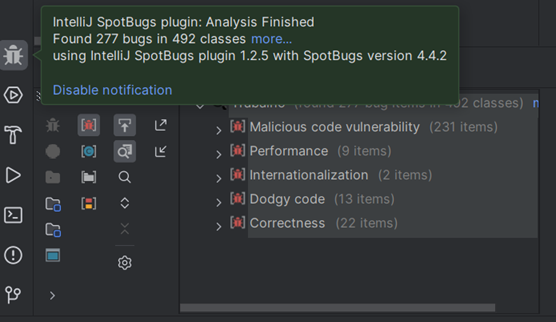

Running spotbugs on the project, reveals 277 bugs in 492 classes

 - Malicious code vulnerability (231 bugs); 
   -  Storing reference to mutable object (150 bugs)
   - Method returning array may expose internal representation (81 bugs)
- Performance (9 bugs);
- Internationalization (2 bugs);
- Dodgy code (13 bugs);
- Correctness (22 bugs).

Focusing on Malicious code vulnerabilities related to the DataSalesPeople controller, and according to the bug description in the spotbugs console and the spotbugs documentation:

**May expose internal representation by incorporating reference to mutable object (EI_EXPOSE_REF2):**

This code stores a reference to an externally mutable object into the internal representation of the object.  If instances are accessed by untrusted code, and unchecked changes to the mutable object would compromise security or other important properties, you will need to do something different. Storing a copy of the object is better approach in many situations.

Following the details in the spotbugs console:

| Class                                  | Method                               | Field                | Priority |
|----------------------------------------|--------------------------------------|----------------------|----------|
| SalesPersonPojo                        | setPerson                            | person               | Medium   |
| SalesPersonPojo                        | SalesPersonPojo<init>                | person               | Medium   |
| SalespersonPojo$SalespersonPojoBuilder | person                               | person               | Medium   |
| SalesProcessServiceImpl                | SalesProcessServiceImpl<init>        | salesRepository      | Medium   |
| RegexMatcherAdapterServiceImpl         | RegexMatcherAdapterServiceImpl<init> | validationProperties | Medium   |
| SalesPerson                            | SalesPerson<init>                    | person               | Medium   |
| SalesPerson                            | setPerson                            | person               | Medium   |
| SalesPerson$SalesPersonBuilder         | person                               | person               | Medium   |
| SalesCrudServiceImpl                   | SalesCrudServiceImpl<init>           | apiProperties        | Medium   |
| SalesCrudServiceImpl                   | SalesCrudServiceImpl<init>           | salesRepository      | Medium   |
| SalesCrudServiceImpl                   | SalesCrudServiceImpl<init>           | productsRepository   | Medium   |

**May expose internal representation by returning reference to mutable object (EI_EXPOSE_REF):**

Returning a reference to a mutable object value stored in one of the object's fields exposes the internal representation of the object.  If instances are accessed by untrusted code, and unchecked changes to the mutable object would compromise security or other important properties, you will need to do something different. Returning a new copy of the object is a better approach in many situations.

Following the details in the spotbugs console:

| Class                 | Method                          | Field                | Priority |
|-----------------------|---------------------------------|----------------------|----------|
| SalesPersonPojo       | getPerson()                     | person               | Medium   |
| SalesPerson           | getPerson()                     | person               | Medium   |
| PeopleTestHelper      | personPojoBeforeCreation        | pojoBeforeCreation   | Medium   |
| PeopleTestHelper      | personPojoForFetch              | pojoForFetch         | Medium   |
| PeopleTestHelper      | personEntityBeforeCreation      | entityBeforeCreation | Medium   |
| PeopleTestHelper      | personPojoAfterCreation         | pojoAfterCreation    | Medium   |
| PeopleTestHelper      | personEntityAfterCreation       | entityAfterCreation  | Medium   |
| SalesTestHelper       | sellPojoAfterCreation           | pojoAfterCreation    | Medium   |
| SalesTestHelper       | sellEntityAfterCreation         | entityAfterCreation  | Medium   |
| SalesTestHelper       | sellEntityBeforeCreation        | entityBeforeCreation | Medium   |
| SalesTestHelper       | sellPojoForFetch                | pojoForFetch         | Medium   |
| SalesPeopleTestHelper | salespersonPojoBeforeCreation   | pojoBeforeCreation   | Medium   |
| SalesPeopleTestHelper | salespersonPojoForFetch         | pojoForFetch         | Medium   |
| SalesPeopleTestHelper | salespersonPojoAfterCreation    | pojoAfterCreation    | Medium   |
| SalesPeopleTestHelper | salespersonEntityBeforeCreation | entityBeforeCreation | Medium   |
| SalesPeopleTestHelper | salespersonEntityAfterCreation  | entityAfterCreation  | Medium   |

## 5. Architecture Compliance

Architecture conformance is the degree to which software complies with its defined architecture, standards, and best practices.
Software architecture is a comprehensive framework that defines the organization, components, interfaces, interactions and other important aspects of a software system.
Architectural compliance can be an important part of the software quality assurance process and is a common practice in large, critical enterprise software development projects.
Architectural compliance is important to ensure that software is developed and maintained in a consistent way,
avoiding deviations and problems that can compromise its quality, security, performance, and scalability.

Using ArchUnit with JUnit5 some fitness functions were written to check and evaluate the compliance of the project architecture. [[7]](#refs)[[8]](#refs)

### 5.1 Controller

#### 5.1.1 Non-Private Methods
```
  @ArchTest
  public static final ArchRule methodsShouldNotBePrivate =
    methods().that()
      .areDeclaredInClassesThat().areAnnotatedWith(RestController.class)
      .and()
      .areNotAnnotatedWith(ExtendWith.class)
      .should().notBePrivate();
```

The purpose of this test is to check that the methods in classes annotated with "@RestController" are not private (do not have the access modifier "private").

This test failed because the method "getUserDetails" of class "AccessController" and the method "fetchProductListByCode" of class "DataProductListContentsController" violated this rule, as both have the access modifier "private".
This rule was violated 2 times in the code.

#### 5.1.2 Class and package containment
```
  @ArchTest
  public static final ArchRule controllerClassesShouldResideInControllerPackage =
    classes().that()
      .areAnnotatedWith(RestController.class)
      .and()
      .haveSimpleNameNotContaining("Test")
      .should().resideInAPackage("..controllers..");
```

This test is to verify that the classes annotated with "@RestController" are located within the "controllers" package.

This test failed. The error shows that the "SimpleController" class annotated with "@RestController" in the "JwtVerifiterFilterTest.java" file does not reside in the "...controllers..." package, violating the rule set.

#### 5.1.3 Inheritance
```
  @ArchTest
  public static final ArchRule controllersShouldBeController =
    classes().that()
      .areAnnotatedWith(RestController.class)
      .and()
      .haveSimpleNameNotContaining("Test")
      .should().haveSimpleNameEndingWith("Controller");
```
This test is to verify that the classes annotated with "@RestController" have their name ending with the word "Controller".

This test passed without errors.


#### 5.1.4 Annotation
```
  @ArchTest
  public static final ArchRule controllerClassesShouldBeAnnotatedWithController =
    classes().that()
      .resideInAPackage("..controllers..")
      .and()
      .haveSimpleNameNotContaining("Test")
      .should().beAnnotatedWith(RestController.class);
```

This test aims to verify that the classes that reside in the "...controllers..." package have the "@RestController" annotation.

This test failed because the "SimplePrincipal" class needs to be annotated with "@RestController" to fit the architecture defined by the test.

##### Results


### 5.2 Service

#### 5.2.1 Package dependency
```
  @ArchTest
  public static final ArchRule serviceClassesShouldNotAccessControllerClasses =
    noClasses().that().resideInAnyPackage("..services..")
      .should().dependOnClassesThat().resideInAnyPackage( "controllers");
```

This test defines an architectural rule that ensures that service classes do not directly access controller classes.
This rule helps maintain the separation of responsibilities between the service and control layers in a software architecture.
This test passed without errors.

#### 5.2.2 Class and package containment
```
  @ArchTest
  public static final ArchRule serviceClassesShouldResideInServicePackage =
    classes().that()
      .areAnnotatedWith(Service.class)
      .and()
      .areNotInterfaces()
      .should().resideInAPackage("..services..");
```
This test checks that all classes that are annotated with @Service (which are service implementations) are located in the "...services..." package.
This helps ensure good code organization by preventing service classes from being spread across different packages, which can make code maintenance difficult.

This test did not pass. The error message indicates that these classes need to be moved to the correct "...services..." package.

Example:
```
Class <org.trebol.mailing.impl.mailgun.MailgunMailingServiceImpl> does not reside in a package '..services..' in (MailgunMailingServiceImpl.java:0)
Class <org.trebol.payment.impl.webpayplus.WebpayplusPaymentServiceImpl> does not reside in a package '..services..' in (WebpayplusPaymentServiceImpl.java:0)
Class <org.trebol.security.UserDetailsServiceImpl> does not reside in a package '..services..' in (UserDetailsServiceImpl.java:0)
```

#### 5.2.3 Inheritance
```
  @ArchTest
  public static final ArchRule servicesShouldBeService =
    classes().that()
      .areAnnotatedWith(Service.class)
      .and()
      .haveSimpleNameNotContaining("Test")
      .should().haveSimpleNameEndingWith("ServiceImpl");
```
This test aims to ensure that all service classes in the project follow a consistent naming convention.
This test passed without errors.


#### 5.2.4 Annotation
```
  @ArchTest
  public static final ArchRule serviceClassesShouldBeAnnotatedWithService =
    classes().that()
      .resideInAPackage("..services..")
      .and()
      .areNotInterfaces()
      .and()
      .haveSimpleNameNotContaining("Test")
      .and()
      .haveSimpleNameEndingWith("ServiceImpl")
      .should().beAnnotatedWith(Service.class);
```
This test checks whether the service classes in a Java project conform to naming conventions and annotations.

This test passed wihout errors.

##### Results
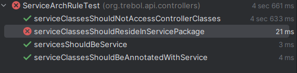

### 5.3 Repository

#### 5.3.1 Package dependency


This fitness function checks that classes from the repository package are not depend on classes from the service or controller package.
The goal is to ensure that the repository layer is separate from the other layers of the system and that coupling between the layers is minimized.

```
  @ArchTest
  public static final ArchRule repositoryClassesShouldNotAccessServicesClasses =
    noClasses().that().resideInAnyPackage("..repositories..")
      .should().dependOnClassesThat().resideInAnyPackage( "..services..", "controllers");
```

This test passed wihout errors.


#### 5.3.2 Class dependency

This fitness function checks that all classes that have a name matching the default ".*Repository" only have dependent classes with the name "Repository".
This is done to ensure that these classes do not have unnecessary or unrelated dependencies that could cause unnecessary coupling or confusion in the code.

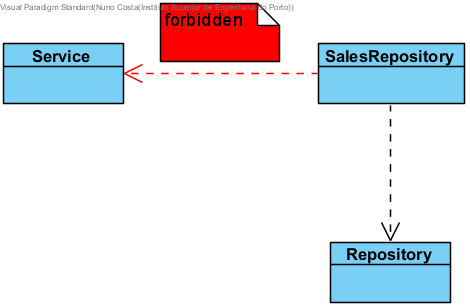

```
  @ArchTest
  public static final ArchRule repositoryMatchingClassSimpleNameRepository =
    classes().that().haveNameMatching(".*Repository")
      .should().onlyHaveDependentClassesThat().haveSimpleName("Repository");
```

This test failed because some classes have dependencies that do not have the required simple Repository name. This may be a design issue.
Example:
```
Constructor <org.trebol.api.services.impl.CompanyServiceImpl.<init>(org.trebol.jpa.repositories.ParamsRepository)> has parameter of type <org.trebol.jpa.repositories.ParamsRepository> in (CompanyServiceImpl.java:0)
```


#### 5.3.3 Class and package containment

The rule defined in this fitness function is that all classes whose names end with "Repository" must be located in the "..repositories" package.

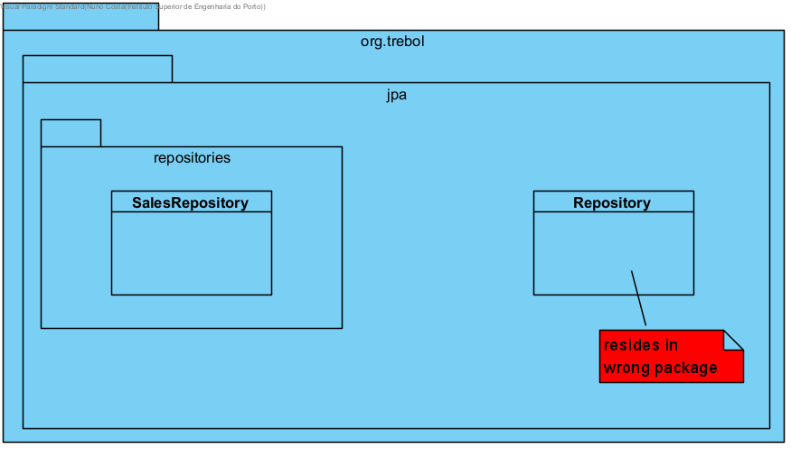

```
  @ArchTest
  public static final ArchRule repositoryEndingNameShouldResideInRepository =
    classes().that().haveSimpleNameEndingWith("Repository")
      .should().resideInAPackage("..repositories");
```

This test has not passed because of a class that isn't in the expected package.
According to the error message, the class is "org.trebol.jpa.Repository", which does not reside in the expected package.


#### 5.3.4 Inheritance

This fitness function checks that all classes that implement the JpaRepository interface have names that end with "Repository".


```
  @ArchTest
  public static final ArchRule repositoryClassesShouldImplementJpaRepository =
    classes().that().implement(Repository.class)
      .should().haveSimpleNameEndingWith("Repository");
```


#### 5.3.5 Annotation

This fitness function checks that all classes that are assignable to Repository are annotated with @Repository.

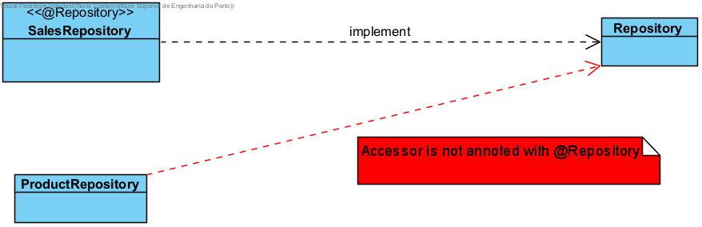

```
  @ArchTest
  public static final ArchRule repositoryClassesShouldBeAnnotatedWithRepository =
    classes().that()
      .areAssignableTo(Repository.class)
      .should().beAnnotatedWith(Repository.class);
```


##### Results


### 5.4 Application

#### 5.4.1 Layer
The purpose of this test is to verify the layered architecture pattern.
The control layer cannot be accessed by any layer,
the service layer can only be accessed by the control layer,
and the repository layer can only be accessed by the service layer.

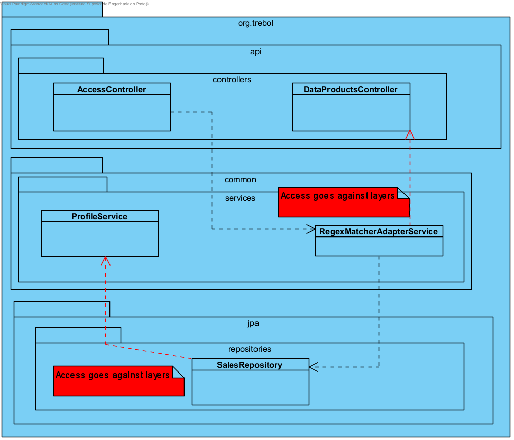

```
  @ArchTest
  public static final ArchRule layeredArchitecture = 
    layeredArchitecture().consideringOnlyDependenciesInLayers()
        .layer("Controller").definedBy("..controllers..")
        .layer("Service").definedBy("..services..")
        .layer("Repository").definedBy("..repositories..")
        .whereLayer("Controller").mayNotBeAccessedByAnyLayer()
        .whereLayer("Service").mayOnlyBeAccessedByLayers("Controller")
        .whereLayer("Repository").mayOnlyBeAccessedByLayers("Service");
```

This test fails due to the use of ProductListItemsRepository and ProductListsRepository by the
DataProductListContentsController class, which belongs to the control layer.
This violation occurred 32 times in the system.

Example:
```
Field <org.trebol.api.controllers.DataProductListContentsController.listItemsRepository> has type <org.trebol.jpa.repositories.ProductListItemsRepository> in (DataProductListContentsController.java:0)
Field <org.trebol.api.controllers.DataProductListContentsController.listsRepository> has type <org.trebol.jpa.repositories.ProductListsRepository> in (DataProductListContentsController.java:0)
Field <org.trebol.api.controllers.DataProductListContentsControllerTest.listItemsRepositoryMock> has type <org.trebol.jpa.repositories.ProductListItemsRepository> in (DataProductListContentsControllerTest.java:0)
Field <org.trebol.api.controllers.DataProductListContentsControllerTest.listsRepositoryMock> has type <org.trebol.jpa.repositories.ProductListsRepository> in (DataProductListContentsControllerTest.java:0)
```

#### 5.4.2 Cycle

This fitness function checks that there are no cycles in the dependencies between packages that match the pattern ..org.trebol.(*)...
This checks that there are no circular dependencies between different packages.


```
  @ArchTest
  public static final ArchRule noCyclesInPackageDependencies =
    slices()
       .matching("..org.trebol.(*)..").should().beFreeOfCycles();
```


This test failed because there is a specific dependency loop between the slices org.trebol.api and org.trebol.common. This rule was violated 92 times.

Example:
```
Constructor <org.trebol.api.controllers.AccessController.<init>(org.trebol.security.services.AuthorizationHeaderParserService, org.springframework.security.core.userdetails.UserDetailsService, org.trebol.security.services.AuthorizedApiService, org.trebol.common.services.RegexMatcherAdapterService)> has parameter of type <org.trebol.common.services.RegexMatcherAdapterService> in (AccessController.java:0)
Field <org.trebol.api.controllers.AccessController.regexMatcherService> has type <org.trebol.common.services.RegexMatcherAdapterService> in (AccessController.java:0)
```

#### Results


## 6. Test Examination

### 6.1 Test completeness

JaCoCo is a free code coverage library for Java, which has been created by the EclEmma team based on the lessons learned from using and integration existing libraries for many years.
The JaCoCo Maven plugin provides the JaCoCo runtime agent to the tests and allows basic report creation.

To measure metrics related to test examination, the Jacoco maven plugin was used, and the following report was generated for the DataSalesPeopleController class:

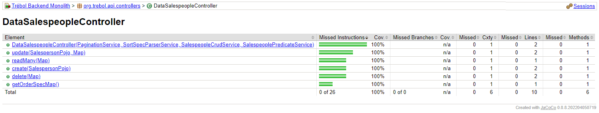

The code converage for the DataSalesPeopleController was 100%, with 0 missed instructions and branches.

### 6.2 Flaky tests

Flaky tests are defined as tests that return both passes and failures despite no changes to the code or the test itself. Several factors can cause unreliable test results, such as inconsistencies in environments, not refreshing test data between test runs, timing and time zone issues, and dependencies on the test execution order.

To spot flaky tests, you need to compare test results from multiple test runs. This analysis would be a time-consuming process to perform manually, but fortunately, many CI servers detect flaky tests automatically.

To check if the DataSalesPeopleControllerTest is a possible flaky test, firstly, a run configuration was created for the test class.

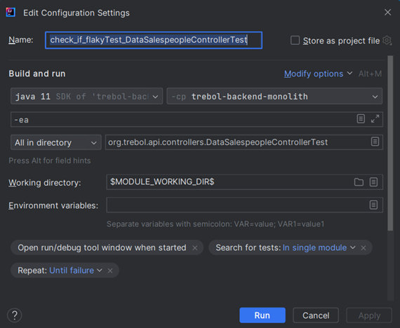

The configuration has a “Repeat: Until failure” option selected that will ensure that the test runs until it fails for a single time, guaranteeing that the test is flaky.

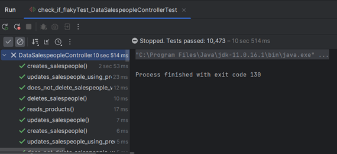

On the image above we can see the results of the run configuration:
- 10,473 out of 10,473 tests passed successfully;
- The configuration ran for 10sec and 514ms

With these results we can positively say that the test class is not a flaky test.

## 7. Other issues

## 8. Conclusions

In summary, it was possible to measure all the quality attributes and architectural characteristics using the different tools chosen.

- Using metricsTree, a Maintainability Index of 48.058 was detected for the dataSalesPeopleController class;


- 3 different types of performance tests were possible to be made for some dataSalesPeopleController methods using JMeter:
  - The Load Test presented a good latency and error % result for a total of 200 users;
  - The Stress Test presented higher values of latency and error % 
  - The Soak Test presented relatively good latency values overall 


- Spotbugs presented all the different errors in the project, as well as the individual classes analyzed;
  - Security bug 'May expose internal representation by incorporating reference to mutable object (EI_EXPOSE_REF2)':
    - 11 bugs related to SalesPersonPojo, SalespersonPojo$SalespersonPojoBuilder, SalesProcessServiceImpl, RegexMatcherAdapterServiceImpl, SalesPerson, SalesPerson$SalesPersonBuilder and SalesCrudServiceImpl.

  - Security bug 'May expose internal representation by returning reference to mutable object (EI_EXPOSE_REF)':
    - 16 bugs related to SalesPersonPojo, SalesPerson, PeopleTestHelper and SalesPeopleTestHelper.


- Archunit tests were able to show specific result on the project’s architecture compliance;
  - Controller
    - 1/4 tests passed
  - Service
    - 3/4 tests passed
  - Repository
    - 2/5 tests passed
  - Application
    - 0/2 tests passed


- The code converage for the DataSalesPeopleController was 100%, with 0 missed instructions and branches.
- The DataSalesPeopleController test class is not a flaky test

## 9. References

1. D. Coleman, D. Ash, B. Lowther, and P. Oman, “Using metrics to evaluate software system maintainability,� Computer, vol. 27, no. 8, pp. 44–49, 1994.
2. https://www.ibm.com/docs/en/rtr/8.0.0?topic=SSSHUF_8.0.0/com.ibm.rational.testrt.studio.doc/topics/csmhalstead.html
3. https://plugins.jetbrains.com/plugin/13959-metricstree
4. https://github.com/b333vv/metricstree
5. https://en.wikipedia.org/wiki/Cyclomatic_complexity
6. https://learn.microsoft.com/en-us/visualstudio/code-quality/code-metrics-values?view=vs-2022
7. https://learn.microsoft.com/en-us/visualstudio/code-quality/code-metrics-maintainability-index-range-and-meaning?view=vs-2022
8. https://jmeter.apache.org/
9. https://jmeter.apache.org/usermanual/index.html
10. https://www.blazemeter.com/blog/performance-testing-vs-load-testing-vs-stress-testing
11. https://dzone.com/articles/load-testing-with-kpis-part-1-what-are-kpis
12. https://spotbugs.github.io/
13. https://spotbugs.readthedocs.io/en/latest/bugDescriptions.html#ei-may-expose-internal-representation-by-returning-reference-to-mutable-object-ei-expose-rep
14. https://www.archunit.org/
15. https://www.opengroup.org/architecture/togaf7-doc/arch/p4/comp/comp.htm
16. https://www.eclemma.org/jacoco/trunk/doc/maven.html
17. https://httpain.com/blog/debugging-flaky-tests-in-intellij-idea/
