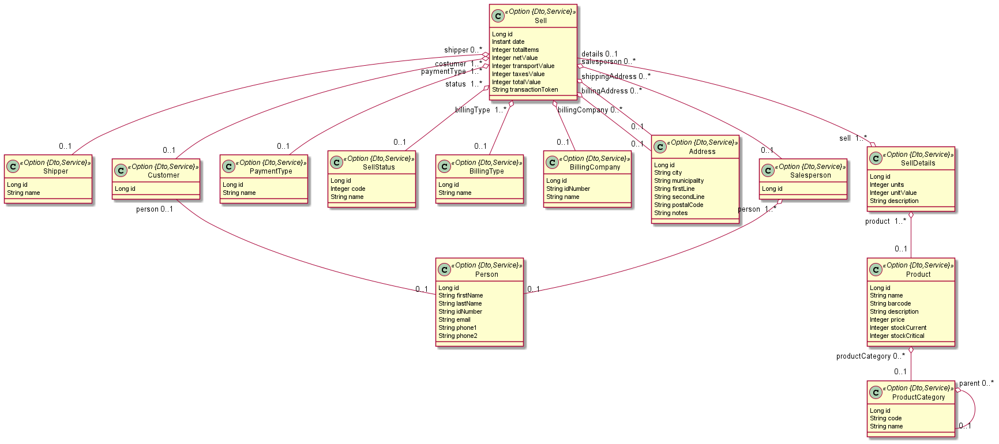
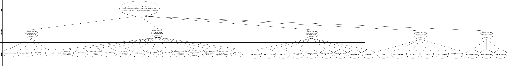

# QESOFT Project (SecondPart) - Global report of group 101 #

## **Group**
-  [**João Campelo (1151386)**](student1/README.md)
-  [**Nuno Costa (1180126)**](student2/README.md)
-  [**Beatriz Vaz (1190429)**](student3/README.md)
-  [**Tiago Pinto (1191098)**](student4/README.md)
-  [**Marco Querido (1220268)**](student5/README.md)

## **1 Introduction**

The goal of the second phase of the QESOFT project is to analyse a JHipster application, generated from the project used in the first phase.

The previous domain model was analyzed and an excerpt of its functionality was transferred to the new application.

The application will be evaluated under some quality atributes, such as: accessibility; compatibility; maintainability; performance; security. For each quality attribute, metrics will be measured based on the GQM present in the overall report.

The division of tasks was done taking into account the endpoints assigned in the previous iteration.

The developed GQM will also be presented and the technologies and conventions used will be described.

The report ends with the conclusion about the measurements made.

## **2 Context**

### **2.1 Functionalities**

Since the group had to use a JHipster application generated from the previous project, it was decided to simply the application domain, always guaranteeing that each element of the group would have an aggregate to analyze.

We analyzed the previous domain and its relationships and came to the conclusion that these would be necessary entities for the creation of the new project, creating the following jdl file.

Therefore, our application has CRUD operations for all entities in the jdl file.

### **2.2 Conventions**

In this second part of the project was asked to create a JHipster application with backend and frontend code.

Technologies used by JHipster have their default configuration and best practices used as much as possible. This means that the application developed uses JPA, Spring and React the “usual way”, without some heavy configuration options and with their usual naming and coding conventions.

Just like in the first part of the project, since the project was written in Java it follows the naming conventions of the Java programming language.

The names of the packages used are in lowercase. (domain, service, repository...)

The names of the classes and interfaces are nouns, in mixed cases with the first letter of each internal word capitalized.

Method names use verbs to describe what the method does, in mixed case with the first letter lowercase and with the first letter of each internal word capitalized.

Variable names are in mixed case and they represent the intent of its use.

Spring data JPA has its own naming conventions for methods. Following these conventions we can build sophisticated queries. These conventions are called also called as method name strategies. These strategies have defined set of keyword to use in method names. Based on the formed method name, method performs predefined operations.

Since it is a Spring boot application, the class that defines the main method has a @SpringBootApplication annotation.
Uses @Service Annotation Class for Business Layer, @RestController and @Repository.

## **3. Work Distribution**

This chapter describes the assignments of each student, as follows:

* João Campelo: **ProductsResource**

    Set of Features:

    | Quality Attribute | Expectations |
    | --- | --- |
    | Maintainability | The application should achieve a classification higher or equal to **Average**. The application should not have code smells with a severity higher than **Minor**|
    | Security | The application should not have vulnerabilities with a severity higher than **Medium**|
    | Accessibility | The application should achieve the AA grade following the WCAG guidelines|
    | Compatibility | The application should be compatible with Google Chrome and Microsoft Edge. The application needs to run on 3 different devices (Windows Computer, iPhone SE, and Samsung Galaxy S20 Ultra). The application needs to run on different Operating Systems, such as Windows, iOS, and Android. |

    - Maintainability:
        - Backend:
            - Tools: MetricsTree, SonarGraph
                - Description: The maintainability value for the ProductsResource and the methods were obtained using the MetricsTree. I utilized Sonargraph to obtain the CCD for the Average Component Dependency (ACD) and then manually calculated the ACD using the formula CCD(N)/N (where N is the number of components). For additional metrics including propagation cost, lines of code, and cyclomatic complexity, see the Sonargraph
            - Maintainability Level: **32,1667**
            - Cumulative Component Dependency: **9**
            - Average Component Dependency: **0.3214**
            - Propagation Cost: **0.0114**
        - Frontend:
            - Tools: Statistic, Sonarlint
                - Description: The Statistic tool was used to obtain the Lines of Code. The Sonarlint was used to obtain the code smells.
    - Security:
        - Tool: OWASP ZAP
            - Description: The SpotBug Plugin was used to find and analise vulnerabilities in the aggregation group
        - Where we analyze two of the OWASP ZAP Top 10 vulnerabilities. In this case, I choose the A01:2021-Broken Access Control and A03:2021-Injection.
    - Performance:
        - Tools: JMeter, Lighthouse 
            - Description: In this part, I used the JMeter to perform Backend Performance Tests and the Lighthouse tool to analyze the Frontend performance.
        - Types of JMeter Tests: Load Tests, Stress Tests, and Soak Tests
    - Accessibility:
        - Tools: Lighthouse 
            - Description: In this part, I used the Lighthouse tool to analyze the Frontend accessibility and it is compliant with the WCAG 2.1 guidelines.
    - Compatibility:
	- Tools: Google Chrome DevTools
        In this part, I used different browsers such as Google Chrome and Microsoft Edge to validate if the Trebol application is compatible with those browsers. Also, check the compatibility in different platforms like computers and smartphones. Finally, I tested the device compatibility by testing the application on different devices that uses Windows, iOS, and Android.

* Nuno Costa: **SellResource**
    - Maintainability: I used MetricsTree to get the Maintainability value for the SellResource and the methods. For the Average Component Dependency (ACD), I used Sonargraph to get the CCD and then calculated the ACD manually using the formula CCD(N)/N (N is the number of components). I used Sonargraph for the other metrics such as propagation cost, lines of code and cyclomatic complexity.
  
    - Performance: 
      - BackEnd: Three types of tests were performed: Load, Stress and Soak. For this, JMeter was used, with Custom Thread Groups.
      - FrontEnd: I used the Lighthouse by Google to get the diagnoses and the possible improvements.
  
    - Security: I used the OWASP ZAP to analyze two of the OWASP ZAP Top 10 vulnerabilities. In this case, I choose the A05:2021-Security Misconfiguration and A09:2021-Security Logging and Monitoring Failures.
  
    - Accessibility: I used the Lighthouse by Google to get the diagnoses and the possible improvements. It is compliant with the WCAG 2.1 guidelines.
  
    - Compatibility: Google Chrome DevTools was used to test different browsers such as Google Chrome, Microsoft Edge and Mozilla Firefox, to check the compatibility of the Trebol application with these browsers. Furthermore, compatibility on different platforms, such as computers and smartphones, was checked. Finally, compatibility tests were performed on different devices using Windows, iOS and Android.

* Tiago Pinto: **ShippersResource**
    - Maintainability: Calculation of Coupling and Structural Erosion (CSE) and Size and Complexity (SC) using Sonargraph; Detail two frontend coding issues (Performance Optimization and Accessibility Compliance)
  
    - Performance: Measure metrics regarding performance focused on user experience using Lighthouse; Measure metrics regarding backend performance using JMeter.
  
    - Security: The OWASP ZAP vulnerabilities to be analyzed are: A02:2021 – Cryptographic Failures and A08:2021 – Software and Data Integrity Failures.
  
    - Accessibility: Use Lighthouse tool to infer about accessibility metrics.
  
    - Compatibility: Use of different browsers to check for compatibility problems

* Beatriz Vaz: **ProductCategoryResource**
    - Maintainability: The tools Sonargraph and MetricsTree were used to obtain th Calculation of Coupling and Structural Erosion (CSE) and Size and Complexity (SC) and were described two frontend coding issues (Code Complexity and Unused Code)
    - Performance: It was used Lighthouse to measure performance focused on user experience and to measure backend performance was used JMeter
    - Security: The OWASP ZAP vulnerabilities to be analyzed are: Insecure Design and A10:2021 – Server-Side Request Forgery (SSRF)
    - Accessibility: It was used Lighthouse to measure the metrics
    - Compatibility: It was used Google Chrome DevTools

* Marco Querido: **DataSalespeopleController**
    - Maintainability: Sonargraph and MetricsTree were used to measure Maintainability Index, Propagation Cost, Cyclomatic Complexity and Size Metric. Two frontend coding issues were analyzed: Error Handling and Logging and Code Documentation;
    - Performance: The Chrome extention Lighthouse was used to measure frontend performance. Apache JMeter was used to perform Load, Stress and Soak tests and evaluate backend performance;
    - Security: OwaspZap was used to scan the project for errors and vulnerabilities. - The Owasp Top 10 A06:2021-Vulnerable and Outdated Components and A07:2021-Identification and Authentication Failures were analyzed;
    - Accessibility: The Chrome extention Lighthouse was used again, but for the purpose of assessing the level of accessibility of the project;
    - Compatibility: The Google Chrome DevTools and VMWare were used to check the project compatibility levels. 

## **4.Goal Question Metric (GQM)**

## **5. Technologies**

This project was generated using JHipster, that is a development platform to quickly generate, develop, and deploy modern web applications and microservice architectures. The [.jdl file](../files/trebol.jdl) file used is present in the repository, a diagram with the relationships between entities is also created as the file is developed:

To measure the different metrics in the chosen project, the group discussed and chose the following tools:

- Maintainability: Sonargraph e MetricsTree;
- Performance: JMeter e Ligthouse;
- Security: Owasp Zap;
- Accessibility: Lighthouse;
- Compatibility: .

## **6. Conventions**

The group used the following conventions for the commits messages:

- Usage of the issue reference regarding the commit
- Reference of the task developed in the commit
- In the individual part, each commit must reference the issue followed by the key concern analyzed and some comment to what was done in the files committed.

The group created an issue for each topic of the global report.

The group created for each student an issue for each topic of the individual report.
These issues were:

- P2 - Definition of the accessibility topic of the individual report - s*
- P2 - Definition of the compatibility topic of the individual report - s*
- P2 - Definition of the maintainability topic of the individual report - s*
- P2 - Definition of the performance topic of the individual report - s*
- P2 - Definition of the security topic of the individual report - s*

**Note:** s* must be replaced by the number defined to each student in the documentation.

## **7. Conclusion**

In conclusion, in this work were analysed several metrics regarding quality in software engineering in five different Controllers class.

In terms maintainability the **ProductsResource** is classified as bellow average. In other hand, in terms of performance, it ran successfuly and more intensive load tests to have a full picture of this controller behavior. Regarding the security of this component, there are some vulnerabilities with Medium or High severity on this controller, we found a few vulnerabilities on its dependencies. In terms of Accessibility, the application was graded with AA that is a good result. Finally, the application show that is compatibility in different browser, OS and devices.

Based on the findings, the Trebol project has a good overall maintainability score, but the **SellResource** class needs improvement. The application meets accessibility standards with an AA rating according to WCAG 2.1 guidelines and is compatible with different browsers, devices and platforms. The decision to start a new project or improve the existing one will depend on the extent of the improvements needed and the complexity of the current application. Starting from scratch may offer the opportunity to avoid known problems and adopt best practice and the latest technologies.

Several quality attributes relating to the pages related to shippers (**ShipperResource**) were measured for this report.
Except for the shipper listing page, it was confirmed that the website offers good levels of accessibility.
No issues with compatibility were discovered, and the program passed each test that was run on it.
In terms of maintainability, MetricsTree's measurement is lower than the results from the previous application. The outcomes from this application, however, are better in terms of size and complexity.
According to the assessment produced by Lighthouse, when it comes to performance centered on user experience, its value is not exceptional but not terrible either, and there is potential for improvement.
Due to tool limitations, it was unable to draw any conclusions about the security topic, but the difficulties that needed to be investigated and their remedies were provided.

The class **ProductCategoryResource** has a low maintainability level, in terms of accessibility, the page that lists all the product categories has a grade A which does not achieve broad accessibility for many situations and no issues were found when testing the compatibility on different browsers, devices and platforms. According to the performance based on the user it is noticeable that needs some improvement. In terms of security it was not possible to obtain results about this endpoint.
