# README #

# Developed by João Campelo (1151386)

This folder includes all artifacts developed for the Second Part of QESOFT Project. 

It is structured as follows:

1. [Introduction](#1)
2. [Maintainability](#2)
3. [Security](#3)
4. [Performance](#4)
5. [Accessibility](#5)
6. [Compatibility](#6)
7. [Conclusions](#7)
8. [References](#8)

##  1. Introduction

The first phase of the QESOFT project analyzes the project in an operational environment to determine whether or not the project is reusable.

The main focus is the quality attributes that must be considered throughout the study, such as maintenability, performance, security, accessability, and compatibility, which are key issues.

In order to identify and select the best materials, this research will take an objective approach.

The paper also describes the project’s learning environment, including how to choose a Java service-based application with multiple executable REST controllers or DDD sets with multiple endpoints that can allow for the distribution of work among team members in this application.
The software should also be SMART compliant and enable complete data generation.

This report will focus only on the **ProductResource** and its dependencies.

##  2. Maintainability

### Tools

#### **Sonargraph**

Sonargraph is a powerful software analysis tool that aids in the development and maintenance of large-scale software systems. It provides comprehensive insights into the architecture, design, and quality of a codebase, enabling developers to detect and resolve potential issues early on. Sonargraph analyzes the structure of the software system, including its modules, components, and dependencies, and generates visual representations such as graphs and diagrams. This allows developers to gain a holistic understanding of the codebase's architecture and identify areas that may require refactoring or optimization. With its advanced static analysis capabilities, Sonargraph helps teams maintain code quality, enforce architectural rules, and improve overall software maintainability.

One compelling reason to use Sonargraph is its ability to mitigate technical debt. As software systems grow and evolve, they often accumulate complexity, duplication, and dependencies that hinder maintainability. Sonargraph's comprehensive analysis enables developers to identify code smells, such as cyclic dependencies, excessive coupling, and high component complexity. By addressing these issues early on, teams can proactively manage technical debt, reduce the risk of software decay, and ensure that the codebase remains clean, modular, and extensible. Ultimately, Sonargraph empowers development teams to make informed decisions, improve code quality, and streamline the software development process.

#### **MetricTree**

Metricstree is an invaluable software tool that provides developers with comprehensive metrics and insights about their codebase directly within the JetBrains IntelliJ IDEA IDE. With Metricstree, developers can effortlessly analyze and monitor key software metrics, such as cyclomatic complexity, code duplication, and code coverage. The tool presents these metrics in a clear and intuitive tree-like structure, allowing developers to easily navigate through their codebase and identify areas that may require attention. By visualizing these metrics, Metricstree helps developers gain a deeper understanding of their code quality and make data-driven decisions to improve software maintainability and performance.

One compelling reason to use Metricstree is its seamless integration with IntelliJ IDEA. By providing real-time metrics directly within the IDE, developers can access important insights without the need to switch between different tools or environments. This tight integration streamlines the development workflow and enhances developer productivity. Furthermore, Metricstree's intuitive tree-like structure makes it easy to explore the codebase and quickly pinpoint areas that may need refactoring or optimization. By leveraging Metricstree's powerful analysis capabilities, developers can continuously monitor and improve the quality of their code, leading to more reliable, efficient, and maintainable software.

### Backend

Software maintainability refers to the ability of a software system to undergo modifications or updates with ease, accuracy, and minimum risks. It is one of the key attributes of software quality that ensures the longevity and sustainability of a software application [[1]](#ref-1)
[[2]](#ref-2)
[[3]](#ref-3).

Maintainability is crucial in the software development lifecycle, as software systems inevitably evolve due to changing requirements, new technologies, or the need to fix bugs and issues. Poorly maintained software can quickly become unmanageable and difficult to update, leading to increased costs, longer development cycles, and even business disruptions [[4]](#ref-4).

The Maintainability Index first appeared in 1992 when it was proposed by Paul Oman and Jack Hagemeister at the International Conference on Software Maintenance to establish automated software development metrics to guide software-related decision-making.
The Maintainability Index tries to give a holistic view of the relative maintenance burden for different sections of a project by blending a series of different metrics [[5]](#ref-5)
[[6]](#ref-6).

Using a more modern adaptation of the original formula proposed in 2011 by Microsoft:

`Maintainability Index = MAX(0,(171 - 5.2 * ln(Halstead Volume) - 0.23 * (Cyclomatic Complexity) - 16.2 * ln(Lines of Code))*100 / 171)`

On the formula above, the Maintainability Index formula uses three other metrics values.

* Halstead Volume is a measure of the program's size and is calculated by counting the number of unique operators and operands used in the code.
* Cyclomatic Complexity is a measure of the program's structural complexity and is calculated by counting the number of decision points (e.g., if statements, loops, switches) in the code.
* Lines of Code is the number of lines of code in the software system.

The MI formula is designed to provide a score between 0 and 100, where higher scores indicate better maintainability. A score above 85 is considered to be excellent, while scores below 20 are considered to be very poor.
As a general rule of thumb:

| Score    | Classification    |
| -------- | ----------------- |
| 0 - 20   | Very Poor         |
| 20 - 40  | Bellow Average    |
| 40 - 70  | Average           |
| 70 - 100 | Good to Excellent |

In this part was used MetricsTree [[7]](#ref-7) - IntelliJ IDEA Plugin - helps to evaluate the project maintainability index for which class or methods.

The **ProductResource** class has a Maintainability Index of **32,1667** this is classified as ***Bellow Average***.

After analyzing the Maintainability Index of the class, it proceeds to analyze the class methods to understand which methods can be improved:

| **Method**                                         | **Maintainability Index** | **Classification**    |
| -------------------------------------------------- | ------------------------- | --------------------- |
| ProductResource(ProductService, ProductRepository) | 78.0773                   | **Good to Excellent** |
| createProduct(ProductDTO)                          | 56,2376                   | **Average**           |
| deleteProduct(Long)                                | 61,1356                   | **Average**           |
| getAllProducts()                                   | 68,5218                   | **Average**           |
| getProduct(Long)                                   | 65,166                    | **Average**           |
| partialUpdateProduct(Long, ProductDTO)             | 49,6553                   | **Average**           |
| updateProduct(Long, ProductDTO)                    | 49.9261                   | **Average**           |

### 2.1 Propagation Cost

The Propagation Cost (PC) metric is a measure of the cost and effort required to make a change in a single component of a system or to propagate this change through the system. This implies the time and resources required to identify the components that need to be updated, make the necessary changes, and test the system to ensure that the changes did not introduce any new issues.

#### 2.1.1. *ProductResource* Aggregate

Total Components = 28

#### Cumulative Component Dependency (CCD)

CCD = Total Dependencies = 9

#### Average Component Dependency (ACD)

ACD = CCD / Total Components = 9 / 28 = 0.3214

#### Propagation Cost (PC)

PC = ACD / Total Components = 0.3214 / 28 = 0.0114

#### 2.1.2 Project

For more information, check [Sonargraph Report](Reports/QESOFT_PROJECT_P2_2023-05-29_12-00-16_501.html)

### Conclusion
Considering that the number of components in the system is less than 500, the system is considered a small system. So it can be concluded that obtaining propagation cost values are of no concern given the size of the system.
However, I can observe that any change in the ProductResource will not have a big impact on the system, but any change in the system may have an impact on the ProductResource.

### 2.2 Cyclomatic complexity

In 1976, Thomas J. McCabe presents a metric for measuring the complexity of a software program, which he calls "cyclomatic complexity."[[8]](#ref-8). This metric is based on the number of control flow statements in the program, such as loops and conditionals, and provides a quantitative measure of the program's complexity.

For this metric, it was analyzed the metric Average Complexity that is described as the weighted average modified extended cyclomatic complexity for fully analyzing code.

Average Complexity: 2,95

I may conclude that the class **ProductResource** is simple to comprehend and doesn't pose a significant danger when modified because the value calculated is relatively low.

### 2.4 Size metric

Lines of Code (LoC) per file counts every line that contains actual code and skips empty lines and comment lines.

Total Lines metric counts every single line, including empty lines and comment lines.

Number of Statements verifies the statements, i.e., s a single complete action performed in the source code, usually terminated by a special character or a newline.

In the class **ProductResource** it was possible to determine the following values:

Lines of Code: 107
Total Lines: 174
Number of Statements: 40

These values can indicate how much the component is doing and how complex it is. So, I can say that this component is not complex.

### Frontend

#### Tool

* *Statistic*: Statistic Tool is a powerful plugin designed for the JetBrains IDEs that enables developers to gather valuable insights into their coding patterns and habits. This tool provides detailed statistics and analytics, offering a comprehensive overview of the programming workflow. With its user-friendly interface and robust features, Statistic Tool helps developers analyze various aspects of their coding practices, such as code lines, code complexity, file types, and much more. By leveraging this tool, developers can gain a deeper understanding of their programming habits, identify areas for improvement, and optimize their overall coding efficiency.
One compelling reason to use Statistic Tool is its ability to foster self-improvement and enhance productivity. By offering comprehensive metrics and analytics, this tool enables developers to identify patterns in their coding practices, which can be immensely helpful in identifying areas for growth. Whether it's reducing code complexity, optimizing code reuse, or identifying coding shortcuts, Statistic Tool empowers developers to make informed decisions and implement strategies for improvement. Moreover, by visualizing data in a clear and concise manner, this tool facilitates better time management, allowing developers to prioritize tasks and allocate resources efficiently. Ultimately, by harnessing the power of Statistic Tool, developers can elevate their coding skills, streamline their workflows, and deliver high-quality code in a more efficient and effective manner.[[9]](#ref-9)

#### Lines Of code

* *index.tsx*: 23
* *product.reducer.ts*: 123
* *product.tsx*: 137
* *product-delete-dialog.tsx*: 68
* *product-detail.tsx*: 94
* *product-reducer.spec.ts*: 293
* *product-update.tsx*:	199

#### Code Smells

* *index.tsx*: No code smells found
* *product.reducer.ts*:

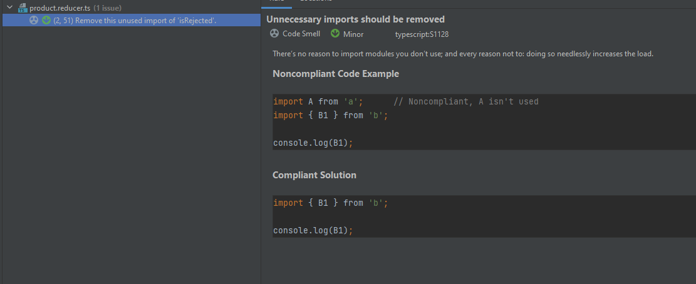

* *product.tsx*:

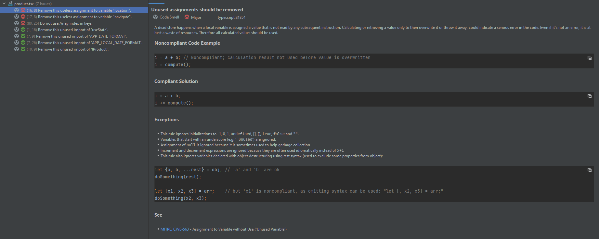
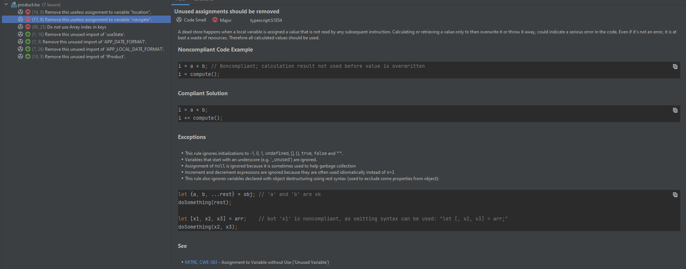
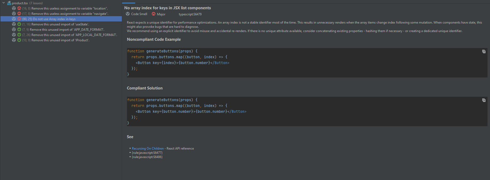

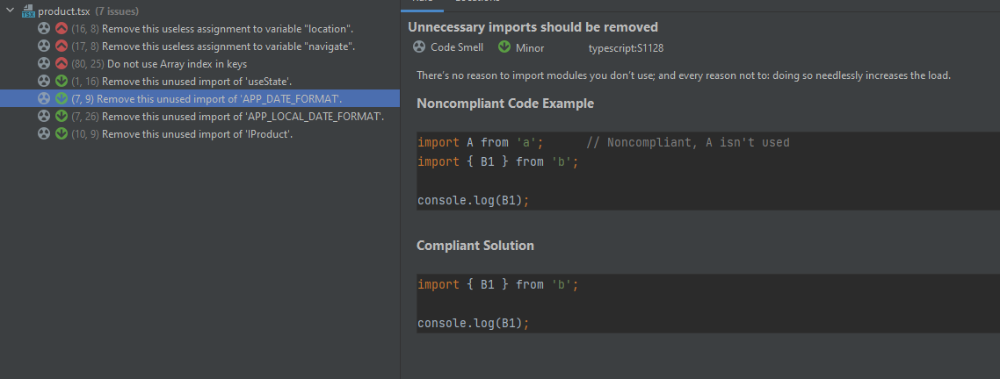
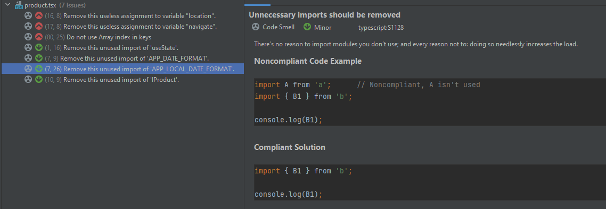
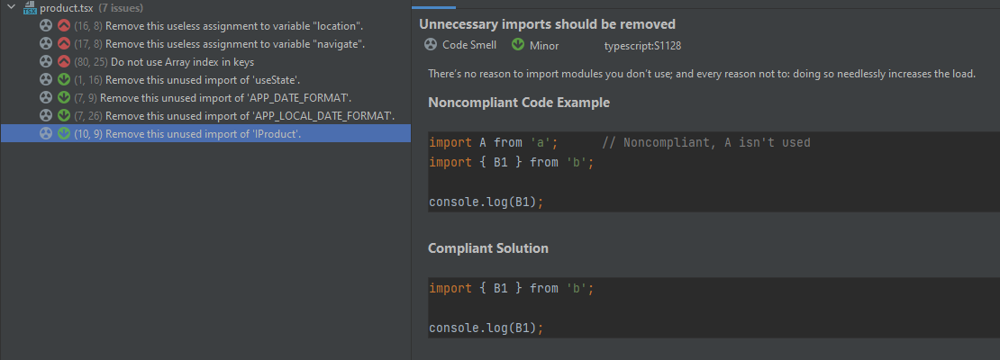

* *product-delete-dialog.tsx*:

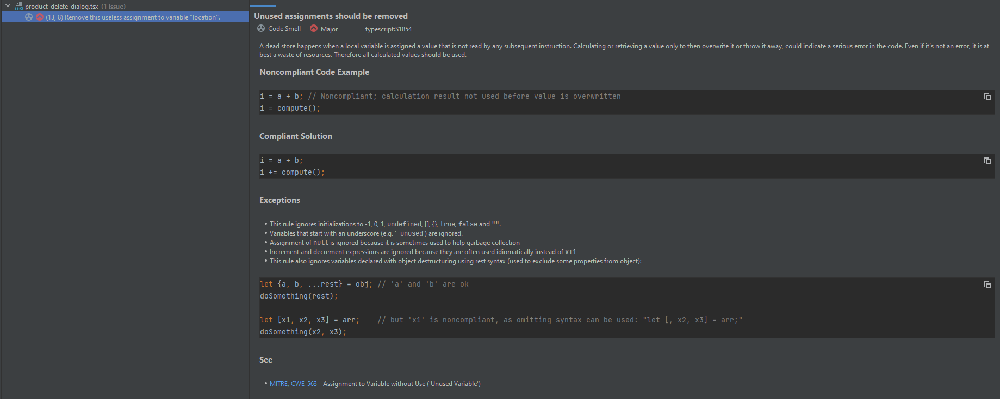

* *product-detail.tsx*:

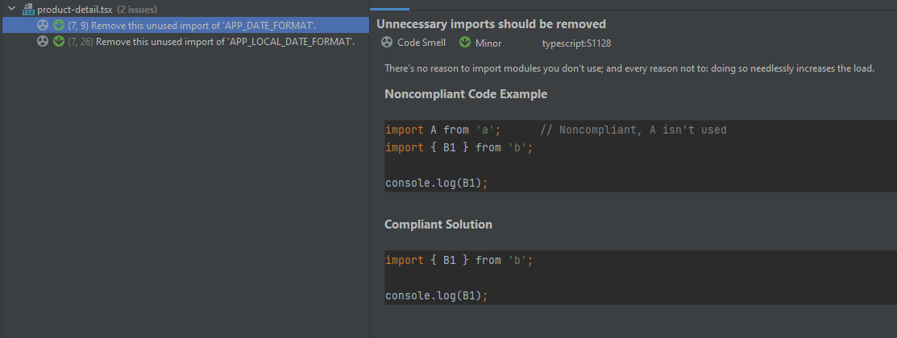
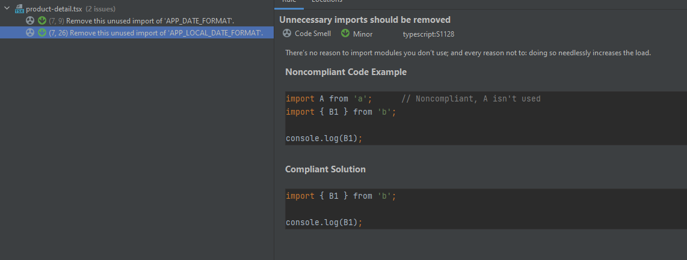

* *product-reducer.spec.ts*: No code smells found
* *product-update.tsx*:

| Code Smell Type                                | Severity | Description                                                                                                                                                                                                                                                                                                                                             | Compliant Solution                                                                                                                                                                                                                               | Occurrencies                                                             |
| ---------------------------------------------- | -------- | ------------------------------------------------------------------------------------------------------------------------------------------------------------------------------------------------------------------------------------------------------------------------------------------------------------------------------------------------------- | ------------------------------------------------------------------------------------------------------------------------------------------------------------------------------------------------------------------------------------------------ | ------------------------------------------------------------------------ |
| No array index for keys in JSX list components | Major    | React expects a unique identifier for performance optimizations. An array index is not a stable identifier most of the time. This results in unnecessary renders when the array items change index following some mutation. When components have state, this might also provoke bugs that are hard to diagnose.                                         | Recommend using an explicit identifier to avoid misuse and accidental re-renders. If there is no unique attribute available, consider concatenating existing properties - hashing them if necessary - or creating a dedicated unique identifier. | product.tsx;                                                             |
| Unnecessary imports should be removed          | Minor    | There’s no reason to import modules you don’t use; and every reason not to: doing so needlessly increases the load.                                                                                                                                                                                                                                     | Remove the unused import.                                                                                                                                                                                                                        | product.reducer.ts; product.tsx; product-detail.tsx; product-update.tsx; |
| Unused assignments should be removed           | Major    | A dead store happens when a local variable is assigned a value that is not read by any subsequent instruction. Calculating or retrieving a value only to then overwrite it or throw it away, could indicate a serious error in the code. Even if it’s not an error, it is at best a waste of resources. Therefore all calculated values should be used. | Remove this useless assignment to variable.                                                                                                                                                                                                      | product.tsx; product-delete-dialog.tsx;                                  |

##  3. Security

### OWASP ZAP Top 10

### A01:2021-Broken Access Control

The A01:2021-Broken Access Control highlights the significant vulnerabilities associated with access control mechanisms in web applications.

Access control is a fundamental security principle that ensures users can only access resources or perform actions they are authorized to. It governs who can access certain features, functionalities, or data within an application. However, when access control mechanisms are implemented incorrectly or are flawed, they can lead to broken access control vulnerabilities.

Broken Access Control vulnerabilities typically arise from inadequate or ineffective enforcement of user permissions and privileges. These vulnerabilities allow attackers to bypass intended access restrictions and gain unauthorized access to sensitive information, perform unauthorized actions, or escalate their privileges within the application.

There are several common types of broken access control vulnerabilities:

Insecure Direct Object References (IDOR): This occurs when an application exposes direct references to internal implementation objects, such as database keys or filenames, without proper authorization checks. Attackers can manipulate these references to access unauthorized resources.

Horizontal Privilege Escalation: This vulnerability arises when an attacker can gain access to resources or actions that should be restricted to other users at the same privilege level. For example, a regular user accessing administrative functions or data.

Vertical Privilege Escalation: This vulnerability occurs when an attacker can elevate their privileges and gain access to resources or perform actions intended for users with higher privilege levels. For instance, a regular user gaining administrative access.

Insecure or Missing Access Control Checks: This refers to situations where access control checks are absent or insufficiently enforced. Attackers can bypass these checks to access restricted functionalities or data.

Forceful Browsing: This vulnerability allows attackers to access unauthorized resources or perform actions by manually modifying the URL or other parameters used for navigation within the application.

### A03:2021-Injection

The A03:2021-Injection attacks can target various types of interpreters, including SQL databases, NoSQL databases, operating systems, LDAP queries, and command-line interfaces. The most well-known type of injection vulnerability is SQL injection, where malicious SQL code is injected into a database query to manipulate its behavior.

The impact of injection attacks can be severe, ranging from unauthorized access to sensitive data to complete system compromise. Attackers can exploit injection vulnerabilities to extract, modify, or delete data, execute arbitrary commands, gain administrative privileges, or even take control of an entire system.

To prevent injection attacks, developers should adopt secure coding practices. Here are some key mitigation techniques:

Parameterized Queries: Use prepared statements or parameterized queries with proper input validation to separate the query logic from the data. This helps ensure that user-supplied data is treated as data and not as part of the query structure.

Input Validation: Implement strict input validation by defining and enforcing whitelist validation for input parameters. Validate input data to ensure it conforms to expected formats and reject any inputs that contain unexpected characters or patterns.

Least Privilege Principle: Apply the principle of least privilege by granting only the necessary permissions to database accounts, operating system accounts, or other interpreters. Restrict access to sensitive system functions or commands to authorized users or roles.

Input Sanitization and Encoding: Apply proper input sanitization and output encoding techniques to prevent special characters, such as quotes or semicolons, from being interpreted as part of a command or query. Use well-established encoding libraries and frameworks.

Use ORM and Security Libraries: Utilize Object Relational Mapping (ORM) tools or security libraries that provide built-in protection against injection attacks. These tools often handle input sanitization and parameterization automatically, reducing the risk of injection vulnerabilities.

Secure Configuration: Ensure that interpreters, such as databases and application servers, are securely configured. Disable any unnecessary functionality, limit the privileges of the interpreter accounts, and regularly update and patch software components.

Security Testing: Perform thorough security testing, including vulnerability scanning, penetration testing, and code reviews, to identify and address any injection vulnerabilities in the application.

### **OWASP ZAP Report**

- [OWASP ZAP Report](Reports/OWASP_ZAP/2023-05-31-ZAP-Report-Traditional-PDF-localhost.pdf)

- [OWASP ZAP Risk and Confidence Report](Reports/OWASP_ZAP/2023-05-31-ZAP-Report-Risk-and-Confidence-localhost.html)

| Vulnerability  | Severity | Description                                                                                                                                                                                                                                                                                                                                                                                                                                                                                                                                                                                                                                                                                                                                                                                                                                                                                                                                                                                                                                                                                                                                                                                                                                                                                                                                                                                                                                                                                                                                                                                                                                                                                                                                                                                                                                                                                                                                                                                                                                                                                                                                                                                                                                                                 | Solution                                                                                                                                                                                                                                                                                                                                                                                                                                                                                                                                                                                                                                                                                                                                                                                                                                                                                                                                                                                                                                                                                                                                                                                                                                                                                                                                                                                                                                                                                                                                                                                                                                                                                                                                                                                                                                                                                                                                                                                                                                                                                                                                                                                                                                                                                                                                                                                                                                                                                                                                                                                                                                                                                                                                                                                                                                                                                                                                                                                                                                                                                                                                                                                                                                                                                                                                                                                                                                                                                                                                                                                                                                                                                                                                                                                       |
| -------------- | -------- | --------------------------------------------------------------------------------------------------------------------------------------------------------------------------------------------------------------------------------------------------------------------------------------------------------------------------------------------------------------------------------------------------------------------------------------------------------------------------------------------------------------------------------------------------------------------------------------------------------------------------------------------------------------------------------------------------------------------------------------------------------------------------------------------------------------------------------------------------------------------------------------------------------------------------------------------------------------------------------------------------------------------------------------------------------------------------------------------------------------------------------------------------------------------------------------------------------------------------------------------------------------------------------------------------------------------------------------------------------------------------------------------------------------------------------------------------------------------------------------------------------------------------------------------------------------------------------------------------------------------------------------------------------------------------------------------------------------------------------------------------------------------------------------------------------------------------------------------------------------------------------------------------------------------------------------------------------------------------------------------------------------------------------------------------------------------------------------------------------------------------------------------------------------------------------------------------------------------------------------------------------------------------- | ---------------------------------------------------------------------------------------------------------------------------------------------------------------------------------------------------------------------------------------------------------------------------------------------------------------------------------------------------------------------------------------------------------------------------------------------------------------------------------------------------------------------------------------------------------------------------------------------------------------------------------------------------------------------------------------------------------------------------------------------------------------------------------------------------------------------------------------------------------------------------------------------------------------------------------------------------------------------------------------------------------------------------------------------------------------------------------------------------------------------------------------------------------------------------------------------------------------------------------------------------------------------------------------------------------------------------------------------------------------------------------------------------------------------------------------------------------------------------------------------------------------------------------------------------------------------------------------------------------------------------------------------------------------------------------------------------------------------------------------------------------------------------------------------------------------------------------------------------------------------------------------------------------------------------------------------------------------------------------------------------------------------------------------------------------------------------------------------------------------------------------------------------------------------------------------------------------------------------------------------------------------------------------------------------------------------------------------------------------------------------------------------------------------------------------------------------------------------------------------------------------------------------------------------------------------------------------------------------------------------------------------------------------------------------------------------------------------------------------------------------------------------------------------------------------------------------------------------------------------------------------------------------------------------------------------------------------------------------------------------------------------------------------------------------------------------------------------------------------------------------------------------------------------------------------------------------------------------------------------------------------------------------------------------------------------------------------------------------------------------------------------------------------------------------------------------------------------------------------------------------------------------------------------------------------------------------------------------------------------------------------------------------------------------------------------------------------------------------------------------------------------------------------------------- |
| Path Traversal | High     | The Path Traversal attack technique allows an attacker access to files, directories, and commands that potentially reside outside the web document root directory. An attacker may manipulate a URL in such a way that the web site will execute or reveal the contents of arbitrary files anywhere on the web server. Any device that exposes an HTTP-based interface is potentially vulnerable to Path Traversal. Most web sites restrict user access to a specific portion of the file-system, typically called the "web document root" or "CGI root" directory. These directories contain the files intended for user access and the executable necessary to drive web application functionality. To access files or execute commands anywhere on the file-system, Path Traversal attacks will utilize the ability of special-characters sequences. The most basic Path Traversal attack uses the "../" special-character sequence to alter the resource location requested in the URL. Although most popular web servers will prevent this technique from escaping the web document root, alternate encodings of the "../" sequence may help bypass the security filters. These method variations include valid and invalid Unicode-encoding ("..%u2216" or "..%c0%af") of the forward slash character, backslash characters ("..\") on Windows-based servers, URL encoded characters "%2e%2e%2f"), and double URL encoding ("..%255c") of the backslash character. Even if the web server properly restricts Path Traversal attempts in the URL path, a web application itself may still be vulnerable due to improper handling of user-supplied input. This is a common problem of web applications that use template mechanisms or load static text from files. In variations of the attack, the original URL parameter value is substituted with the file name of one of the web application's dynamic scripts. Consequently, the results can reveal source code because the file is interpreted as text instead of an executable script. These techniques often employ additional special characters such as the dot (".") to reveal the listing of the current working directory, or "%00" NULL characters in order to bypass rudimentary file extension checks. | Assume all input is malicious. Use an "accept known good" input validation strategy, i.e., use an allow list of acceptable inputs that strictly conform to specifications. Reject any input that does not strictly conform to specifications, or transform it into something that does. Do not rely exclusively on looking for malicious or malformed inputs (i.e., do not rely on a deny list). However, deny lists can be useful for detecting potential attacks or determining which inputs are so malformed that they should be rejected outright. When performing input validation, consider all potentially relevant properties, including length, type of input, the full range of acceptable values, missing or extra inputs, syntax, consistency across related fields, and conformance to business rules. As an example of business rule logic, "boat" may be syntactically valid because it only contains alphanumeric characters, but it is not valid if you are expecting colors such as "red" or "blue." For filenames, use stringent allow lists that limit the character set to be used. If feasible, only allow a single "." character in the filename to avoid weaknesses, and exclude directory separators such as "/". Use an allow list of allowable file extensions. Warning: if you attempt to cleanse your data, then do so that the end result is not in the form that can be dangerous. A sanitizing mechanism can remove characters such as '.' and ';' which may be required for some exploits. An attacker can try to fool the sanitizing mechanism into "cleaning" data into a dangerous form. Suppose the attacker injects a '.' inside a filename (e.g. "sensi.tiveFile") and the sanitizing mechanism removes the character resulting in the valid filename, "sensitiveFile". If the input data are now assumed to be safe, then the file may be compromised. Inputs should be decoded and canonicalized to the application's current internal representation before being validated. Make sure that your application does not decode the same input twice. Such errors could be used to bypass allow list schemes by introducing dangerous inputs after they have been checked. Use a built-in path canonicalization function (such as realpath() in C) that produces the canonical version of the pathname, which effectively removes ".." sequences and symbolic links. Run your code using the lowest privileges that are required to accomplish the necessary tasks. If possible, create isolated accounts with limited privileges that are only used for a single task. That way, a successful attack will not immediately give the attacker access to the rest of the software or its environment. For example, database applications rarely need to run as the database administrator, especially in day-to-day operations. When the set of acceptable objects, such as filenames or URLs, is limited or known, create a mapping from a set of fixed input values (such as numeric IDs) to the actual filenames or URLs, and reject all other inputs. Run your code in a "jail" or similar sandbox environment that enforces strict boundaries between the process and the operating system. This may effectively restrict which files can be accessed in a particular directory or which commands can be executed by your software. OS-level examples include the Unix chroot jail, AppArmor, and SELinux. In general, managed code may provide some protection. For example, java.io.FilePermission in the Java SecurityManager allows you to specify restrictions on file operations. This may not be a feasible solution, and it only limits the impact to the operating system; the rest of your application may still be subject to compromise. |
| SQL Injection  | High     | SQL injection may be possible.                                                                                                                                                                                                                                                                                                                                                                                                                                                                                                                                                                                                                                                                                                                                                                                                                                                                                                                                                                                                                                                                                                                                                                                                                                                                                                                                                                                                                                                                                                                                                                                                                                                                                                                                                                                                                                                                                                                                                                                                                                                                                                                                                                                                                                              | Do not trust client side input, even if there is client side validation in place. In general, type check all data on the server side. If the application uses JDBC, use PreparedStatement or CallableStatement, with parameters passed by '?'. If the application uses ASP, use ADO Command Objects with strong type checking and parameterized queries. If database Stored Procedures can be used, use them. Do _not_ concatenate strings into queries in the stored procedure, or use 'exec', 'exec immediate', or equivalent functionality! Do not create dynamic SQL queries using simple string concatenation. Escape all data received from the client. Apply an 'allow list' of allowed characters, or a 'deny list' of disallowed characters in user input. Apply the principle of least privilege by using the least privileged database user possible. In particular, avoid using the 'sa' or 'db-owner' database users. This does not eliminate SQL injection, but minimizes its impact. Grant the minimum database access that is necessary for the application.                                                                                                                                                                                                                                                                                                                                                                                                                                                                                                                                                                                                                                                                                                                                                                                                                                                                                                                                                                                                                                                                                                                                                                                                                                                                                                                                                                                                                                                                                                                                                                                                                                                                                                                                                                                                                                                                                                                                                                                                                                                                                                                                                                                                                                                                                                                                                                                                                                                                                                                                                                                                                                                                                                                   |
| SQL Injection  | Medium   | A Format String error occurs when the submitted data of an input string is evaluated as a command by the application.                                                                                                                                                                                                                                                                                                                                                                                                                                                                                                                                                                                                                                                                                                                                                                                                                                                                                                                                                                                                                                                                                                                                                                                                                                                                                                                                                                                                                                                                                                                                                                                                                                                                                                                                                                                                                                                                                                                                                                                                                                                                                                                                                       | Rewrite the background program using proper deletion of bad character strings. This will require a recompile of the background executable.                                                                                                                                                                                                                                                                                                                                                                                                                                                                                                                                                                                                                                                                                                                                                                                                                                                                                                                                                                                                                                                                                                                                                                                                                                                                                                                                                                                                                                                                                                                                                                                                                                                                                                                                                                                                                                                                                                                                                                                                                                                                                                                                                                                                                                                                                                                                                                                                                                                                                                                                                                                                                                                                                                                                                                                                                                                                                                                                                                                                                                                                                                                                                                                                                                                                                                                                                                                                                                                                                                                                                                                                                                                     |

##  4. Performance

### Tools

* Apache JMeter: It is an open-source software tool designed to perform load testing, performance testing, and functional testing of applications. It was originally developed to test web applications but has since expanded to support various protocols, including HTTP, HTTPS, SOAP, REST, FTP, JDBC, and more.

* Lighthouse: The Lighthouse performance scoring is a metric used to evaluate and measure the performance of web pages. Lighthouse is an open-source automated tool developed by Google that runs a series of audits on web pages to assess their quality and performance. The tool provides a score based on several key performance metrics. Here's a summary of the Lighthouse performance scoring:
    * Performance: This metric evaluates how quickly a web page loads and becomes interactive. It measures key factors like first contentful paint (FCP), which indicates when the first element of a page is rendered, and time to interactive (TTI), which measures when the page is fully interactive and responsive.
    * Accessibility: This metric assesses how well a web page can be used by people with disabilities. It checks for factors like proper use of semantic HTML, sufficient color contrast, keyboard navigation support, and proper labeling of interactive elements.

    * Best Practices: This metric evaluates the adherence to web development best practices. It checks for common issues such as correct and optimized resource loading, secure connections (HTTPS), avoiding deprecated or experimental features, and other recommended practices.

    * SEO (Search Engine Optimization): This metric measures how well a web page is optimized for search engines. It assesses factors like the presence of appropriate meta tags, structured data markup, descriptive headings, and other elements that contribute to search engine visibility.

Each of these metrics is assigned a score ranging from 0 to 100, and the overall performance score is an average of these four scores. 

The metrics scores and the performance score are colored according to these ranges:

| Score            | Classification    |
| ---------------- | ----------------- |
| 0 - 49 (red)     | Poor              |
| 50 - 89 (orange) | Needs Improvement |
| 90 - 100 (green) | Good              |

### KPIs

| KPI Metrics              | Description                                                                                                                                    |
| ------------------------ | ---------------------------------------------------------------------------------------------------------------------------------------------- |
| Average Response Time    | It measures the average time taken by all the samples to execute specific labels.                                                               |
| Cumulative Layout Shift  | It measures the visual stability of a web page or application.                                                                                 |
| First Contentful Pain    | It measures the time it takes for the first visible content to be rendered on a web page or application.                                       |
| Largest Contentful Paint | It measures the time it takes for the largest visible content element to be rendered on a web page or application.                             |
| Median Response Time     | It measures the time in a bunch of test results.                                                                                               |
| Memory Usage             | It measures the amount of memory used by the system or application during execution.                                                           |
| Speed Index              | It measures how quickly the visual content of a web page or application is displayed to users.                                                 |
| Throughput               | It measures the number of requests an application can handle in a second.                                                                      |
| Total Blocking Time      | It measures the total amount of time during which the main thread of a web page or application is blocked and unable to respond to user input. |

### Backend

#### Load Tests

To execute a load test for the application, I simulate 100 users doing GET and POST requests. So I define the following thread properties:

* Number of threads (users): 100
* Ramp-up period (how long it takes to "ramp up" to the full number of threads chosen, in seconds): 0
* Loop Count: 1

* Get Products:

| # Samples | Average | Median | 90% Line | 95% Line | 99% Line | Min | Max | Error % | Throughput | Received KB/sec | Sent KB/sec |
| --------- | ------- | ------ | -------- | -------- | -------- | --- | --- | ------- | ---------- | --------------- | ----------- |
| 100       | 389     | 448    | 590      | 608      | 659      | 34  | 668 | 0.00    | 122.4/sec  | 372.58          | 116.66      |

* Get Products by Id:

| # Samples | Average | Median | 90% Line | 95% Line | 99% Line | Min | Max | Error % | Throughput | Received KB/sec | Sent KB/sec |
| --------- | ------- | ------ | -------- | -------- | -------- | --- | --- | ------- | ---------- | --------------- | ----------- |
| 100       | 160     | 172    | 182      | 187      | 206      | 18  | 224 | 0.00    | 248.8/sec  | 266.49          | 237.58      |

* Create Products:

| # Samples | Average | Median | 90% Line | 95% Line | 99% Line | Min | Max  | Error % | Throughput | Received KB/sec | Sent KB/sec |
| --------- | ------- | ------ | -------- | -------- | -------- | --- | ---- | ------- | ---------- | --------------- | ----------- |
| 100       | 395     | 445    | 626      | 687      | 810      | 5   | 1164 | 4.00    | 82.5/sec   | 97.26           | 95.79       |

* Update Products:

| # Samples | Average | Median | 90% Line | 95% Line | 99% Line | Min | Max | Error % | Throughput | Received KB/sec | Sent KB/sec |
| --------- | ------- | ------ | -------- | -------- | -------- | --- | --- | ------- | ---------- | --------------- | ----------- |
| 100       | 264     | 262    | 439      | 461      | 512      | 5   | 540 | 0.00    | 156.7/sec  | 174.93          | 183.51      |

* Partial Update Products:

| # Samples | Average | Median | 90% Line | 95% Line | 99% Line | Min | Max | Error % | Throughput | Received KB/sec | Sent KB/sec |
| --------- | ------- | ------ | -------- | -------- | -------- | --- | --- | ------- | ---------- | --------------- | ----------- |
| 100       | 300     | 362    | 413      | 428      | 437      | 106 | 438 | 0.00    | 200.4/sec  | 223.68          | 235.03      |

* Delete Products:

| # Samples | Average | Median | 90% Line | 95% Line | 99% Line | Min | Max  | Error % | Throughput | Received KB/sec | Sent KB/sec |
| --------- | ------- | ------ | -------- | -------- | -------- | --- | ---- | ------- | ---------- | --------------- | ----------- |
| 100       | 2465    | 2578   | 3292     | 3408     | 3430     | 274 | 3431 | 99.00   | 25.0/sec   | 28.21           | 24.51       |

#### Stress Tests
For this type of test, I used the bzm - concurrency thread group plugin.
To execute a Stress Test for the application, I simulate 20 target concurrencies doing GET and POST requests and this will be held for 60 seconds. So I define the following thread properties:

* Target Concurrency: 20
* Ramp-Up time (seconds): 5
* Ramp-Up Steps Count: 10
* Hold Target Rate Time (seconds): 60

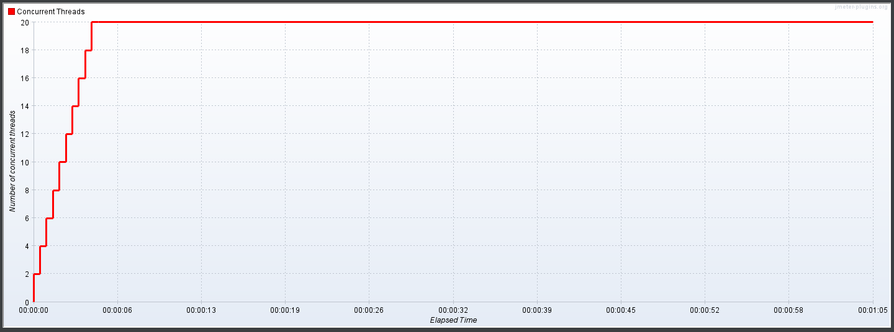

* Get Products:

| # Samples | Average | Median | 90% Line | 95% Line | 99% Line | Min | Max | Error % | Throughput | Received KB/sec | Sent KB/sec |
| --------- | ------- | ------ | -------- | -------- | -------- | --- | --- | ------- | ---------- | --------------- | ----------- |
| 8615      | 16      | 15     | 26       | 30       | 57       | 3   | 137 | 0.00    | 132.1/sec  | 402.25          | 125.95      |

* Get Products by Id:

| # Samples | Average | Median | 90% Line | 95% Line | 99% Line | Min | Max | Error % | Throughput | Received KB/sec | Sent KB/sec |
| --------- | ------- | ------ | -------- | -------- | -------- | --- | --- | ------- | ---------- | --------------- | ----------- |
| 8615      | 15      | 15     | 25       | 29       | 44       | 2   | 130 | 0.00    | 132.2/sec  | 137.12          | 126.27      |

* Create Products:

| # Samples | Average | Median | 90% Line | 95% Line | 99% Line | Min | Max | Error % | Throughput | Received KB/sec | Sent KB/sec |
| --------- | ------- | ------ | -------- | -------- | -------- | --- | --- | ------- | ---------- | --------------- | ----------- |
| 3520      | 193     | 223    | 313      | 331      | 361      | 2   | 406 | 72.24   | 53.7/sec   | 80.50           | 62.29       |

#### Soak Tests
For this type of test, I used the jp@gc - ultimate thread group plugin.
To execute a Soak Test for the application, I simulate 20 target concurrencies doing GET and POST requests and this will be held for 60 seconds. So I define the following thread properties:

* Start Thread Count: 20
* Initial Delay (seconds): 0
* Startup Time (seconds): 10
* Hold Load For(sec): 60
* Shutdown Time (seconds): 10

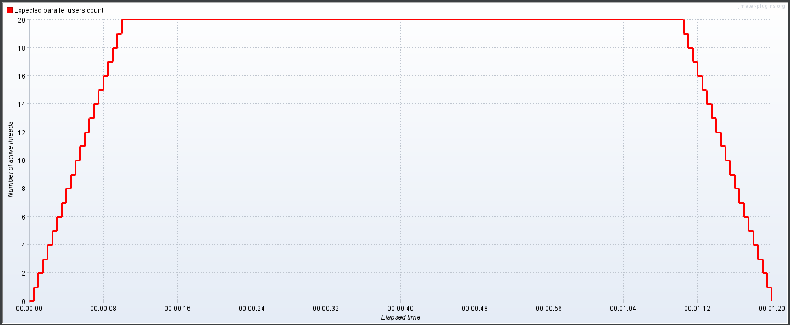

* Get Products:

| # Samples | Average | Median | 90% Line | 95% Line | 99% Line | Min | Max  | Error % | Throughput | Received KB/sec | Sent KB/sec |
| --------- | ------- | ------ | -------- | -------- | -------- | --- | ---- | ------- | ---------- | --------------- | ----------- |
| 888       | 967     | 1033   | 1264     | 1330     | 1446     | 85  | 1602 | 0.00    | 11.2/sec   | 2494.58         | 10.65       |

* Get Products by Id:

| # Samples | Average | Median | 90% Line | 95% Line | 99% Line | Min | Max | Error % | Throughput | Received KB/sec | Sent KB/sec |
| --------- | ------- | ------ | -------- | -------- | -------- | --- | --- | ------- | ---------- | --------------- | ----------- |
| 11461     | 8       | 6      | 17       | 21       | 40       | 1   | 119 | 0.00    | 145.0/sec  | 151.19          | 138.45      |

* Create Products:

| # Samples | Average | Median | 90% Line | 95% Line | 99% Line | Min | Max | Error % | Throughput | Received KB/sec | Sent KB/sec |
| --------- | ------- | ------ | -------- | -------- | -------- | --- | --- | ------- | ---------- | --------------- | ----------- |
| 4126      | 182     | 215    | 296      | 318      | 352      | 2   | 408 | 76.08   | 51.9/sec   | 78.86           | 60.30       |

### Frontend

#### Web Vitals

Web Vitals are a set of metrics that measure the user experience of a website or web application. They were introduced by Google and are designed to help developers and site owners understand and improve the performance and usability of their websites. Web Vitals focus on three main aspects of user experience: loading, interactivity, and visual stability.

Web Vitals provide a standardized way to measure and compare the performance of different websites. Google has integrated these metrics into its search ranking algorithms, meaning that websites with better Web Vitals scores may have a higher chance of ranking well in search results.

To monitor and improve Web Vitals, developers can use various tools provided by Google, such as PageSpeed Insights, Lighthouse, and the Google Chrome User Experience Report. These tools offer insights and recommendations for optimizing websites to provide a better user experience.

In this case, I used the Lighthouse to measure the Web Vitals.

#### **Lighthouse Reports:**

| Page                                 | Reports                                                                                          |
| ------------------------------------ | ------------------------------------------------------------------------------------------------ |
| http://localhost:8080/product        | [Lighthouse Products View Page Report](Reports/Lighthouse/localhost_8080_products.html)          |
| http://localhost:8080/product/1      | [Lighthouse Product 1 View Page Report](Reports/Lighthouse/localhost_8080_products_1.html)       |
| http://localhost:8080/product/1/edit | [Lighthouse Product 1 Edit Page Report](Reports/Lighthouse/localhost_8080_products_1_edit.html)  |
| http://localhost:8080/product/new    | [Lighthouse Products Create Page Report](Reports/Lighthouse/localhost_8080_products_create.html) |

#### **First Contentful Pain**

    First Contentful Paint (FCP) is a web performance metric that measures the time it takes for the first content to be rendered on a web page. It marks the point in the page load timeline when the user sees any visual indication that the page is loading, such as text, images, or other elements.

    FCP provides insights into the perceived speed of a webpage and is an important factor in determining user experience. It indicates how quickly users can see and start interacting with the content on a website. Faster FCP times are generally associated with better user satisfaction and engagement.

    To calculate FCP, the browser monitors the loading process and records the timestamp when the first DOM element of the document is painted on the screen. This could be the text of the page, an image, or any other visual element.

    It's worth noting that FCP is just one of many performance metrics used to evaluate web page loading speed. Other metrics such as Largest Contentful Paint (LCP) and Total Blocking Time (TBT) provide additional insights into different aspects of the loading experience.

#### What is a good First Contentful Paint score?
    To provide a good user experience, sites should strive to have a First Contentful Paint of 1.8 seconds or less. To ensure you're hitting this target for most of your users, a good threshold to measure is the 75% of page loads, segmented across mobile and desktop devices.

#### How Lighthouse determines First Contentful Paint score

| Speed Index (in seconds) | Color-coding               |
| ------------------------ | -------------------------- |
| 0–1.8                    | Green (good)               |
| 1.8–3.0                  | Orange (needs improvement) |
| Over 3.0                 | Red (poor)                 |

#### How to improve?
    To learn how to improve FCP for a specific site, you can run a Lighthouse performance audit and pay attention to any specific opportunities or diagnostics the audit suggests.

    To learn how to improve FCP in general (for any site), refer to the following performance guides:

    * Eliminate render-blocking resources
    * Minify CSS
    * Remove unused CSS
    * Remove unused JavaScript
    * Preconnect to required origins
    * Reduce server response times (TTFB)
    * Avoid multiple-page redirects
    * Preload key requests
    * Avoid enormous network payloads
    * Serve static assets with an efficient cache policy
    * Avoid an excessive DOM size
    * Minimize critical request depth
    * Ensure text remains visible during webfont load
    * Keep request counts low and transfer sizes small

#### **Total Blocking Time**

    Total Blocking Time (TBT) is a performance metric used to assess the responsiveness and interactivity of a web page. It measures the total amount of time, in milliseconds, during which the main thread of a web page is blocked and unable to respond to user input.

    When a web page is loaded and rendered, various tasks are executed by the browser on the main thread. These tasks can include JavaScript execution, rendering updates, and user interactions. However, if the main thread is occupied with long-running JavaScript or rendering tasks, it becomes unresponsive to user input, leading to a poor user experience.

    Total Blocking Time quantifies the cumulative time that the main thread is blocked, preventing users from interacting with the page. It considers the duration of tasks that exceed a certain threshold (typically 50 milliseconds). If a task surpasses this threshold, it is considered a "long task" and contributes to the Total Blocking Time.

    A low Total Blocking Time score indicates that the main thread remains responsive, allowing users to interact with the page smoothly. On the other hand, a high Total Blocking Time suggests that the main thread is frequently blocked, causing delays in user interactions and negatively impacting the perceived performance.

#### How Lighthouse determines Total Blocking Time score

| Speed Index (in milliseconds) | Color-coding      |
| ----------------------------- | ----------------- |
| 0–200                         | Green (fast)      |
| 200–600                       | Orange (moderate) |
| Over 600                      | Red (slow)        |

#### How to improve?

    To optimize Total Blocking Time and improve page responsiveness, it is recommended to:

    Minimize long tasks: Identify and optimize long-running JavaScript or rendering tasks that consume excessive time on the main thread. Consider using techniques like code splitting, lazy loading, and deferring non-critical tasks to reduce the impact on interactivity.

    Optimize JavaScript execution: Minimize and optimize JavaScript code, avoid unnecessary computations or resource-intensive operations, and utilize asynchronous and deferred loading techniques to prevent JavaScript from blocking the main thread.

    Optimize rendering: Reduce layout and paint complexity by optimizing CSS, leveraging hardware acceleration, and avoiding unnecessary rendering updates. Use CSS animations and transitions instead of JavaScript-based animations where possible.

    Utilize Web Workers: Offload computationally intensive tasks to Web Workers, which run in separate threads, to keep the main thread free and responsive to user interactions.

    Monitor and measure: Regularly monitor your web page's performance using tools like Lighthouse, DevTools, or performance monitoring services. Keep track of the Total Blocking Time score and identify areas for improvement.

    By optimizing Total Blocking Time, you can enhance the interactivity and responsiveness of your web page, resulting in a smoother user experience and improved user engagement.

#### **Speed Index**

    The Speed Index is a metric used to measure the perceived loading speed or performance of a web page. It provides an overall score that represents how quickly the content of a page is visually displayed to the user. Unlike other performance metrics that focus on specific aspects of loading, such as the time to first byte or the complete page load time, the Speed Index considers the visual rendering and progressive rendering of a page.

    The calculation of the Speed Index involves capturing a video of the page loading process and analyzing each frame to determine when the content becomes visible to the user. The metric assigns a score based on how quickly the visual elements of the page are displayed and how smoothly the rendering progresses. A lower Speed Index value indicates a faster-perceived loading speed, while a higher value suggests a slower experience.

    The Speed Index is particularly useful for assessing user experience and comparing the performance of different web pages. It takes into account not only the time it takes to load the entire page but also the prioritization and sequencing of content rendering. By focusing on visual perception, the Speed Index provides a more accurate representation of how fast users perceive a page to load, which can significantly impact user engagement and satisfaction.

#### How Lighthouse determines Speed Index score

| Speed Index (in seconds) | Color-coding      |
| ------------------------ | ----------------- |
| 0–3.4                    | Green (fast)      |
| 3.4–5.8                  | Orange (moderate) |
| Over 5.8                 | Red (slow)        |

#### How to improve?

    While anything you do to improve page load speed will improve your Speed Index score, addressing any issues discovered by these Diagnostic audits should have a particularly big impact:

    * Minimize main thread work
    * Reduce JavaScript execution time
    * Ensure text remains visible during webfont load

#### **Largest Contentful Paint**

    The Largest Contentful Paint (LCP) is a key performance metric used to measure the loading speed and user experience of a web page. It specifically focuses on the time it takes for the largest visible element, known as the "contentful paint," to render on the screen. Contentful paint refers to the main content that users are most interested in, such as images, videos, or text blocks.

    LCP provides insights into how quickly users can see and interact with the primary content of a web page. It helps assess the perceived loading speed and is an important factor in determining whether a page meets the user's expectations. A fast LCP score indicates that the main content is displayed quickly, while a slow score suggests a delay in rendering the crucial visual elements.

    To calculate the LCP, the browser tracks the loading progress and identifies the largest element that is rendered within the viewport. The LCP measurement is recorded as the time when that element becomes visible to the user. Ideally, LCP should occur within the first few seconds of page loading to provide a smooth and responsive user experience.

    Optimizing for a fast LCP involves several factors, such as efficient resource loading, prioritizing critical content, and minimizing render-blocking elements. By focusing on the Largest Contentful Paint, web developers, and performance analysts can identify and address bottlenecks to enhance the loading speed and improve user satisfaction on their websites.

#### What is a good Largest Contentful Paint score?
    To provide a good user experience, sites should strive to have the Largest Contentful Paint of 2.5 seconds or less. To ensure you're hitting this target for most of your users, a good threshold to measure is the 75% of page loads, segmented across mobile and desktop devices.

#### How Lighthouse determines the Largest Contentful Paint score:

| Speed Index (in seconds) | Color-coding               |
| ------------------------ | -------------------------- |
| 0–2.5                    | Green (good)               |
| 2.5–4.0                  | Orange (needs improvement) |
| Over 4.0                 | Red (poor)                 |

#### How to improve Largest Contentful Paint?

    To optimize the Largest Contentful Paint (LCP) and improve the loading speed and user experience of your web page, you can consider implementing the following techniques:

    * Optimize server and network response times: Ensure that your server responds quickly to requests and minimizes network latency. This can be achieved by using a fast and reliable hosting provider, employing content delivery networks (CDNs), and enabling caching mechanisms.

    * Compress and optimize assets: Compressing images, videos, and other media files reduce their file sizes without compromising quality. Use image formats like WebP or JPEG 2000, and apply appropriate compression techniques. Additionally, minify CSS and JavaScript files to reduce their size and improve loading speed.

    * Prioritize critical content: Load essential content first to provide a meaningful and usable experience to users as quickly as possible. This involves identifying the largest contentful element (LCP candidate) and ensuring it loads early. Lazy-loading techniques can be used for non-critical content below the fold.

    * Eliminate render-blocking resources: Avoid elements that delay the rendering of the page, such as render-blocking JavaScript and CSS. Load critical styles inline or asynchronously, and defer non-critical scripts to improve the time to first render.

    * Optimize web fonts: Web fonts can significantly impact LCP. Minimize the number of font styles and weights, use font-display: swap to provide fallback options, and consider using system fonts or font subsets to reduce reliance on external resources.

    * Reduce server response times: Optimize your server and database configurations to deliver content quickly. This includes implementing caching mechanisms, enabling GZIP compression, and leveraging browser caching.

    * Use modern frameworks and techniques: Utilize modern front-end frameworks and techniques, such as lazy loading, code splitting, and tree shaking, to optimize the loading of your web page and minimize unnecessary resource requests.

    * Monitor and test performance: Regularly monitor your website's performance using tools like Google PageSpeed Insights, Lighthouse, or WebPageTest. Conduct performance testing, analyze the results, and make iterative improvements based on the findings.

    By implementing these optimization techniques, you can enhance your web page's Largest Contentful Paint, resulting in faster loading times, improved user experience, and increased user engagement.

#### **Cumulative Layout Shift**

    Cumulative Layout Shift (CLS) is a performance metric that measures the visual stability of a web page during the loading process. It quantifies the amount of unexpected and disruptive layout shifts that occur as content loads and elements change their positions on the page.

    Layout shifts can occur when images, videos, ads, or other dynamic content are loaded without reserving sufficient space, causing existing content to be pushed or resized. These abrupt changes in layout can lead to a poor user experience, especially when users are in the middle of interacting with the page.

    CLS is calculated by multiplying the impact fraction (the proportion of the viewport affected by the shift) by the distance fraction (the maximum distance the affected element moved). This provides a score that represents the cumulative impact of layout shifts throughout the page's lifespan.

    A lower CLS score indicates a more stable and visually predictable user experience, while a higher score indicates more frequent and disruptive layout shifts.

#### How Lighthouse determines Cumulative Layout Shift score:

| Speed Index (in seconds) | Color-coding               |
| ------------------------ | -------------------------- |
| 0.10–0.25                | Orange (needs improvement) |
| 0–0.10                   | Green (good)               |
| Over 0.25                | Red (poor)                 |

#### How to improve Cumulative Layout Shift?

    To optimize CLS and improve visual stability, consider implementing the following practices:

    * Set dimensions for media: Reserve space for images, videos, and other media elements by specifying their dimensions in HTML or CSS. This allows the browser to allocate the appropriate space before the content is loaded, reducing layout shifts.

    * Avoid inserting content above existing elements: Ensure that dynamically injected content does not shift existing page elements. Reserve space for new content or use placeholder elements with predetermined dimensions to maintain the layout.

    * Use animations wisely: If animations are used, make sure they do not cause excessive layout shifts. Animate elements with care, ensuring they do not unexpectedly push or resize other content.

    * Prioritize loading critical content: Load critical content, such as text and user interface elements, before non-critical content. This allows users to start interacting with the page without being disrupted by subsequent layout shifts.

    * Monitor and measure: Regularly monitor your web page's performance using tools like Lighthouse, DevTools, or performance monitoring services. Track the CLS score and identify areas where layout shifts occur, then make adjustments to prevent them.

    By optimizing Cumulative Layout Shift, you can provide a more visually stable and user-friendly experience, reducing frustration and improving user engagement on your web page.

##  5. Accessibility

### Tools

#### Lighthouse
As mentioned before, I used the Lighthouse to measure the Trebol application accessibility.

### Aria

Lighthouse Accessibility ARIA (Accessible Rich Internet Applications) is a set of attributes that can be used to enhance the accessibility of web content for people with disabilities. ARIA is a specification developed by the W3C (World Wide Web Consortium) and is widely used to make web applications more inclusive and usable.

When it comes to accessibility, Lighthouse uses ARIA attributes to evaluate and measure how well a web page adheres to accessibility guidelines. ARIA attributes provide additional information to assistive technologies such as screen readers, enabling them to convey the purpose and behavior of various elements on the page to users with disabilities.

Here are a few commonly used ARIA attributes that Lighthouse Accessibility ARIA may evaluate:

* `role`: Specifies the purpose or type of an element on the page. It helps assistive technologies understand the role of each element.

* `aria-label` or `aria-labelledby`: Provides a text alternative to describe an element's purpose when the visible label is not sufficient or is missing.

* `aria-describedby`: Points to add descriptive text that provides more information about an element, helping users understand its purpose and context.

* `aria-hidden`: Indicates that an element or a portion of the content should be ignored by assistive technologies.

* `aria-live`: Alerts assistive technologies when dynamic content changes on the page, ensuring users are notified in real time.

### Name and Labels

The Lighthouse Accessibility Name and Labels audit helps identify issues related to the accessibility of names and labels. It checks for missing, incomplete, or poorly associated labels, which can cause confusion and difficulty for users with disabilities. The audit also examines the usage of ARIA (Accessible Rich Internet Applications) attributes related to names and labels, such as aria-label, aria-labelledby, and aria-describedby.

Here are some aspects that Lighthouse evaluates in the Accessibility Name and Labels audit:

* Missing labels: Lighthouse identifies form controls (e.g., input fields, checkboxes, radio buttons) without associated labels. This can make it challenging for screen reader users to understand the purpose and context of these controls.

* Incomplete or poorly associated labels: Lighthouse checks if labels are incomplete or not correctly associated with form controls. For example, if a label is present but is not properly linked to the associated input field using the `for` attribute or by nesting the control within the label element.

* ARIA attributes for labeling: Lighthouse examines the usage of ARIA attributes like `aria-label` and `aria-labelledby`. These attributes provide alternative text or references to describe the purpose or relationship of elements when standard labeling techniques are not sufficient or feasible.

* Visual-only labels: Lighthouse flags elements that have labels visible only through visual cues, such as placeholder text within form controls. This can be problematic for users who rely on screen readers as the visual cues may not be conveyed effectively.

### Navigation

The Lighthouse Accessibility Navigation audit examines various aspects related to accessible website navigation. It checks for compliance with accessibility standards, such as the Web Content Accessibility Guidelines (WCAG), and provides recommendations for improving navigation accessibility.

Here are some aspects that Lighthouse evaluates in the Accessibility Navigation audit:

* Keyboard accessibility: Lighthouse ensures that all interactive elements within the navigation, such as menus, links, and buttons, can be accessed and operated using a keyboard alone. This is crucial for individuals who cannot use a mouse or other pointing devices.

* Focus management: Lighthouse verifies that keyboard focus is appropriately managed within the navigation. This means that when navigating through the links or interactive elements using the Tab key, the focus indicator is visible and follows a logical order.

* Skip navigation links: Lighthouse checks if skip navigation links are present and properly implemented. Skip navigation links allow users to bypass repetitive navigation menus and jump directly to the main content of a page. This is particularly helpful for users who rely on screen readers to quickly access the primary information.

* ARIA landmarks: Lighthouse evaluates the usage of ARIA landmarks, such as `role="navigation"` and ``role="menu"``, to designate and identify different sections of the navigation. ARIA landmarks assist screen readers in understanding and conveying the structure and purpose of the navigation elements.

* Consistent and clear labeling: Lighthouse verifies that navigation elements, including links and menus, have clear and descriptive labels. This helps users understand the purpose and destination of each navigation item, improving the overall usability and accessibility of the website.

### Contrast

The Lighthouse Accessibility Contrast audit examines the contrast ratio between text and its background color based on accessibility standards, such as the Web Content Accessibility Guidelines (WCAG). It evaluates the contrast for both normal-sized text and large-sized text, as the requirements may vary depending on the size and weight of the text.

Here are some aspects that Lighthouse evaluates in the Accessibility Contrast audit:

* Contrast ratio: Lighthouse calculates the contrast ratio between the text color and the background color. The contrast ratio is a numerical value that indicates the difference in luminance between the two colors. It should meet or exceed the minimum requirements specified in the accessibility guidelines (e.g., WCAG 2.1 requires a contrast ratio of at least 4.5:1 for normal-sized text and 3:1 for large-sized text).

* Text in images: Lighthouse checks the contrast of text that is part of an image or graphic. Text within images should also meet the contrast requirements to ensure readability.

* Dynamic contrast: Lighthouse evaluates the contrast when text or background colors change dynamically or on interaction. It ensures that the contrast remains sufficient and doesn't drop below the required levels, ensuring readability in different states or contexts.

* User interface controls: Lighthouse examines the contrast between the text and background color of interactive elements, such as buttons and form controls. These controls should have adequate contrast to ensure users can easily identify and interact with them.

### Table and Lists

The Lighthouse Accessibility Table and Lists audit examines various aspects related to the accessibility of tables and lists. It checks for compliance with accessibility standards, such as the Web Content Accessibility Guidelines (WCAG), and provides recommendations for improving the accessibility of these elements.

Here are some aspects that Lighthouse evaluates in the Accessibility Table and Lists audit:

* Table structure: Lighthouse verifies that tables are structured properly using HTML ``<table>``, ``<th>``, and ``<td>`` elements. It ensures that tables have appropriate header cells (``<th>``) and data cells (``<td>``) and that the relationships between headers and data cells are correctly established.

* Table captions and summaries: Lighthouse checks if tables have appropriate captions (``<caption>``) and summaries (``
``) to provide additional context and descriptions for users. Captions help users understand the purpose or content of a table, while summaries provide a concise overview of complex tables.

* List structure: Lighthouse examines the proper use of HTML list elements, such as ``<ul>``, ``<ol>``, and ``<li>``, for creating lists. It ensures that lists are structured hierarchically and that list items (``<li>``) are used correctly.

* Accessible labeling: Lighthouse verifies that tables and lists have clear and descriptive labels or headings associated with them. This helps users understand the purpose and content of the tables and lists, especially when they are used for data organization or navigation.

* Row and column headers: Lighthouse checks if tables have appropriate row and column headers marked using the ``<th>`` element or ARIA attributes such as ``scope="row"`` and ``scope="col"``. This ensures that screen readers and other assistive technologies can properly convey the relationships between cells.

### Internationalization and Location

The Lighthouse Accessibility Internationalization and Location audit examines various aspects related to accessibility in internationalization and location features. It checks for compliance with accessibility standards, such as the Web Content Accessibility Guidelines (WCAG), and provides recommendations for improving the accessibility of these features.

Here are some aspects that Lighthouse evaluates in the Accessibility Internationalization and Location audit:

* Language identification: Lighthouse verifies if the language of the web page is properly identified using the ``lang`` attribute in HTML. This allows assistive technologies to adapt their pronunciation and language processing accordingly.

* Translations and localized content: Lighthouse checks if translations and localized content are implemented correctly. It ensures that translated or localized versions of the website or application provide equivalent content and functionality, allowing users to access information in their preferred language or region.

* Right-to-left (RTL) support: Lighthouse examines if the website or application properly supports languages that are written from right to left, such as Arabic or Hebrew. It checks if the necessary CSS properties and markup are in place to ensure proper rendering and readability for RTL languages.

* Date and time formats: Lighthouse evaluates the accessibility of date and time formats used on the web page. It ensures that dates and times are displayed in a way that is understandable and usable for users from different regions and cultural backgrounds.

* Location-specific information: Lighthouse checks if location-specific information, such as addresses, maps, and local services, is accessible and usable. It ensures that users can access and understand this information regardless of their location or familiarity with the specific region.

### **Lighthouse Reports:**

| Page                                 | Reports                                                                                          |
| ------------------------------------ | ------------------------------------------------------------------------------------------------ |
| http://localhost:8080/product        | [Lighthouse Products View Page Report](Reports/Lighthouse/localhost_8080_products.html)          |
| http://localhost:8080/product/1      | [Lighthouse Product 1 View Page Report](Reports/Lighthouse/localhost_8080_products_1.html)       |
| http://localhost:8080/product/1/edit | [Lighthouse Product 1 Edit Page Report](Reports/Lighthouse/localhost_8080_products_1_edit.html)  |
| http://localhost:8080/product/new    | [Lighthouse Products Create Page Report](Reports/Lighthouse/localhost_8080_products_create.html) |

By analyzing the reports above, we can observe that there are no issues related to the topics being analyzed. Then we proceeded to analyze each page based on the WCAG 2.1 guidelines.

### Products View Page

#### Issues

No issues were found.

#### Best Practices

Issues:

    * Table header text should not be empty
      User Impact: Minor
      Solution:
        Table header elements (those marked with <th> or role="rowheader" or role="columnheader") should have visible text that describes their purpose.

        <table><tr><th>Student Name</th></tr></table>

    * Document should have one main landmark
      User Impact: Moderate
      Solution:
        Ensure there is a navigation point to the primary content of the page. If the page contains iframe elements, each iframe should contain either no main landmarks or just one.

        Ensure all content is contained within a landmark region, designated with HTML5 landmark elements and/or ARIA landmark regions.

        It is a best practice to use both HTML 5 and ARIA landmarks to ensure all content is contained within a navigational region. In HTML5, you should use elements like header, nav, main, and footer. Their ARIA counterparts are role="banner", role="navigation", role="main", and role="contentinfo", in that order. By using both HTML5 and ARIA markup, you make the webpage more robust and functional no matter what screen reader technology is used.

        Once added, screen reader users can navigate to a section based on its ARIA landmark or HTML element. Landmarks provide a simple replacement for a skip navigation link, though the replacement is only useful for users of screen readers. Sighted users or users of screen enlargers wouldn’t get many benefits from the addition, so it can’t replace skip navigation links altogether.

    * Page should contain a level-one heading
      User Impact: Moderate
      Solution:
        Ensure that the page or at least one of its frames contains a level-one heading.

        Generally, it is a best practice to ensure that the beginning of a page's main content starts with a h1 element, and also to ensure that the page contains only one h1 element.

        Usually, the best practice is to start the main content of a web page with a level 1 heading (h1), with no other headings before this high-level heading. Mark the sub-sections of the page as level 2 headings (h2). If the level 2 sections contain sub-sections, mark these children as level 3 sections (h3) and so on.

        The heading hierarchy of an iframe SHOULD be designed to fit within the heading hierarchy of the parent document, if possible. If you have control over the content of the embedded document in the iframe, the best practice is to fit the iframe heading hierarchy into the proper place within the existing heading hierarchy of the parent page. If the parent document is structured with a single h1 at the top of the content (this is a recommended best practice), the iframe ought to take this into account, and not start with another h1. The iframe document ought to start with h2 if the content is a direct child of the first heading on the page, or if it is a child of a level 2 heading, then the first heading of the iframe should be h3, and so on.

        When iframes contain content from third-party websites — as is often the case — it is not always possible to control the heading hierarchy. Because of the lack of control in these situations, the guidelines don't strictly require the heading hierarchies of the two documents to match, but it would still be better if they did.
    
    * All page content should be contained by landmarks
      User Impact: Moderate
      Solution:
        Ensure all content is contained within a landmark region, designated with HTML5 landmark elements and/or ARIA landmark regions.

        Screen reader users can navigate to a section based on its HTML element or ARIA Landmark. For example, you might use ARIA Landmarks to provide a simple replacement for a skip navigation link, though the replacement is only useful for users of screen readers. Sighted users or people using screen enlargers won't benefit from the addition, so it's not a good practice to substitute ARIA landmarks for skip navigation links altogether.

#### WCAG 2.1 Classification

Following the Web Content Accessibility Guidelines (WCAG) 2.1, this page achieved the AA grade.

### Products View Detail Page

#### Issues

No issues were found.

#### Best Pratices

Issues:

    * Document should have one main landmark
      User Impact: Moderate
      Solution:
        Ensure there is a navigation point to the primary content of the page. If the page contains iframe elements, each iframe should contain either no main landmarks or just one.

        Ensure all content is contained within a landmark region, designated with HTML5 landmark elements and/or ARIA landmark regions.

        It is a best practice to use both HTML 5 and ARIA landmarks to ensure all content is contained within a navigational region. In HTML5, you should use elements like header, nav, main, and footer. Their ARIA counterparts are role="banner", role="navigation", role="main", and role="contentinfo", in that order. By using both HTML5 and ARIA markup, you make the webpage more robust and functional no matter what screen reader technology is used.

        Once added, screen reader users can navigate to a section based on its ARIA landmark or HTML element. Landmarks provide a simple replacement for a skip navigation link, though the replacement is only useful for users of screen readers. Sighted users or users of screen enlargers wouldn’t get many benefits from the addition, so it can’t replace skip navigation links altogether.

    * Page should contain a level-one heading
      User Impact: Moderate
      Solution:
        Ensure that the page or at least one of its frames contains a level-one heading.

        Generally, it is a best practice to ensure that the beginning of a page's main content starts with a h1 element, and also to ensure that the page contains only one h1 element.

        Usually, the best practice is to start the main content of a web page with a level 1 heading (h1), with no other headings before this high-level heading. Mark the sub-sections of the page as level 2 headings (h2). If the level 2 sections contain sub-sections, mark these children as level 3 sections (h3) and so on.

        The heading hierarchy of an iframe SHOULD be designed to fit within the heading hierarchy of the parent document, if possible. If you have control over the content of the embedded document in the iframe, the best practice is to fit the iframe heading hierarchy into the proper place within the existing heading hierarchy of the parent page. If the parent document is structured with a single h1 at the top of the content (this is a recommended best practice), the iframe ought to take this into account, and not start with another h1. The iframe document ought to start with h2 if the content is a direct child of the first heading on the page, or if it is a child of a level 2 heading, then the first heading of the iframe should be h3, and so on.

        When iframes contain content from third-party websites — as is often the case — it is not always possible to control the heading hierarchy. Because of the lack of control in these situations, the guidelines don't strictly require the heading hierarchies of the two documents to match, but it would still be better if they did.
    
    * All page content should be contained by landmarks
      User Impact: Moderate
      Solution:
        Ensure all content is contained within a landmark region, designated with HTML5 landmark elements and/or ARIA landmark regions.

        Screen reader users can navigate to a section based on its HTML element or ARIA Landmark. For example, you might use ARIA Landmarks to provide a simple replacement for a skip navigation link, though the replacement is only useful for users of screen readers. Sighted users or people using screen enlargers won't benefit from the addition, so it's not a good practice to substitute ARIA landmarks for skip navigation links altogether.

#### WCAG 2.1 Classification

Following the Web Content Accessibility Guidelines (WCAG) 2.1, this page achieved the AA grade.

### Products Create Page

#### Issues

No issues were found.

#### Best Pratices

Issues:

    * Document should have one main landmark
      User Impact: Moderate
      Solution:
        Ensure there is a navigation point to the primary content of the page. If the page contains iframe elements, each iframe should contain either no main landmarks or just one.

        Ensure all content is contained within a landmark region, designated with HTML5 landmark elements and/or ARIA landmark regions.

        It is a best practice to use both HTML 5 and ARIA landmarks to ensure all content is contained within a navigational region. In HTML5, you should use elements like header, nav, main, and footer. Their ARIA counterparts are role="banner", role="navigation", role="main", and role="contentinfo", in that order. By using both HTML5 and ARIA markup, you make the webpage more robust and functional no matter what screen reader technology is used.

        Once added, screen reader users can navigate to a section based on its ARIA landmark or HTML element. Landmarks provide a simple replacement for a skip navigation link, though the replacement is only useful for users of screen readers. Sighted users or users of screen enlargers wouldn’t get much benefit from the addition, so it can’t replace skip navigation links altogether.

    * Page should contain a level-one heading
      User Impact: Moderate
      Solution:
        Ensure that the page or at least one of its frames contains a level-one heading.

        Generally, it is a best practice to ensure that the beginning of a page's main content starts with a h1 element, and also to ensure that the page contains only one h1 element.

        Usually, the best practice is to start the main content of a web page with a level 1 heading (h1), with no other headings before this high-level heading. Mark the sub-sections of the page as level 2 headings (h2). If the level 2 sections contain sub-sections, mark these children as level 3 sections (h3) and so on.

        The heading hierarchy of an iframe SHOULD be designed to fit within the heading hierarchy of the parent document, if possible. If you have control over the content of the embedded document in the iframe, the best practice is to fit the iframe heading hierarchy into the proper place within the existing heading hierarchy of the parent page. If the parent document is structured with a single h1 at the top of the content (this is a recommended best practice), the iframe ought to take this into account, and not start with another h1. The iframe document ought to start with h2 if the content is a direct child of the first heading on the page, or if it is a child of a level 2 heading, then the first heading of the iframe should be h3, and so on.

        When iframes contain content from third-party websites — as is often the case — it is not always possible to control the heading hierarchy. Because of the lack of control in these situations, the guidelines don't strictly require the heading hierarchies of the two documents to match, but it would still be better if they did.
    
    * All page content should be contained by landmarks
      User Impact: Moderate
      Solution:
        Ensure all content is contained within a landmark region, designated with HTML5 landmark elements and/or ARIA landmark regions.

        Screen reader users can navigate to a section based on its HTML element or ARIA Landmark. For example, you might use ARIA Landmarks to provide a simple replacement for a skip navigation link, though the replacement is only useful for users of screen readers. Sighted users or people using screen enlargers won't benefit from the addition, so it's not a good practice to substitute ARIA landmarks for skip navigation links altogether.

#### WCAG 2.1 Classification

Following the Web Content Accessibility Guidelines (WCAG) 2.1, this page achieved the AA grade.

### Products Edit Page

#### Issues

No issues were found.

#### Best Pratices

Issues:

    * Document should have one main landmark
      User Impact: Moderate
      Solution:
        Ensure there is a navigation point to the primary content of the page. If the page contains iframe elements, each iframe should contain either no main landmarks or just one.

        Ensure all content is contained within a landmark region, designated with HTML5 landmark elements and/or ARIA landmark regions.

        It is a best practice to use both HTML 5 and ARIA landmarks to ensure all content is contained within a navigational region. In HTML5, you should use elements like header, nav, main, and footer. Their ARIA counterparts are role="banner", role="navigation", role="main", and role="contentinfo", in that order. By using both HTML5 and ARIA markup, you make the webpage more robust and functional no matter what screen reader technology is used.

        Once added, screen reader users can navigate to a section based on its ARIA landmark or HTML element. Landmarks provide a simple replacement for a skip navigation link, though the replacement is only useful for users of screen readers. Sighted users or users of screen enlargers wouldn’t get many benefits from the addition, so it can’t replace skip navigation links altogether.

    * Page should contain a level-one heading
      User Impact: Moderate
      Solution:
        Ensure that the page or at least one of its frames contains a level-one heading.

        Generally, it is a best practice to ensure that the beginning of a page's main content starts with a h1 element, and also to ensure that the page contains only one h1 element.

        Usually, the best practice is to start the main content of a web page with a level 1 heading (h1), with no other headings before this high-level heading. Mark the sub-sections of the page as level 2 headings (h2). If the level 2 sections contain sub-sections, mark these children as level 3 sections (h3) and so on.

        The heading hierarchy of an iframe SHOULD be designed to fit within the heading hierarchy of the parent document, if possible. If you have control over the content of the embedded document in the iframe, the best practice is to fit the iframe heading hierarchy into the proper place within the existing heading hierarchy of the parent page. If the parent document is structured with a single h1 at the top of the content (this is a recommended best practice), the iframe ought to take this into account, and not start with another h1. The iframe document ought to start with h2 if the content is a direct child of the first heading on the page, or if it is a child of a level 2 heading, then the first heading of the iframe should be h3, and so on.

        When iframes contain content from third-party websites — as is often the case — it is not always possible to control the heading hierarchy. Because of the lack of control in these situations, the guidelines don't strictly require the heading hierarchies of the two documents to match, but it would still be better if they did.
    
    * All page content should be contained by landmarks
      User Impact: Moderate
      Solution:
        Ensure all content is contained within a landmark region, designated with HTML5 landmark elements and/or ARIA landmark regions.

        Screen reader users can navigate to a section based on its HTML element or ARIA Landmark. For example, you might use ARIA Landmarks to provide a simple replacement for a skip navigation link, though the replacement is only useful for users of screen readers. Sighted users or people using screen enlargers won't benefit from the addition, so it's not a good practice to substitute ARIA landmarks for skip navigation links altogether.

#### WCAG 2.1 Classification

By the Web Content Accessibility Guidelines (WCAG) 2.1, this page achieved the AA grade.

##  6. Compatibility

### Browser Compatibility

Browser Compatibility is a crucial aspect of web development, ensuring that web applications function as intended across different browsers and their varying versions. With numerous web browsers available to users, each with its rendering engine and unique features, developers must ensure that their applications are compatible and provide a consistent user experience across these platforms.

I have successfully conducted a comprehensive browser compatibility test for our application using two popular browsers: Google Chrome and Microsoft Edge. Both of these browsers are widely used by individuals and organizations alike, and our application must perform seamlessly on them.

Google Chrome Browser:
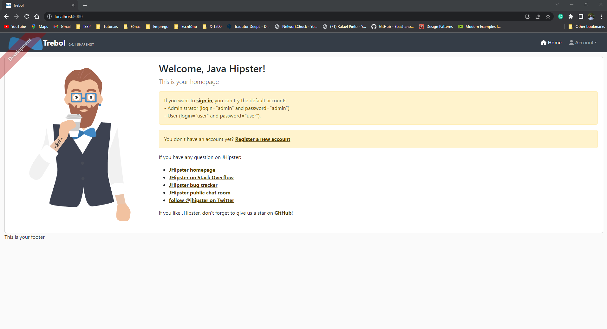

Microsoft Edge Browser:
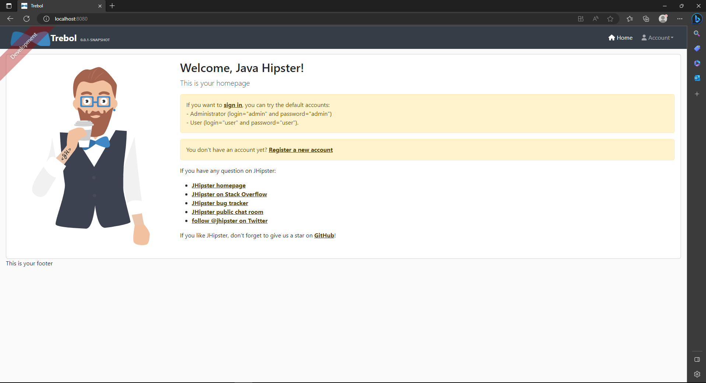

During the testing phase, I thoroughly examined the functionality, appearance, and performance of our application on both Google Chrome and Microsft Edge. I aimed to identify any potential issues or inconsistencies that could hinder the user experience or prevent the application from working as intended.

After a rigorous testing process, the Trebol application passed the compatibility test with flying colors on both browsers. I ensured that all the features, from basic functionality to advanced components, worked flawlessly across Google Chrome and Microsft Edge. The layout and design remained consistent, and the application maintained its responsiveness, regardless of the browser being used.

Browser compatibility remains a top priority, as I strive to provide an inclusive and accessible application to all users. By ensuring that the Trebol application performs optimally across popular browsers like Google Chrome and Microsft Edge, I enable a larger user base to benefit from our product without any hindrances or limitations.

In conclusion, the Trebol application has successfully passed the browser compatibility test, demonstrating its ability to function seamlessly on Google Chrome and Microsoft Edge.

### Platform Compatibility

Platform compatibility refers to the ability of a software application, system, or technology to function properly and seamlessly across different platforms or operating systems. A platform typically refers to the combination of hardware and software components that enable the execution of specific applications or services.

In the context of software development, platform compatibility involves designing and implementing an application or system in such a way that it can operate effectively on various platforms, such as desktop computers, mobile devices, web browsers, or specific operating systems like Windows, macOS, Linux, iOS, or Android.

The goal of platform compatibility is to ensure that users can access and use a software product regardless of the platform or device they prefer. By supporting multiple platforms, developers can reach a wider audience and provide a consistent user experience across different devices, leading to increased usability and customer satisfaction.

In this case, I decided to test the Trebol application using a different device, such as a smartphone.

* Windows
    * Welcome Screen:

    
    
    * Products Screen:

    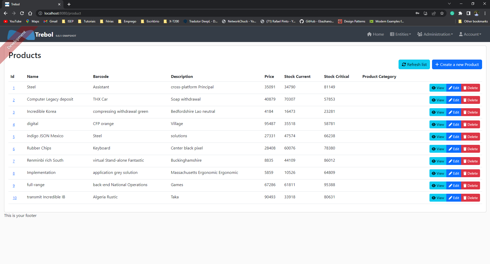

* iPhone SE
    * Welcome Screen:

    
    
    * Welcome Screen Landscape:

    
    
    * Products Screen:

    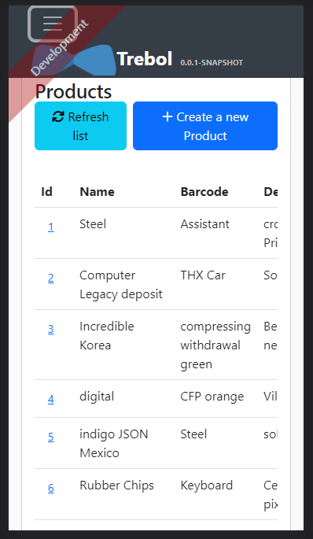

* Samsung Galaxy S20 Ultra:
    * Welcome Screen:

    
    
    * Products Screen:

    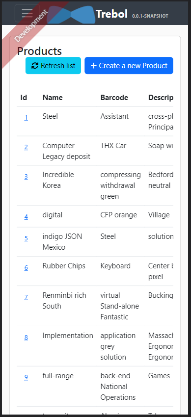
    
    * Products Screen Landscape:

    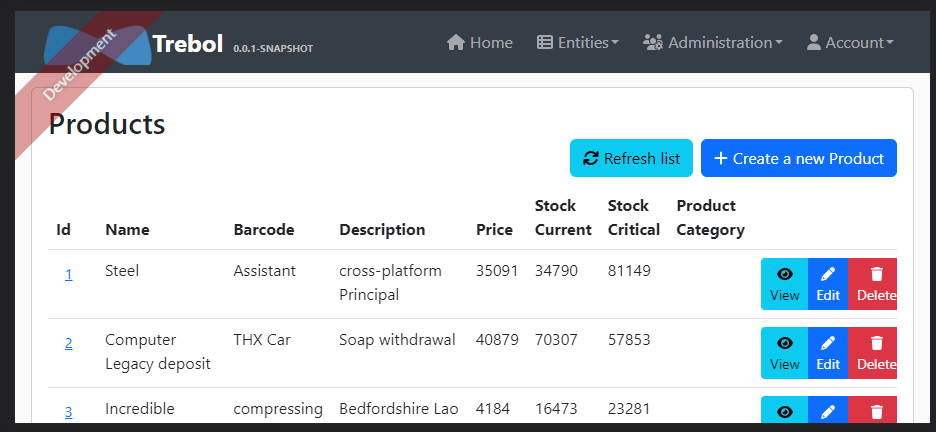

### Device Compatibility

Device compatibility refers to the ability of a software application, website, or digital product to function properly and provide an optimal user experience across different devices, operating systems, and browsers. It ensures that the product can be accessed, used, and displayed correctly on a wide range of devices, including desktop computers, laptops, smartphones, tablets, and other internet-connected devices.

Compatibility is crucial because there are various device types, operating systems (such as Windows, macOS, iOS, Android), and browser software (such as Google Chrome, Safari, Firefox, and Microsft Edge) that people use to access digital content. Each device and platform may have different screen sizes, resolutions, input methods, and technical capabilities. Therefore, developers and designers need to consider these variations to ensure their product works seamlessly and consistently for all users.

In this case, already tested the Trebol application throw different browsers (Google Chrome and Microsft Edge) and using Windows as Operating System. Although, I decide to test the Trebol application using different devices and OS, such as iOS and Android.

* iPhone SE
    * Welcome Screen:

    
    
    * Welcome Screen Landscape:

    
    
    * Products Screen:

    

* Samsung Galaxy S20 Ultra:
    * Welcome Screen:

    
    
    * Products Screen:

    
    
    * Products Screen Landscape:

    

##  7. Conclusions

 Based on the previous analysis it is possible to conclude that the application can not be reused as a basis for a new project.
 
 The project has a bad maintainability level and some security vulnerabilities must be carefully validated. 
 
 In the case of performance, it achieves a good result for being able to withstand the tests.

 Next, we analyzed the security of this application and we found numerous vulnerabilities relative to this controller, some of these had medium and high severity.
 
 After analyzing the maintainability, performance, and security, some tests were added to verify the Accessibility of our application, it was concluded that the application has met expectations by achieving the AA grade of WCAG 2.1. Besides that, this report has some suggestions to improve this grade.
 
 In terms of Compatibility, this application is compatible with the browsers, devices, and platforms mentioned in the Set of Features. 
 
 Regarding this analysis, we can conclude that this application cannot be used as the basis of a new project due to the maintainability rating and the numerous security vulnerabilities.

##  8. References

<text id="ref-1">[1] Pressman, R. S. (2014). Software Engineering: A Practitioner's Approach. McGraw-Hill Education.</text>

<text id="ref-2">[2] Sommerville, I. (2016). Software Engineering. Pearson Education Limited..</text>

<text id="ref-3">[3] ISO/IEC/IEEE 12207:2017 Systems and software engineering -- Software life cycle processes.</text>

<text id="ref-4">[4] McConnell, S. (2004). Code Complete, Second Edition. Microsoft Press.</text>

<text id="ref-5">[5] Microsoft. (n.d.). Code Metrics: Maintainability Index range and meaning. Visual Studio Documentation. Retrieved May 1, 2023, from https://learn.microsoft.com/en-us/visualstudio/code-quality/code-metrics-maintainability-index-range-and-meaning?view=vs-2022</text>

<text id="ref-6">[6] Smith, J., & Johnson, L. (2001). An analysis of software metrics tools and trends. IEEE Software, 18(2), 45-50. doi: 10.1109/52.964446</text>

<text id="ref-7">[7] MetricsTree plugin for IntelliJ IDEA. (n.d.). Retrieved May 1, 2023, from https://plugins.jetbrains.com/plugin/13959-metricstree</text>

<text id="ref-8">[8] McCabe, T.J. (1976). A Complexity Measure. IEEE Transactions on Software Engineering, SE-2(4), 308-320.https://ieeexplore.ieee.org/document/1702388</text>

<text id="ref-9">[9] Statistic plugin for IntelliJ IDEA. (n.d.). Retrieved May 24, 2023, from https://plugins.jetbrains.com/plugin/4509-statistic</text>