# README #

# Developed by Nuno Costa (1180126)

This folder includes all artifacts developed for the Second Part of QESOFT Project.

It is structured as follows:

1. [Introduction](#1)
2. [Maintability](#2)
3. [Performance](#3)
4. [Security](#4)
5. [Accessibility](#5)
6. [Compatibility](#6)
7. [Other issues](#7)
8. [Conclusions](#8)
9. [References](#refs)

## <a id="1"></a> 1. Introduction

The second phase of the QESOFT project aims to analyse a JHipster application generated from the project used in the first phase.

The application will be evaluated regarding some quality attributes, such as: accessibility, compatibility, maintainability, performance and security. For each quality attribute, metrics will be measured based on the GQM (Goal-Question-Metric) approach present in the general report.

In this report, conclusions will be drawn after evaluating the SellResource class and its respective methods.

## <a id="2"></a>2. Maintainability

### 2.1 Technologies

#### 2.1.1 Sonargraph
Sonargraph is a static code analysis tool designed to aid software development. It provides features for architectural analysis, code quality problem detection and software metrics. It provides valuable insights into the structure and complexity of the software, identifying problem areas such as excessive dependencies, strong coupling and violations of architectural patterns.

Sonargraph's features include:
* Architecture analysis
* Detection of code quality problems
* Software metrics
* Report generation

#### 2.1.2 MetricsTree

The MetricsTree plugin is designed to provide code metrics analysis and interactive visualizations within the IntelliJ environment. MetricsTree helps developers monitor code quality and identify potential maintainability issues. It provides various software metrics such as cyclomatic complexity, coupling, cohesion, lines of code and other common metrics. Based on these metrics, the plugin generates graphical visualizations, such as trees and charts, to make it easier to understand the structure and quality of the code.

### 2.2 Maintainability

Software maintainability refers to the ability of software to be modified, updated, and improved over time in a cost-effective manner. 
In other words, it refers to the ease with which software can be maintained and evolved throughout its lifecycle.
Maintainability is an important aspect of software engineering because software systems are rarely static - they need to be modified and updated to adapt to changing requirements, fix bugs, and improve performance. 
Maintaining software can be a complex and expensive process, so ensuring that software is designed and built with maintainability in mind can save time and resources in the long run [[1]](#refs).

The Maintainability Index first appeared in 1992 when it was proposed by Paul Oman and Jack Hagemeister at the International Conference on Software Maintenance with the goal of establishing automated software development metrics to guide software related decision-making [[2]](#refs).
The Maintainability Index tries to give a holistic view of the relative maintenance burden for different sections of a project by blending together a series of different metrics.

Using a more modern adaptation of the original formula proposed in 2011 by Microsoft:

`Maintainability Index = MAX(0,(171 - 5.2 * ln(Halstead Volume) - 0.23 * (Cyclomatic Complexity) - 16.2 * ln(Lines of Code))*100 / 171)`

where:
* **Halstead Volume** is a measure of the size and complexity of the code.
* **Cyclomatic Complexity** is a measure of the number of independent paths through the code.
* **Lines of Code** is a simple count of the number of lines in the code.


The MI formula is designed to provide a score between 0 and 100, where higher scores indicate better maintainability. A score above 85 is considered to be excellent, while scores below 20 are considered to be very poor.
As a general rule of thumb:

| Score    | Classification    |
| -------- | ----------------- |
| 0 - 20   | Very Poor         |
| 20 - 40  | Bellow Average    |
| 40 - 70  | Average           |
| 70 - 100 | Good to Excellent |


Using the Sonargraph and MetricsTree plugin in IntelliJ IDEA, I was able to check some metrics about the Trebol project and specific classes. [[3/4]](#refs)
While overall the project has a metric that is considered good to excellent (**80**) when it comes to maintainability, the controller that I'm analysing has a metric not so good.

The **_SellResource_** class has a Maintainability Index of **33.0958** this is considered **bellow average**.

If we analyze each method, we can see the following values regarding maintainability:

* SellResource(): **78.0773**
* createSell(SellDTO): **57.5047**
* deleteSell(Long): **62.8373**
* getAllSells(): **69.951**
* getSell(Long): **66.5511**
* partialUpdateSell(Long, SellDTO): **50.314**
* updateSell(Long, SellDTO): **50.811**

### 2.3 Average Component Dependency (ACD)

Is a metric used in software engineering to measure the level of coupling between the components or modules of a application. 
In other words, ACD represents the average number of dependencies that each component has on other components.
This metric is calculated by dividing the total number of dependencies for all components in a application by the total number of components. [[5]](#refs)

The Sonargraph tool was used because it is a much more complete tool, a little complex to work with but very useful.
To do this, in sonargraph it was selected the class SalesResource and then selected the option to show in graph view. The graph obtained is in the next image.

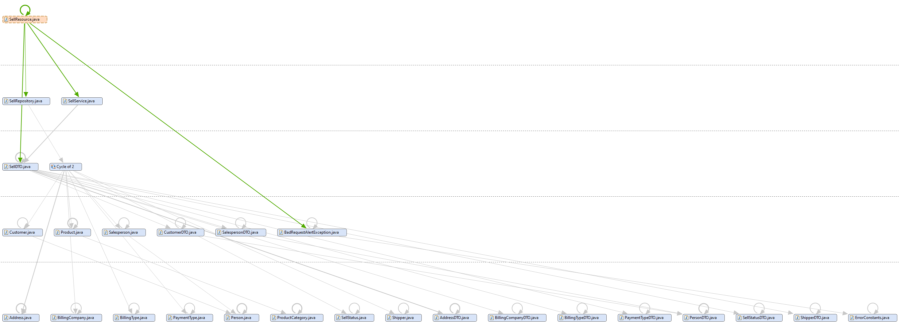


Having all the values from the Depends Upon metric of all components of the class SalesResource, the value CCD can be calculated as the sum of these values.
It was determined that CCD has a value of **91**.

The number of components as we can see in the diagram above is **26**

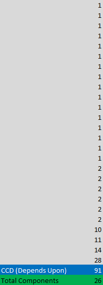

As it was said before, ACD can be obtained by dividing CCD by the number of components. This way:

``` 
Average Component Dependency = CCD(N)/N (N is # of components) 
Average Component Dependency = 91/26 = 3.25 
```

The average component dependency (ACD) of **3.25** indicates that, on average, each component in the application depends on about 3 other components. Comparing to the maximum value, the ACD is approximately 12.5%.

### 2.4 Propagation Cost (PC)

Propagation Cost is a metric used in software engineering to assess the potential impact of a change in one component of the application on other components that depend on it.

A higher propagation cost will likely lead to an increase in complexity of the system therefore making it difficult to maintain.

PC can also be calculated by dividing the ACD once more by the number of nodes (components).

` PC = 3.25/26 = 0.125 `

Since we are working with a small part of the system, this value shouldn't be concerning.

### 2.5 Size metric

Lines of Code (LOC) is a software metric that measures the size of a software program by counting the number of lines of code that are written to create it. The LOC metric is used to estimate the complexity of a program and the effort required to develop, test, and maintain it.

In the class SalesResource it was possible to determine the following values:

- Lines of Code: 107
- Total Lines: 174
- Number of Statements: 40

Based on these values, we can conclude that this component in question has a moderate size in terms of lines of code (LOC), with 107 lines of code in total. However, it is important to note that the total number of lines (174) also includes comments and blank lines, which may influence the interpretation of the actual size of the code itself.

Moreover, the number of statements is relatively low, with only 40, which may indicate good organization and clarity in the code.

### 2.6 Cyclomatic complexity

Cyclomatic complexity is a software metric that measures the complexity of a program by counting the number of independent paths through its source code. It is a quantitative measure of the number of decision points in a program and the number of paths that can be traversed through it. [[6]](#refs)

The cyclomatic complexity of a program is calculated by counting the number of decision points in the program's control flow. A decision point is any point in the code where the control flow can change, such as an if block.

Using sonargraph I was able to get the value of Average Complexity.

- Average Complexity: 2.95

This may indicate that the component in question has moderate complexity. 

An average complexity below 5 is generally considered good programming practice, indicating that the component is easy to understand and maintain.

### 2.7 FrontEnd

To perform this analysis I used the Statistic plugin to IntelliJ IDEA. The Statistic plugin provides functionality for analyzing code metrics such as code line count, number of classes and methods, cyclomatic complexity and other relevant statistics. It can help developers understand code structure, identify areas of high complexity and take steps to improve code quality and maintainability.

#### 2.7.1 Comment Lines

One of the practices that contributes to maintainability is the use of comments in the code. Comments are snippets of text added to source code to provide explanations, clarifications and additional information about how the code works. They help programmers understand the logic behind the code, the goals of the functions, the programmer's intentions and other relevant information.

However, it is important to note that while comments are a useful practice for explaining parts of the code, it is essential that the code itself is well structured, with descriptive variable, function and class names, following the principles of clean code design. Comments should not be used to compensate for confusing or poorly structured code.

| Arquivo                | Total de linhas | Linhas de código | Blocos de comentários |
|------------------------|-----------------|------------------|-----------------------|
| index.tsx              | 23              | 19               | 0                     |
| sell.tsx               | 169             | 160              | 0                     |
| sell-delete-dialog.tsx | 68              | 57               | 0                     |
| sell-detail.tsx        | 132             | 125              | 0                     |
| sell-update.tsx        | 398             | 382              | 0                     |
| sell.reducer.ts      | 123             | 105              | 3                      |
| sell-reducer.spec.ts | 293             | 269              | 0                     |

Based on the table, none of the files shows comment blocks. This could mean that there are no comments in the source code or that comments were removed during the code compilation or minification process. As I said before comments are important to improve the understanding of the code, provide additional information, and facilitate collaboration among team members. It is recommended to include appropriate and relevant comments to make the code more readable and facilitate future maintenance.

## <a id="3"></a> 3. Performance

A software performance test is an activity performed to evaluate a system's ability to handle a given volume of load and/or users, identify bottlenecks, and measure speed, response time, resource consumption, and other parameters relevant to the quality and usability of the application.[[7]](#refs)
Performance testing is important to ensure quality and end-user satisfaction, and to identify and correct problems before the software is released. 
They can also be used to optimize the hardware and software infrastructure, and to improve the efficiency and economy of the resources used by the system.

### **Key Performance Indicators**

KPIs (Key Performance Indicators) are key performance indicators that help organizations evaluate the success or performance of their activities against their objectives and goals.

KPIs are important to enable organizations to monitor their performance and make informed decisions based on hard data. 
It is important to define and regularly track the relevant KPIs for each area or department to ensure that activities are aligned with the organization's strategic goals and contribute to its success.

Some of the key performance metrics include:

**Response time:** measures the time it takes for the system or application to respond to a user request.

**Throughput:** measures how much data the system can process in a given time interval.

**CPU utilization:** measures the percentage of CPU usage while the application or system is running.

**Memory Usage:** Measures the amount of memory used by the system or application during execution.

**Error Rate:** measures the frequency of errors or glitches in the system or application during execution.

**Concurrency:** measures the ability of the system or application to handle multiple concurrent requests.

### **3.1 BackEnd**

#### **3.1.1 Tests**

We decide to use JMeter.
JMeter is an open-source software tool developed by the Apache Software Foundation that is primarily used for load, performance, and stress testing of web applications and web services. With JMeter, we can simulate a large number of users accessing an application or service at the same time, in order to evaluate the system's ability to handle the load and identify bottlenecks and performance problems.[[8]](#refs)

#####  **3.1.1.1 Load Test**

To execute a load test for the application we create a Thread Group on JMeter and we define the following thread properties:

* Number of threads (users): 200
  * The number of virtual users that we want to simulate during the test. We have set a value of 200, which means that the test will run with 200 virtual users.
* Ramp-up period (how long to take to "ramp-up" to the full number of threads chosen, in seconds): 1
  * The time it takes for all virtual users to be started and reach the number defined in the first item.
* Loop Count: 10
  * The number of times each virtual user will execute the requests defined in the test plan. 

To present the results, we used an **Aggregated Report**:

| # Samples | Average | Median | 90% Line | 95% Line | 99% Line | Min | Max  | Error % | Throughput | Received KB/sec | Sent KB/sec |
| --------- | ------- | ------ | -------- | -------- | -------- | --- | ---- | ------- | ---------- | --------------- | ----------- |
| 2000      | 1244    | 1372   | 1572     | 1639     | 1717     | 18  | 2509 | 0.0     | 66.54/sec  | 485.75          | 63.23       |

Based on the results of the performed test, we can draw the following conclusions:

**Average Response Time:** The average response time is 1244 milliseconds, which indicates that the application is taking a considerable amount of time to process each request.

**Median Response Time:** The median response time is 1372 milliseconds, which means that half of the requests were processed in a longer-than-average time.

**90% Line:** 90% of requests were completed in less than 1572 milliseconds, indicating that a small percentage of requests are experiencing higher response times.

**Throughput:** The throughput of the application is 66.54 transactions per second, which is a relatively low rate for an application with 200 simulated users.

**Errors:** There were no errors recorded during the test, which indicates that the application is running stably.

Based on these results, we can conclude that the application is underperforming during load testing. The average response time and throughput are relatively low, which may indicate possible performance bottlenecks in the application. It is recommended to investigate and optimize the application to improve performance and ensure that it can handle the load of simulated users more efficiently. Furthermore, it is important to perform additional tests under different load conditions to validate the improvements and monitor performance over time.

The Results Tree report can be consulted [here](files/JMeter/LoadTestResultTree.csv) and the Aggregated Report [here](files/JMeter/LoadTestAggregated.csv).

#####  **3.1.1.2 Stress Test**

To execute a stress test for the application we installed a JMeter plugin, the "Custom Thread Groups" and create a bzm - Concurrency Thread Group on JMeter and we define the following thread properties:

* Target Concorruncy: 10 
  * The number of concurrent threads (concurrency) that we want the test to generate. We have set the value to 10, which means that the test will generate 10 concurrent threads during execution.
* Ramp-up period(seconds): 5
  * The time it takes for all threads to start and reach the concurrency defined in the first item. We defined a value of 5 seconds for the ramp, which means that the 10 threads will be started gradually over 5 seconds.
* Hold Target Rate Time (seconds): 30
  * The time that threads will be kept running in the defined concurrency before the test is terminated.

To present the results, we used an **Aggregated Report**:

| # Samples | Average | Median | 90% Line | 95% Line | 99% Line | Min | Max | Error % | Throughput | Received KB/sec | Sent KB/sec |
| --------- | ------- | ------ | -------- | -------- | -------- | --- | --- | ------- | ---------- | --------------- | ----------- |
| 2153      | 60      | 61     | 80       | 87       | 102      | 12  | 119 | 32.74   | 61/sec     | 445.96          | 58.05       |

**Average Response Time:** The average response time is 60 milliseconds, which indicates that the application is responding relatively quickly to requests.

**Median Response Time:** The median response time is 61 milliseconds, which means that most requests are being processed in close to average time.

**90% and 99% Line:** 90% of requests were completed in less than 80 milliseconds, indicating that most requests are performing well.

**Errors:** There was an error rate of 32.74%, which indicates that a significant number of applications were not completed successfully. It is important to investigate and resolve these errors to improve the stability and reliability of the application.

**Throughput:** The throughput of the application was 61 transactions per second, indicates that the application was able to handle the load of 10 concurrent threads, sending an average of 61 requests per second.

Based on these results, we can conclude that the application is performing reasonably well, but the error rate is high. It is recommended to investigate the causes of the errors and perform optimizations on the application to reduce the error rate and improve the overall performance. Furthermore, it is important to perform additional tests with different load configurations to validate the application behavior in more challenging scenarios.

The Results Tree report can be consulted [here](files/JMeter/BZMResultsTree.csv) and the Aggregated Report [here](files/JMeter/BZMAggregated.csv).

#####  **3.1.1.3 Soak Test**

To execute a stress test for the application we installed a JMeter plugin, the "Custom Thread Groups" and create a jp@gc - Ultimate Thread Group on JMeter and we define the following thread properties:

* Threads Schedule:

| Start Threads Count | Initial Delay, sec | Startup Time, sec | Hold Load For, sec | Shutdown Time |
| ------------------- | ------------------ | ----------------- | ------------------ | ------------- |
| 10                  | 0                  | 10                | 30                 | 5             |
| 20                  | 15                 | 30                | 60                 | 5             |
| 30                  | 30                 | 90                | 40                 | 5             |
| 10                  | 5                  | 45                | 90                 | 10            |

These settings define the behavior of the threads during the test. They specify how many threads will be started, the delays before they start, the startup time, the load duration, and the shutdown time. These settings allow to simulate different load patterns and thread behavior over time.

Each setting provides a different approach to increasing, maintaining, and reducing load during testing. It is useful to experiment with different combinations to understand how the application behaves under different load scenarios.


To present the results, we used an **Aggregated Report**:

| # Samples | Average | Median | 90% Line | 95% Line | 99% Line | Min | Max  | Error % | Throughput | Received KB/sec | Sent KB/sec |
| --------- | ------- | ------ | -------- | -------- | -------- | --- | ---- | ------- | ---------- | --------------- | ----------- |
| 10318     | 286     | 297    | 420      | 457      | 528      | 12  | 792  | 0.00    | 62.96      | 459.61          | 59.83       |

The results indicate that the system was subjected to a considerable workload, with:

**Average Response Time:** The average response time is 286 milliseconds, indicating that the application responses are taking a considerable amount of time.

**Median Response Time:** The median response time is 297 milliseconds, which means that half of the requests are processed within that time range.

**90% and 99% Line:** 90% of requests were completed within 420 milliseconds, suggesting that most requests perform relatively well.

**Throughput:** The throughput of 62.96 requests per second indicates the application's ability to handle the load provided. A low throughput may indicate that the application is experiencing difficulties in processing the workload provided.

**Errors:** However, the error (58.96%) is quite high, which may indicate that there was a significant failure rate in the test or that the infrastructure was not able to handle the load. 

In general, it is necessary to analyze the results in more detail and consider other factors, such as system resources, to draw more accurate conclusions.

Overall, the results suggest that the application is performing adequately, but there is room for improvement with respect to response time.

The Results Tree report can be consulted [here](files/JMeter/JPGCResultsTree.csv) and the Aggregated Report [here](files/JMeter/JPGCAggregated.csv).

### **3.2 FrontEnd**

#### 3.2.1 Lighthouse

Lighthouse[[10]](#refs) is an open source tool developed by Google that helps evaluate the quality and performance of websites and web applications. It is widely used by developers, SEO professionals and quality teams to ensure their sites meet recommended standards and deliver a great user experience.

Utilizing a log-normal distribution derived from real website performance data on HTTP Archive, Lighthouse maps each raw metric value to a score ranging from 0 to 100. For instance, the Largest Contentful Paint (LCP) metric, which measures the time duration between page load initiation and rendering of primary content, is considered excellent if it falls within approximately 1,220ms, corresponding to a score of 99. 

The Lighthouse scoring curve model utilizes control points derived from HTTPArchive data to shape the log-normal curve. The 25th percentile becomes the median control point with a score of 50, while the 8th percentile represents the good/green control point with a score of 90. Notably, between metric values of 0.50 and 0.92, there exists a nearly linear relationship between the metric value and the score. However, beyond a score of 0.96, the curve exhibits diminishing returns, necessitating substantial metric improvements for further score enhancement[[11]](#refs).

Here are some of the main areas addressed by Lighthouse:

* Performance
* Accessibility
* Best practice
* SEO
* Web Progressivity

The metrics scores and the perf score are colored according to these ranges:

* 0 to 49 (red): Poor
* 50 to 89 (orange): Needs Improvement
* 90 to 100 (green): Good


#### **3.2.2 OPPORTUNITIES**

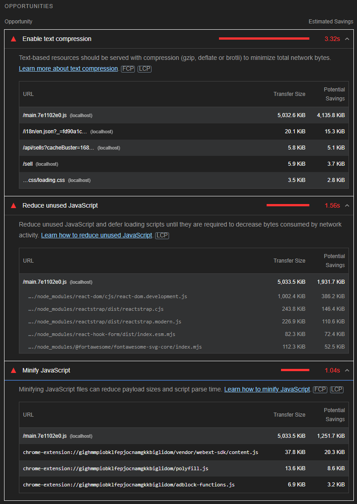

#### **3.2.2.1 Enable text compression**

Text-based resources should be served with compression to minimize total network bytes. To enable text compression for improving performace the bellow list could be follow:
  * **Gzip Compression:** Gzip compression is a popular technique used to reduce the size of files, including JavaScript files, before transmitting them over the network. It works by compressing the content at the server-side and decompressing it on the client-side, resulting in reduced file sizes and faster downloads.
  
  Enabling Gzip compression for JavaScript files can significantly reduce their file size, resulting in faster downloads and improved performance. Combined with other optimization techniques, such as minification and script deferment, it can help optimize the website or application for efficient network activity.

##### **3.2.2.2 Reduce unused JavaScript**

To reduce the unused JavaScript we can follow some good pratices:

  * **Remove Unused JavaScript:** Analyse the site/application code and identify any JavaScript files that are not being used. Remove or refactor these scripts to reduce the amount of code being loaded unnecessarily.
  * **Code splitting:** Split JavaScript code into smaller modules or chunks based on the functionality they provide. This allows to load only the code needed for a particular page or functionality.
  * **Asynchronous loading:** Instead of blocking the rendering of the web page, load JavaScript files asynchronously using the async attribute in the script tag. This ensures that scripts are fetched in parallel, without slowing down the rendering of the page. 
    * `` <script async src="script.js"></script> ``
  * **Lazy Load:** For non-critical JavaScript files, consider slow loading when it is really needed. This is particularly useful for scripts associated with user interactions or specific events.

##### **3.2.2.3 Minify JavaScript**

Minification is the process of removing whitespace and any code that is not necessary to create a smaller but perfectly valid code file.

Minification can be done in 3 ways:
* **Manual Minification:** Removing unnecessary whitespace, comments and line breaks. However, this approach can be time-consuming and error-prone, especially for larger codebases.
* **Build Tools:** Build tools like Webpack, Rollup, or Gulp. These tools can automate the minification process and provide additional optimizations like dead code elimination and variable renaming.
* **Online Minifiers:** There are several online tools available that allow minify JavaScript code without the need for any compilation tools. The code can be copied and pasted into these tools. Terser[[12]](#refs) is a popular JavaScript compression tool.

**_Note: This opportunities are the same for the three pages_** 

#### **3.2.3 Sell Page**

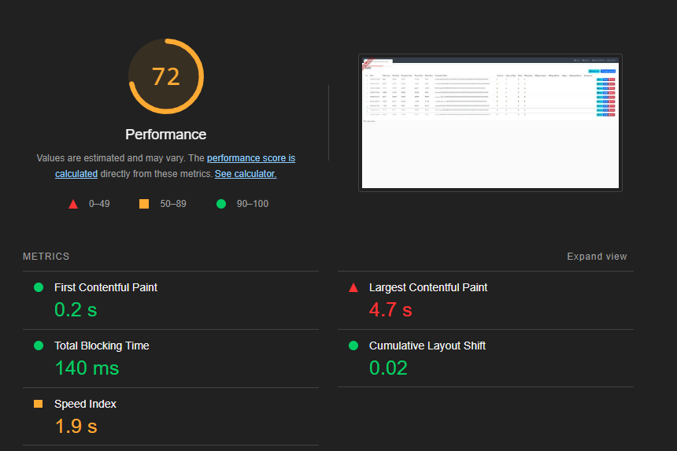


[**A more detailed report can be read here**](files/FrontEnd/PerformanceReports/Sell.html)

#### **3.2.4 Sell View Page**

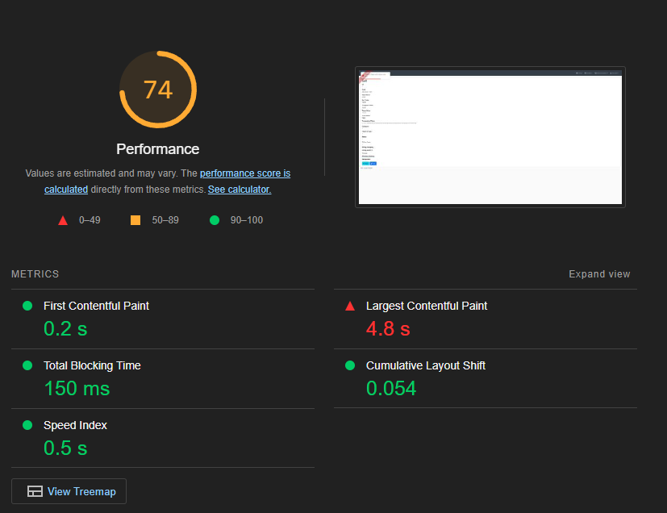


[**A more detailed report can be read here**](files/FrontEnd/PerformanceReports/SellView.html)


#### **3.2.5 Sell Edit Page**

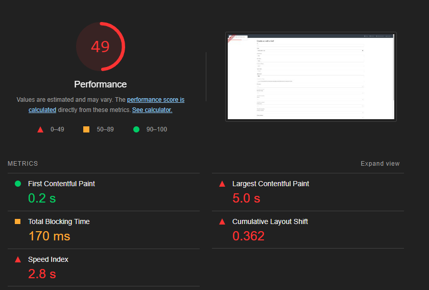

[**A more detailed report can be read here**](files/FrontEnd/PerformanceReports/SellEdit.html)


#### **3.2.5 Diagnostics**

The Sell page and the SellView page both had between 70 and 75 so some improvement is needed.
The Sell Edit Page didn't go beyond 49, so the performance, in this case, is really low.

The diagnosis showed the same problems for all 3 pages. I will list below the main problems and how to try to solve them in order to improve the performance of the application.

##### **3.2.5.1 Avoid serving legacy JavaScript to modern browsers**

The strategy of deploying modern scripts with module/node resource detection allows to reduce shipping of unnecessary code to modern browsers while maintaining support for legacy browsers. Code is bundled as ES modules for modern browsers, while legacy browsers receive a separate package with transpile code and polyfills. This results in faster loading and better performance, serving a wide range of browsers.[[13]](#refs)

##### **3.2.5.2 Image elements do not have explicit width and height**

It is recommended to set explicit width and height on image elements in order to reduce layout shifts and improve Cumulative Layout Shift (CLS) in Lighthouse. Specifying a specific size for the images prevents the page from experiencing layout shifts when the images are loaded, which can lead to a poor user experience. By providing the correct width and height, the browser can allocate the necessary space for the image, thus preventing layout changes and improving CLS. This can be done by using the "width" and "height" attributes on the &lt;img&gt; tag or by setting the size through CSS.[[14]](#refs)

##### **3.2.5.2 Page prevented back/forward cache restoration**

The backward/forward cache (bfcache) is a browser feature that enables faster browsing when users return to a previously visited page or forward again. It stores the entire state of a page, including the JavaScript stack and DOM tree, so that it can be quickly restored without having to reload or re-analyse the page resources.

However, on the current page, there are factors that prevent bfcache from restoring. This means that the browser is not using the bfcache for back browsing, which could potentially affect the speed and performance of these browsings.[[15]](#refs)

##### **3.2.5.2 Avoid enormous network payloads**

To improve website performance and minimise costs for users, it is important to avoid sending large network loads. Large network loads result in long loading times and consume significant amounts of data, which can lead to additional costs for users with limited data plans.

Here are some recommendations for reducing network charges:

* Compress and optimize assets
* Minify and bundle code
* Lazy load resources
* Implement caching
* Use a content delivery network (CDN)
* Implement server-side optimizations

By implementing these strategies, the network payload size of the website can be significantly reduce. This leads to faster load times, improved user experience, and reduced costs for the users in terms of both time and data consumption.[[16]](#refs)

## <a id="4"></a> 4. Security

### 4.1 OWASP ZAP

Owasp Zap (Zed Attack Proxy) is a web application security testing tool developed by the Owasp project (Open Web Application Security Project). Zap is a free, open source tool widely used by developers, security testers and cyber security professionals to identify and fix vulnerabilities in web applications.
Owasp Zap is a powerful tool for identifying security vulnerabilities in web applications and can be used both by developers during the development process and by security testers in security assessments of existing applications.

### 4.2 OWASP ZAP TOP 10 List

The Owasp Top 10 list[[17]](#refs)[[18]](#refs) is a compilation of the top ten security vulnerabilities found in web applications. The list is updated periodically to reflect the latest threats and vulnerabilities.

Here is the Owasp Top 10 list of 2021, which identifies the top security vulnerabilities found in web applications:

* A01 Broken Access Control: Refers to the lack of adequate access restrictions to protected resources, allowing unauthorised users to access restricted functionality or information.
* A02 Cryptographic Failures: Involves the incorrect or weak use of cryptographic algorithms, keys or secret storage, resulting in the exposure of confidential information.
* A03 Injection: Refers to the unauthorized insertion of malicious code in data entries, such as SQL, operating system commands, LDAP, among others. This occurs when data is not properly validated, allowing the execution of unwanted commands in the system
* A04 Insecure Design: Involves flaws in the design and architecture of a system, leading to vulnerabilities that can be exploited by attackers
* A05 Security Misconfiguration: Refers to the failure to implement proper security settings on applications, servers or components, leaving gaps that can be exploited by attackers
* A06 Vulnerable and Outdated Components: Involves the use of software components or libraries with known vulnerabilities or outdated versions that can be exploited by attackers
* A07 Identification and Authentication Failures: Refers to problems related to authentication, such as weak passwords, credential protection failures, weak or non-existent authentication, among others.
* A08 Software and Data Integrity Failures: Involves the unauthorised manipulation or corruption of software or data, resulting in integrity breaches.
* A09 Security Logging and Monitoring Failures: Refers to the lack of ability to monitor and record relevant security events, making it difficult to detect suspicious activities and respond to incidents.
* A10 Server-Side Request Forgery:Involves the exploitation of applications that allow an attacker to make unauthorised requests to other systems or services on the network.

#### 4.2.1 A05:2021 – Security Misconfiguration

Security Misconfiguration is one of the main vulnerabilities listed in the Owasp Top 10. This vulnerability occurs when security settings in an application, server or component are not properly implemented or are left with insecure default values.

Inadequate Security Configuration can result in several security breaches such as:

* Insecure default settings
* Detailed error pages
* Inadequate file and directory permissions
* Missing or disabled security settings
* Unused features enabled
* Improper session management

To avoid Inappropriate Security Configuration, it is important to follow security best practices, such as reviewing and adjusting security settings, disabling unused features, applying vendor-recommended settings, and maintaining a secure and up-to-date configuration management process. In addition, performing regular security analysis and penetration testing can help identify and correct any inappropriate configurations.

##### 4.2.1.1 Attack Scenario

Directory listing is not disabled on the server. An attacker discovers they can simply list directories. They find and download the compiled Java classes, which they decompile and reverse engineer to view the code. The attacker then finds a serious access control flaw in the application.

#### 4.2.2 A09:2021 – Security Logging and Monitoring Failures

Security Logging and Monitoring Failures is a vulnerability that involves a lack of ability to monitor and log relevant security events on a system or application. This failure can compromise suspicious activity detection, forensic analysis, and security incident response.

When security monitoring and logging failures occur, several negative consequences can arise, such as:

* Difficulty in detecting attacks
* Inadequate incident response
* Lack of monitoring of suspicious behaviour
* Inadequate compliance

To mitigate this vulnerability, it is critical to implement a robust security monitoring and logging system. This may include setting up logs of relevant events, such as failed authentication attempts, elevated privilege activities, access to sensitive resources and security breach events. In addition, it is important to set up alerts and notifications for suspicious activities and establish appropriate incident response procedures to deal with any identified security events.

##### 4.2.2.1 Attack Scenario

An attacker scans for users with a common password. They can take over all accounts with this password. For all other users, this scan leaves only one false login behind. After some days, this may be repeated with a different password.

### 4.3 Analysis

For my endpoint none of the above vulnerabilities were found, however I was able to find an A05 in at least one endpoint so I decided to present it below:

| Alert                              | Scale  | Description | Solution |
| ---------------------------------- | ------ | ----------- | -------- |
| Cloud Metadata Potentially Exposed | High   | The potential cloud metadata exposure vulnerability occurs when sensitive metadata of a cloud instance is exposed due to incorrect or insecure configurations. This could allow an attacker to access sensitive information, such as API keys, access credentials, or other sensitive cloud instance information. To mitigate this vulnerability, it is important to review and enforce cloud security settings, ensuring that metadata is adequately protected and that only necessary information is publicly available. In addition, it is important to maintain security updates and follow recommended best practices from cloud service providers. | To address this vulnerability, it is recommended to perform the following actions: 1. Review and enforce cloud security settings to ensure metadata is adequately protected. 2. Ensure that only necessary information is publicly available and restrict access to sensitive metadata. 3. Maintain security updates and follow best practices recommended by cloud service providers. 4. Implement appropriate access control and authentication to protect metadata from unauthorised access. 5. Perform regular security testing and audits to identify and correct any misconfigurations or vulnerabilities of cloud metadata exposure. |

[**A more detailed report can be read here**](files/OWASP%20ZAP/2023-06-05-ZAP-Report-localhost.html)

## <a id="5"></a> 5. Accessibility

Accessibility aims to ensure that websites, applications and other technologies are usable by people with different types of disability, such as visual, hearing, motor or cognitive impairment.

### 5.1 Technologies

#### 5.1.1 Lighthouse

Lighthouse[[10]](#refs) is an open source tool developed by Google that helps evaluate the quality and performance of websites and web applications. It is widely used by developers, SEO professionals and quality teams to ensure their sites meet recommended standards and deliver a great user experience.

Here are some of the main areas addressed by Lighthouse:

* Performance
* Accessibility
* Best practice
* SEO
* Web Progressivity

### 5.2 Sell

#### 5.2.1 Sell Page

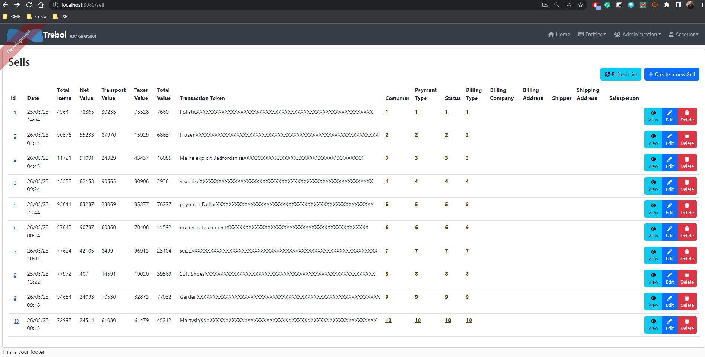

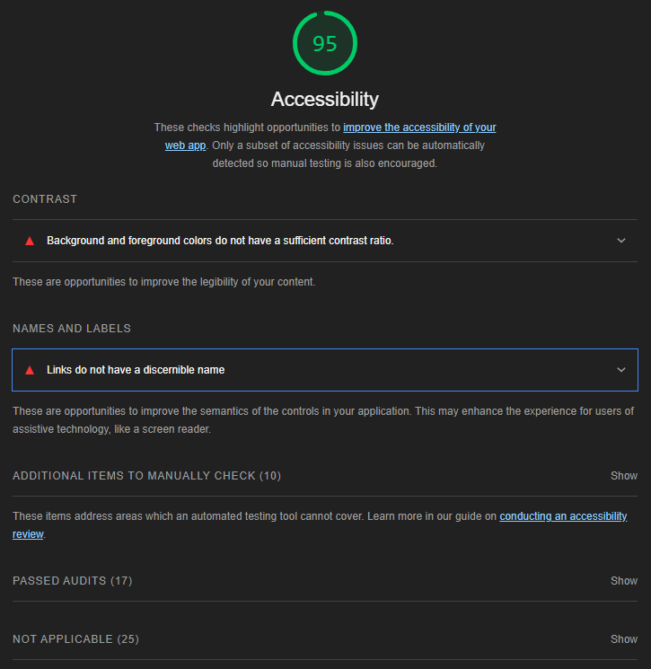

[**A more detailed report can be read here**](files/FrontEnd/AccessibilityReports/Sell.html)

The message **_"Background and foreground colors do not have a sufficient contrast ratio"_** is a common warning provided by Lighthouse Accessibility when the contrast between background and text colours on a website or application does not meet accessibility criteria.

Adequate contrast between colours is important to ensure that text is readable for all people, especially those with visual impairments or reading difficulties. Insufficient contrast can make content unreadable, especially on devices with low quality screens or in poorly lit environments.

To solve this problem and comply with accessibility guidelines, the following practices can be followed:
* Increase contrast
* Use accessible colours.
* Avoid information by colour alone

The message **_"Links have no discernible name"_** is a common accessibility issue identified by Lighthouse accessibility testing. This means that there are links on the website or app that do not have a clear and descriptive name, making it difficult for users, especially those who rely on assistive technologies, to understand the purpose or destination of the link.

To solve this problem and ensure accessibility, here are some recommended practices:
* Ensure all link names are accessible
* Ensure all links can receive programmatic focus
* Ensure all link text is visible to screen readers
* Make sure all links can receive programmatic focus
* Do not modify link styles to suppress style changes when a link is programmatically focused

#### 5.2.1 Sell View Page

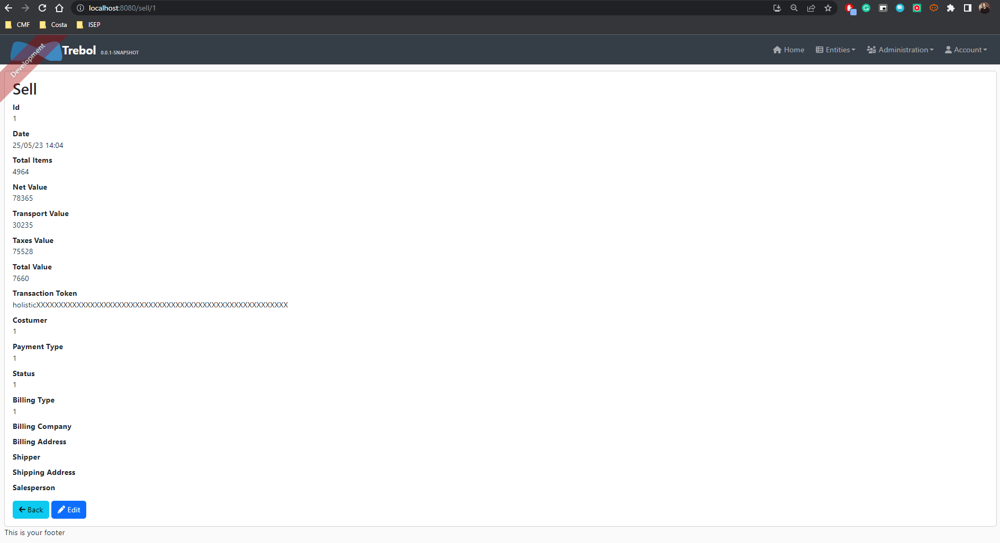

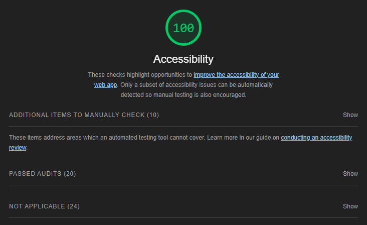


[**A more detailed report can be read here**](files/FrontEnd/AccessibilityReports/SellView.html)

No accessibility issues identified.

#### 5.2.1 Sell Edit Page

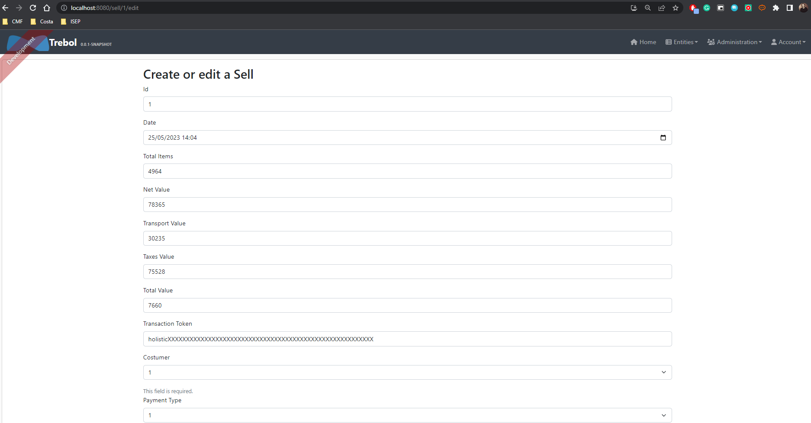

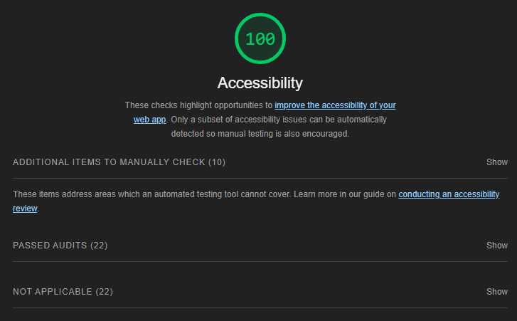

[**A more detailed report can be read here**](files/FrontEnd/AccessibilityReports/SellEdit.html)

No accessibility issues identified.

### 5.3 WCAG 2.1

WCAG 2.1 (Web Content Accessibility Guidelines) is an internationally recognised set of guidelines for making web content more accessible. The WCAG 2.1 guidelines are divided into three levels of compliance: A, AA and AAA. Level AA is considered the intermediate level and addresses a wide range of accessibility requirements.

After analysing the accessibility of the pages, I consider them to be classified according to the WCAG 2.1 metrics as AA. This means that the application meets a satisfactory level of accessibility, making it more inclusive and usable by a wider audience, including people with disabilities and special needs.

By rating the application as AA, this indicates that several accessibility best practices have been implemented. These practices may include, among other things, the appropriate use of semantic markers for page structure, provision of textual alternatives to images, appropriate use of colour and contrast, availability of keyboard navigation options, appropriate readability of content, and provision of clear and concise information.

## <a id="6"></a> 6. Compatibility

### 6.1 Browser Compatibility

Browser compatibility refers to the ability of a website or web application to function correctly in different web browsers. Each browser has its own rendering engine and interprets HTML, CSS and JavaScript in slightly different ways, which can lead to variations in how a website displays and functions.

It is important to ensure browser compatibility so that users can access a website across a variety of different browsers, devices and platforms. If a site is not compatible with a particular browser, parts of the site may not display correctly, the functionality may not work properly or the site may not load at all.

#### 6.1.1 Google Chrome

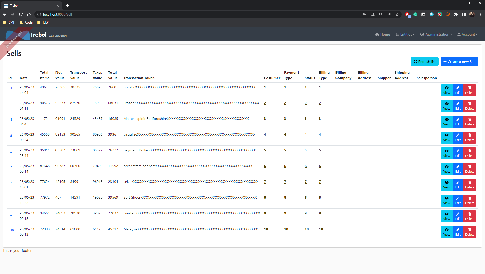

#### 6.1.2 Microsoft Edge

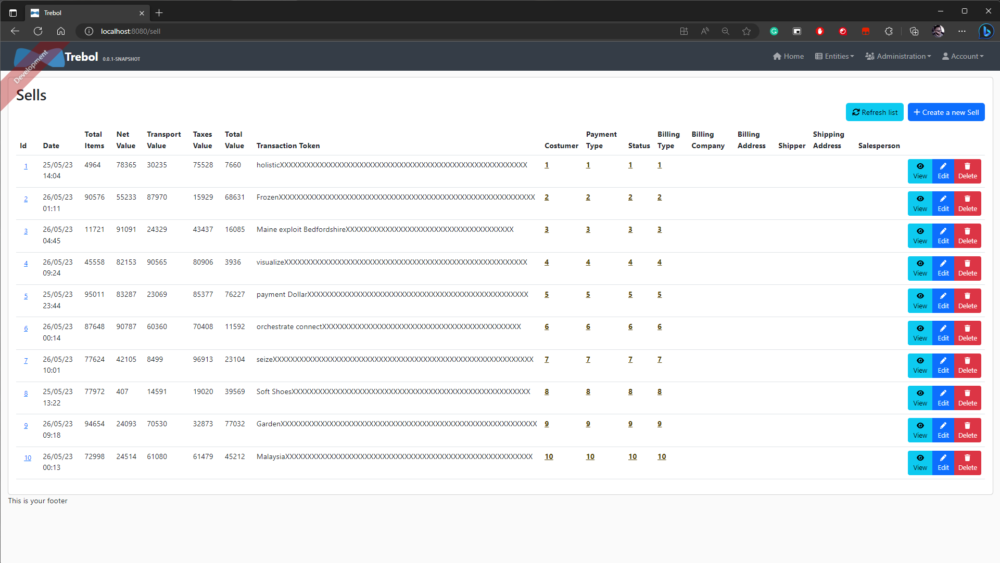

#### 6.1.3 Mozila Firefox

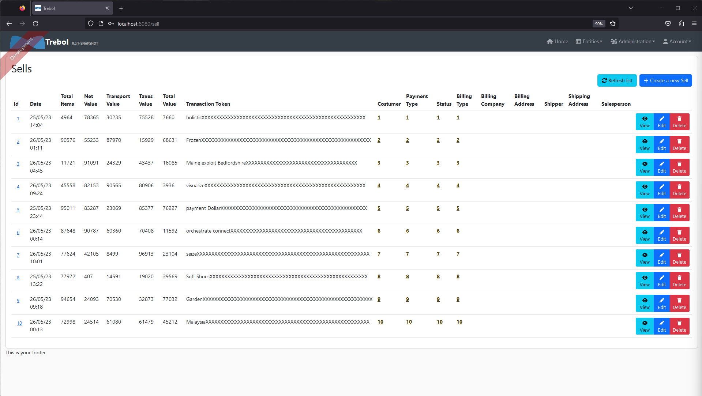

After carrying out an analysis of the same page in relation to browser compatibility, we found that the application works correctly in Chrome, Firefox and Edge browsers without any problems. These browsers are widely used and represent a significant portion of web users.

In Chrome, the application renders correctly, all functionality runs flawlessly, and the user experience is satisfactory. Chrome has a solid history of supporting web standards and is constantly evolving.

In Firefox, the application also works perfectly. Firefox has a reputation for commitment to web standards and is known for its solid performance. The rendering and operation of the application is consistent with what is expected.

Edge, Windows 10's default browser, also demonstrates seamless compatibility with the app. Since the transition to the Chromium-based rendering engine, compatibility has improved considerably. Edge is now able to correctly interpret page elements, execute scripts and provide a consistent and seamless experience.

In summary, the application has been tested and works correctly in Chrome, Firefox and Edge browsers, providing a satisfactory experience for users of these widely used browsers.

### 6.2 Device Compatibility

#### 6.2.1 Desktop


#### 6.2.2 SmartPhone

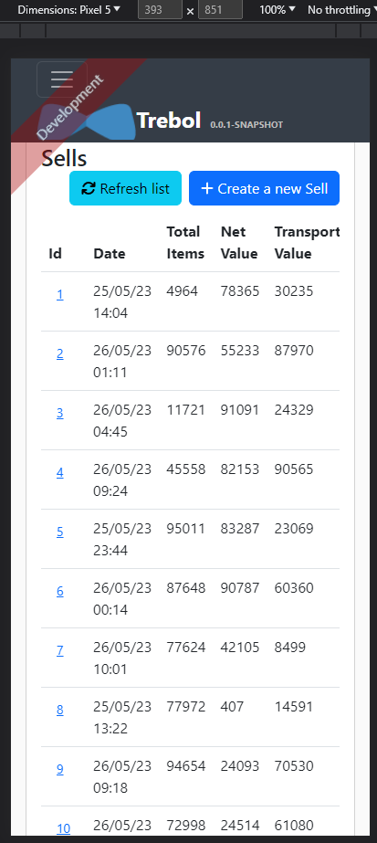

#### 6.2.3 iPad

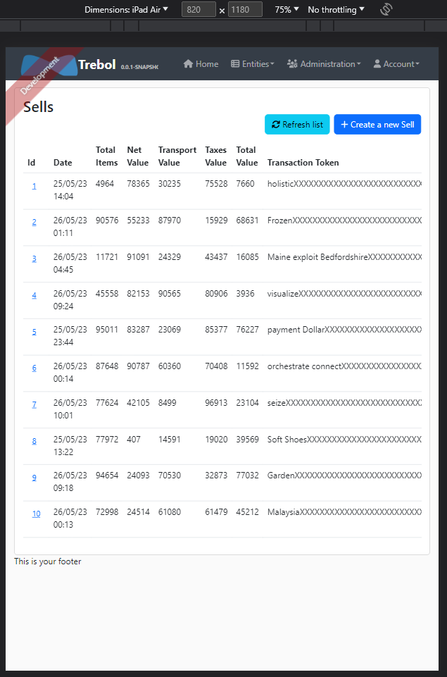

The application was analysed in terms of device compatibility and was found to work correctly on the computer, smartphone and iPad without any problems. This means that users can access and use the application without difficulty on different devices.

On the desktop, the application is displayed correctly, all features are available and work as expected. The interface fits the screen size correctly, providing a satisfying user experience.

On smartphones, the application also works properly. The interface is responsive and adapts to the screen size of the device, allowing easy and accessible navigation. All features are available and can be used without problems.

On the iPad, a device with a larger screen, the application is displayed correctly and all functionalities are accessible. The interface adjusts to the size of the iPad screen, ensuring a consistent and satisfying experience for users.

In summary, the analysis of the app's compatibility with the devices revealed that it works correctly on the computer, smartphone and iPad without any problems. This means that users can enjoy the app on different devices without losing functionality or user experience.

### 6.3 Platform Compatibility

#### 6.3.1 Android

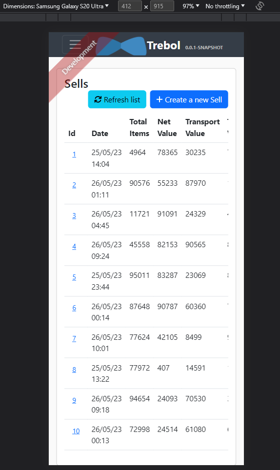
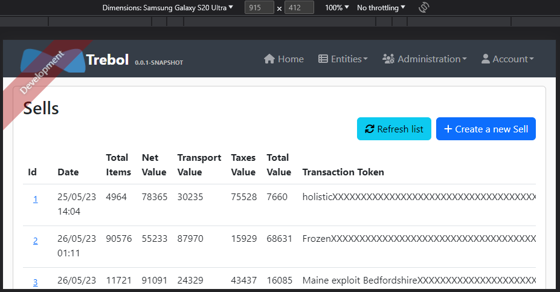

#### 6.3.2 iOS

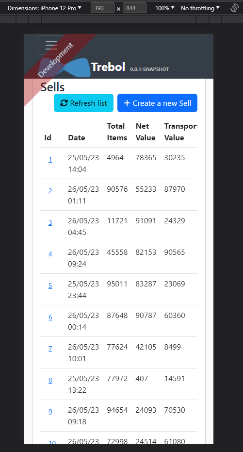
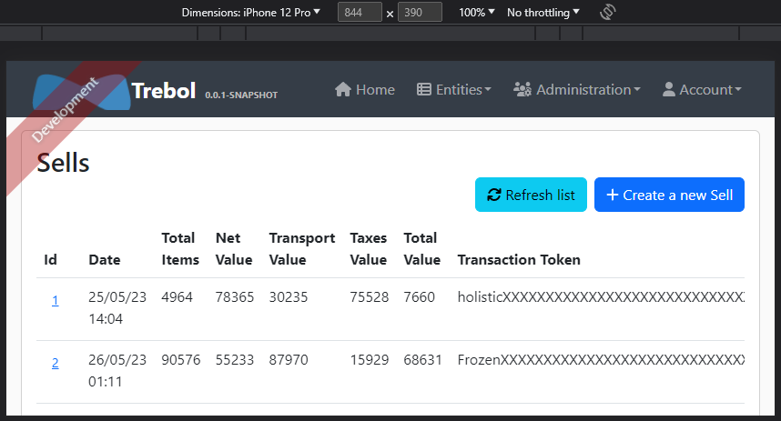

#### 6.3.3 Windows

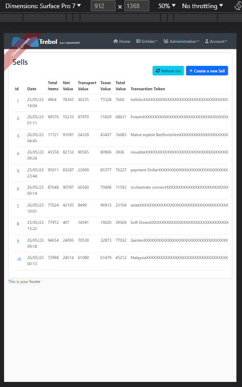

The application was analysed in terms of platform compatibility and was found to work correctly on Android, iOS and Windows operating systems without any problems. This means that users can use the app on their preferred devices, regardless of the operating system used.

On Android, the app is compatible and works perfectly. All the features are available and the interface adapts to the Android operating system environment, providing a satisfactory user experience.

On iOS, the application is also compatible and works flawlessly. All features are accessible and the interface follows the iOS visual and interaction standards, ensuring a consistent experience for iOS users.

On Windows, the application is compatible and runs smoothly. All features are available and the interface adapts to the Windows platform, offering a suitable experience for users of the operating system.

In summary, the platform compatibility analysis of the app revealed that it works properly on Android, iOS and Windows operating systems without any issues. This means that users can enjoy the app on their preferred devices, regardless of the operating system used, with a consistent and satisfying experience.

## <a id="8"></a> 8. Conclusions

The Trebol project has a good to excellent overall maintainability score, but the SellResource class needs improvement as it has a below-average score. Some methods within the class also require attention for better maintainability. The absence of comment blocks in the front-end code suggests a need for adding appropriate comments to enhance understanding and maintainability.

Performance testing identified areas for improvement in response time, error rate, and workload handling. It is recommended to optimize the application, reduce errors, and ensure a positive user experience. Continuous monitoring and additional testing are crucial for validating improvements and meeting user needs.

Diagnostics revealed performance issues on specific pages, including legacy JavaScript delivery, lack of image element specifications, absence of back/navigation cache support, and excessive network loads. These issues should be addressed to enhance the application's performance.

A potential cloud metadata exposure vulnerability was identified, highlighting the importance of reviewing and enforcing cloud security settings to protect sensitive information.

The application and tested pages meet WCAG 2.1 AA accessibility standards, promoting inclusivity and usability for people with disabilities.

Furthermore, the application demonstrated compatibility across major browsers, devices (desktop, smartphone, iPad), and platforms (Windows, iOS, Android), ensuring a consistent user experience in various environments.

Considering these points, the application can serve as a basis for a new one, provided that the areas for improvement are addressed and the improvements are implemented. A positive maintainability score indicates that the existing code can be used as a starting point for the development of a new application. 

On the other hand depending on the extent of improvements required and the complexity of the existing application, it may be more productive and efficient to start a new application from scratch, rather than attempting to patch and enhance an existing application.

When starting a new project, you can take advantage of lessons learned from the previous application, avoid known issues, and adopt best practices from the beginning. Also, starting from scratch offers the opportunity to use newer technologies and more efficient development approaches.

## <a id="7"></a> 7. Other Issues

NA

## <a id="refs"></a> 9. References

[1] Lehman, M. M. (1980). Programs, life cycles, and laws of software evolution. Proceedings of the IEEE, 68(9), 1060-1076.

[2] Coleman, D., Ash, D., Lowther, B., & Oman, P. (1994, August). Using metrics to evaluate software system maintainability. Computer, 27(8), 44-49. DOI: 10.1109/2.291294

[3] MetricsTree plugin for IntelliJ IDEA. [https://plugins.jetbrains.com/plugin/13959-metricstree](https://plugins.jetbrains.com/plugin/13959-metricstree)

[4] Sonargraph Product Family. [https://www.hello2morrow.com/products/sonargraph](https://www.hello2morrow.com/products/sonargraph) 

[5] BASICS, METRICS, SOFTWARE DEVELOPMENT, SOFTWARE QUALITY (2009) Software Quality: The Basics II - CCD, ACD, Ca, Ce, I, A, I/A and D [https://blog.eisele.net/2009/12/software-quality-basics-ii-ccd-acd-ca.html](https://blog.eisele.net/2009/12/software-quality-basics-ii-ccd-acd-ca.html)

[6] McCabe, T. J. (1976). "A complexity measure." IEEE Transactions on Software Engineering, 2(4), 308-320.
 
[7] Gillis, A. S. (2023). Performance Testing. [https://www.techtarget.com/searchsoftwarequality/definition/performance-testing](https://www.techtarget.com/searchsoftwarequality/definition/performance-testing)

[8] Apache Software Foundation. https://jmeter.apache.org/

[9] Otrebski, K. (2018)  [https://www.signifytechnology.com/blog/2018/05/flaky-tests-by-krzysztof-otrebski?source=google.com](https://www.signifytechnology.com/blog/2018/05/flaky-tests-by-krzysztof-otrebski?source=google.com)

[10] Lighthouse Overview. (May 24, 2022) [https://developer.chrome.com/docs/lighthouse/overview/](https://developer.chrome.com/docs/lighthouse/overview/)

[11] Lighthouse performance scoring. (September 19, 2019) [https://developer.chrome.com/docs/lighthouse/performance/performance-scoring/?utm_source=lighthouse&utm_medium=devtools](https://developer.chrome.com/docs/lighthouse/performance/performance-scoring/?utm_source=lighthouse&utm_medium=devtools)

[12] terser - JavaScript mangler and compressor toolkit for ES6+. [https://terser.org/](https://terser.org/)

[13] Djirdeh, H., Miller, J. (2020, December 10) Publish, ship, and install modern JavaScript for faster applications. [https://web.dev/publish-modern-javascript/?utm_source=lighthouse&utm_medium=devtools](https://web.dev/publish-modern-javascript/?utm_source=lighthouse&utm_medium=devtools)

[14] Osmani, A. (2020, May 5) Otimize a Cumulative Layout Shift. [https://web.dev/optimize-cls/?utm_source=lighthouse&utm_medium=devtools#images-without-dimensions](https://web.dev/optimize-cls/?utm_source=lighthouse&utm_medium=devtools#images-without-dimensions)

[15] Ensure the page can be restored from the back/forward cache. (2023, January 12) [https://developer.chrome.com/docs/lighthouse/performance/bf-cache/?utm_source=lighthouse&utm_medium=devtools](https://developer.chrome.com/docs/lighthouse/performance/bf-cache/?utm_source=lighthouse&utm_medium=devtools)

[16] Avoid enormous network payloads. (2019, May 2) [https://developer.chrome.com/docs/lighthouse/performance/total-byte-weight/?utm_source=lighthouse&utm_medium=devtools](https://developer.chrome.com/docs/lighthouse/performance/total-byte-weight/?utm_source=lighthouse&utm_medium=devtools)

[17] OWASP Top 10 - 2021 [https://owasp.org/Top10/](https://owasp.org/Top10/)

[18] OWASP Top Security Risks & Vulnerabilities 2021 [https://sucuri.net/guides/owasp_top_10_2021_edition/](https://sucuri.net/guides/owasp_top_10_2021_edition/)
