# **README** #

# **Developed by Beatriz Vaz (1190429)**

This folder includes all artifacts developed for the Second Part of QESOFT Project.

This file is structured as follows:

1. Introduction
2. Accessibility
3. Compatibility
4. Maintainability
5. Performance
6. Security
7. Conclusions
8. References

## **1. Introduction**

The objective of the second period of the QESOFT project is to dissect a JHipster application, created from the task utilized in the main stage.

The application will be evaluated based on a number of quality indicators, including: accessibility, compatibility, maintainability, performance and security. Metrics will be measured based on the GQM in the overall report for each quality attribute.

After evaluating the ProductCategoryResource class and its methods, this report will draw its conclusions.


## **2. Accessibility**

Accessibility is the practice of making your websites usable by as many people as possible. Traditionally, accessibility is associated with people with disabilities, but the practice of making sites accessible also benefits other groups such as those using mobile devices, or those with slow network connections. [[1]](#ref-1)

Six metrics were identified to determinate the accessibility of the application in the GQM presented in the global report. 

To measure these metrics, it was used Lighthouse.
Lighthouse is an open-source, automated tool for improving the quality of web pages. You can run it against any web page, public or requiring authentication. It has audits for performance, accessibility, progressive web apps, SEO, and more. [[2]](#ref-2)

With Lighthouse the accessibility audits were checked.
The accessibility audits checks highlight opportunities to improve the accessibility of your web app. Only a subset of accessibility issues can be automatically detected so manual testing is also encouraged. [[3]](#ref-3)

Report generated by LightHouse: [Lighthouse Report - Accessibility](./reports/LightHouseProductCategoryAccessibility.html)

Since the global score was 100, it is considered an excellent value.

### **2.1 Aria**

Five audits were found applicable to this metric and all of them passed the tests.

These are opportunities to improve the usage of ARIA in the application which may enhance the experience for users of assistive technology, like a screen reader.

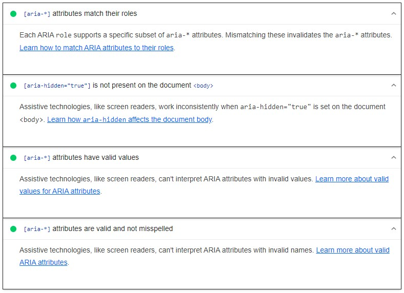
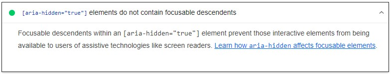

### **2.2 Name and Labels**

Four audits were found applicable to this metric and all of them passed the tests.

These are opportunities to improve the semantics of the controls in the application. This may enhance the experience for users of assistive technology, like a screen reader.

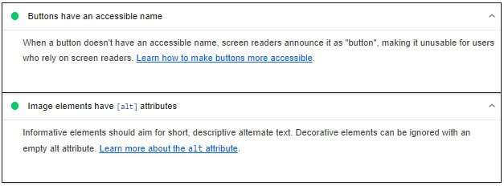
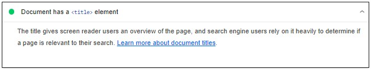
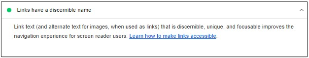

### **2.3 Navigation**

One audit was found applicable to this metric and passed the test.

These are opportunities to improve keyboard navigation in the application.

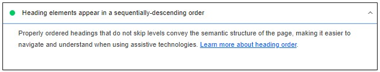

### **2.4 Contrast**

One audit was found applicable to this metric and passed the test.

These are opportunities to improve the legibility of the content.

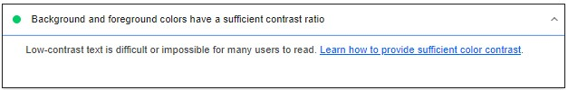

### **2.5 Tables and Lists**

Three audits were found applicable to this metric and all of them passed the tests.

These are opportunities to improve the experience of reading tabular or list data using assistive technology, like a screen reader.

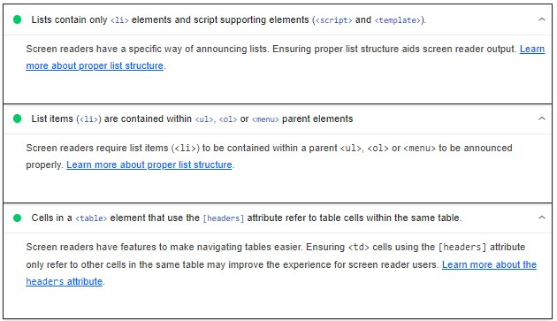


### **2.6 Internationalization and Location**

Two audits were found applicable to this metric and all of them passed the tests.

These are opportunities to improve the semantics of the controls in the application. This may enhance the experience for users of assistive technology, like a screen reader.

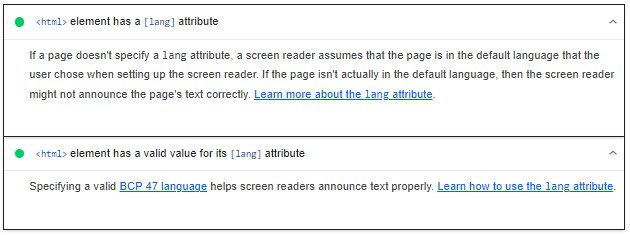

### **2.7 WCAG 2.1**

To evaluate web accessibility and compare the results to WCAG 2.1 it was used a tool WAVE. [[4]](#ref-4)

WAVE is a web openness assessment instrument created by WebAIM.org. By incorporating icons and indicators into your page, it provides visual feedback regarding the accessibility of your website content.

Using this tool was possible to visualize the error Empty table header presented bellow:

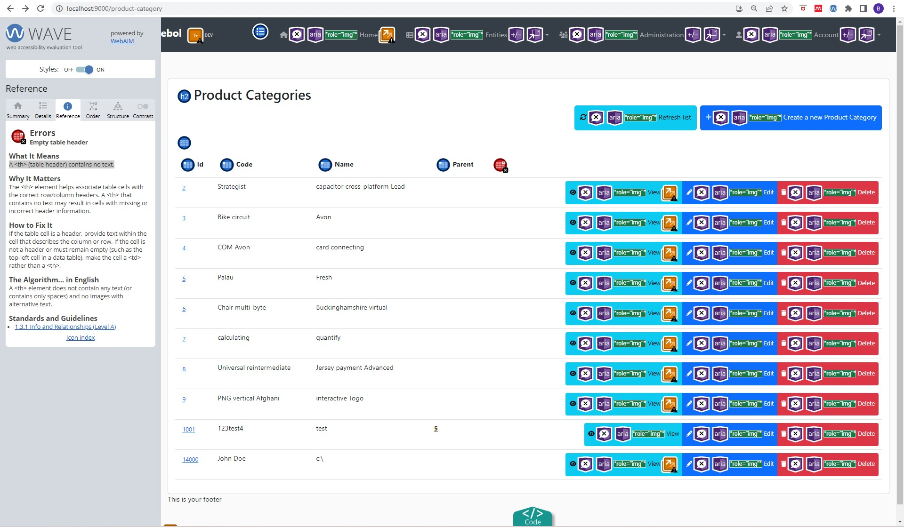

It is possible to conclude that this page achieves the A grade.


## **3. Compatibility**

To test the level of compatibility of the application, the group decided to use the metrics: Browser Compatibility, Platform Compatibility and Device Compatibility.

### **3.1 Browser Compatibility**

Browser Compatibility refers to the ability of a certain website or app to appear fully functional on different browsers that are available in the market. [[5]](#ref-5)

To make sure the website is compatible with different browsers, it is needed to follow a systematic process of addressing potential issues and providing a consistent user experience across different browsers.
The process begins with utilizing standardized web technologies like HTML, CSS, and JavaScript, to ensure broader browser support.

For cross-browser testing, the browsers Google Chrome, Mozilla Firefox, and Microsoft Edge to ensure wide coverage.

All the browsers mentioned were tested using the Product Category page and all of them had the same behavior.

#### **Google Chrome**


#### **Mozilla Firefox**
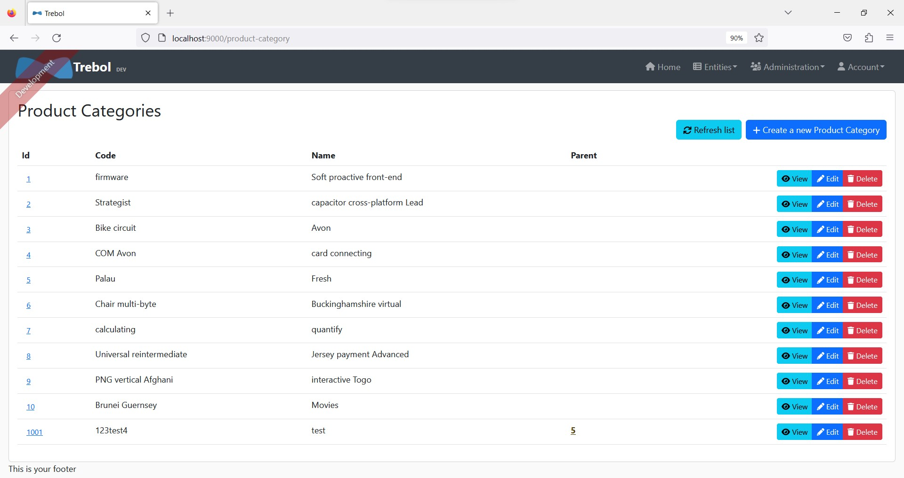

#### **Microsoft Edge**
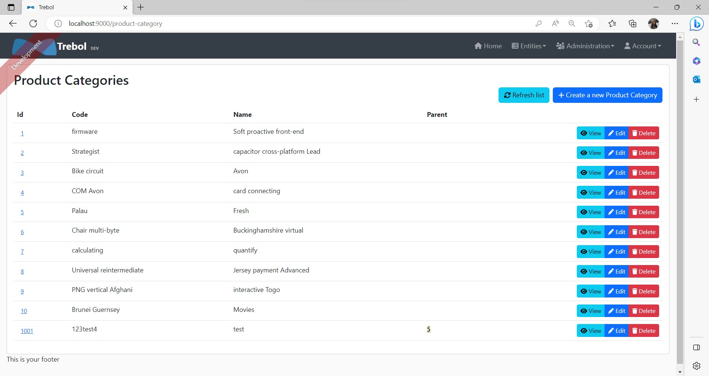

It is possible to see that there are no differences between the three browsers analyzed.

### **3.2 Device Compatibility**

Testing software for device compatibility involves checking its behavior on several devices including mobile phones, tablets, laptops, and desktop systems. Although most of the users use mobile phones for internet access, this part of testing remains of critical importance as you can never anticipate how end-user preferences change. [[6]](#ref-6)

Therefore, to the website, it is necessary to run it on desktop systems, laptops, mobile phones, and tablets.

To test this metric it was used Chrome dev tools to change the dimensions of the page.

The values used were:

- Design for desktop displays from 1280×720 through 1920×1080
- Design for mobile displays from 360×640 through 414×896
- Design for tablet displays from 601×962 through 1280×800

#### **Desktop**
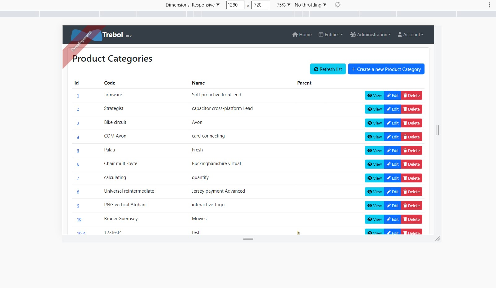

#### **Mobile**
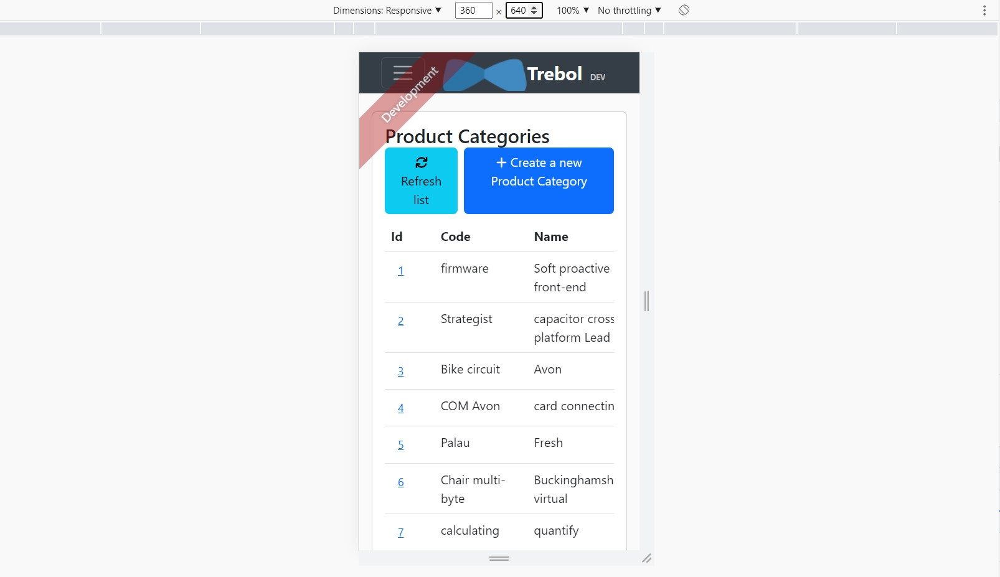

#### **Tablet**


It is possible to see that there are no differences between the three devices analyzed.

### **3.3 Platform Compatibility**

Cross Platform Compatibility testing measures how well pages display on different software and hardware platforms, including different browser versions, different operating systems and different machines.

Platform compatibility testing addresses the difference between operating systems such as an Android and an iOS to ensure consistent and reliable performance. [[7]](#ref-7)

#### **Android**
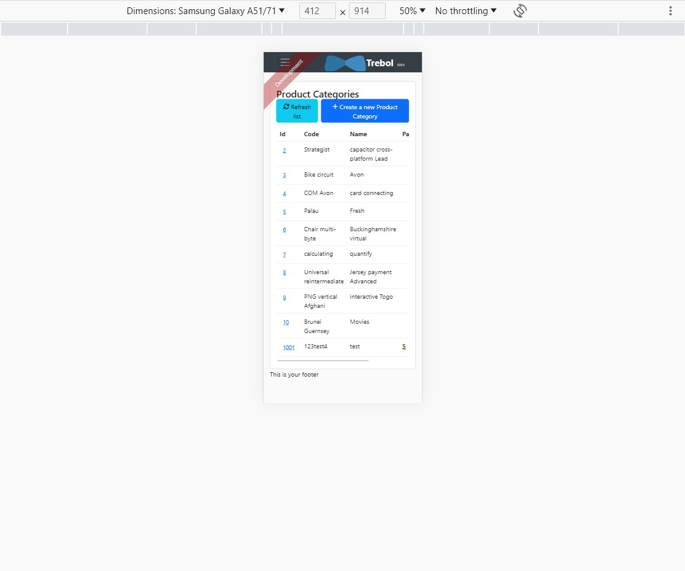

#### **iOS**
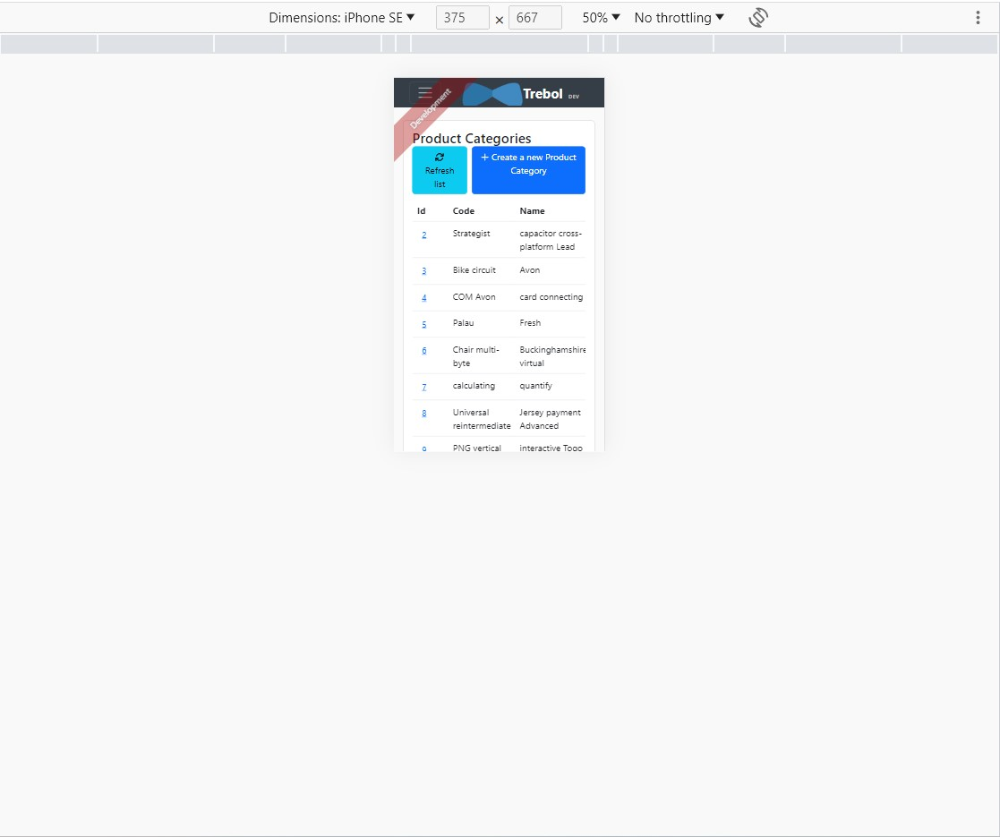

It is possible to see that there are no differences between the two platforms analyzed.


## **4. Maintainability**

It was used the IntelliJ plugin MetricsTree and Sonargraph to measure Coupling and Structural Erosion (CSE) and Size and Complexity (SC).

MetricsTree is an IDE extension that helps to evaluate quantitative properties of java code.
It supports the most common sets of metrics at the project, package, class, and method levels. [[8]](#ref-8)

Sonargraph is a powerful static code analyzer that allows you to monitor a software system for technical quality and enforce rules regarding software architecture, metrics and other aspects in all stages of the development process. The Sonargraph platform supports Java, Kotlin (the JVM version of it), C#, Python 3 and C/C++ out of the box and includes powerful features like a Groovy based scripting engine and a DSL (domain specific language) to describe software architecture. [[9]](#ref-9)

System used in Sonargraph: [Trebol-jhispter.sonargraph](./reports/Trebol-jhispter.sonargraph/system.sonargraph)

To measure CSE were used the metrics: average component dependency, propagation cost, cyclicity and relative cyclicity and maintainability level.

To measure SC were used the metrics: size metric and cyclomatic complexity.

### **4.1 Average Component Dependency (ACD)**

ACD can be obtained by dividing CCD by the number of components to get the ACD.

This way, it was used the tool Sonargraph to calculate the components to get the ACD and the value of CCD.
To do this, in Sonargraph it was selected the class ProductCategoryResource and then selected the option to show in graph view. The graph obtained is in the next image.

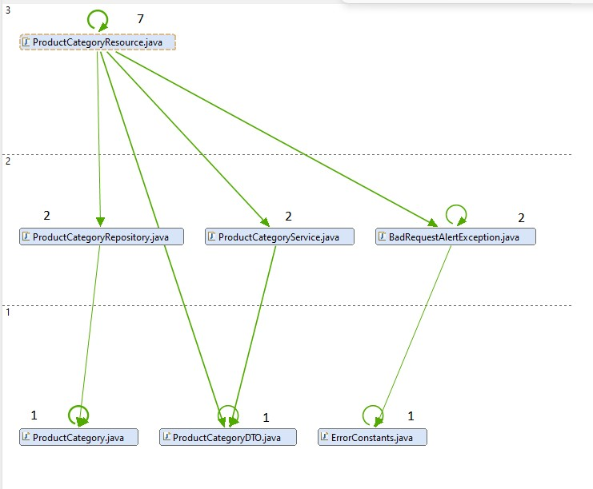

The number above each class represents the value from the metric Depends Upon. This metric was also available in the tool Sonargraph.

Having all the values from the Depends Upon metric of all components of the class ProductCategoryResource, the value CCD can be calculated as the sum of these values.
It was determined that CCD has a value of 16.

As it was said before, ACD can be obtained by dividing CCD by the number of components. This way:

`ACD = 16/7 = 2,28 `

The maximum value is equal to the number of components, in this case it that would be 7
On average, a component depends on 2,28 components. Comparing to the maximum value, it can be said that in terms of coupling, this number is fairly low.

### **4.2 Propagation Cost (PC)**

The metric propagation cost measures the potential impact a change in a component will cause on other components.
A higher propagation cost will likely lead to an increase in complexity of the system therefore making it difficult to maintain.

PC can also be calculated by dividing the ACD once more by the number of nodes (components).

`PC = 2,28/7 = 0,32 `

Since we are working with a small part of the system, this value shouldn't be concerning.

### **4.3 Maintainability Level**

The Maintainability Index first appeared in 1992 when it was proposed by Paul Oman and Jack Hagemeister at the International Conference on Software Maintenance with the goal of establishing automated software development metrics to guide software related decision making. 
The Maintainability Index tries to give a holistic view of the relative maintenance burden for different sections of a project by blending together a series of different metrics. [[10]](#ref-10)
Here we use a more modern adaptation of the original formula proposed in 2011 by Microsoft:

`Maintainability Index = MAX(0,(171 - 5.2 * ln(Halstead Volume) - 0.23 * (Cyclomatic Complexity) - 16.2 * ln(Lines of Code))*100 / 171)`

The ProductCategoryResource class has a Maintainability Index of 32,09

About the methods of this class, their maintainability levels are:

| Method                | Maintainability Index |
|-----------------------|:---------------------:|
| ProductCategoryResource() |        78,0773        |
| createProductCategory()              |        55,7516         |
| deleteProductCategory()              |        61,1356         |
| getAllProductCategory()     |        68,5218        |
| getProductCategory()            |        65,166        |
| partialUpdateProductCategory()              |        49,6253        |
| updateProductCategory()              |        49,9261        |


### **4.4 Size metric**

Lines of Code (LoC) per file counts every line that contains actual code and skips empty lines and comment lines.

Total Lines metric counts every single line, including empty lines and comment lines.

Number of Statements verifies the statements, i.e., s a single complete action performed in the source code, usually terminated by a special character or a newline.

In the class ProductCategoryResource it was possible to determine the following values:

- Lines of Code: 108
- Total Lines: 175
- Number of Statements: 40

These values can indicate of how much the component is doing and how complex it is. 
So, we can say that this component is not complex.


### **4.5 Cyclomatic complexity**

Cyclomatic complexity was proposed in 1976, and it computes the number of different possible execution paths through a method or
function, which is also a floor for the number of test cases needed to achieve 100% test coverage.

For this metric it was analyzed the metric Average Complexity that is described as the weighted average modified extended cyclomatic complexity for fully analyzes code.

- Average Complexity: 2,95

As the value calculated is very low we can say that the class ProductCategoryResource is easy to understand and don't have a big risk associated when modifying the class.

### **4.6 Frontend Coding Issues**

In this section, code complexity and unused code will be described.

#### **Code Complexity**

Complexity refers to the intricacy and convoluted nature of code. High complexity can make code harder to understand, modify, and maintain. Complex code often contains deeply nested conditionals, excessive loops, and long functions or methods.

To measure code complexity it was used the framework ESLint.

ESLint statically analyzes the code to quickly find problems. It is built into most text editors and can be extended with plugins and rules to measure code complexity. [[11]](#ref-11)

It was used the plugin eslint-plugin-complexity. This plugin is based on the Cyclomatic Complexity metric.

To install this plugin it was used the following command:

`npm install eslint-plugin-complexity --save-dev`

Then, the file .eslintrc.json was updated with the lines:

```
{
  "plugins": [
    "complexity"
  ],
  "rules": {
    "complexity": ["error", 0] // Set the maximum allowed complexity value
  }
}
```

With these lines, the "complexity" rule is enabled, and the maximum allowed complexity is set to 0. This way is possible to observe the complexity for each method.

Finally to analyzed the complexity in product-categories, the next command was executed:

`eslint .\src\main\webapp\app\entities\product-category`

In the console was presented the complexity of each function of each file in the path above.

Example of page list of product categories:

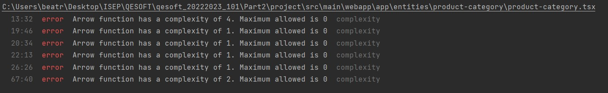

Example of page detail of product categories:

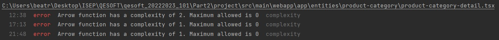

Example of page delete of product categories:

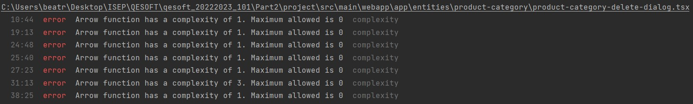

As it is possible to see the complexity of each function isn't too high. Some functions that have a complexity of 4 and 3 need to improve their complexity.

#### **Unused Code**

Unused code is another significant frontend coding issue that can impact maintainability. It refers to pieces of code that are present in the codebase but are not actively used or executed. Having unused code can lead to various problems, such as increased code complexity, decreased performance, and difficulties in code maintenance.

To measure unused code it was used the framework ESLint.
It was used the plugin eslint-plugin-unused-imports.

To install this plugin it was used the following command:

`npm install eslint eslint-plugin-unused-imports --save-dev`

Then, the file .eslintrc.json was updated with the lines:

```
{
  "plugins": [
    "unused-imports"
  ],
  "rules": {
    "unused-imports/no-unused-imports": "error",
  }
}
```

With these lines, the "unused-imports/no-unused-imports" rule is enabled. This way is possible to observe the imports not used in the files.

Finally to analyzed the unused code in product-categories, the next command was executed:

`eslint .\src\main\webapp\app\entities\product-category`

In the console was presented the unused code of each function of each file in the path above.

Example of page list of product categories:

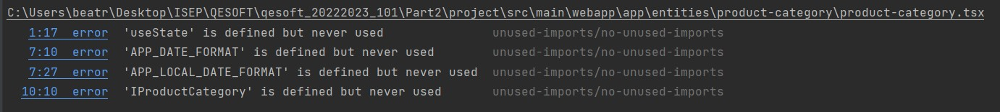

Example of page detail of product categories:

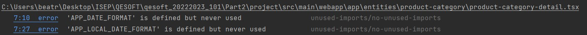

Example of page update of product categories:

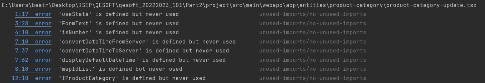

As it is possible to see the unused code of each file isn't too high. All the identified variables can be deleted.

## **5. Performance**

Performance testing is the practice of evaluating how a system performs in terms of responsiveness and stability under a particular workload. Performance tests are typically executed to examine speed, robustness, reliability, and application size.

Performance testing gathers all the tests that verify an application’s speed, robustness, reliability, and correct sizing. It examines several indicators such as a browser, page and network response times, server query processing time, number of acceptable concurrent users architected, CPU memory consumption, and number/type of errors which may be encountered when using an application. [[12]](#ref-12)

These tests highlight improvements you should make to your applications relative to speed, stability, and scalability before they go into production.

To measure the performance it was used Apache JMeter.
Apache JMeter is a pure Java, open-source application that enables load testing and performance measurement of functional behavior. Initially developed for testing web applications, JMeter has evolved to accommodate other types of testing as well.

JMeter can evaluate the performance of both static and dynamic resources, including web-based applications. It is capable of simulating a heavy load on a server, a group of servers, or an object to assess its strength or to analyze overall performance under various load types. [[13]](#ref-13)

In the GQM presented in the global report were identified the metrics First Contentful Paint, Total Blocking Time, Speed Index, Largest Contentful Paint and Cumulative Layout.

To measure these metrics, it was used Lighthouse.
Lighthouse is an open-source, automated tool for improving the quality of web pages. You can run it against any web page, public or requiring authentication. It has audits for performance, accessibility, progressive web apps, SEO, and more. [[2]](#ref-2)

With Lighthouse the performance audits were checked.
The performance audits ensure that your page is optimized for users to be able to see and interact with page content. [[14]](#ref-14)

Report generated by LightHouse: [Lighthouse Report - Performance](./reports/LightHouseProductCategoryPerformance.html)

### **5.1 Performe Tests based on User Experience - Lighthouse**

The metrics scores and the perf score are colored according to these ranges:

- 0 to 49: Poor
- 50 to 89: Needs Improvement
- 90 to 100: Good

Since the global score was 85, it is considered an acceptable value and it is concluded that the performance needs some improvements.


#### **5.1.1 First Contentful Paint**

First Contentful Paint marks the time at which the first text or image is painted.

First Contentful Paint measures how long it takes the browser to render the first piece of DOM content after a user navigates to your page. Images, non-white canvas elements, and SVGs on your page are considered DOM content; anything inside an iframe isn't included. [[15]](#ref-15)

The First Contentful Paint score is a comparison of the page's First Contentful Paint time and First Contentful Paint times for real websites, based on data from the HTTP Archive.

These scores can be interpreted using the following values:

- 0–1.8: Fast
- 1.8–3: Moderate
- Over 3: Slow

The score obtained from this metric was 0.2s, which is evaluated as fast.

This means that the page takes 0.2s to render the first piece of DOM content after a user navigates to the page associated to the entity Product Category.

#### **5.1.2 Total Blocking Time**
Total Blocking Time expresses the sum of all time periods between First Contentful Paint and Time to Interactive, when task length exceeded 50ms, expressed in milliseconds.

Total Blocking Time measures the total amount of time that a page is blocked from responding to user input, such as mouse clicks, screen taps, or keyboard presses. The sum is calculated by adding the blocking portion of all long tasks between First Contentful Paint and Time to Interactive. Any task that executes for more than 50 ms is a long task. The amount of time after 50 ms is the blocking portion. [[16]](#ref-16)

Total Blocking Time score is a comparison of the page's Total Blocking Time time and Total Blocking Time times millions of real sites when loaded on mobile devices.

These scores can be interpreted using the following values:

- 0–200: Fast
- 200–600: Moderate
- Over 600: Slow

The score obtained from this metric was 220ms, which is evaluated as moderate.

This means that the page associated to the entity Product Category is blocked by 220ms from responding to the user input.

#### **5.1.3 Speed Index**
Speed Index shows how quickly the contents of a page are visibly populated.

Speed Index measures how quickly content is visually displayed during page load. Lighthouse first captures a video of the page loading in the browser and computes the visual progression between frames. [[17]](#ref-17)

Speed Index score is a comparison of the page's speed index and the speed indices of real websites, based on data from the HTTP Archive.

These scores can be interpreted using the following values:

- 0–3.4: Fast
- 3.4-5.8: Moderate
- Over 5.8: Slow

The score obtained from this metric was 1.4s, which is evaluated as fast.

This means that the page associated to the entity Product Category takes 1.4s to visually display the content during page load.

#### **5.1.4 Largest Contentful Paint**
Largest Contentful Paint marks the time at which the largest text or image is painted.

Largest Contentful Paint measures when the largest content element in the viewport is rendered to the screen. This approximates when the main content of the page is visible to users. [[18]](#ref-18)

Largest Contentful Paint scores are extracted from the data from [Chrome's tracing tool](https://www.chromium.org/developers/how-tos/trace-event-profiling-tool/).

These scores can be interpreted using the following values:

- 0–2.5: Fast
- 2.5-4: Moderate
- Over 4: Slow

The score obtained from this metric was 1.6s, which is evaluated as fast.

This means that the page associated to the entity Product Category takes 1.6s to make the main content of the page visible to users.

#### **5.1.5 Cumulative Layout Shift**
Cumulative Layout Shift measures the movement of visible elements within the viewport.

Cumulative Layout Shift is a measure of the largest burst of layout shift scores for every unexpected layout shift that occurs during the entire lifespan of a page. A layout shift occurs any time a visible element changes its position from one rendered frame to the next. [[19]](#ref-19)

The scores of Cumulative Layout Shift can be interpreted using the following values:

- 0–0.1: Good
- 0.1-0.25: Needs Improvement
- Over 0.25: Poor

The score obtained from this metric was 0.065, which is evaluated as good.

To provide a good user experience, sites should strive to have a Cumulative Layout Shift score of 0.1 or less. This is verified in the page associated to the entity Product Category.

### **5.2 Backend Performance Tests - Apache JMeter**

There are three main types of performance tests commonly used:

- **Load Tests:** These tests are designed to measure the performance of a system under high levels of user traffic or load. They simulate a large number of users or transactions to determine how the system responds.
- **Stress Tests:** Stress testing is similar to load testing but pushes the system beyond normal usage scenarios to test its limits. This involves testing how the system performs under extreme conditions.
- **Soak Tests:** Soak testing is used to evaluate how a system performs over an extended period of time. This type of testing involves subjecting the system to sustained load for several hours, days, or even weeks to observe its performance. Soak tests are especially useful for detecting memory leaks.


To run JMeter tests, a test plan was designed with the following configuration:

```bash
.
└── Thread Group/
    ├── Http Request (Login)/
    │   ├── Http Header Manager
    │   ├── View Results Tree
    │   └── JSR223 PostProcessor
    ├── Http Request (Get Product Categories)/
    │   ├── Http Header Manager
    │   └── View Results Tree
    ├── Http Request (Post Product Category)/
    │   ├── Http Header Manager
    │   ├── View Results Tree
    │   ├── CSV Data Set Config
    │   └── JSR223 PostProcessor
    ├── Http Request (Put Product Category)/
    │   ├── Http Header Manager
    │   └── View Results Tree
    ├── Http Request (Delete Product Category)/
    │   ├── Http Header Manager
    │   └── View Results Tree
    ├── View Results Tree
    ├── jp@gc - Transactions per Second
    └── Aggregate Report
```

### **5.2.1 Load Test**

To do a load test for the application, we’ll simulate many users accessing the product categories page. 
The thread properties defined will be:

- **Number of Threads (users):** 200
- **Ramp-up period:** 1
- **Loop Count:** 10

Only 1 thread was defined for each test, so it'll only take 1 second to ramp it up. 
To see the results, a View Results Tree Listener and a Aggregate Report was used. 
It was also used a jp@gc - Transactions per Second. These were possible after the download of these plugins.

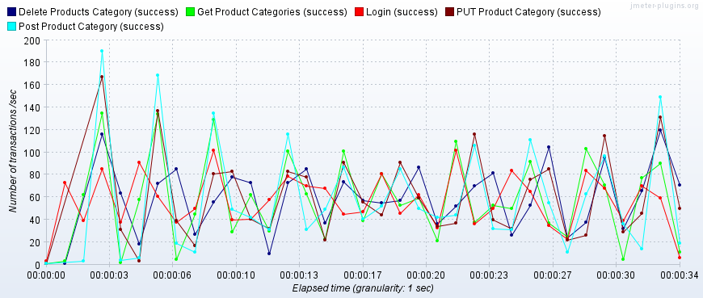

By this image (jp@gc - Transactions per Second), it is possible to see that in the same second several requests are being handled.
Besides this, we can also see the that all requests were a success.

To show the results from the test made, we used an [Aggregate Report](reports/Performance/AggregateReportLoadTest.csv) :

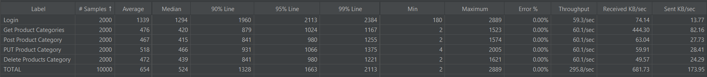

Based on these results, it is concluded:

- **Average Response Time:** 654ms. This means that the application is responding quickly.
- **Median Response Time:** 524ms. Most of the requests are being processed in a short time.
- **Throughput:** 295.8 transactions per second. This value is not very high since we are simulating the test with 200 users.
- **Errors:** There were no errors recorded during the test.


### **5.2.2 Stress Test**

For this type of test, it was used the bzm - concurrency thread group plugin.

The thread properties defined will be:

- **Target Concurrency:** 200
- **Ramp-Up time (min):** 0.5
- **Ramp-Up Steps Count:**
- **Hold Target Rate Time (min):** 2

Having this configurations as well as the next image is possible to conclude that the 200 users will start after a 30 second period. There are no ramp-up steps, this means that the concurrency level will never increase. This test will last for 2 minutes.

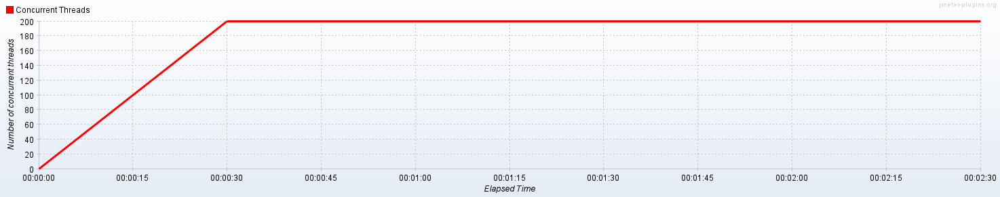

To show the results from the test made, we used an [Aggregate Report](reports/Performance/AggregateReportStressTest.csv) :

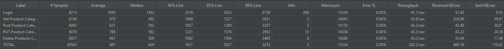

Based on these results, it is concluded:

- **Average Response Time:** 881ms. This means that the application is responding quickly.
- **Median Response Time:** 629ms. Most of the requests are being processed in a short time.
- **Throughput:** 202.2 transactions per second. This value is not very high since we are simulating the test with 200 users.
- **Errors:** There were no errors recorded during the test.

### **5.2.3 Soak Test**

For this type of test, it was used the jp@gc - ultimate thread group plugin.

The thread properties defined will be:

- **Start Threads Count:** 200
- **Initial Delay (sec):** 0
- **Start Time (sec):** 30
- **Hold Load For (sec):** 60
- **Shutdown Time:** 10

Having this configurations as well as the next image is possible to conclude that the 200 users will start immediately. the thread groups will start after a delay of 30 seconds from the beginning of the test and the load will be sustained for 60 seconds. A 10 second shutdown period will be allocated to stop the threads and conclude the test.

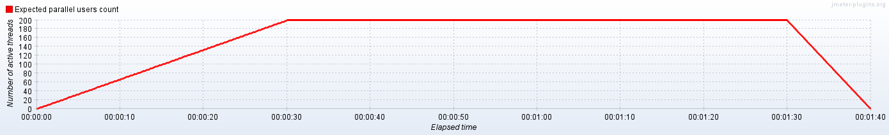

To show the results from the test made, we used an [Aggregate Report](reports/Performance/AggregateReportSoakTest.csv) :

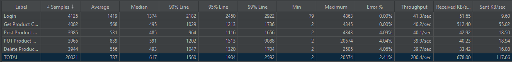

Based on these results, it is concluded:

- **Average Response Time:** 787ms. This means that the application is responding quickly.
- **Median Response Time:** 617ms. Most of the requests are being processed in a short time.
- **Throughput:** 200.4 transactions per second. This value is not very high since we are simulating the test with 200 users.
- **Errors:** There were 2.41% errors recorded during the test. These errors occurred in the requests POST, PUT and DELETE.


## **6. Security**

Security testing determines whether software is susceptible to online assaults and evaluates the effects of unauthorized or unanticipated inputs on its functionality. Security testing gives proof that data and systems are secure, trustworthy, and do not allow unauthorized inputs. [[20]](#ref-20)

To measure security it was used the tool OWASP ZAP.

Zed Attack Proxy (ZAP) is a free, open-source penetration testing tool being maintained under the umbrella of the Open Web Application Security Project (OWASP). ZAP is designed specifically for testing web applications and is both flexible and extensible. [[21]](#ref-21)

In order to obtain a report from OWASP ZAP, in this tool, a add-on was installed (Authentication Helper). Then, is was executed the following authentication tester:

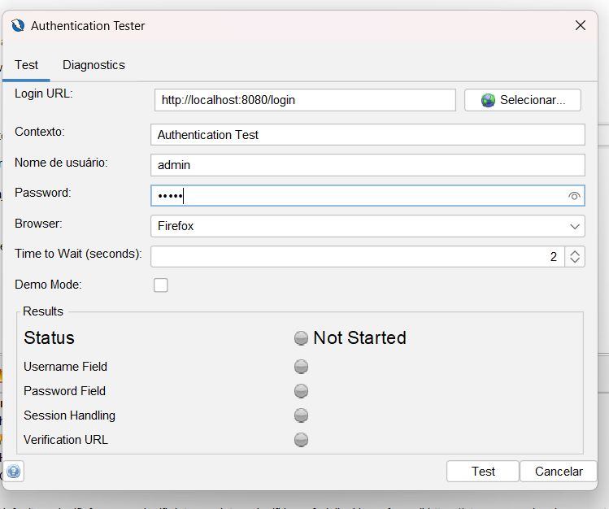

However most of the requests failed due to authentication issues and all the requests made to http://localhost:8080/api/product-categories had the response code 401.

The reports generated: 

- [OWASP ZAP Report](reports/Security/2023-06-06-ZAP-Report-localhost.pdf)
- [OWASP ZAP Risk and Confidence Report](reports/Security/2023-06-06-ZAP-Report-localhost-riskAndConfidence.html)

Taken into account the OWASP Top 10 - 2021, in this section will be mentioned A04:2021 – Insecure Design and A10:2021 – Server-Side Request Forgery (SSRF).

### **6.1 A04:2021 – Insecure Design**
As it is described in [[22]](#ref-22), this is new category for 2021. It focuses on risks related to design and architectural flaws, with a call for more use of threat modeling, secure design patterns, and reference architectures. As a community we need to move beyond "shift-left" in the coding space to pre-code activities that are critical for the principles of Secure by Design. Notable Common Weakness Enumerations (CWEs) include CWE-209: Generation of Error Message Containing Sensitive Information, CWE-256: Unprotected Storage of Credentials, CWE-501: Trust Boundary Violation, and CWE-522: Insufficiently Protected Credentials.

#### **6.1.1 Description**

A secure design can be described as a culture and methodology that constantly evaluates threats and ensures that code is robustly designed and tested to prevent known attack methods. Threat modeling should be integrated into refinement sessions (or similar activities). In the development of the user story it is recommended the determination of the correct flow and failure states, in a way that they are well understood by everyone involved. The analysis of assumptions and conditions for expected and failure flows is also recommended.

#### **6.1.2 Solutions**

There are several ways to prevent these kinds of errors, such as:

- With AppSec professionals, establish and utilize a secure development lifecycle to assist in the evaluation and design of security and privacy-related controls.
- Create and make use of a library of safe design patterns or ready-to-use components for paved roads.
- Critical authentication, access control, business logic, and key flows can all benefit from threat modeling.
- Integrate security language and controls into user stories
- Coordinate security language and controls into client stories
- Make sure that all of the critical flows are resistant to the threat model by writing unit and integration tests. For each tier of your application, compile misuse and use cases.
- Isolate level layers on the framework and organization layers relying upon the openness and assurance needs
- Design strong tenant segmentation across all tiers
- Limit asset utilization by client or administration

### **6.2 A10:2021 – Server-Side Request Forgery (SSRF)**

As it is described in [[23]](#ref-23), this classification is added from the Top 10 community study. The data show that the incidence rate is relatively low, that testing coverage is above average, and that the potential for exploit and impact is above average. The hope is that new entries, which are likely to be a single or small group of Common Weakness Enumerations (CWEs) for attention and awareness, can be rolled into a larger category in a subsequent edition.

#### **6.2.1 Description**

When a web application fetches a remote resource without validating the user-supplied URL, SSRF flaws occur. It permits an aggressor to force the application to send a created solicitation to an unforeseen objective, in any event, when safeguarded by a firewall, VPN, or one more kind of organization access control list.
Fetching a URL is becoming more and more common in modern web applications, which offer users a variety of convenient features

#### **6.2.2 Solutions**

Developers can implement any or all of the following defense in depth controls to stop SSRF:

- From Network layer
    - To lessen the impact of SSRF, separate networks should be used for remote resource access functionality.
    - Deny by default firewall policies or network access control rules should be used to block all but essential intranet traffic.
- From Application layer:
    - Use a positive allow list to enforce the URL schema, port, and destination.
    - Do not send clients raw responses.
    - Disable HTTP redirections.
    - Be aware of URL consistency to avoid attacks like DNS rebinding and “time of check, time of use” (TOCTOU) race conditions.
    - Sanitize and validate all client-supplied input data.

## **7. Conclusions**

It is possible to draw the conclusion that the application cannot be used as the foundation for a new project based on the previous analysis.
 
In what concerns accessibility, the page Product Categories comparing to WCAG 2.1 it had the grade A which is the lowest and easiest level of conformance to obtain. This means that it does not achieve broad accessibility for many situations.

This application is compatible with different browsers, devices, and platforms.

The project has a low level of maintainability (32.09).
 
In terms of performance, all the tests gave good results.

In terms of security it was not possible to obtain results due to some problems with the tool used by the group.
 
Concerning investigation, we can presume that this application can't be utilized.

## 8. **References**

<span>[1] Accessibility - Developer Mozilla.</span>
<a id="ref-1" href="https://developer.mozilla.org/en-US/docs/Learn/Accessibility/What_is_accessibility#so_what_is_accessibility"> (https://developer.mozilla.org/en-US/docs/Learn/Accessibility/What_is_accessibility#so_what_is_accessibility)</a>

<span>[2] Lighthouse.</span>
<a id="ref-2" href="https://developer.chrome.com/docs/lighthouse/overview/">(https://developer.chrome.com/docs/lighthouse/overview/)</a>

<span>[3] Lighthouse - Accessibility Audits.</span>
<a id="ref-3" href="https://developer.chrome.com/docs/lighthouse/accessibility/">(https://developer.chrome.com/docs/lighthouse/accessibility/)</a>

<span>[4] WAVE Evaluation Tool.</span>
<a id="ref-4" href="https://chrome.google.com/webstore/detail/wave-evaluation-tool/jbbplnpkjmmeebjpijfedlgcdilocofh/related">(https://chrome.google.com/webstore/detail/wave-evaluation-tool/jbbplnpkjmmeebjpijfedlgcdilocofh/related)</a>

<span>[5] Browser Compability.</span>
<a id="ref-5" href="https://www.omniconvert.com/what-is/browser-compatibility/">(https://www.omniconvert.com/what-is/browser-compatibility/)</a>


<span>[6] Devices Compability.</span>
<a id="ref-6" href="https://diffy.website/blog/compatibility-testing">(https://diffy.website/blog/compatibility-testing)</a>

<span>[7] Platform Compability.</span>
<a id="ref-7" href="https://xbosoft.com/software-testing-services/platform-compatibility/">(https://xbosoft.com/software-testing-services/platform-compatibility/)</a>

<span>[8] MetricsTree plugin for IntelliJ IDEA.</span>
<a id="ref-8" href="https://plugins.jetbrains.com/plugin/13959-metricstree">(https://plugins.jetbrains.com/plugin/13959-metricstree)</a>

<span>[9] Sonargraph.</span>
<a id="ref-9" href="https://www.hello2morrow.com/products/sonargraph">(https://www.hello2morrow.com/products/sonargraph)</a>

<span>[10] Coleman, D., Ash, D., Lowther, B., & Oman, P. (1994, August). Using metrics to evaluate software system maintainability. Computer, 27(8), 44-49. DOI: 10.1109/2.291294</span>

<span>[11] ESLint.</span>
<a id="ref-11" href="https://eslint.org/">(https://eslint.org/)</a>


<span>[12] Performance Testing.</span>
<a id="ref-12" href="https://www.tricentis.com/learn/performance-testing">(https://www.tricentis.com/learn/performance-testing)</a>

<span>[13] Apache Software Foundation - Apache JMeter.</span>
<a id="ref-13" href="https://jmeter.apache.org/">(https://jmeter.apache.org/)</a>

<span>[14] Lighthouse - Performance Audits.</span>
<a id="ref-14" href="https://developer.chrome.com/docs/lighthouse/performance/">(https://developer.chrome.com/docs/lighthouse/performance/)</a>

<span>[15] Lighthouse - First Contentful Paint.</span>
<a id="ref-15" href="https://developer.chrome.com/docs/lighthouse/performance/first-contentful-paint/?utm_source=lighthouse&utm_medium=devtools">(https://developer.chrome.com/docs/lighthouse/performance/first-contentful-paint/?utm_source=lighthouse&utm_medium=devtools)</a>

<span>[16] Lighthouse - Total Blocking Time.</span>
<a id="ref-16" href="https://developer.chrome.com/docs/lighthouse/performance/lighthouse-total-blocking-time/?utm_source=lighthouse&utm_medium=devtools">(https://developer.chrome.com/docs/lighthouse/performance/lighthouse-total-blocking-time/?utm_source=lighthouse&utm_medium=devtools)</a>

<span>[17] Lighthouse - Speed Index.</span>
<a id="ref-17" href="https://developer.chrome.com/docs/lighthouse/performance/speed-index/?utm_source=lighthouse&utm_medium=devtools">(https://developer.chrome.com/docs/lighthouse/performance/speed-index/?utm_source=lighthouse&utm_medium=devtools)</a>

<span>[18] Lighthouse - Largest Contentful Paint.</span>
<a id="ref-18" href="https://developer.chrome.com/docs/lighthouse/performance/lighthouse-largest-contentful-paint/?utm_source=lighthouse&utm_medium=devtools">(https://developer.chrome.com/docs/lighthouse/performance/lighthouse-largest-contentful-paint/?utm_source=lighthouse&utm_medium=devtools)</a>

<span>[19] Lighthouse - Cumulative Layout Shift.</span>
<a id="ref-19" href="https://web.dev/i18n/en/cls/">(https://web.dev/i18n/en/cls/)</a>

<span>[20] Security Testing.</span>
<a id="ref-20" href="https://brightsec.com/blog/security-testing/">(https://brightsec.com/blog/security-testing/)</a>

<span>[21] OWASP ZAP.</span>
<a id="ref-21" href="https://www.zaproxy.org/getting-started/">(https://www.zaproxy.org/getting-started/)</a>

<span>[22] OWASP ZAP - A04:2021 – Insecure Design.</span>
<a id="ref-22" href="https://owasp.org/Top10/A04_2021-Insecure_Design/">(https://owasp.org/Top10/A04_2021-Insecure_Design/)</a>

<span>[23] OWASP ZAP - A10:2021 - Server-Side Request Forgery.</span>
<a id="ref-23" href="https://owasp.org/Top10/A10_2021-Server-Side_Request_Forgery_%28SSRF%29/">(https://owasp.org/Top10/A10_2021-Server-Side_Request_Forgery_%28SSRF%29/)</a>
