# README #

# Developed by Tiago Pinto (1191098)

This folder includes all artifacts developed for the Second Part of QESOFT Project. 

It is structured as follows:

1. Introduction
2. Accessibility
3. Compatibility
4. Maintainability
5. Performance
6. Security
7. Conclusions
8. References

## 1. Introduction

The goal of the second phase of the QESOFT project is to analyse a JHipster application, generated from the project used in the first phase. 

The application will be evaluated under some quality atributes, such as: accessibility; compatibility; maintainability; performance; security. For each quality attribute, metrics will be measured based on the GQM present in the overall report.

In this report, conclusions will be drawn after the evaluation of the SellResource class and its respective methods.


## 2. Accessibility

Speaking about accessibility, and more specifically about web accessibility, it means websites, tools, and technologies are designed and developed so that people with disabilities can use them [[1]](#ref-1).

Web accessibility has been developed and is based on 4 fundamental principles. These 4 principles make up the acronym POUR and they are: perceivable, operable, understandable and robust [[2]](#ref-2).

In the GQM defined in the global report, 6 metrics have been identified to assess the accessibility of the application. To measure them, it was used Lighthouse, from the Google Dev Tools.

The tool generated the following report: [Lighthouse Report](LighthouseReportForCompatibility.html)

### Aria

Regarding Aria, four audits were applicable to this metric and all of them passed the tests, as it's possible to see in the following image.

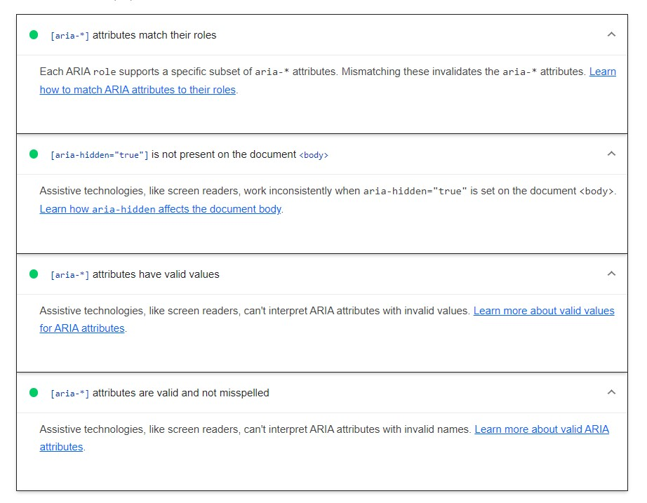

### Names and Labels

The metric names and labels was identified with regard to the use of links, improving the experience of screen reader users.


Good levels in this metric were also seen in the use of buttons and images.

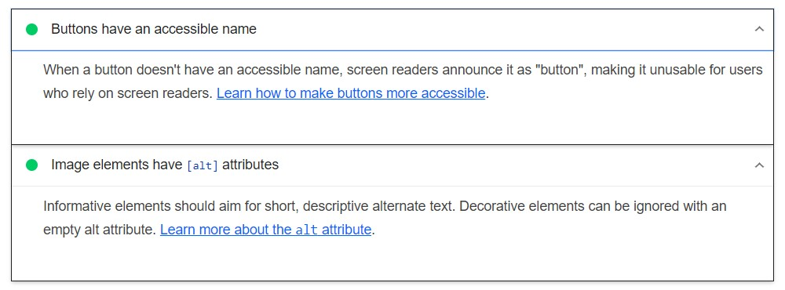

### Contrast

About contrast, it was inferred about the colours of the page and the results were positive.

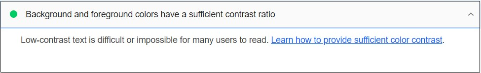

### Tables and List

Some tests were carried out to evaluate this metric, again with success.


To evaluate the degree of accessibility of shipper-related pages according to Web Content Accessibility Guidelines (WCAG) 2.1, the Chrome extension, Wave, was used.

### WCAG 2.1 Classification

- **http://localhost:9000/shipper**
  
  Using the Wave extension on this page, the following summary was generated:

  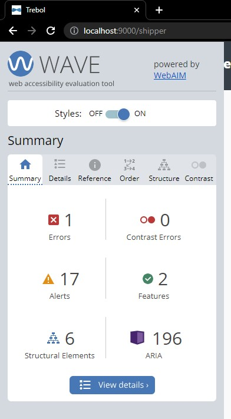

  Where the error found was as follows:

  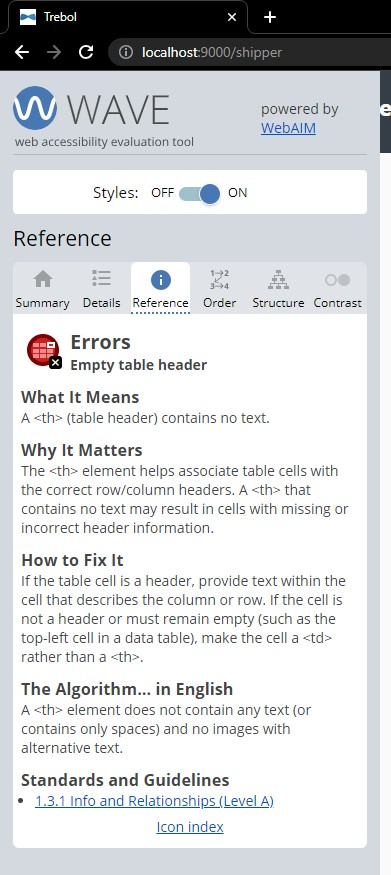

  Therefore, this page does not get the grade A.

- **http://localhost:9000/shipper/1**
  
  This page is simpler, and therefore has fewer rendered elements. Considering the evaluation done by Wave, no errors were found.

  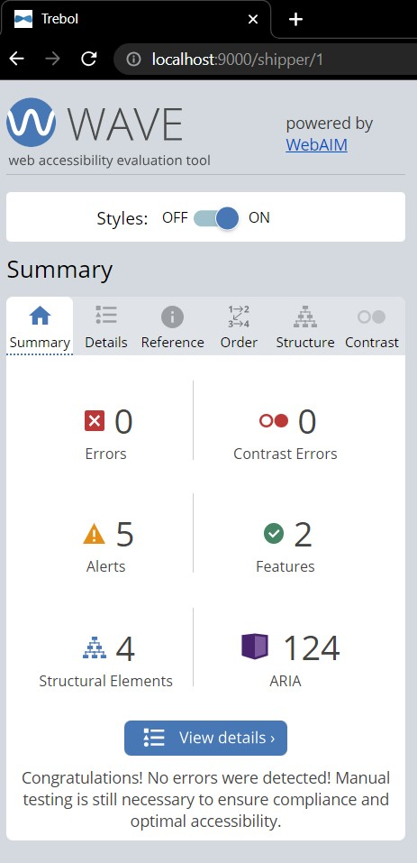

  So, this page gets the grade AAA.

- **http://localhost:9000/shipper/1/edit**, **
  
  This page has the same evaluation (AAA), since no errors were found by Wave.

  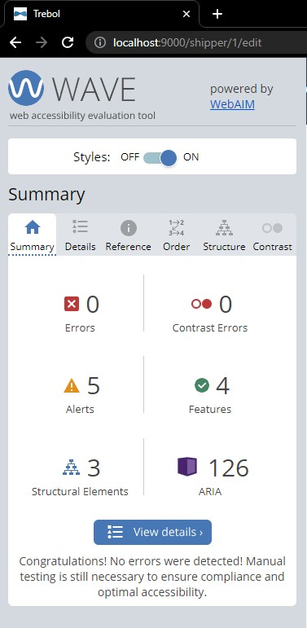

- **http://localhost:9000/shipper/new**
  
  This page has the same evaluation (AAA), since no errors were found by Wave.

  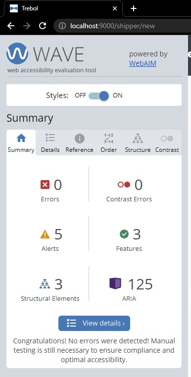

- **http://localhost:9000/shipper/1/delete**
  
  This page has the same evaluation (AAA), since no errors were found by Wave.

  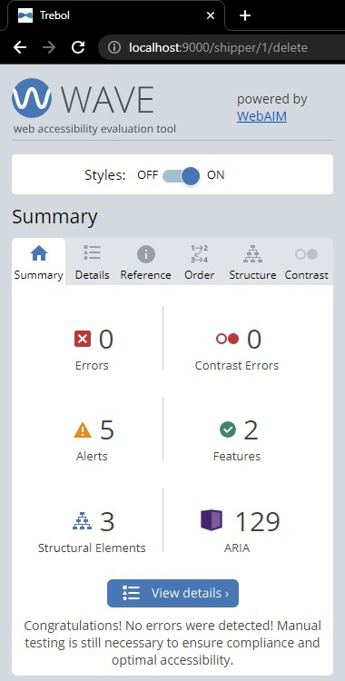

## 3. Compatibility

As the ecosystem has evolved to include a broader range of devices, operating systems, and browsers, achieving cross-browser compatibility has become an increasingly formidable task for front-end developers. It encompasses addressing issues and implementing strategies to ensure that applications maintain a consistent appearance and functionality across diverse browsers and platforms. The ever-expanding diversity of devices, operating systems, and browsers adds complexity to the goal of supporting a wide array of configurations [[3]](#ref-3).

To test the frontend compatibility, three differents tests took place.

### Browser Compatibility

Browser Compatibility is verified when the system has the same behaviour across different browsers (Chrome, Firefox, Edge). To evaluate that, the functionalities related to the Shippers page were tested in the three browsers mentioned.

The first two images concern the GET request that displays all the existing shippers. There are no errors or differences between the two browsers.

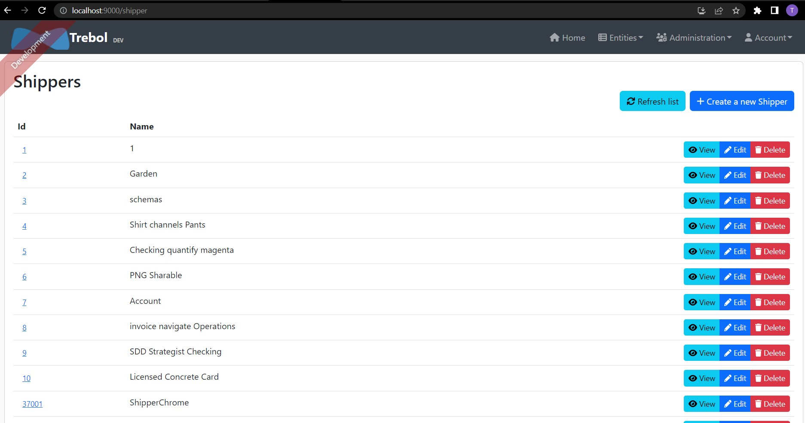

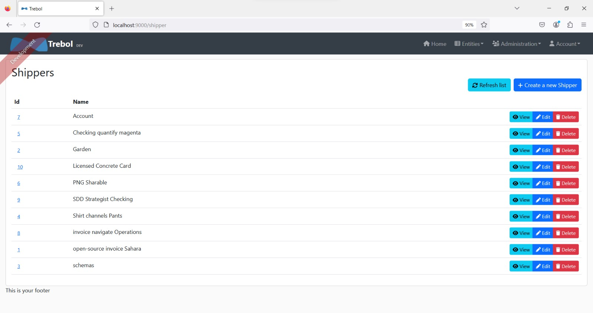

The following images concern the POST request that creates a new shipper and it can be seen that in both browsers the request was successful.

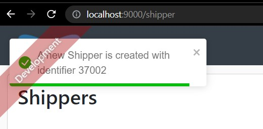

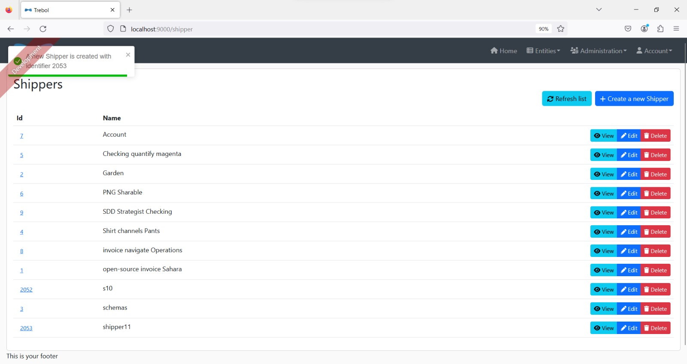

### Device Compatibility

Regarding device compatibility, to ensure that the application meets the requirements, three different screen resolutions were used, simulating different devices.

- iPhone XR
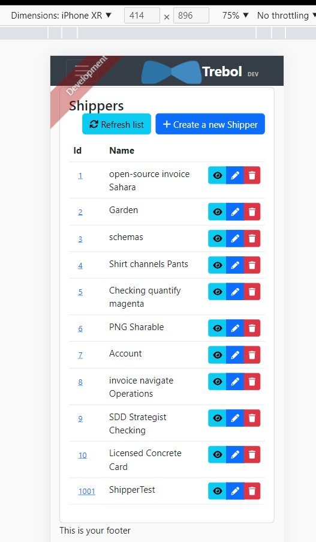

- iPad Air
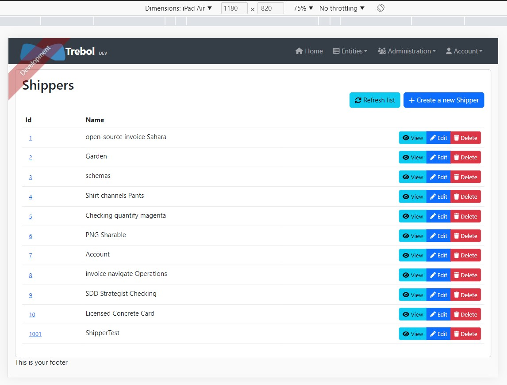

- NestHub Max
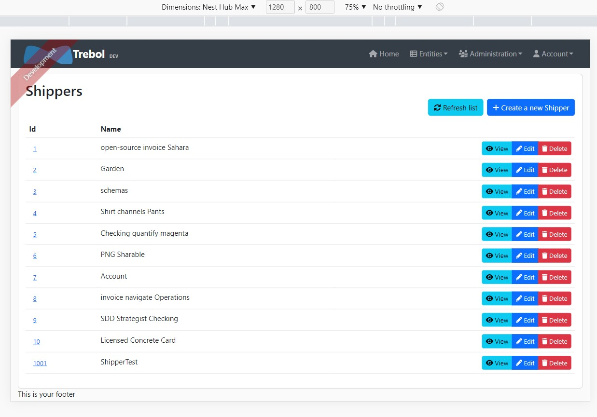

As it's possible to verify, there aren't problems in all three resolutions. The page is responsive, as all page elements behave as expected.

### Platform Compatibility

To infer about platform compatibility, it was used Google Chrome Dev Tools to change between an iPhone and an Android device.
 
The following figures show that no differences were found

- iPhone XR


- Samsung Galaxy S8+


## 4. Maintainability

It was used the IntelliJ plugin MetricsTree to measure Coupling and Structural Erosion (CSE) and Size and Complexity (SC).

MetricsTree is an IDE extension that helps to evaluate quantitative properties of java code.
It supports the most common sets of metrics at the project, package, class, and method levels.

To measure CSE were used the metrics: average component dependency, propagation cost, cyclicity and relative cyclicity and maintainability level.

To measure SC were used the metrics: size metric, cyclomatic complexity and indentation debt.

### 4.1 Average Component Dependency (ACD)

ACD can be obtained by dividing CCD by the number of components to get the ACD.

This way, it was used the tool Sonargraph to calculate the components to get the ACD and the value of CCD.
To do this, in sonargraph it was selected the class DataUsersController and then selected the option to show in graph view. The graph obtained is in the next image.

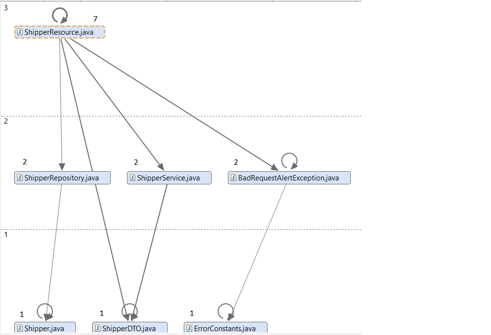

The number above each class represents the value from the metric Depends Upon. This metric was also available in the tool Sonargraph.

Having all the values from the Depends Upon metric of all components of the class DataUsersController, the value CCD can be calculated as the sum of these values.
It was determined that CCD has a value of 64.

As it was said before, ACD can be obtained by dividing CCD by the number of components. This way:

`ACD = 16/7 = 2,28`

The maximum value is equal to the number of components, in this case that would be 7
On average, a component depends on 2,28 components. Comparing to the maximum value, it can be said that in terms of coupling, this number is fairly low.

### 4.2 Propagation Cost (PC)

The metric propagation cost measures the potential impact a change in a component will cause on other components.
A higher propagation cost will likely lead to an increase in complexity of the system therefore making it difficult to maintain.

PC can also be calculated by dividing the ACD once more by the number of nodes (components).

`PC = 2,28/7 = 0,32 `

Since the work was done with a small part of the system, this value shouldn't be concerning.

### 4.3 Maintainability Level

Regarding maintainability level, it was used the Intellij's plugin, MetricsThree. It allowed measurement at the class level and at the level of the different methods.

In what concers to ShippersResource class, its maintainability level, given by MetricsTree's metric Maintainability Index, it's **32,1667**, which is considered low.

About the methods of this class, their maintainability levels are:

- ShipperResource(ShipperService,ShipperRepository): 78,0773

- createShipper(ShipperDTO): 56,2375

- deleteShipper(Long): 61,1356

- getAllShippers(): 68,5218

- getShipper(Long): 65,166

- partialUpdateShipper(Long,ShipperDTO): 49,6253

- updateShipper(Long,ShipperDTO): 49,9261
  
### 4.4 Size Metric

Lines of Code (LoC) per file counts every line that contains actual code and skips empty lines and comment lines.

Total Lines metric counts every single line, including empty lines and comment lines.

Number of Statements verifies the statements, i.e., s a single complete action performed in the source code, usually terminated by a special character or a newline.

In the class ShippersResource it was possible to determine the following values:

- Lines of Code: 107
- Total Lines: 174
- Number of Statements: 40

These values can indicate of how much the component is doing and how complex it is.
So, it can be said that this component is not complex.

### 4.5 Cyclomatic complexity

Cyclomatic complexity was proposed in 1976, and it computes the number of different possible execution paths through a method or
function, which is also a floor for the number of test cases needed to achieve 100% test coverage.

For this metric it was analyzed the metric Average Complexity that is described as the weighted average modified extended cyclomatic complexity for fully analyzes code.

- Average Complexity: 1,00

As the value calculated is very low it's possible to say that the class ShippersResource is easy to understand and don't have a big risk associated when modifying the class.

### Frontend Coding Issues

Regarding frontend coding issues, the ones that were described in this report were:

- Performance Optimization
- Accessibility Compliance

**Performance Optimization**

To infer about performance optimization, it was used the Lighthouse tool that analyzed the Shippers' page and generated a report.

In this report, two issues and suggestions of improvement were found regarding performance. 

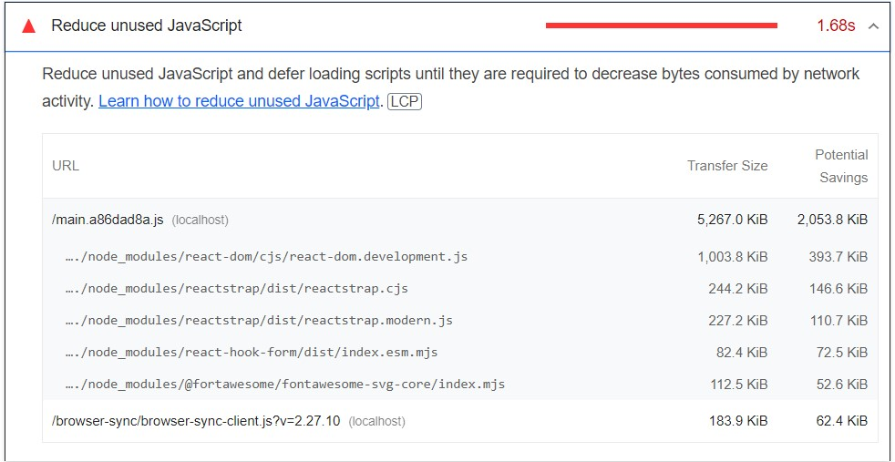

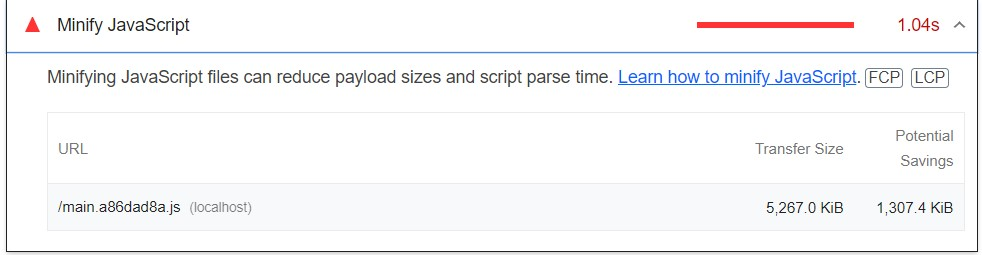

To solve the first problem, two approaches could be followed. Either use the "Coverage" tab in Google DevTools or the "Coverage" class from the Puppeteer library [[4]](#ref-4).

The second issue could be solved with the use of a tool called Terser [[5]](#ref-5).

**Accessibility Compliance**

To measure accessibility compliance, it was used a framework called Axe. Axe is a JavaScript accessibility testing framework developed by Deque Systems [[6]](#ref-6).

After installing the node package to the project, it was necessary to add a function in the React component that was going to be analyzed.

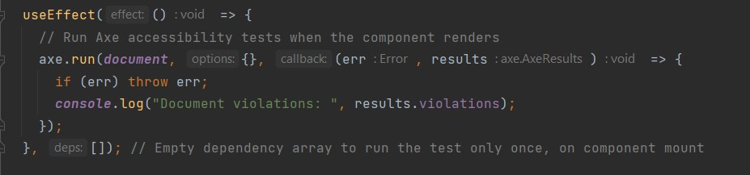

This function will look for accessibility violations throughout the document and print them on the console.

Three violations were found, all of them rated as having moderate impact.

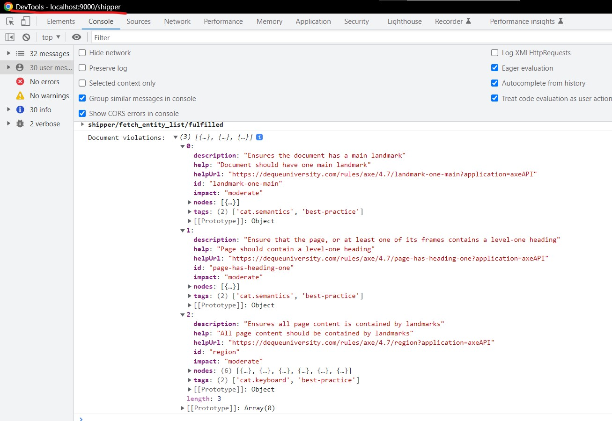
## 5. Performance

In what concerns to performance, two subtopics were addressed: Performance focused on User Experience and Backend Performance.

### 5.1 Performance focused on User Experience

In order to infer on performance from the user's perspective, the Lighthouse tool was used, which analyzed the Shippers' page and generated a report where the Core Web Vitals and other important metrics addressed.

The global score was 71, as it considered an acceptable, but not excellent, value.

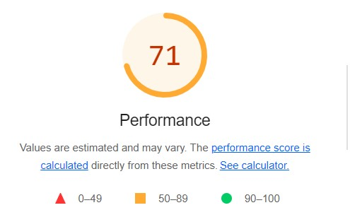

This value was calculated taking into account the following method.

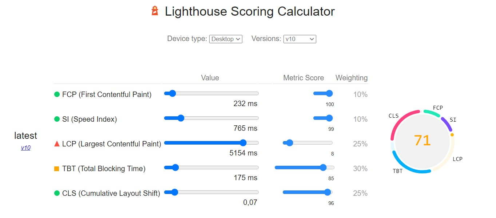

Regarding each metric, some conclusions can be made.

- First Contentful Paint (FCP)


    The value obtained is considered very good, with the benchmark for providing a good user experience being 1.8 seconds or less [[7]](#ref-7).

- Total Blocking Time (TBT)
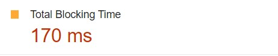

    TBT quantifies the cumulative duration during which a page is unresponsive to user input, encompassing actions like mouse clicks, screen taps, or keyboard presses [[8]](#ref-8).

    According to the value obtained, it can be considered that this is a moderated time.

- Speed Index
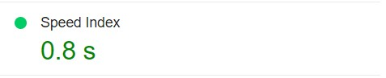
    
    The Speed Index assesses the speed at which content is visually presented while a page is loading [[9]](#ref-9).

    0.8 seconds gives a good indication of how fast the page behaves.

- Largest Contentful Paint (LCP)


    LCP gauges the moment when the screen displays the largest content element within the viewport, providing an approximation of when users can see the primary content of the page [[10]](#ref-10).

    The value obtained it's not considered a good value, allowing to classify the page as slow, in what this metric concers.

- Cumulative Layout Shift (CLS)


    CLS quantifies the most significant sequence of layout changes caused by unexpected occurrences throughout the entire lifespan of a page [[11]](#ref-11).

    Since sites should strive to have a CLS score of 0.1 or less, this is considered a good value.

### 5.2 Backend Performance

Performance testing encompasses a variety of tests that assess the behavior and efficiency of a system. Specifically, software performance testing evaluates the responsiveness, stability, scalability, reliability, speed, and resource utilization of both your software and infrastructure. Depending on the type of performance test used, different data can be obtained, as we will explain in more detail.

There are three common types of performance testing that provide different data:

* Load Tests: These tests simulate a high level of user traffic or load to measure how well a system performs. They involve testing a large number of users or transactions to see how the system responds.

* Stress Tests: Stress testing goes beyond load testing by testing a system's performance limits. It involves testing beyond normal usage scenarios to see how well the system handles extreme conditions.

* Soak Tests: Also known as endurance testing, these tests measure how well a system performs over a sustained period of time. They involve testing the system for several hours, days, or even weeks to see how it performs under sustained load. Soak tests are useful for detecting memory leaks.
  
**JMeter**

The Apache JMeter application is an open-source software, a 100% pure Java application designed to load test functional behavior and measure performance. It was originally designed for testing Web Applications but has since expanded to other test functions.

Apache JMeter may be used to test performance both on static and dynamic resources, Web dynamic applications.
It can be used to simulate a heavy load on a server, group of servers, network, or object to test its strength or to analyze overall performance under different load types.

To run Jmeter tests, a test plan was designed with the following configuration:

```bash
.
└── Thread Group/
    ├── Http Request (Login)/
    │   ├── Http Header Manager
    │   ├── View Results Tree
    │   └── JSR223 PostProcessor
    ├── Http Request (Get Shippers)/
    │   ├── Http Header Manager
    │   └── View Results Tree
    ├── Http Request (Post Shippers)/
    │   ├── Http Header Manager
    │   ├── View Results Tree
    │   ├── CSV Data Set Config
    │   └── JSR223 PostProcessor
    ├── Debug Sampler
    ├── View Results Tree
    ├── Http Request (Put Shippers)/
    │   ├── Http Header Manager
    │   ├── JSR223 PreProcessor
    │   └── View Results Tree
    ├── Debug Sampler
    ├── View Results Tree
    ├── jp@gc - Response Codes per Second
    ├── jp@gc - Transactions per Second
    └── Summary Report
```

**5.2.1 Load Tests**

To do a load test for the application, we’ll simulate many users accessing the users page.
The thread properties defined will be:

- **Number of Threads (users):** 200

- **Ramp-up period:** 1

- **Loop Count:** 10

Only 1 thread was defined for each test, so it'll only take 1 second to ramp it up.
To see the results, a View Results Tree Listener and a Summary Report was used.
It was also used a jp@gc - Response Codes per Second and jp@gc - Transactions per Second. These were possible after the download of these plugins.

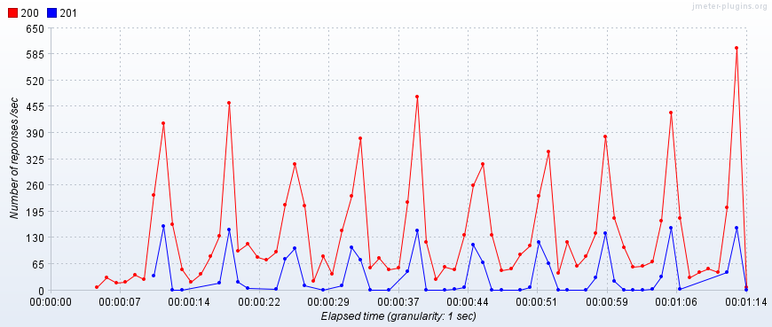

By looking at this image (jp@gc - Response Codes per Second), it is possible to see that in the same second several requests are being handled. Besides this, we can also see the codes from each request. The red line represents the GET and PUT requests, while the blue line represents the POST requests.

The next image is representative of the number of Transactions per Second that occured, all of them successful transactions.

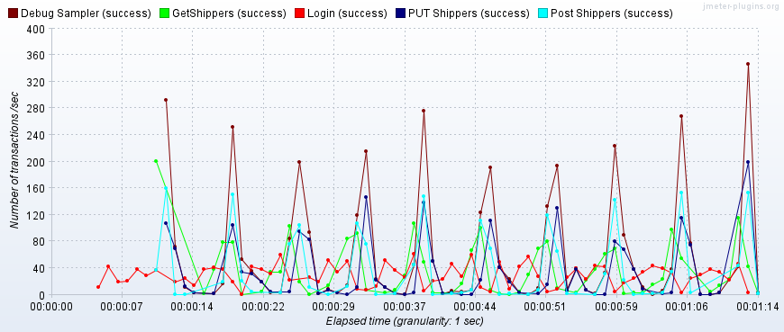

To show the results, it was used a Summary Report:

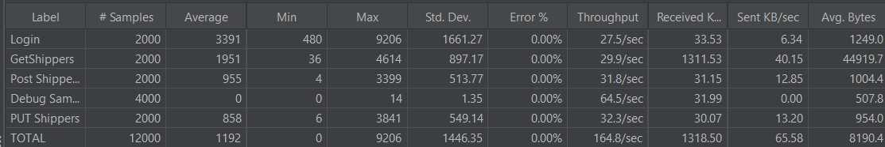

**5.2.2 Stress Tests**

To do a stress test for the application, we’ll simulate way more users than the usual accessing the product categories page. The thread properties defined will be:

- **Number of Threads (users):** 800

- **Ramp-up period:** 1

- **Loop Count:** 10

Only 1 thread was defined for each test, so it'll only take 1 second to ramp it up.
To see the results, a View Results Tree Listener and a Summary Report was used.
It was also used a jp@gc - Response Codes per Second and jp@gc - Transactions per Second. These were possible after the download of these plugins.

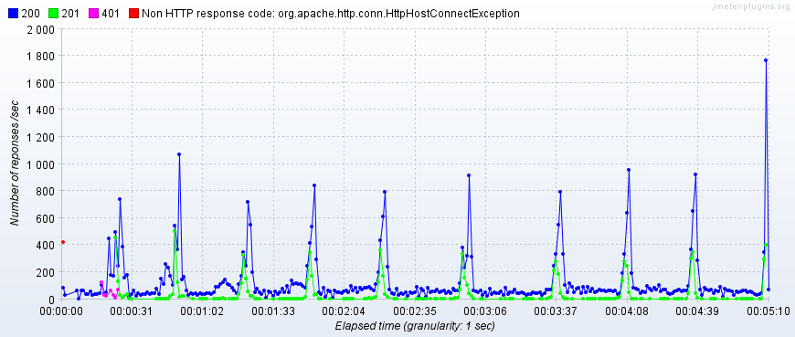

By this image (jp@gc - Response Codes per Second), it is possible to see that in the same second several requests are being handled.
Besides this, we can also see the codes from each request.

When comparing the results with the load tests there are differences regarding the number of transactions (that have increased) and regarding the existence of errors, in the first 30 seconds of test.

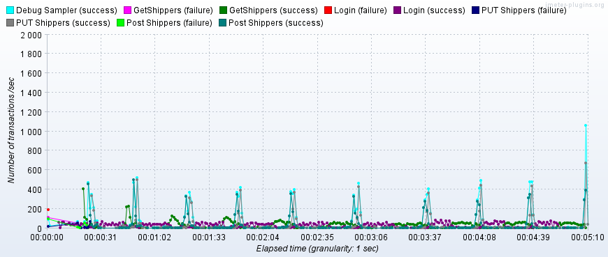

To show the results, it was used a Summary Report:

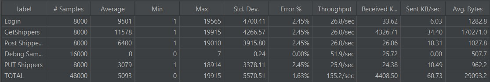

**5.2.3 Soak Tests**

To do a stress test for the application, we’ll simulate way more users than the usual accessing the users page.
The thread properties defined will be:

- **Number of Threads (users):** 200

- **Ramp-up period:** 1

- **Loop Count:** infinite

Only 1 thread was defined for each test, so it'll only take 1 second to ramp it up.
To see the results, a View Results Tree Listener and a Summary Report was used.
It was also used a jp@gc - Response Codes per Second and jp@gc - Transactions per Second. These were possible after the download of these plugins.

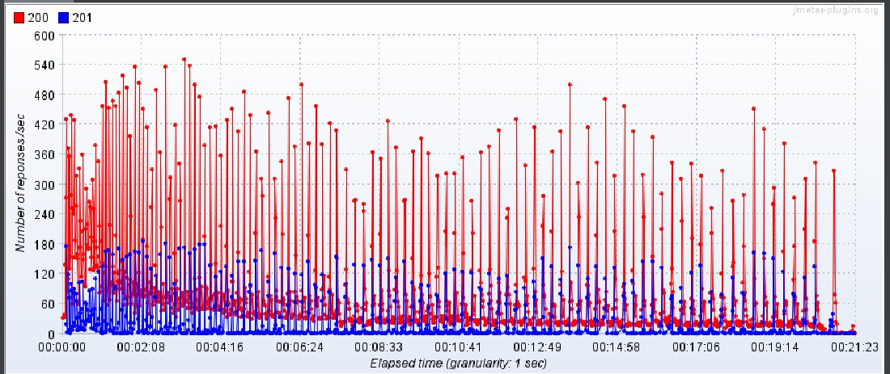

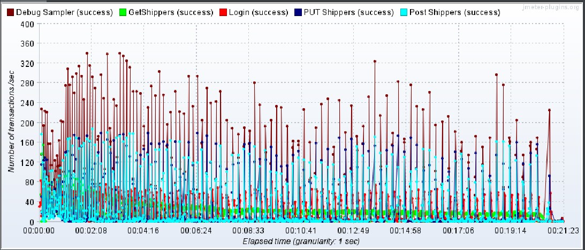

To show the results, it was used a Summary Report:

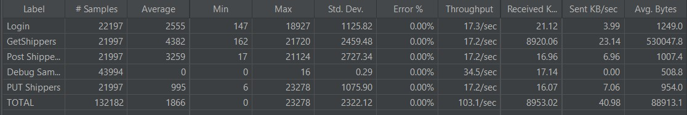
## 6. Security

To assess application security, it was used the tool OwaspZap. However, the requests to the application failed due to authentication issues.
The steps taken were:

- 1: Use of plugin **Authentication Tester** to create a context.
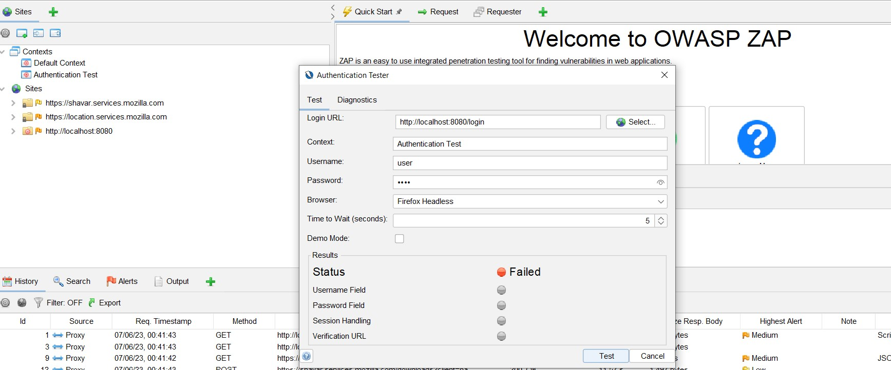

- 2: Automated scan to the shipper page.
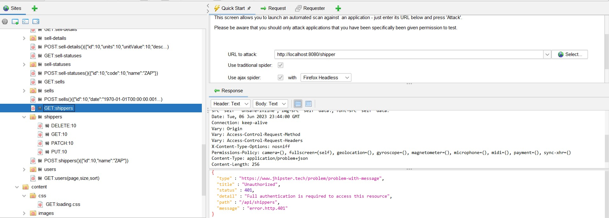

As it's possible to see in the last image, all the requests regarding the Shippers page returned an error 401.

The goal of this topic was to infer about two categories from the OWASP Top 10 - 2021.

In this report, the two that were addressed were: **A02:2021 – Cryptographic Failures** and **A08:2021 – Software and Data Integrity Failures**

### 6.1 A02:2021 – Cryptographic Failures

According to [[12]](#ref-12), identifying the requirements for data protection both in transit and at rest is the first step. Passwords, credit card numbers, health records, personal information, and business secrets, for instance, need extra protection, especially if they are covered by privacy laws like the EU's General Data Protection Regulation (GDPR) or regulations like the PCI Data Security Standard (PCI DSS), which protect financial data. For each of these data:

Is any information sent in clear text? This applies to protocols implementing TLS upgrades like STARTTLS, including HTTP, SMTP, and FTP. Traffic from outside the internet is dangerous. Check all internal communication, such as that between load balancers, web servers, or back-end systems.

Exist any cryptographic protocols or obsolete, insecure algorithms that are utilized by default or in older software?

Are weak crypto keys being generated or reused, default crypto keys being utilized, or is effective key management or rotation lacking? Are cryptographic keys backed up in source code archives?

Is encryption not enforced, as evidenced, for instance, by the absence of HTTP headers (browser) security directives or headers?

Is the trust chain and the server certificate that was obtained correctly validated?

When utilized in the cryptographic mode of operation, are initialization vectors that are disregarded, reused, or not produced sufficiently secure? Is ECB or another insecure mode of operation being used? When authenticated encryption would be more appropriate, is encryption used?

In the absence of a mechanism to derive keys from passwords, are passwords being utilized as cryptographic keys?

Is randomness employed in cryptography for purposes other than those for which it was intended? Even if the right function is selected, does the developer need to seed it, and if not, has the developer replaced the powerful seeding feature built into it with a seed that doesn't have enough entropy/unpredictability?

When cryptographic hash functions are required, are out-of-date hash functions like MD5 or SHA1 in use, or are non-cryptographic hash functions employed instead?

Are still in use outdated cryptographic padding techniques like PKCS number 1 v1.5?

Can side channels or cryptographic error messages be abused, for instance by padding oracle attacks?

There are several ways to prevent these kinds of errors, such as:

- Put data that an application processes, stores, or sends into categories. Determine which information is sensitive in accordance with privacy regulations, legal obligations, or commercial requirements.

- Avoid needlessly storing sensitive information. Use tokenization or even truncation that complies with PCI DSS as soon as possible, or just throw it away. Non-retained data cannot be stolen.

- At rest, be cautious to encrypt all sensitive data.

- Use appropriate key management and make sure that standard algorithms, protocols, and keys are current and robust.

- Use secure protocols to encrypt all data in transit, such as TLS with forward secrecy (FS) ciphers, server-side cipher priority, and secure parameters. Use directives like HTTP Strict Transport Security (HSTS) to enforce encryption.

###  6.2 A08:2021 – Software and Data Integrity Failures

Following [[13]](#ref-13), code and architecture that do not provide protection against integrity violations are related to software and data integrity failures. The use of plugins, libraries, or modules from unreliable sources, repositories, or content delivery networks (CDNs) is an illustration of this. An unsecured CI/CD pipeline increases the risk of malicious code, unauthorised access, and system compromise. Last but not least, many programs now have auto-update features that download updates without performing enough integrity checks before applying them to previously trusted applications. Attackers might post their own updates for distribution and execution across all installations. Another instance is when data or objects are encoded or serialized into a structure that is open to unsafe deserialization and is visible to and modifiable by an attacker.

There are some techniques enumered to prevent this, such as:

- Verify the program or data is from the anticipated source and has not been altered by using digital signatures or equivalent procedures.

- Make certain that libraries and dependencies, such npm or Maven, are utilizing reliable repositories. Consider hosting an internal, validated known-good repository if your risk profile is higher.

- Make sure to utilize a software supply chain security tool to confirm that components don't include known vulnerabilities, like OWASP Dependency Check or OWASP CycloneDX.

- To lessen the possibility of malicious code or configuration entering your software pipeline, make sure there is a review procedure in place for modifications to configuration and code.

- To guarantee the integrity of the code moving through the build and deploy processes, make sure your CI/CD pipeline is configured, segregated, and has access control.

- To prevent alteration or replay of the serialized data, make sure that unsigned or unencrypted serialized data is never given to untrusted clients without an integrity check or digital signature.

## 7. Conclusions

In this report, several qualitiy attributes were measured regarding the pages related to Shippers.

It was verified that in terms of accessibility, except for the shipper listing page, excellent levels of accessibility are presented.

As far as compatibility is concerned, no problems were found and the application passed all tests performed.

Regarding maintainability, the maintainability level recorded by MetricsTree is lower than that obtained in the previous application. But regarding size and complexity, this application presents better results.

When it comes to performance focused on user experience, according to the report generated by Lighthouse, its value is not excellent but not too bad either, and there is room for improvement.

It was not possible to draw conclusions regarding the security topic due to constraints with the tool, but the problems to be analyzed were described and solutions to them were presented.

## 8. References
<span>[1] </span><a id="ref-1" href="https://www.w3.org/WAI/fundamentals/accessibility-intro">https://www.w3.org/WAI/fundamentals/accessibility-intro/</a>

<span>[2] </span><a id="ref-2" href="https://guides.cuny.edu/accessibility/whyitmatters">https://guides.cuny.edu/accessibility/whyitmatters</a>

<span>[3] </span><a id="ref-3" href="https://www.linkedin.com/pulse/best-practices-cross-browser-compatibility-front-end-ivo">https://www.linkedin.com/pulse/best-practices-cross-browser-compatibility-front-end-ivo</a>
<span>[4] </span><a id="ref-4" href="https://pptr.dev/#?product=Puppeteer&version=v4.0.0&show=api-class-coverage">https://pptr.dev/#?product=Puppeteer&version=v4.0.0&show=api-class-coverage</a>

<span>[5] </span><a id="ref-5" href="https://github.com/terser/terser">https://github.com/terser/terser</a>

<span>[6] </span><a id="ref-6" href="https://github.com/dequelabs/axe-core">https://github.com/dequelabs/axe-core</a>

<span>[7] </span><a id="ref-7" href="https://web.dev/fcp/">https://web.dev/fcp/</a>

<span>[8] </span><a id="ref-8" href="https://developer.chrome.com/docs/lighthouse/performance/lighthouse-total-blocking-time/?utm_source=lighthouse&utm_medium=devtools">https://developer.chrome.com/docs/lighthouse/performance/lighthouse-total-blocking-time/?utm_source=lighthouse&utm_medium=devtools</a>

<span>[9] </span><a id="ref-9" href="https://developer.chrome.com/docs/lighthouse/performance/speed-index/?utm_source=lighthouse&utm_medium=devtools">https://developer.chrome.com/docs/lighthouse/performance/speed-index/?utm_source=lighthouse&utm_medium=devtools</a>

<span>[10] </span><a id="ref-10" href="https://developer.chrome.com/docs/lighthouse/performance/lighthouse-largest-contentful-paint/?utm_source=lighthouse&utm_medium=devtools">https://developer.chrome.com/docs/lighthouse/performance/lighthouse-largest-contentful-paint/?utm_source=lighthouse&utm_medium=devtools</a>

<span>[11] </span><a id="ref-11" href="https://web.dev/cls/?utm_source=lighthouse&utm_medium=devtools">https://web.dev/cls/?utm_source=lighthouse&utm_medium=devtools</a>

<span>[12] </span><a id="ref-12" href="https://owasp.org/Top10/A02_2021-Cryptographic_Failures/">https://owasp.org/Top10/A02_2021-Cryptographic_Failures/</a>

<span>[13] </span><a id="ref-13" href="https://owasp.org/Top10/A08_2021-Software_and_Data_Integrity_Failures/">https://owasp.org/Top10/A08_2021-Software_and_Data_Integrity_Failures/</a>