# README #

# Developed by Marco Querido (1220268)

This folder includes all artifacts developed for the Second Part of QESOFT Project. 

It is structured as follows:

1. Introduction
2. Accessibility
3. Compatibility
4. Maintainability
5. Performance
6. Security
7. Conclusions
8. References

## 1. Introduction

The second phase of the QESOFT project analyzes a new project, generated using JHipster, that has a set of features from the old project analyzed in the first phase, and it analyzes the project in an operational environment to determine whether or not the project is reusable.

The main focus of this analysis are the quality attributes that must be evaluated for the new project, such as accessibility, compatibility, maintainability, performance and security.

In order to identify and select the best materials, this research will take an objective approach.

## 2. Accessibility

Web Content Accessibility Guidelines (WCAG) 2.1 defines how to make Web content more accessible to people with disabilities. Accessibility involves a wide range of disabilities, including visual, auditory, physical, speech, cognitive, language, learning, and neurological disabilities. Although these guidelines cover a wide range of issues, they are not able to address the needs of people with all types, degrees, and combinations of disability. These guidelines also make Web content more usable by older individuals with changing abilities due to aging and often improve usability for users in general.

There are four principles that provide the foundation for Web accessibility: 
- perceivable (Information and user interface components must be presentable to users in ways they can perceive);
- operable (User interface components and navigation must be operable);
- understandable (Information and the operation of user interface must be understandable);
- robust (Content must be robust enough that it can be interpreted by a wide variety of user agents, including assistive technologies).

In the GQM defined in the global report, 6 metrics have been identified to check the accessibility of the application. To measure them, the google chrome extension  Lighthouse was used, from the Google Dev Tools.

Lighthouse is an open-source, automated tool for improving the quality of web pages. You can run it against any web page, public or requiring authentication. It has audits for performance, accessibility, progressive web apps, SEO, and more. [[1]](#ref-1)

The tool generated the following report: [Lighthouse Accessibility Report](Accessibility/Lighthouse_AccessibilityReport_SalesPeople.html)

### 2.1. Aria

Accessible Rich Internet Applications (ARIA) is a set of roles and attributes that define ways to make web content and web applications (especially those developed with JavaScript) more accessible to people with disabilities. 

It supplements HTML so that interactions and widgets commonly used in applications can be passed to assistive technologies when there is not otherwise a mechanism. For example, ARIA enables accessible JavaScript widgets, form hints and error messages, live content updates, and more. [[2]](#ref-2)

Regarding Aria, five audits were applicable to this metric and all of them passed the tests, visible in the image below:

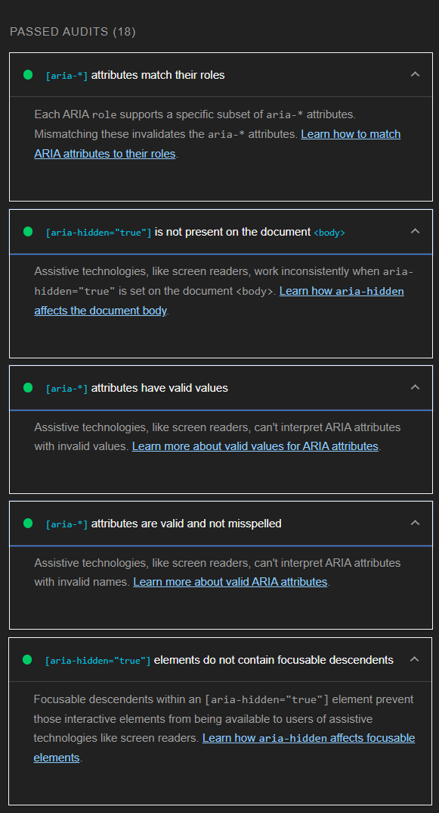

### 2.2. Names and Labels

Defining good accessible names and alternate text for elements is a good accessibility practice to help users who rely on screen readers navigate their way around a webpage.

Regarding Names, two audits were applicable to this metric related to Buttons and Links, and both of them passed the tests, visible in the image below:

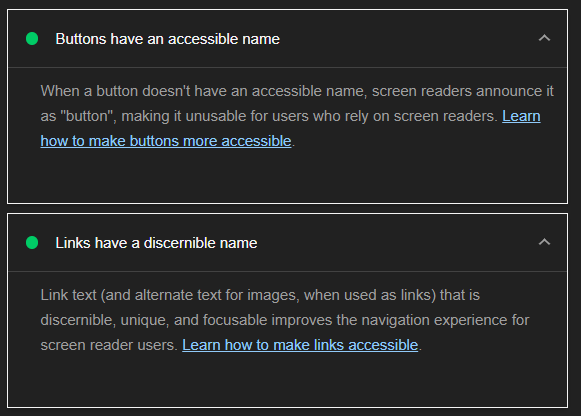

### 2.3. Navigation

Elements that appear in a sequential order facilitate users to navigate and find elements in the screen.

Regarding Heading Order, one audit was applicable to this metric related to reading order, and it passed the tests, visible in the image below:

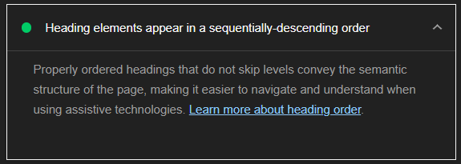

### 2.4. Contrast

High contrast elements like text and labels help users read and understand what is present in the screen.

Regarding Contrast, one audit was applicable to this metric related to Background and Foreground colors, and it passed the tests, visible in the image below:

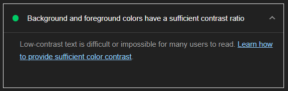

### 2.5. Tables and Lists

These table and list elements and attributes present in the webpage code help users with impaired vision navigate and find their way around the screen through a screen reader. 

Regarding Elements and Attributes, eight audits were applicable to this metric related to **title**, **html**, **li** and **table** elements and **alt**, **id**, **lang** and **headers** attributes, and all of them passed the tests, visible in the image below:

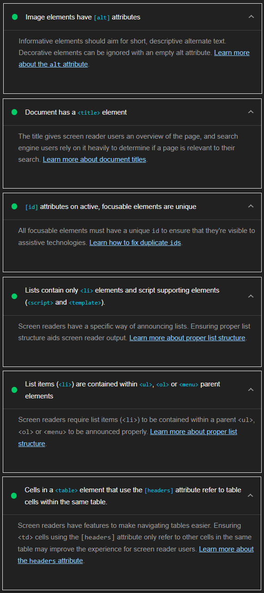

### 2.6. Internationalization and Location

These lang attributes helps assume the page's default language and read text properly.

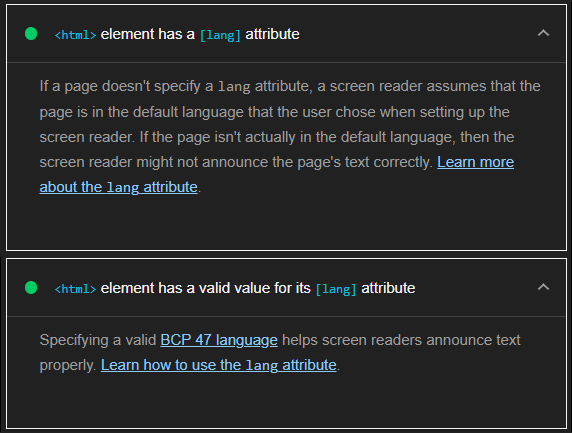

WCAG 2.1 Classification
Following the Web Content Accessibility Guidelines (WCAG) 2.1 and using the Google Chrome WAVE Evaluation Tool, the Salesperson page achieved the A grade.

### 2.7. Adapt project to Colorblind Mode

In order to accommodate more users to use the project, it was idealized that it's gonna have color accessibility.

In web design, color blindness accessibility [3] means designing elements of a website so that people who can’t differentiate the full color spectrum can still use and experience the website as intended. Color accessibility is concerned with factors like text color, background color, saturation, and patterns, along with text size and ratio of size to contrast.

Color accessibility is measured against Web Content Accessibility Guidelines (WCAG) for contrast and color, which standardize color definitions, minimum contrast ratios by text size, and more. These guidelines can apply to all kinds of content on a website – basically anything a user needs to see to get around – from words on the screen to how text color changes when the user hovers over it, outlines of forms, checkboxes, and even graphical elements like logos and icons.


Color accessibility isn’t just for the color blind, the more complex and unclear a web page’s use of color becomes, the more frustrating it becomes – even to the average sighted visitor. The same Web Content Accessibility Guidelines (WCAG) standards that make it possible for color blind people to use a website make it easier for other visitors to use it, too. A better website experience leads to lower frustration, improved visitor satisfaction, and lower bounce rates.

Also, consciously designing a website with many accessibility vectors in mind minimizes the chances of violating regulations and experiencing legal trouble. When a business fails to comply with accessibility standards on their website, it can leave them open to legal action, like lawsuits, payment of damages, and more from or on behalf of disabled visitors.


With this in mind, it's possible to implement a small dropdown menu that has different colorblindess modes according to the user's colorblindness type.
Some common sight disabilities are:

**Monochromacy**
- Monochromacy is a condition where a person can’t see colors – only black, white, and shades of grey. Monochromacy is a broad term covering two conditions: Achromatopsia (rod monochromacy), where someone can’t see color because of missing or inert retinal cones, is very rare and often accompanied by light sensitivity or near/far-sightedness; and cone monochromacy, where people can’t see color but have generally normal vision otherwise.

**Tritanopia**
- Tritanopia is a form of color blindness where a person can’t tell the difference between blue and yellow. People with tritanopia can still perceive red and green hues.

**Deuteranopia**
- People with deuteranopia can’t distinguish green colors, making it one subtype of what’s commonly called “red-green colorblindness”. Deuteranopes can exhibit a nearly complete blindness to green or a lack of sensitivity to green hues (known as deuteranomaly). It’s estimated that about 1% of males and 0.1% of females have deuteranopia.

**Protanopia**
- Protanopia is a condition where people can’t distinguish red hues, and it’s the other subtype of red-green colorblindness. About 0.02% of females and 1.01% of males have some form of protanopia.


The dropdown menu would look like the one in the image below:

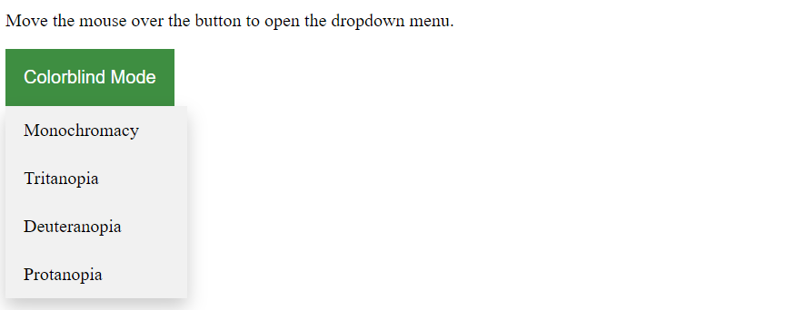

Each mode would adjust the colors of the page elements to the user's colorblindness type. For example, the Tritanopia mode would change all the blue and yellow elements of the page to red and green ones.

Below is an example code of the dropdown menu:

```bash

<!DOCTYPE html>
<html>
<head>
<meta name="viewport" content="width=device-width, initial-scale=1">
<style>
.dropbtn {
  background-color: #04AA6D;
  color: white;
  padding: 16px;
  font-size: 16px;
  border: none;
}

.dropdown {
  position: relative;
  display: inline-block;
}

.dropdown-content {
  display: none;
  position: absolute;
  background-color: #f1f1f1;
  min-width: 160px;
  box-shadow: 0px 8px 16px 0px rgba(0,0,0,0.2);
  z-index: 1;
}

.dropdown-content a {
  color: black;
  padding: 12px 16px;
  text-decoration: none;
  display: block;
}

.dropdown-content a:hover {background-color: #ddd;}

.dropdown:hover .dropdown-content {display: block;}

.dropdown:hover .dropbtn {background-color: #3e8e41;}
</style>
</head>
<body>

<h2>Hoverable Dropdown</h2>
<p>Move the mouse over the button to open the dropdown menu.</p>

<div class="dropdown">
  <button class="dropbtn">Colorblind Mode</button>
  <div class="dropdown-content">
    <a href="#">Monochromacy</a>
    <a href="#">Tritanopia</a>
    <a href="#">Deuteranopia</a>
    <a href="#">Protanopia</a>
  </div>
</div>

</body>
</html>

```

This implementation could take a few days to be in production mode, after several tests and visual improvement in development mode.

## 3. Compatibility

### 3.1. Browser Compatibility

Browser Compatibility or Cross-browser testing [4] is the practice of ensuring that a website works across various browsers and devices. Web developers should consider:

- Different browsers, including slightly older ones that don't support all the latest JS/CSS features.
- Different devices, from desktops and laptops to tablets and smartphones, to smart TVs, with varying hardware capabilities.
- People with disabilities, who may rely on assistive technologies like screen readers, or use only a keyboard.

Websites should be accessible across different browsers and devices, and to people with disabilities (e.g.,  screen-reader-friendly).

It can be common for browsers to have bugs, implement different features, have different levels of support for technological features or even big animation, so it's important to have a webpage accessible in different browsers to reduce or mitigate these risks.

To test the browser compatibility of the project, three different browsers were used: Google Chrome, Microsoft Edge and Mozilla Firefox. The SalesPeople page was tested.

Below is the SalesPeople page running on Google Chrome:

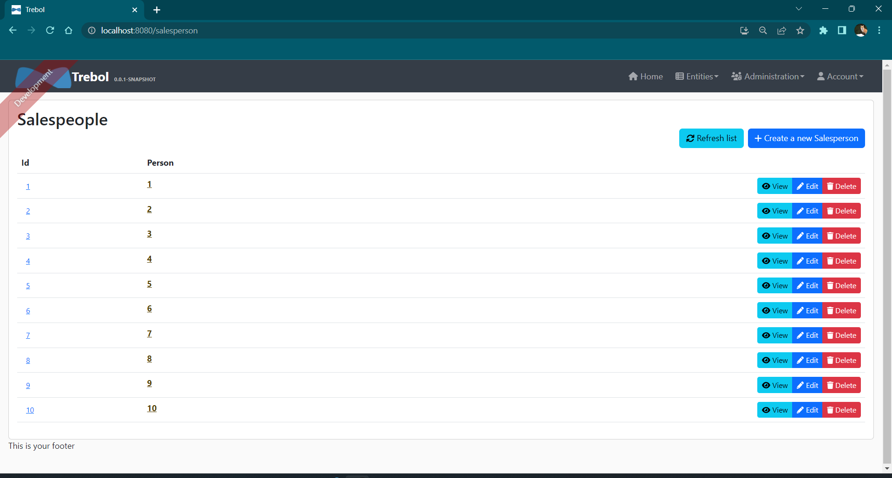

Below is the SalesPeople page running on Microsoft Edge:

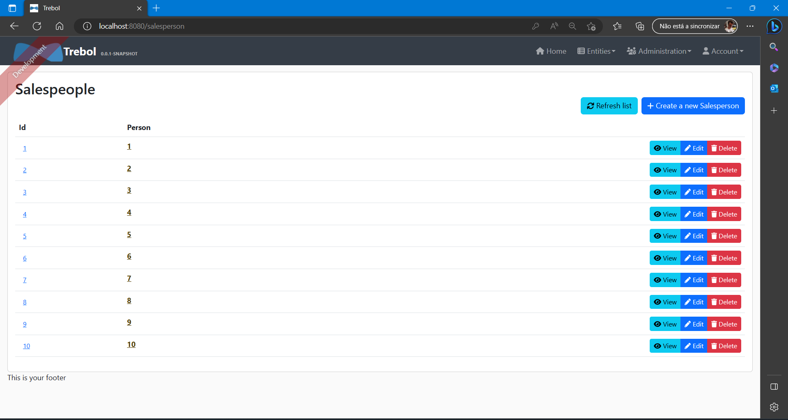

Below is the SalesPeople page running on Mozilla Firefox:

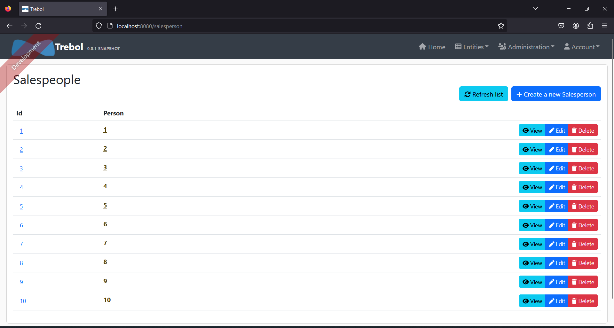

### 3.2. Platform Compatibility

Platform Compatibility or Cross Platform Compatibility [5] testing measures how well pages display on different software and hardware platforms, including different browser versions, different operating systems and different machines. For example, cross browser compatibility testing addresses different implementations of HTML by the various browser manufacturers, operating system support, and machine platform display and rendering characteristics resulting from different layout engines. Platform compatibility testing, meanwhile, addresses the difference between operating systems such as Windows, Linux and MAC OS to ensure consistent and reliable performance.

To test if the application runs smoothly across different operating systems, two operating systems were chosen: Windows and Linux.

By default, the JHipster project was created and is being analyzed in an Asus VivoBook laptop running Windows 11. After the creation and configuration with the jdl file, the application runs in localhost on any of the chosen browser from the topic above, but for the sake of demonstration it's running in Google Chrome, as it can be seen in the image below:

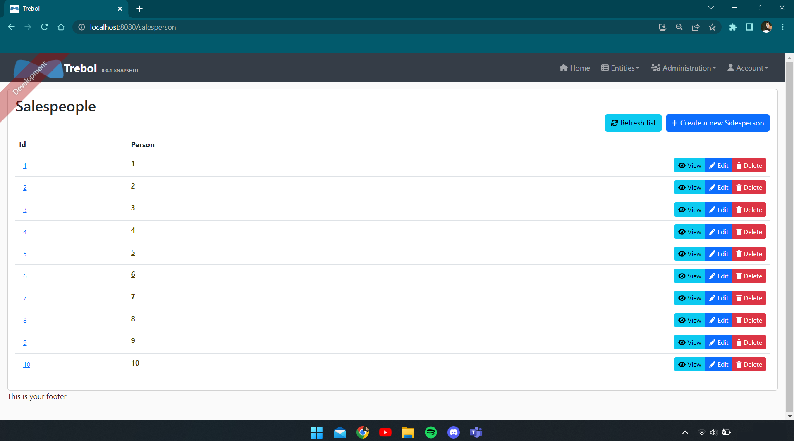

To test if the application runs in Linux, a Virtual Machine running ubuntu-22.04.1 was created. After installing the OS, installing the requirements to run JHipster in Linux (Java, Git and Node.js), running JHipster in the chosen project directory and replicating the jdl file from the Part2/files to the project directory using JDL Studio, the project was running using ./mvnw .

The SalesPeople page can be seen running in Ubuntu using Firefox in the image below:

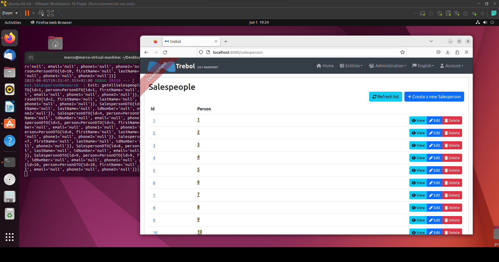

### 3.3. Device Compatibility 

Device Compatibility checks if an application runs in different devices, like computers, televisions, or mobile devices. Focusing on mobile devices, there are different kinds of compatibility related issues that impact user experience, like [6]:

- Issues related to navigation: Mobile navigation often needs methods that differ from websites. This is because navigation processes vary for differing screen sizes and orientations. Navigating from one page to another on a small screen is complex as mobile navigation might require different designs and procedures with disparate demands and goals.
  
- Issues related to content and layout: A website designed for a desktop view may not fit on a small mobile device screen. Thus, it is challenging to ensure the layout and content on different mobile devices work as desired. Responsive design can resolve these issues but will require more effort and resources to develop.
  
- Issues related to size: Websites built for smaller screens like mobile phones require appropriate font, image, and attachment sizes. The same font size may look small on a desktop but could appear disproportionate on a mobile screen.
  
- Issues related to functions and features: The same component behavior is difficult to predict for different devices and operating systems. The proper functionality should work for all device configurations and have minimal to no disruptions.

To test the application in different mobile devices, we'll use the Chrome dev tools to change the device our application is tested on and see the elements orientation.

Below is the SalesPeople page running on a SamsungGalaxyA51_71:

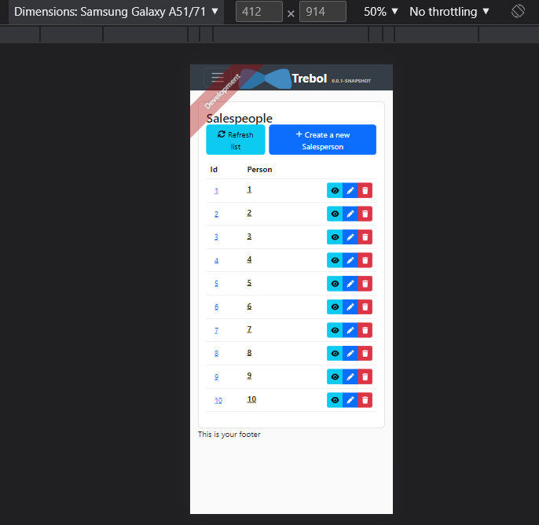

Below is the SalesPeople page running on an Ipad Mini:

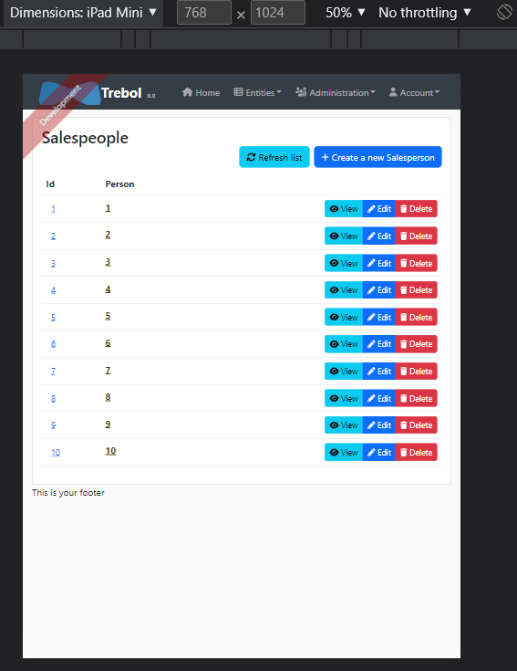

## 4. Maintainability 

Maintainability [7] is a measure of how easy it is to keep a software system running smoothly and effectively. A maintainable system can be easily adapted to changing needs, whether those changes are made by the original developers or by new members of the team.

Several factors contribute to maintainability, including code quality, documentation, and modularity. Code quality includes factors such as readability, consistency, and simplicity. Documentation can help new team members understand the code base and make changes without introducing errors. Modularity allows different parts of the system to change without affecting other parts, making it easier to make targeted changes without having to understand the entire system.


For more details on the whole sonargraph information, please check out the [Sonargraph Report](/Maintainability/Sonargraph/trebol_2023-06-03_12-28-47_820.html). 

### 4.1. Maintainability Index

The Maintainability Index first appeared in 1992 when it was proposed by Paul Oman and Jack Hagemeister at the International Conference on Software Maintenance with the goal of establishing automated software development metrics to guide software related decision making. The Maintainability Index tries to give a holistic view of the relative maintenance burden for different sections of a project by blending together a series of different metrics.
It calculates an index value between 0 and 100 that represents the relative ease of maintaining the code. A high value means better maintainability. Color coded ratings can be used to quickly identify trouble spots in the code. A green rating is between 20 and 100 and indicates that the code has good maintainability. A yellow rating is between 10 and 19 and indicates that the code is moderately maintainable. A red rating is a rating between 0 and 9 and indicates low maintainability.

The metric originally was calculated as follows:

Maintainability Index = 171 - 5.2 * ln(Halstead Volume) - 0.23 * (Cyclomatic Complexity) - 16.2 * ln(Lines of Code)

The use of this formula meant that it ranged from 171 to an unbounded negative number. As code tended toward 0, it was clearly hard to maintain code and the difference between code at 0 and some negative value was not useful. As a result of the decreasing usefulness of the negative numbers and a desire to keep the metric as clear as possible, it was decided to treat all 0 or less indexes as 0 and then rebase the 171 or less range to be from 0 to 100.
Using a more modern adaptation of the original formula proposed in 2011 by Microsoft:
Maintainability Index = MAX(0,(171 - 5.2 * ln(Halstead Volume) - 0.23 * (Cyclomatic Complexity) - 16.2 * ln(Lines of Code))*100 / 171)
where:
- Halstead Volume is a metric for estimating the complexity and size of software systems.
- Cyclomatic Complexity is a measure of the number of independent paths through the software's code.
- Lines of Code is a simple count of the number of lines in the code.

Looking at the SalesPersonResource class, the results of a metricsTree analysis gives a Maintainability Index of 32.1667, which indicates a good maintainability.

Maintainability Index of methods of SalesPersonResource class:
- SalesPersonResource(SalesPersonservice, SalespersonRepository): 78.0773;
- createSalesperson(SalespersonDTO): 56.2376;
- deleteSalesperson(Long): 61.1356;
- getAllSalespeople(): 68.5218;
- getSalesperson(Long): 65.166;
- partialUpdateSalesperson(Long, SalespersonDTO): 49.6253;
- updateSalesperson(Long, SalespersonDTO): 49.9261.
  
### 4.2. Propagation Cost

The Propagation Cost (PC) metric is a measure of the cost and effort required to make a change in a single component of a system or to propagate this change through the system. This implies the time and resources required to identify the components that need to be updated, make the necessary changes, and test the system to ensure that the changes did not introduce any new issues.

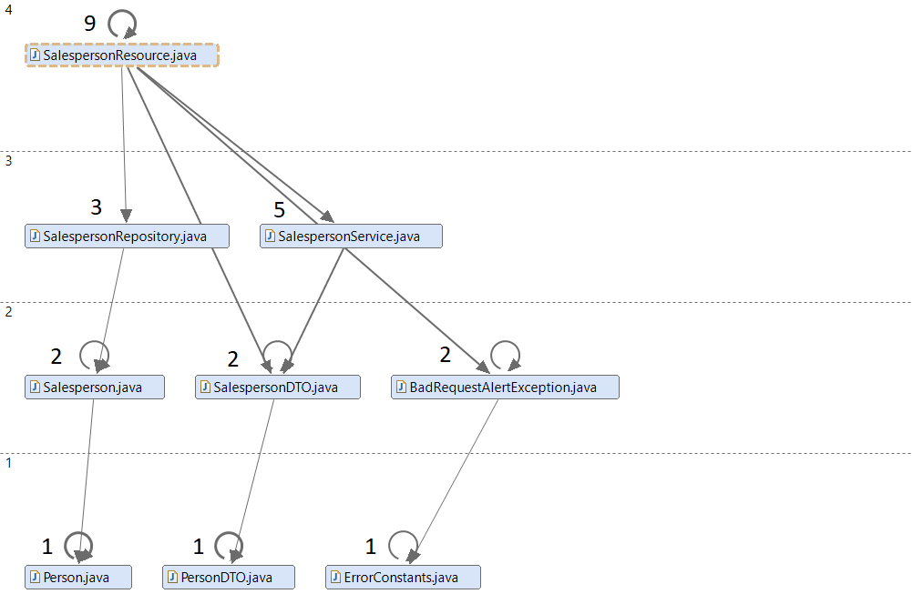

The number above each class represents the value from the metric Depends Upon.

SalesPersonResource Aggregate

- Total Components (java classes) = 9

Cumulative Component Dependency (CCD)

CCD can be calculated as the sum of all components from the SalesPersonResource class.

- CCD = Total Dependencies = 26

Average Component Dependency (ACD)

- ACD = CCD / Total Components = 26 / 9 = 2.8(9)

The maximum value is equal to the number of components, in this case it that would be 9 On average, a component depends on 2,89 components. Comparing to the maximum value, it can be said that in terms of coupling, this number is fairly low.

Propagation Cost (PC)

The Propagation Cost can be calculated by dividing the ACD once more by the number of components.

- PC = ACD / Total Components = 2.89 / 9 = 0.3211
  
### 4.3. Cyclomatic Complexity

Cyclomatic complexity [8] is a software metric used to measure the complexity of a program. Thomas J. McCabe developed this metric in 1976. McCabe interprets a computer program as a set of a strongly connected directed graph. Nodes represent parts of the source code having no branches and arcs represent possible control flow transfers during program execution. The notion of program graph has been used for this measure, and it is used to measure and control the number of paths through a program. The complexity of a computer program can be correlated with the topological complexity of a graph. 

In his presentation 'Software Quality Metrics to Identify Risk' for the Department of Homeland Security, Tom McCabe introduces the following categorization to interpret cyclomatic complexity:

- 1 - 10: Simple procedure, little risk
- 11 - 20: More complex, moderate risk
- 21 - 50: Complex, high risk
- above 50: Untestable code, very high risk

For this metric, the metric Average Complexity was analyzed for the SalesPersonResource class:

- Average Complexity: 2,95

We can conclude that the class presents little risk to the project.

### 4.4. Size Metric

Lines of Code (LoC) per file counts every line that contains actual code and skips empty lines and commented lines.

Total Lines metric counts every single line, including empty lines and comment lines.

Number of Statements verifies the statements, i.e., a single complete action performed in the source code, usually ending with a special character or a newline.

The SalesPersonResource class has the following values:

- Lines of Code: 107 
- Total Lines: 174 
- Number of Statements: 40

These values can indicate how much the component is doing and how complex it is. So, we can say that this component is not complex.


### 4.5. Error Handling and Logging 

This metric is focused on measuring the effectiveness of error handling and logging in the frontend code. Proper error handling and logging practices contribute to maintainability by aiding in debugging and troubleshooting. To measure this issue, the following approaches were taken:

### 4.5.1. Error Logging Analysis

The codebase of the SalespersonResource class was examined to identify the presence and quality of error logging. The level of detail provided in the logs was measured, and whether the logs were structured and easily readable.

* Error deleting salerperson:

```
2023-06-06T22:26:40.629+01:00 ERROR 21624 --- [  XNIO-1 task-3] o.z.problem.spring.common.AdviceTraits   : Internal Server Error 

org.springframework.dao.DataIntegrityViolationException: could not execute batch; SQL [delete from salesperson where id=?]; constraint ["FK_SELL__SALESPERSON_ID: PUBLIC.SELL FOREIGN KEY(SALESPERSON_ID) REFERENCES PUBLIC.SALESPERSON(ID) (CAST(6 AS BIGINT))"; SQL statement:
delete from salesperson where id=? [23503-214]]; nested exception is org.hibernate.exception.ConstraintViolationException: could not execute batch

```

This was the only identified error while navigating on the webpage. At a first glance it is hard to detect as it is smonochromatic on the terminal, and one can infer that the information is cluttered and hardly readable. On a closer look there are many informative elements visible in the log:
- Date and time of error (2023-06-06T22:26:40.629+01:00);
- Error id (ERROR 21624);
- Problem handling library (problem.spring.common.AdviceTraits);
- Type of error (Internal Server Error)
- Description of error;


Althought it is dense and informative, the log does not present an immediate solution.

The image below shows the log error on the IDE terminal:

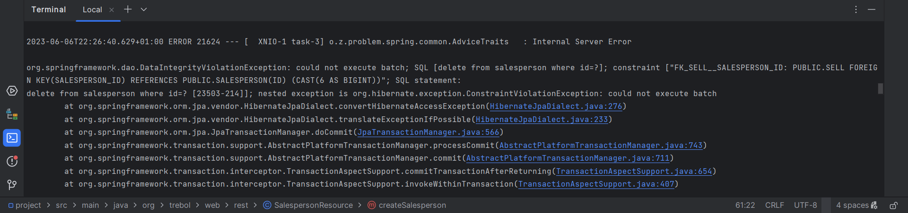

Below is an example of a failed login attempt log:

```
2023-06-06T22:15:32.549+01:00  WARN 21624 --- [  XNIO-1 task-4] .m.m.a.ExceptionHandlerExceptionResolver : Resolved [org.springframework.web.bind.MethodArgumentNotValidException: Validation failed for argument [0] in public org.springframework.http.ResponseEntity<org.trebol.web.rest.UserJWTController$JWTToken> org.trebol.web.rest.UserJWTController.authorize(org.trebol.web.rest.vm.LoginVM): [Field error in object 'loginVM' on field 'password': rejected value [aaa]; codes [Size.loginVM.password,Size.password,Size.java.lang.String,Size]; arguments [org.springframework.context.support.DefaultMessageSourceResolvable: codes [loginVM.password,password]; arguments []; default message [password],100,4]; default message [size must be between 4 and 100]] ]
2023-06-06T22:15:32.563+01:00  WARN 21624 --- [  XNIO-1 task-4] o.z.problem.spring.common.AdviceTraits   : Unauthorized: Full authentication is required to access this resource    
2023-06-06T22:15:32.565+01:00  WARN 21624 --- [  XNIO-1 task-4] .m.m.a.ExceptionHandlerExceptionResolver : Resolved [org.springframework.security.authentication.InsufficientAuthenticationException: Full authentication is required to access this resource]
```

This error log has much more information, and although it says it's an authentication error, it does not explicitly tell what is missing in the login. 

Possible solutions:

- Implementing a centralized logging system that groups every possible error and separates them by an id;
- Ensuring comprehensive error handling across the application (simpler and more "straight to the point" solutions).

### 4.5.2. Error Handling Coverage: 

This metric is focused on analyzing the coverage of error handling mechanisms throughout the codebase. The presence of try-catch blocks and handling of specific error scenarios were analyzed as well.

There are several try-catch block throughout the codebase, as it is visible in the image below:

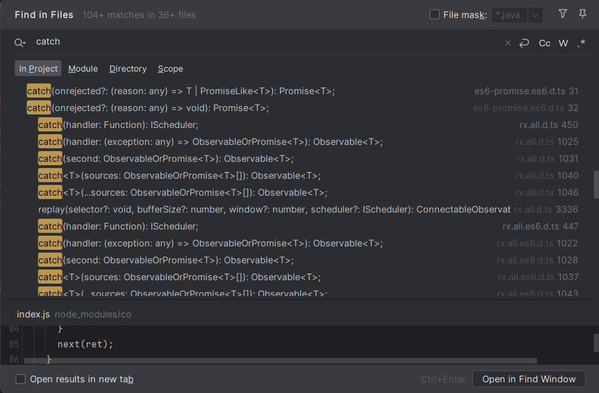

There are some specific error scenarios that are isolated from their respective class. For a user that creates an account with a username that already exists in the database, a UsernameAlreadyUsedException is called:

```
public class UsernameAlreadyUsedException extends RuntimeException {

    private static final long serialVersionUID = 1L;

    public UsernameAlreadyUsedException() {
        super("Login name already used!");
    }
}
```

Other examples are the EmailAlreadyUsedException and the InvalidPasswordException.


### 4.6. Code Documentation

This metric is focused on measuring the level of code documentation in the frontend codebase. Lack of proper documentation can make it challenging for developers to understand and maintain the code. To measure this issue, the following technique was used:

### 4.6.1. Documentation Quality Assessment

- The quality of the existing documentation was assessed by reviewing its clarity, completeness, and accuracy (whether the documentation effectively communicated the code's intent and provided sufficient information for other developers to understand and use the code).

There is a README.md file in the root of the project folder with some information on the project. 

- Project Structure

```
Node is required for generation and recommended for development. package.json is always generated for a better development experience with prettier, commit hooks, scripts and so on.

In the project root, JHipster generates configuration files for tools like git, prettier, eslint, husky, and others that are well known and you can find references in the web.

/src/* structure follows default Java structure.

.yo-rc.json - Yeoman configuration file JHipster configuration is stored in this file at generator-jhipster key. You may find generator-jhipster-* for specific blueprints configuration.

.yo-resolve (optional) - Yeoman conflict resolver Allows to use a specific action when conflicts are found skipping prompts for files that matches a pattern. Each line should match [pattern] [action] with pattern been a Minimatch pattern and action been one of skip (default if ommited) or force. Lines starting with # are considered comments and are ignored.

.jhipster/*.json - JHipster entity configuration files

npmw - wrapper to use locally installed npm. JHipster installs Node and npm locally using the build tool by default. This wrapper makes sure npm is installed locally and uses it avoiding some differences different versions can cause. By using ./npmw instead of the traditional npm you can configure a Node-less environment to develop or test your application.

/src/main/docker - Docker configurations for the application and services that the application depends on
```

- Development

  Some information about necessary dependencies to the project, and the correct commands to install them;

- PWA Support

  Vague information on the Progressive Web App support and how to enable it;

- Managing Dependencies

  Commands to run to enable them

- JHipster Control Center

  Command to run a local control center server

- Building for production

  Commands and instructions on how to package the project as jar or war

- Testing

  Commands and instructions for Client tests and Code quality

- Using Docker to simplify development

  Instructions.


This is the only visible documentation about the project as a whole.

For the SalespersonResource class, each REST method has an explanation above it of how it works, and the status code it returns:

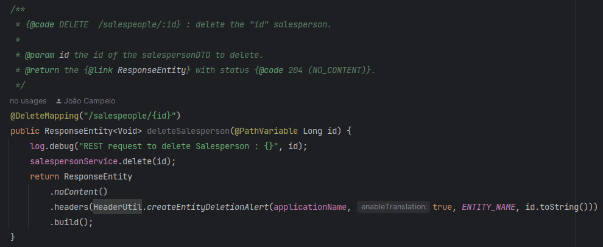

The code documentation in each class is simple, well separated in the code and informative, so it doesn't need much improvement.


Solutions:
- Create a more detailed README.md about the project structure and components. </br></br>

Frameworks to Measure Maintainability:

### JSDoc 

JSDoc [9] is a popular documentation generator for JavaScript. It uses special comments to document functions, classes, and variables, allowing for the automatic generation of documentation. JSDoc can be integrated into the development workflow, enabling developers to write and maintain consistent and standardized code documentation. 

### CodeClimate

CodeClimate [10] is a platform that provides automated code review and analysis for various programming languages, including frontend technologies. It offers maintainability metrics, such as duplication, complexity, and code documentation coverage, allowing teams to assess and improve code maintainability.</br></br>

By utilizing these additional examples of coding issues and frameworks, the team can effectively measure and address maintainability concerns in the frontend codebase.</br></br>


## 5. Performance

### 5.1. Frontend Performance

To measure the frontend performance of the application, the chrome extension Lighthouse was used.

The Performance score [11] is a weighted average of the metric scores. Naturally, more heavily weighted metrics have a bigger effect on the overall Performance score. The metric scores are not visible in the report, but are calculated under the hood.

The metrics chosen by the group were:

- First Contentful Paint;
- Total Blocking Time;
- Speed Index;
- Largest Contentful Paint;
- Cumulative Layout Shift.

The weightings are chosen to provide a balanced representation of the user's perception of performance. The weightings have changed over time because the Lighthouse team is regularly doing research and gathering feedback to understand what has the biggest impact on user-perceived performance. For Lighthouse 10, the weights are shown in the table below:


|           Audit          | Weight |
|:------------------------:|:------:|
| First Contentful Paint   | 10%    |
| Speed Index              | 10%    |
| Largest Contentful Paint | 25%    |
| Total Blocking Time      | 30%    |
| Cumulative Layout Shift  | 25%    |


The image below shows the Lighthouse scoring calculator for the SalesPersonResource class:

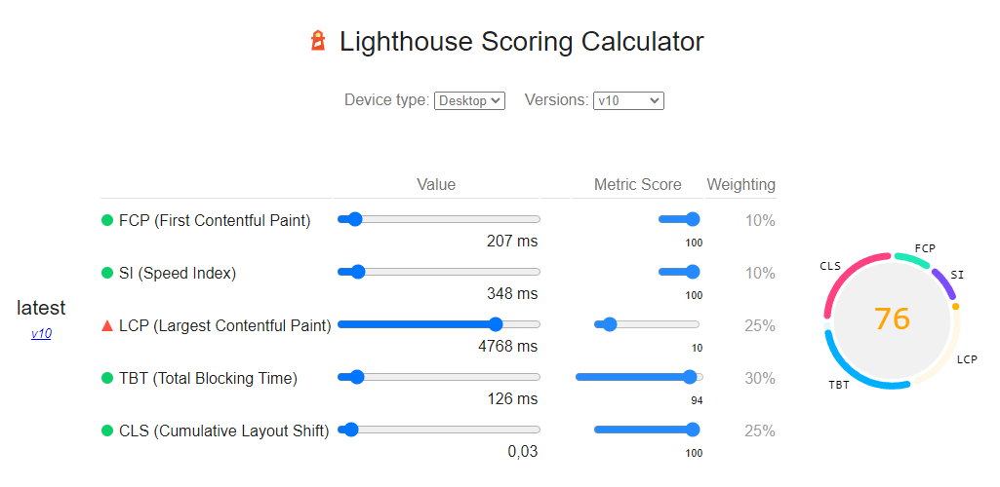

The scoring calculator has range sliders that allows to change the metric values to achieve the best metric score, or change the metric score to see what metric value it requires to achieve a certain score. 

The image below shows the Lighthouse scoring report for the SalesPersonResource class:

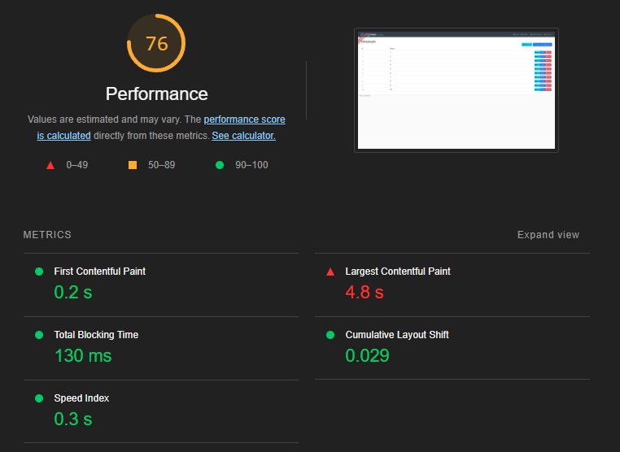

The metrics scores and the perf score are colored according to these ranges:

- 0 to 49 (red): Poor
- 50 to 89 (orange): Needs Improvement
- 90 to 100 (green): Good </br></br> 

The First Contentful Paint (FCP) metric [12] measures the time from when the page starts loading to when any part of the page's content is rendered on the screen. For this metric, "content" refers to text, images (including background images), **svg** elements, or non-white **canvas** elements.
-  FCP = 0.2 s (Good). The SalesPerson page has good loading times and the page content renders quickly. </br></br> 
    

The Total Blocking Time (TBT) metric [13] measures the total amount of time between First Contentful Paint (FCP) and Time to Interactive (TTI) where the main thread was blocked for long enough to prevent input responsiveness.
-  TBT = 130 ms (Good). The SalesPerson page has good input responsiveness. </br></br> 


The Speed Index (SI) metric [14] measures how quickly content is visually displayed during page load. Lighthouse first captures a video of the page loading in the browser and computes the visual progression between frames. Lighthouse then uses the Speedline Node.js module to generate the Speed Index score.
-  SI = 0.3 s (Good). The SalesPerson page displays its content quickly during page load. </br></br> 


The Largest Contentful Paint (LCP) [15] metric reports the render time of the largest image or text block visible within the viewport, relative to when the page first started loading.
-  LCP = 4.8 s (Poor). The SalesPerson page takes too much time rendering the largest image (Trebol icon). </br></br> 


The Cumulative Layout Shift (CLS) [16] metric is a measure of the largest burst of layout shift scores for every unexpected layout shift that occurs during the entire lifespan of a page. A layout shift occurs any time a visible element changes its position from one rendered frame to the next. (See below for details on how individual layout shift scores are calculated.)
-  CLS = 4.8 s (Good). The SalesPerson page has few layout shifting. </br></br> 


Overall, the SalesPerson page has a performance score of 76, which indicates that the page "Needs Improvement".

### 5.2. Backend Performance

Performance testing is the general name for tests that check how the system behaves and performs. Software performance testing examines responsiveness, stability, scalability, reliability, speed, and resource usage of your software and infrastructure.
Different types of performance testing provides you with different data, as we will further detail.

The 3 most common types of performance tests are:

- **Load Tests**:
This type of test is used to measure how well a system performs under high levels of user traffic or load. It involves simulating a large number of users or transactions to see how the system responds.


- **Stress Tests**:
Stress testing is similar to load testing but goes beyond it by testing the limits of a system's performance. This involves testing beyond normal usage scenarios to see how well the system handles extreme conditions.


- **Soak Tests**:
Endurance testing, also known as soak testing, is used to measure how well a system performs over an extended period of time. It involves testing the system for several hours, days, or even weeks to see how it performs under sustained load.
Soak tests are fundamental to detect memory leaks.

### 5.2.1. JMeter

The Apache JMeter application is an open-source software, a 100% pure Java application designed to load test functional behavior and measure performance. It was originally designed for testing Web Applications but has since expanded to other test functions.

Apache JMeter may be used to test performance both on static and dynamic resources, Web dynamic applications.
It can be used to simulate a heavy load on a server, group of servers, network, or object to test its strength or to analyze overall performance under different load types.

To run JMeter tests, a test plan was designed with the following configuration:

```bash
.
└── Thread Group/
    ├── Http Request (HomePage)/
    │   └── View Results Tree
    ├── Http Request (Login)/
    │   ├── Http Header Manager
    |   ├── JSR223 PostProcessor
    │   └── View Results Tree
    ├── Http Request (GetAll)/
    │   ├── Http Header Manager
    |   ├── JSON Extractor
    │   └── View Results Tree
    ├── Http Request (GetSalesPerson)/
    │   ├── Http Header Manager
    │   └── View Results Tree
    ├── Http Request (PutSalesPerson)/
    │   ├── Http Header Manager
    │   └── View Results Tree
    ├── Http Request (PostSalesPerson)/
    │   ├── Http Header Manager
    │   └── View Results Tree
    ├── Http Request (DeleteSalesPerson)/
    │   ├── Http Header Manager
    │   └── View Results Tree
    ├── Debug Sampler
    ├── jp@gc - Response Codes per Second
    ├── jp@gc - Response Latencies Over Time
    ├── jp@gc - Response Times Over Time
    ├── jp@gc - Transactions per Second   
    ├── View Results in Table
    └── Summary Report
```

Note: The PutSalesPerson and DeleteSalesPerson methods gave the error "Method Not Allowed: Request method not supported". The PostSalesPerson gave the error "cannot create a user with an existing id". They were disabled for the tests. 

### 5.2.2. Load Test

To do a load test for the application, we’ll simulate many users accessing the salespeople page. The thread properties defined will be

- Number of Threads (users): 173
- Ramp-up period (how long to take to "ramp-up" to the full number of threads chosen, in seconds): 1
- Loop Count: 10
- Different users in each iteration

Only 1 thread was defined for each test, so it'll only take 1 second to ramp it up.
To see the results, a View Results in Table Listener and a Summary Report was used.

The number of response latencies per second can be seen in the image below. We can see that the values flow normally except around 14 seconds when there was a spike in response latencies. All of the http requests were successful:

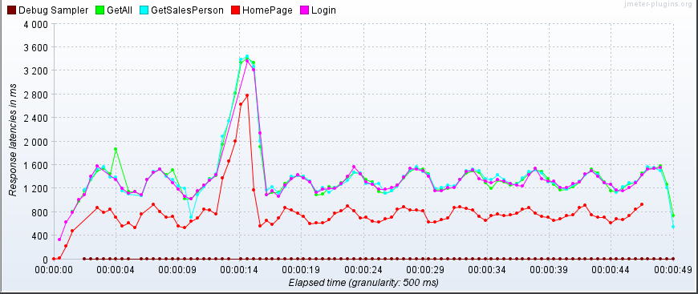

The number of transactions per second can be seen in the image below. We can see that the values flow normally across the entire test. All of the http requests were successful:

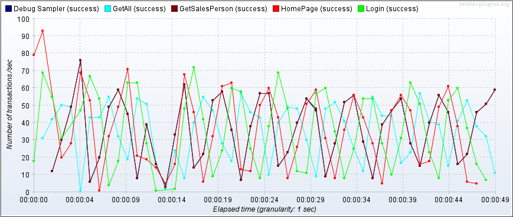

Below are the results of the Load Test in table form:

| Label          | # Samples | Average | Min | Max  | Std. Dev.          | Error %  | Throughput         | Received KB/sec    | Sent KB/sec        | Avg. Bytes         |
|----------------|-----------|---------|-----|------|--------------------|----------|--------------------|--------------------|--------------------|--------------------|
| HomePage       | 1730      | 694     | 3   | 2827 | 325.63084094337665 | 0.0      | 36.843001959281025 | 242.75364669850498 | 4.281559798002385  | 6747.0             |
| Login          | 1730      | 1253    | 250 | 3728 | 357.649030003579   | 0.0      | 35.672309627399635 | 44.625223274120046 | 8.395533808792296  | 1281.0             |
| GetAll         | 1730      | 1346    | 562 | 3479 | 333.91678425546536 | 0.0      | 35.37108975669597  | 95.95789779697404  | 20.517995425270907 | 2778.0             |
| GetSalesPerson | 1730      | 1448    | 102 | 3998 | 455.1286326384204  | 0.0      | 35.881694113742896 | 97.34311157029079  | 20.989389427863276 | 2778.0             |
| Debug Sampler  | 1730      | 0       | 0   | 11   | 0.3688409367283351 | 0.0      | 36.75455182816716  | 18.491801929082836 | 0.0                | 515.1907514450867  |
| TOTAL          | 8650      | 948     | 0   | 3998 | 635.2081304443493  | 0.0      | 175.39235167687255 | 482.9863716087433  | 53.20006292073888  | 2819.8381502890174 |

- Average Response Time: 948;
- Memory Usage: 2819.8381502890174 Bytes
- Throughput: 175.39235167687255


The results of the Load test were exported to a csv file by specifying the csv file path in the filename option (in the Summary Report).


### 5.2.3. Stress Tests

To do a stress test for the application, we’ll simulate way more users than the usual accessing the salespeople page. The thread properties defined will be:
- Number of Threads (users): 829
- Ramp-up period (seconds): 1
- Loop Count: 10
- Different users in each iteration
  
Only 1 thread was defined for each test, so it'll only take 1 second to ramp it up.
To see the results, a View Results in Table Listener and a Summary Report was used.

The number of response latencies per second can be seen in the image below. We can see that the values flow normally across the entire test. All of the http requests were successful:

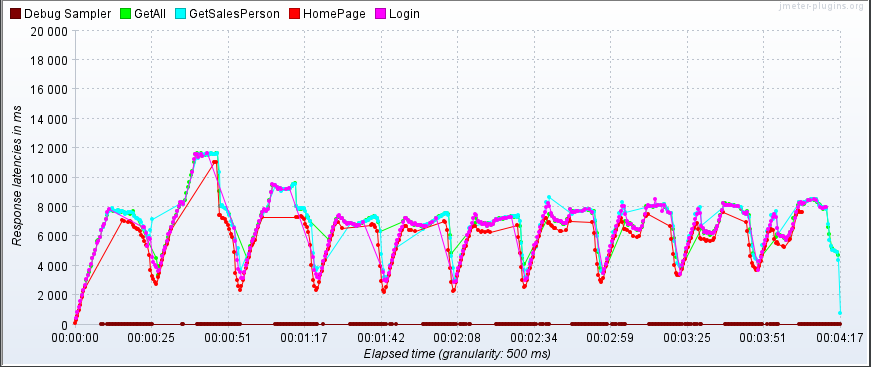

The number of transactions per second can be seen in the image below. We can see that the values flow normally across the entire test, except for the HomePage HTTP Request having spikes in the number of transactions. All of the http requests were successful:

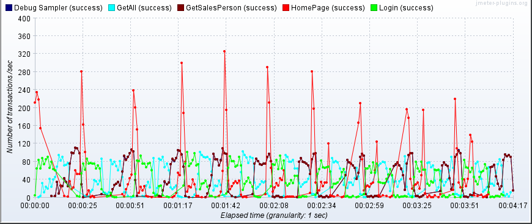

Below are the results of the Stress Test in table form:

| Label          | # Samples | Average | Min  | Max   | Std. Dev.           | Error %  | Throughput         | Received KB/sec    | Sent KB/sec        | Avg. Bytes        |
|----------------|-----------|---------|------|-------|---------------------|----------|--------------------|--------------------|--------------------|-------------------|
| HomePage       | 8290      | 4561    | 69   | 11096 | 1810.1005843815522  | 0.0      | 33.942858078727774 | 223.64498384489875 | 3.944531358758404  | 6747.0            |
| Login          | 8290      | 5873    | 395  | 11667 | 1636.9143789343236  | 0.0      | 32.87529990284139  | 41.12622966361311  | 7.73725319978982   | 1281.0            |
| GetAll         | 8290      | 7586    | 1976 | 12216 | 1369.2114359484842  | 0.0      | 32.37952395459836  | 87.84210697839282  | 18.782653543976    | 2778.0            |
| GetSalesPerson | 8290      | 7057    | 257  | 12145 | 1634.3570100960499  | 0.0      | 32.59839485346451  | 88.43587978801213  | 19.068787614477777 | 2778.0            |
| Debug Sampler  | 8290      | 0       | 0    | 9     | 0.25461797708836437 | 0.0      | 33.44211770495904  | 16.973579743718005 | 0.0                | 519.7322074788902 |
| TOTAL          | 41450     | 5015    | 0    | 12216 | 3078.2103795310613  | 0.0      | 161.4065146706645  | 444.61606630030565 | 48.95787446944179  | 2820.746441495778 |

- Average Response Time: 5015;
- Memory Usage: 2820.746441495778 Bytes
- Throughput: 161.4065146706645
- Error %: 0.0011% 


The results of the Stress test were exported to a csv file by specifying the csv file path in the filename option (in the Summary Report).


### 5.2.4. Soak Tests

To do a soak test for the application, we’ll simulate 301 users accessing the salespeople page, but for half an hour. The thread properties defined will be
- Number of Threads (users): 301
- Ramp-up period (seconds): 1
- Loop Count: infinite (for half an hour)
- Different users in each iteration

Only 1 thread was defined for each test, so it'll only take 1 second to ramp it up.
To see the results, a View Results in Table Listener and a Summary Report was used.

The number of response latencies per second can be seen in the image below. We can see that the values flow normally across the entire test, having an increase of response latencies between minute 23 and minute 28 and a half, and also some spikes for the Login and GetSalesPerson http methods. All of the http requests were successful:

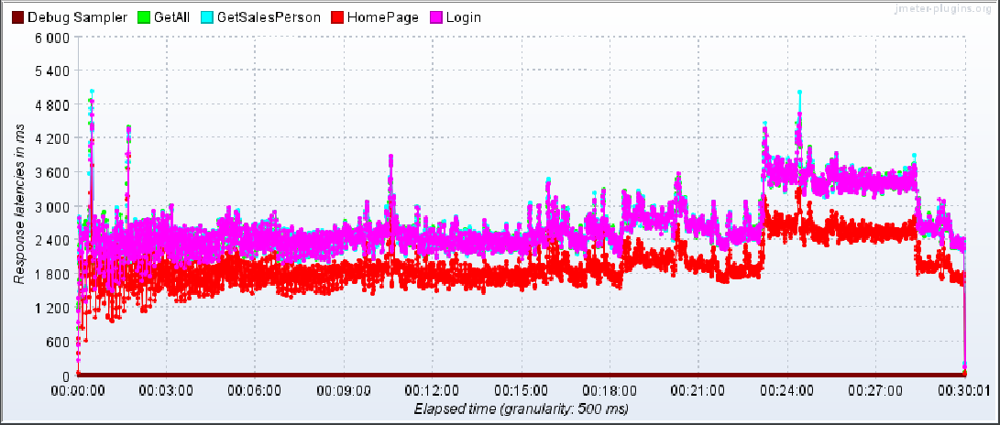

The number of transactions per second can be seen in the image below. We can see that the values flow normally across the entire test, having the higher number of transactions in the beginning of the test and slowly reducing over time. All of the http requests were successful. the HomePage http method had some spikes in transactions:


Below are the results of the Soak Test in table form:

| Label          | # Samples | Average | Min | Max  | Std. Dev.           | Error %               | Throughput         | Received KB/sec    | Sent KB/sec        | Avg. Bytes         |
|----------------|-----------|---------|-----|------|---------------------|-----------------------|--------------------|--------------------|--------------------|--------------------|
| HomePage       | 55696     | 1911    | 4   | 4527 | 371.68090922204664  | 0.0011311404768744615 | 30.920406157877498 | 203.59027502123502 | 3.5892248724164064 | 6742.3577994829075 |
| Login          | 55633     | 2598    | 69  | 5743 | 470.3633867779909   | 0.0013301457767871587 | 30.885602300611794 | 38.691807336427004 | 7.259305964123724  | 1282.811658547984  |
| GetAll         | 55559     | 2612    | 13  | 5374 | 437.5334296282865   | 0.0016019006821577063 | 30.84977786760676  | 83.68555805506168  | 17.866614838782578 | 2777.783743407909  |
| GetSalesPerson | 55470     | 2627    | 117 | 5285 | 443.6852389371362   | 0.0013520822065981612 | 30.815434049304695 | 83.59340919331977  | 18.001452793450763 | 2777.8174689021093 |
| Debug Sampler  | 55395     | 0       | 0   | 9    | 0.24387866047234508 | 0.0                   | 30.8028423469436   | 15.549527049936248 | 0.0                | 516.9235851611156  |
| TOTAL          | 277753    | 1950    | 0   | 5743 | 1082.4831652750079  | 0.0010836966657425842 | 154.198255455034   | 425.0145570957981  | 46.70138950332737  | 2822.4372914063933 |

- Average Response Time: 1950;
- Memory Usage: 2822.4372914063933 Bytes
- Throughput: 154.198255455034


The results of the Soak test were exported to a csv file by specifying the csv file path in the filename option (in the Summary Report).</br>

The entire jmx report can be seen in [JMeter Performance Report](Performance/Trebol_Backend_Monolith_Part2-000144.jmx)

## 6. Security

### 6.1. OwaspZap

To measure the security of the application the OwaspZap tool was used.

Zed Attack Proxy (ZAP) [17] is a free, open-source penetration testing tool being maintained under the umbrella of the Open Web Application Security Project (OWASP). ZAP is designed specifically for testing web applications and is both flexible and extensible.

At its core, ZAP is what is known as a “man-in-the-middle proxy.” It stands between the tester’s browser and the web application so that it can intercept and inspect messages sent between browser and web application, modify the contents if needed, and then forward those packets on to the destination. It can be used as a stand-alone application, and as a daemon process.

Running an automated scan for the Salesperson webpage, the following results are shown:

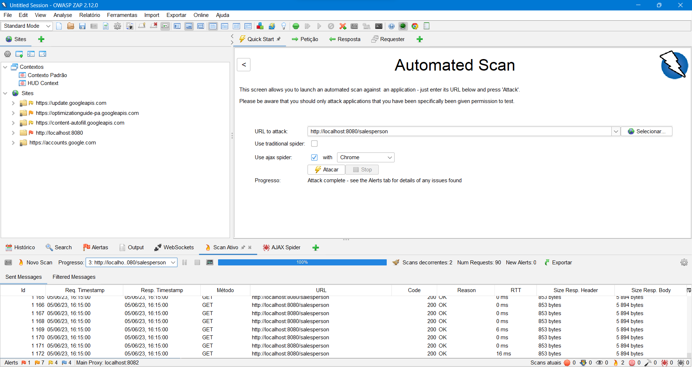

The scan runs a 'Spider', which is used to discover all the project directories, files or scripts, so that the project configuration is known (where the input forms are, and areas where it is possible to run payloads or run attacks like SQL or XSS Injections)

During the scan, it is possible to see some elements:
- id of the payload used;
- Rest methods used;
- URL's that the Spider checks;
- HTTP code and reason;
- RTT, the length of time the whole request took.


After the scan runs, it will launch the Alerts tab, where all the vulnerabilities and risks to the wep application can be seen:

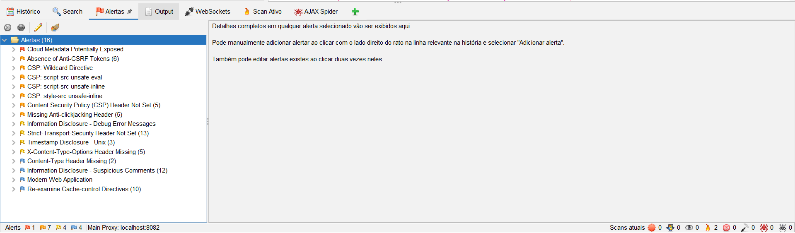

Note: To bypass the authentication aspect of the project, the Authentication Tester plugin was used. The url of the login page was specified, the username and password credentials and the browser to use as well. The plugin was able to fill the username and password fields, but unfortunately was not able to authenticate the user. The results are visible in the image below:

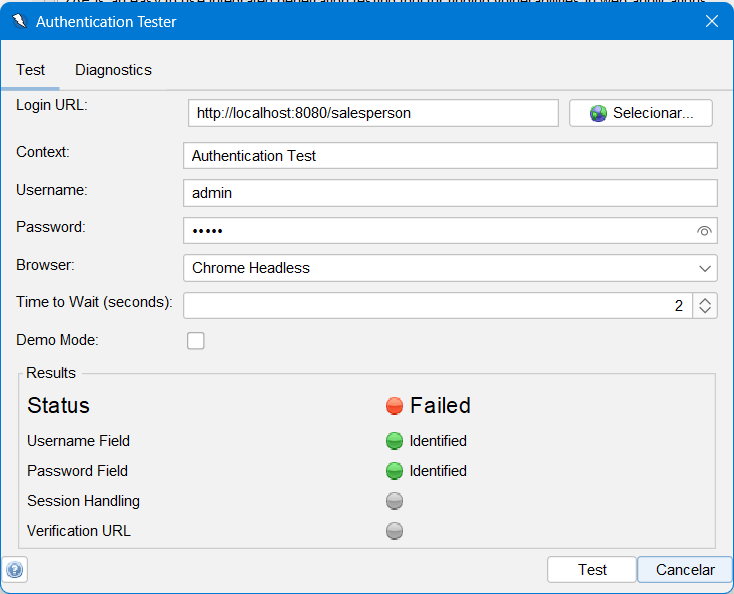

The OWASP Top 10 [18] is a standard awareness document for developers and web application security. It represents a broad consensus about the most critical security risks to web applications.

Looking at the Owasp Top 10 Web Application Security Risks most recent version, we'll focus on the following risks:

- **A06:2021**-Vulnerable and Outdated Components
- **A07:2021**-Identification and Authentication Failures </br>

**Vulnerable and Outdated Components**

Description

You are likely vulnerable [19]:

If you do not know the versions of all components you use (both client-side and server-side). This includes components you directly use as well as nested dependencies.

If the software is vulnerable, unsupported, or out of date. This includes the OS, web/application server, database management system (DBMS), applications, APIs and all components, runtime environments, and libraries.

If you do not scan for vulnerabilities regularly and subscribe to security bulletins related to the components you use.

If you do not fix or upgrade the underlying platform, frameworks, and dependencies in a risk-based, timely fashion. This commonly happens in environments when patching is a monthly or quarterly task under change control, leaving organizations open to days or months of unnecessary exposure to fixed vulnerabilities.

If software developers do not test the compatibility of updated, upgraded, or patched libraries.

If you do not secure the components’ configurations (see A05:2021-Security Misconfiguration).

How to Prevent
There should be a patch management process in place to:

Remove unused dependencies, unnecessary features, components, files, and documentation.

Continuously inventory the versions of both client-side and server-side components (e.g., frameworks, libraries) and their dependencies using tools like versions, OWASP Dependency Check, retire.js, etc. Continuously monitor sources like Common Vulnerability and Exposures (CVE) and National Vulnerability Database (NVD) for vulnerabilities in the components. Use software composition analysis tools to automate the process. Subscribe to email alerts for security vulnerabilities related to components you use.

Only obtain components from official sources over secure links. Prefer signed packages to reduce the chance of including a modified, malicious component (See A08:2021-Software and Data Integrity Failures).

Monitor for libraries and components that are unmaintained or do not create security patches for older versions. If patching is not possible, consider deploying a virtual patch to monitor, detect, or protect against the discovered issue.

Every organization must ensure an ongoing plan for monitoring, triaging, and applying updates or configuration changes for the lifetime of the application or portfolio.</br></br></br>


**Identification and Authentication Failures**

Description

You are likely vulnerable [20]:

If you do not know the versions of all components you use (both client-side and server-side). This includes components you directly use as well as nested dependencies.

If the software is vulnerable, unsupported, or out of date. This includes the OS, web/application server, database management system (DBMS), applications, APIs and all components, runtime environments, and libraries.

If you do not scan for vulnerabilities regularly and subscribe to security bulletins related to the components you use.

If you do not fix or upgrade the underlying platform, frameworks, and dependencies in a risk-based, timely fashion. This commonly happens in environments when patching is a monthly or quarterly task under change control, leaving organizations open to days or months of unnecessary exposure to fixed vulnerabilities.

If software developers do not test the compatibility of updated, upgraded, or patched libraries.

If you do not secure the components’ configurations (see A05:2021-Security Misconfiguration).

How to Prevent
There should be a patch management process in place to:

Remove unused dependencies, unnecessary features, components, files, and documentation.

Continuously inventory the versions of both client-side and server-side components (e.g., frameworks, libraries) and their dependencies using tools like versions, OWASP Dependency Check, retire.js, etc. Continuously monitor sources like Common Vulnerability and Exposures (CVE) and National Vulnerability Database (NVD) for vulnerabilities in the components. Use software composition analysis tools to automate the process. Subscribe to email alerts for security vulnerabilities related to components you use.

Only obtain components from official sources over secure links. Prefer signed packages to reduce the chance of including a modified, malicious component (See A08:2021-Software and Data Integrity Failures).

Monitor for libraries and components that are unmaintained or do not create security patches for older versions. If patching is not possible, consider deploying a virtual patch to monitor, detect, or protect against the discovered issue.

Every organization must ensure an ongoing plan for monitoring, triaging, and applying updates or configuration changes for the lifetime of the application or portfolio.


In total, there are 16 risks associated to the project.

In the table below, we can see details on an alert raised after the Zap scan, that matches the risks above: 

|                Name                | URL                                     | Risk | Trust |           Alert Tags           |
|:----------------------------------:|-----------------------------------------|------|-------|:------------------------------:|
| Cloud Metadata Potentially Exposed | http://localhost:8080/latest/meta-data/ | High | Low   | OWASP_2021_A05; OWASP_2021_A06 |

Description:
- The Cloud Metadata Attack attempts to abuse a misconfigured NGINX server in order to access the instance metadata maintained by cloud service providers such as AWS, GCP and Azure.

Other Info:
- Based on the successful response status code cloud metadata may have been returned in the response. Check the response data to see if any cloud metadata has been returned.

Solution:
- Do not trust any user data in NGINX configs. In this case it is probably the use of the $host variable which is set from the 'Host' header and can be controlled by an attacker.

References:
- https://www.nginx.com/blog/trust-no-one-perils-of-trusting-user-input/


In the table below, we can see details on an alert raised after the Zap scan, that matches the risks above: 

|                Name                | URL                                     | Risk | Trust |           Alert Tags           |
|:----------------------------------:|-----------------------------------------|------|-------|:------------------------------:|
| Content Security Policy (CSP) Header Not Set | https://optimizationguide-pa.googleapis.com/downloads?name=1679317318&target=OPTIMIZATION_TARGET_LANGUAGE_DETECTION | Medium | High   | OWASP_2021_A05; OWASP_2021_A06 |

Description:
- Content Security Policy (CSP) is an added layer of security that helps to detect and mitigate certain types of attacks, including Cross Site Scripting (XSS) and data injection attacks. These attacks are used for everything from data theft to site defacement or distribution of malware. CSP provides a set of standard HTTP headers that allow website owners to declare approved sources of content that browsers should be allowed to load on that page — covered types are JavaScript, CSS, HTML frames, fonts, images and embeddable objects such as Java applets, ActiveX, audio and video files.

Solution:
- Ensure that your web server, application server, load balancer, etc. is configured to set the Content-Security-Policy header.

References:
- https://developer.mozilla.org/en-US/docs/Web/Security/CSP/Introducing_Content_Security_Policy
- https://cheatsheetseries.owasp.org/cheatsheets/Content_Security_Policy_Cheat_Sheet.html
- http://www.w3.org/TR/CSP/
- http://w3c.github.io/webappsec/specs/content-security-policy/csp-specification.dev.html
- http://www.html5rocks.com/en/tutorials/security/content-security-policy/
- http://caniuse.com/#feat=contentsecuritypolicy
- http://content-security-policy.com/


In the table below, we can see details on an alert raised after the Zap scan, that matches the risks above: 

|                Name                | URL                                     | Risk | Trust |           Alert Tags           | Parameter       |
|:----------------------------------:|-----------------------------------------|------|-------|:------------------------------:|-----------------|
| Missing Anti-clickjacking Header | https://optimizationguide-pa.googleapis.com/downloads?name=1679317318&target=OPTIMIZATION_TARGET_LANGUAGE_DETECTION | Medium | Medium   | OWASP_2021_A05; WSTG-v42-CLNT-09; OWASP_2017_A06 | X-Frame-Options |

Description:
- The response does not include either Content-Security-Policy with 'frame-ancestors' directive or X-Frame-Options to protect against 'ClickJacking' attacks.

Solution:
- Modern Web browsers support the Content-Security-Policy and X-Frame-Options HTTP headers. Ensure one of them is set on all web pages returned by your site/app.
If you expect the page to be framed only by pages on your server (e.g. it's part of a FRAMESET) then you'll want to use SAMEORIGIN, otherwise if you never expect the page to be framed, you should use DENY. Alternatively consider implementing Content Security Policy's "frame-ancestors" directive.

References:
- https://developer.mozilla.org/en-US/docs/Web/HTTP/Headers/X-Frame-Options


In the table below, we can see details on an alert raised after the Zap scan, that matches the risks above: 

|                Name                | URL                                     | Risk | Trust |           Alert Tags           |
|:----------------------------------:|-----------------------------------------|------|-------|:------------------------------:|
| X-Content-Type-Options Header Missing | https://optimizationguide-pa.googleapis.com/downloads?name=2202180000&target=OPTIMIZATION_TARGET_SEGMENTATION_CHROME_LOW_USER_ENGAGEMENT | Low | Medium   | OWASP_2021_A05; OWASP_2017_A06 |

Description:
- The Anti-MIME-Sniffing header X-Content-Type-Options was not set to 'nosniff'. This allows older versions of Internet Explorer and Chrome to perform MIME-sniffing on the response body, potentially causing the response body to be interpreted and displayed as a content type other than the declared content type. Current (early 2014) and legacy versions of Firefox will use the declared content type (if one is set), rather than performing MIME-sniffing.

Other Info:
- This issue still applies to error type pages (401, 403, 500, etc.) as those pages are often still affected by injection issues, in which case there is still concern for browsers sniffing pages away from their actual content type.
At "High" threshold this scan rule will not alert on client or server error responses.

Solution:
- Ensure that the application/web server sets the Content-Type header appropriately, and that it sets the X-Content-Type-Options header to 'nosniff' for all web pages.
If possible, ensure that the end user uses a standards-compliant and modern web browser that does not perform MIME-sniffing at all, or that can be directed by the web application/web server to not perform MIME-sniffing.

References:
- http://msdn.microsoft.com/en-us/library/ie/gg622941%28v=vs.85%29.aspx
https://owasp.org/www-community/Security_Headers


The entire OwaspZap report can be seen in [OwaspZap Security Report](Security/Report/2023-06-05-ZAP-Report-.html)

## 7. Conclusions

Looking back at every metric that was analyzed, it can be concluded that the project cannot be reused, even though the analyzis for the SalespersonResource class could be considered average.

- About Accessibility, the project has good results in the different metrics, due to the fact that it is a JHipster generated project, which follows certain norms.

- Speaking about Compatibility, the project adapts well in different smartphone devices, runs in different browsers in the same machine, and ultimately runs in different Operating Systems, such as Windows and Linux.

- In terms of Maintainability, the project has a bad maintainability level overall, and has some frontend design flaws to be improved. 

- Speaking about Performance, according to the analyzed metrics, the lighthouse report gave good results for the frontend perfomance of the webpages, and the different types of backend performance tests gave out some good results as well.

- Finally, about Security, the project doesn't present much safety, since it has some vulnerabilities to be resolved.

## 8. References

<text id="ref-1"> [1] https://developer.chrome.com/docs/lighthouse/overview/

<text id="ref-2"> [2] https://developer.mozilla.org/en-US/docs/Web/Accessibility/ARIA

<text id="ref-3"> [3] https://www.siteimprove.com/blog/color-blindness-accessibility/

<text id="ref-4"> [4] https://developer.mozilla.org/en-US/docs/Learn/Tools_and_testing/Cross_browser_testing/Introduction

<text id="ref-5"> [5] https://xbosoft.com/software-testing-services/platform-compatibility/

<text id="ref-6"> [6] https://www.headspin.io/blog/understanding-mobile-compatibility-testing-why-your-application-needs-it

<text id="ref-7"> [7] https://www.devstringx.com/software-maintainability

<text id="ref-8"> [8] https://www.javatpoint.com/software-engineering-cyclomatic-complexity

<text id="ref-9"> [9] https://jsdoc.app/about-getting-started.html

<text id="ref-10"> [10] https://codeclimate.com/velocity/what-is-velocity

<text id="ref-11"> [11] https://developer.chrome.com/docs/lighthouse/performance/performance-scoring/

<text id="ref-12"> [12] https://web.dev/i18n/en/fcp/

<text id="ref-13"> [13] https://web.dev/i18n/en/tbt/

<text id="ref-14"> [14] https://developer.chrome.com/en/docs/lighthouse/performance/speed-index/

<text id="ref-15"> [15] https://web.dev/i18n/en/lcp/

<text id="ref-16"> [16] https://web.dev/i18n/en/cls/

<text id="ref-17"> [17] https://www.zaproxy.org/getting-started/

<text id="ref-18"> [18] https://owasp.org/www-project-top-ten/

<text id="ref-19"> [19] https://owasp.org/Top10/A05_2021-Security_Misconfiguration/

<text id="ref-20"> [20] https://owasp.org/Top10/A06_2021-Vulnerable_and_Outdated_Components/